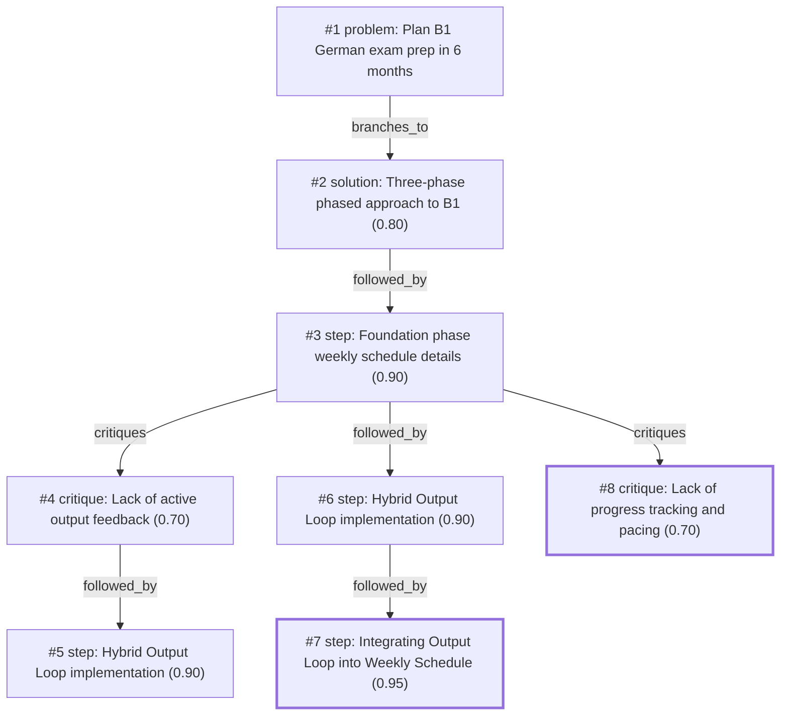

# b1-exam · ollama-cloud/gemma4:31b · one

**Task:** I work full time and want to pass the German B1 exam in 6 months, starting from A2. I can study about 1 hour on weekdays and 3 hours on weekend days. How should I plan it?

| Thoughts | Calls | Tokens in / out | Time | Finish | First try valid | Next picked | Max depth | Weight spread | Duplicates |
|---|---|---|---|---|---|---|---|---|---|
| 8 | 10 | 15561 / 3710 | 33s | model | 6/8 | 4/7 | 4 | 0.09 | 1 |

Failures: no_tool_call 2

## Answer from the graph

Passing the B1 German exam while working full-time is achievable with a disciplined, phased approach. Since you have 11 hours per week, the key is to balance passive learning (grammar/vocab) with active output (speaking/writing) so you don't reach the exam feeling "book-smart" but unable to speak.

### The Three-Phase Strategy

**Phase 1: Foundation (Months 1–3)**
The goal is to complete a B1 textbook (e.g., *Menschen*, *Schritte*, or *Begegnungen*). Map the textbook chapters to your 12-week window (e.g., 1–2 chapters per week) to ensure you finish on time.

**Phase 2: Skill Integration (Months 4–5)**
Shift your focus from the textbook to the four core exam skills: Reading, Listening, Writing, and Speaking. Practice specifically with B1-level prompts and materials.

**Phase 3: Exam Simulation (Month 6)**
Perform intensive mock tests under real exam conditions. Focus on timing strategies and identifying your remaining weak points.

---

### Your Weekly Schedule (Foundation Phase)

To avoid burnout and ensure progress, integrate a "Hybrid Output Loop" directly into your hours so that you are producing the language, not just studying it.

*   **Weekdays (1 hour/day):**
    *   **30m Vocabulary:** Use Anki or flashcards. *Twice a week, swap 15m of this for a "2-minute recording" where you summarize the grammar you learned that day.*
    *   **30m Grammar:** Textbook exercises and theory.
*   **Saturdays (3 hours):**
    *   **1h Reading & Listening:** Comprehensive exercises from your textbook.
    *   **2h Intensive Practice:** Grammar and writing. *Dedicate the final 30m to writing a short text (email/blog) using the week's grammar, then use AI tools (ChatGPT/DeepL Write) for immediate correction.*
*   **Sundays (3 hours):**
    *   **1h Review:** Review the week's mistakes. *Use 30m of this to prepare a list of questions/errors for a tutor.*
    *   **2h Immersive Content:** Podcasts, easy videos, and light speaking practice. (If budget allows, use 30m of this for a bi-weekly session with a tutor on iTalki/Tandem to review your writing and speaking outputs).

---

### Risks to Watch

1.  **The "Passive Trap":** It is easy to feel like you are progressing because you understand a textbook, but the exam requires active production. Do not skip the recording exercises or the AI-assisted writing.
2.  **Pacing Issues:** If you fall behind on your textbook chapters, you will bleed into the Skill Integration phase. Set a monthly "checkpoint" to ensure you are on track.
3.  **Consistency:** With a full-time job, fatigue is a risk. If you miss a weekday hour, do not try to "make it up" by adding 5 hours to your Sunday; instead, adjust your chapter goal for the following week to avoid burnout.

*Used: #1, #2, #3, #4, #5, #6, #7, #8*

## Baseline: one call, no graph

Passing B1 from an A2 level in 6 months is a realistic and achievable goal with your schedule. You have roughly **420 study hours** available (approx. 11 hours per week x 26 weeks). Since B1 typically requires another 200–300 hours of guided study beyond A2, you have a comfortable buffer.

The key to success while working full-time is **consistency** and **integration**.

Here is your strategic plan:

---

### 1. The Weekly Routine
Since your time is limited on weekdays, avoid "heavy lifting" (like starting a complex new grammar chapter) during the work week. Use weekdays for reinforcement and weekends for deep learning.

#### Weekdays (1 Hour/Day)
*Focus: Maintenance, Vocabulary, and Listening.*
* **0–20 mins:** Active vocabulary review (use Anki or Memrise).
* **20–50 mins:** Focused skill work (e.g., 1 grammar exercise, 1 reading text, or 1 writing prompt).
* **50–60 mins:** Listening (Podcast/News in Slow German) while commuting or during a break.

#### Weekends (3 Hours/Day)
*Focus: New Concepts, Writing, and Speaking.*
* **Hour 1: New Input.** Study a new grammar topic from your B1 textbook.
* **Hour 2: Active Application.** Write a short essay or do comprehensive workbook exercises.
* **Hour 3: Output/Review.** Speak aloud (shadowing) or have a conversation with a tutor/language partner.

---

### 2. The 6-Month Roadmap

#### Months 1–3: The "Knowledge Build" Phase
Your goal here is to complete the B1 curriculum. Don't obsess over perfection; focus on understanding the concepts.
* **Grammar Priorities:** Passiv, Konjunktiv II (wishes/politeness), relative clauses, and subordinate clauses (weil, obwohl, dass).
* **Vocabulary:** Focus on "Thematic Vocabulary" (Work, Health, Environment, Travel, Technology).
* **Milestone:** By the end of Month 3, you should have finished your B1 textbook.

#### Month 4: The "Bridge" Phase
Move from "learning" to "using."
* **Reading:** Start reading short news articles (e.g., *Deutsche Welle - Top-Thema*).
* **Writing:** Start writing 100-word emails/letters (typical B1 exam tasks).
* **Speaking:** Book a tutor (iTalki/Preply) for 1 hour a week to specifically practice B1 speaking prompts.

#### Months 5–6: The "Exam Sprint" Phase
The B1 exam is as much about **technique** as it is about language.
* **Model Tests:** Do one full mock exam every weekend. Time yourself strictly.
* **Identify Gaps:** If you keep failing the "Listening" part, spend your weekday hours listening to B1-level audio.
* **Templates:** Memorize "Redemittel" (standard phrases) for the speaking and writing parts (e.g., *"Ich bin der Meinung, dass..."* or *"Könnten wir vielleicht...?"*).

---

### 3. Essential Tools & Resources
* **Coursebook:** *Menschen B1* or *Netzwerk Neu B1* (Standard for Goethe/ÖSD).
* **Grammar:** *Grammatik Aktiv A1-B1* (Highly recommended for clear explanations and exercises).
* **Listening:** *Deutsche Welle (DW) - Nicos Weg B1* (Free, high quality, and interactive).
* **Vocabulary:** *Anki* (Flashcards) for the B1 word list.
* **News:** *Nachrichten leicht* (News in simple German).

---

### 4. Pro-Tips for Full-Time Workers

1. **The "Dead Time" Hack:** Use your commute, lunch break, or gym time for "passive" learning. Listen to German podcasts (*Easy German*) or review flashcards. This doesn't count toward your 1 hour; it's a bonus.
2. **The 2-Day Rule:** Never skip more than two days in a row. Language learning is about momentum. If you are exhausted on Tuesday, just do 10 minutes of vocab and call it a win.
3. **Output over Input:** Many learners spend 100% of their time reading and listening. To pass B1, you **must** produce. Speak to yourself in the shower or write your grocery list in German.
4. **Focus on "Redemittel":** In the B1 exam, the examiners look for specific structures. Learning a set of 20-30 "power phrases" can boost your grade even if your general grammar isn't perfect.

## Index

```text
#1 [problem] Plan B1 German exam prep in 6 months · expanded
  #2 [solution] Three-phase phased approach to B1 · w 0.80 · expanded
    #3 [step] Foundation phase weekly schedule details · w 0.90 · expanded
      #4 [critique] Lack of active output feedback · w 0.70 · expanded
        #5 [step] Hybrid Output Loop implementation · w 0.90 · open, max depth
      #6 [step] Hybrid Output Loop implementation · w 0.90 · expanded
        #7 [step] Integrating Output Loop into Weekly Schedule · w 0.95 · done
      #8 [critique] Lack of progress tracking and pacing · w 0.70 · done
```

## Graph



## Thoughts

### #1 [problem] Plan B1 German exam prep in 6 months
w 1.00 · expanded · depth 0 · from –

Goal: Pass the German B1 exam in 6 months.
Current Level: A2.
Constraints: 
- Time: 1 hour/weekday, 3 hours/weekend day (Total: 11 hours/week).
- Occupation: Full-time employment.
Unknowns: Specific exam provider (Goethe, TELC, ÖSD), current strength/weakness in A2, access to learning materials.
Success Criteria: A structured study plan that covers B1 grammar, vocabulary, and the four core skills (Reading, Writing, Listening, Speaking) while fitting into the strict time budget.

> Defines the objective, constraints, and requirements for a successful plan.

### #2 [solution] Three-phase phased approach to B1
w 0.80 · expanded · depth 1 · from #1

Divide the 6-month period into three phases: 
1. Foundation (Months 1-3): Focus on B1 grammar and core vocabulary using a textbook.
2. Skill Integration (Months 4-5): Focused practice on Reading, Listening, Writing, and Speaking.
3. Exam Simulation (Month 6): Intensive mock tests and timing strategies.
This approach ensures a gradual transition from learning content to applying it in an exam context.

> A phased approach is the most sustainable way to manage a full-time job while ensuring all B1 requirements are met.

### #3 [step] Foundation phase weekly schedule details
w 0.90 · expanded · depth 2 · from #2

Break down the Foundation phase (Months 1-3) into a weekly schedule.
- Weekdays (1h): 30m vocabulary (Anki/Flashcards), 30m grammar exercises/textbook.
- Saturdays (3h): 1h comprehensive reading/listening, 2h intensive grammar and writing practice.
- Sundays (3h): 1h review of the week, 2h immersive content (podcasts, easy videos) and light speaking practice.
Focus: Completing a B1 textbook (e.g., Menschen, Schritte, or Begegnungen).

> Provides the concrete daily application of the general phased approach.

### #4 [critique] Lack of active output feedback
w 0.70 · expanded · depth 3 · from #3

The current foundation plan is heavy on passive study (textbook/flashcards) but lacks an active feedback loop for speaking and writing. Since the user is working full-time, they may struggle to find a partner. Suggest adding a specific mechanism for output: using AI tools for writing correction or a language exchange partner for 30 minutes of the Sunday slot.

> Active output is critical for B1 and usually the weakest point in self-study plans.

### #5 [step] Hybrid Output Loop implementation
w 0.90 · open · depth 4 · from #4

Implement a 'Hybrid Output Loop' to address the lack of feedback without adding more time:
1. Writing: Replace 30m of Saturday's writing practice with AI-assisted correction (e.g., ChatGPT or DeepL Write) to identify recurring grammar errors.
2. Speaking: Replace 30m of Sunday's immersion with a structured 'Shadowing' exercise or a 30m session with a tutor/language partner (e.g., iTalki or Tandem) focusing on B1 speaking prompts.
3. Recording: Once a week, record a 2-minute monologue on a B1 topic and compare it to a model answer.

> Provides concrete, time-efficient alternatives to solve the feedback gap identified in the critique.

### #6 [step] Hybrid Output Loop implementation
w 0.90 · expanded · depth 3 · from #3

To address the risk of passive learning, implement a 'Hybrid Output Loop' during the Foundation phase:
1. Writing: Once a week, write a short text (e.g., email/blog post) using the grammar point of the week. Use tools like DeepL Write or ChatGPT for initial correction, then manually rewrite the corrected version.
2. Speaking: Record yourself summarizing the day's grammar lesson in 2 minutes. Listen back to identify hesitation or pronunciation errors.
3. Feedback: Use an online tutor (e.g., iTalki) for just one 30-minute session every two weeks to specifically check the 'Writing' and 'Speaking' outputs produced during the week.

> Provides a concrete method to solve the lack of feedback identified in thought #4.

### #7 [step] Integrating Output Loop into Weekly Schedule
w 0.95 · done · depth 4 · from #6

To make the Hybrid Output Loop sustainable within the 11h/week limit, integrate these tasks into the existing schedule:
- Weekdays (1h): Swap 15m of vocabulary for the '2-minute recording' (Speaking) twice a week.
- Saturday (3h): Dedicate the final 30m of the 'intensive writing' block to the 'short text' (Writing) using AI for correction.
- Sunday (3h): Use 30m of the 'review' block to prepare the list of questions/errors for the bi-weekly iTalki tutor.
This ensures the output loop doesn't feel like 'extra' work but a replacement for passive study.

> It transforms the theoretical loop into a concrete time-managed schedule.

### #8 [critique] Lack of progress tracking and pacing
w 0.70 · done · depth 3 · from #3

The current Foundation phase plan lacks a specific method for tracking progress and adjusting the pace. To ensure the B1 textbook is finished within 3 months, the learner should map the book's chapters to the 12-week window (e.g., 1-2 chapters per week) and conduct a monthly 'checkpoint' assessment to identify weak points before moving to the Skill Integration phase.

> A schedule is only useful if it includes milestones to ensure the goal is actually being met.

