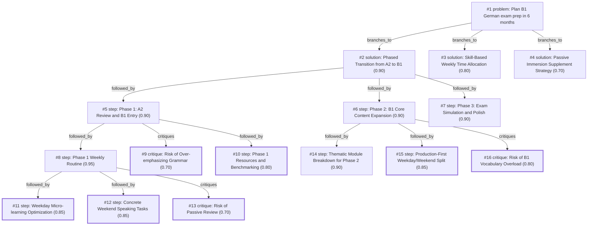

# b1-exam · ollama-cloud/gemma4:31b · siblings

**Task:** I work full time and want to pass the German B1 exam in 6 months, starting from A2. I can study about 1 hour on weekdays and 3 hours on weekend days. How should I plan it?

| Thoughts | Calls | Tokens in / out | Time | Finish | First try valid | Next picked | Max depth | Weight spread | Duplicates |
|---|---|---|---|---|---|---|---|---|---|
| 16 | 8 | 9568 / 4084 | 31s | budget | 6/6 | 5/5 | 4 | 0.06 | 0 |

## Answer from the graph

Passing the B1 exam while working full-time is entirely achievable with a structured "phased" approach. Since you have approximately 11 hours per week, the key is to balance focused study with "micro-learning" to avoid burnout.

### The 6-Month Roadmap

**Phase 1: Gap Filling & B1 Entry (Months 1–2)**
*   **Goal:** Solidify A2 foundations and introduce basic B1 concepts.
*   **Focus:** Review A2 grammar (cases, prepositions) and start B1 basics (passive voice, subordinate clauses) using a B1 textbook (e.g., *Menschen* or *Hueber*).
*   **Milestone:** Successfully completing the first 1/3 of a B1 textbook.

**Phase 2: Core Content Expansion (Months 3–4)**
*   **Goal:** Expand B1 vocabulary and build communicative competence.
*   **Focus:** Thematic modules (work, environment, health, travel) and moving from understanding grammar to using it in production.
*   **Milestone:** Ability to hold a 10-minute conversation on a B1 topic.

**Phase 3: Exam Simulation & Polish (Months 5–6)**
*   **Goal:** Master the exam format and increase speed.
*   **Focus:** Intensive mock tests, learning specific exam strategies for each module (Reading, Writing, Listening, Speaking), and refining common errors.
*   **Milestone:** Scoring within the passing range on three consecutive mock exams.

---

### Your Weekly Routine

To maximize your limited time, split your approach between "micro-learning" on weekdays and "integrated practice" on weekends.

**Weekdays (1 Hour Total)**
Break your hour into blocks to stay fresh after work:
*   **15m (Commute/Break):** Vocabulary drills using Anki or flashcards.
*   **30m (Home):** Core study from your B1 textbook.
*   **15m (Chores/Evening):** Passive listening (German podcasts or news).

**Weekends (3 Hours per Day)**
Focus on the skills that require deeper concentration:
*   **Reading/Listening (1h):** Comprehension exercises from your textbook or exam prep books.
*   **Writing (1h):** Draft a short text (emails, opinions) based on B1 prompts.
*   **Speaking (1h):** Be specific. Use 30 minutes to describe images (a key B1 task) and 30 minutes chatting with a language partner or AI tutor about B1 topics like work-life balance.

---

### Risks to Watch Out For

*   **The "Grammar Trap":** Avoid spending all your time on grammar rules. B1 is about communication. If you only study textbooks, you will have "textbook knowledge" but won't be able to speak. Integrate speaking from Day 1.
*   **Passive Review:** Don't just read through your A2 notes. Use active recall (testing yourself) to ensure your foundation is solid before moving deeper into B1.
*   **Burnout:** A full hour of intense study after a full work day can be draining. Stick to the micro-learning blocks to keep the momentum without feeling overwhelmed.

*Used: #1, #2, #5, #8, #9, #11, #12, #13*

## Baseline: one call, no graph

Passing B1 from an A2 level in 6 months is a realistic and achievable goal with your schedule. You have roughly **11 hours per week**, totaling about **260–280 hours** of study. This is generally the amount of time recommended to bridge the gap between A2 and B1.

Since you work full-time, the key is **consistency over intensity** and integrating the language into your "dead time."

Here is your comprehensive strategic plan.

---

### 1. The Weekly Schedule
To avoid burnout, divide your learning into "Input" (passive/learning) and "Output" (active/practicing).

#### Weekdays (1 Hour/Day)
*Focus: Vocabulary, Grammar, and Short-form Listening.*
* **0–20 mins:** New vocabulary/Flashcards (use Anki or Memrise).
* **20–50 mins:** Core lesson (Textbook, App, or Course). Focus on one grammar point.
* **50–60 mins:** Review/Quick writing (e.g., write 5 sentences using the new grammar).

#### Weekend Day 1 (3 Hours)
*Focus: Deep Dive and Comprehension.*
* **Hour 1:** Intensive Reading. Read a B1-level article or chapter; look up every word you don't know.
* **Hour 2:** Listening & Dictation. Listen to a B1 podcast (e.g., *Easy German* or *Deutsche Welle*) and transcribe short segments.
* **Hour 3:** Grammar Consolidation. Do the exercises in your workbook for everything you learned during the week.

#### Weekend Day 2 (3 Hours)
*Focus: Production and Exam Simulation.*
* **Hour 1:** Writing. Write an email or a short essay (B1 exam style). Use a tool like DeepL or a tutor to correct it.
* **Hour 2:** Speaking. Talk to yourself, record your voice, or use a language partner (Tandem/HelloTalk).
* **Hour 3:** Review & Planning. Review the hardest parts of the week and plan the next week's topics.

---

### 2. The 6-Month Roadmap

#### Months 1–3: The Learning Phase (Building the Base)
Your goal is to cover all B1 curriculum topics.
* **Grammar Priorities:** Passiv, Konjunktiv II (wishes/politeness), subordinate clauses (*obwohl, weil, dass*), and adjective endings.
* **Vocabulary:** Focus on "Topics" (Environment, Work, Health, Travel, Media).
* **Resource:** Use a structured B1 textbook (e.g., *Menschen B1* or *Netzwerk Neu B1*).

#### Month 4: The Transition Phase (Applying Knowledge)
Start moving away from the textbook and toward "real" German.
* **Reading:** Start reading short news articles on *Nachrichten leicht*.
* **Listening:** Listen to B1-level audiobooks or podcasts.
* **Writing:** Start writing 100-word texts about your opinion on a topic.

#### Months 5–6: The Exam Phase (Tactics)
B1 is not just about knowing German; it’s about knowing **how to pass the test**.
* **Mock Exams:** Do one full mock exam every weekend. Time yourself strictly.
* **Templates:** Memorize "Redemittel" (standard phrases) for the speaking and writing parts (e.g., *"Ich bin der Meinung, dass..."* or *"Könntest du mir bitte helfen..."*).
* **Weak Spot Training:** If you struggle with the listening part, spend your weekday hour doing only listening exercises.

---

### 3. "Hidden" Study Time (The Secret Weapon)
Since you work full-time, you must use "dead time" to supplement your 11 hours. This doesn't count as "study time" but is essential for immersion:
* **Commute:** Listen to German podcasts or Pimsleur.
* **Lunch Break:** 10 minutes of Duolingo or Anki flashcards.
* **At Home:** Change your phone language to German.
* **Chores:** Listen to German radio (DLF) in the background.

### 4. Recommended Resources
* **Course/Textbook:** *Deutsche Welle (DW) Nicos Weg B1* (Free, high quality, and structured).
* **Vocabulary:** *Anki* (Spaced Repetition System).
* **Listening:** *Easy German* (YouTube/Podcast).
* **Writing/Correction:** *LanguageTool* (for grammar) or *iTalki* (for a professional tutor to grade your essays).

### Summary Checklist for Success:
1. [ ] Get a B1 Textbook or sign up for DW Nicos Weg.
2. [ ] Set a fixed time for your weekday hour (e.g., 7 PM – 8 PM).
3. [ ] Set up an Anki deck for B1 vocabulary.
4. [ ] Book your exam date for 6 months from now (having a deadline creates urgency).

## Index

```text
#1 [problem] Plan B1 German exam prep in 6 months · expanded
  #2 [solution] Phased Transition from A2 to B1 · w 0.90 · expanded
    #5 [step] Phase 1: A2 Review and B1 Entry · w 0.90 · expanded
      #8 [step] Phase 1 Weekly Routine · w 0.95 · expanded
        #11 [step] Weekday Micro-learning Optimization · w 0.85 · done
        #12 [step] Concrete Weekend Speaking Tasks · w 0.85 · done
        #13 [critique] Risk of Passive Review · w 0.70 · done
      #9 [critique] Risk of Over-emphasizing Grammar · w 0.70 · done
      #10 [step] Phase 1 Resources and Benchmarking · w 0.80 · done
    #6 [step] Phase 2: B1 Core Content Expansion · w 0.90 · expanded
      #14 [step] Thematic Module Breakdown for Phase 2 · w 0.90 · open
      #15 [step] Production-First Weekday/Weekend Split · w 0.85 · done
      #16 [critique] Risk of B1 Vocabulary Overload · w 0.80 · done
    #7 [step] Phase 3: Exam Simulation and Polish · w 0.90 · open
  #3 [solution] Skill-Based Weekly Time Allocation · w 0.80 · open
  #4 [solution] Passive Immersion Supplement Strategy · w 0.70 · open
```

## Graph



## Thoughts

### #1 [problem] Plan B1 German exam prep in 6 months
w 1.00 · expanded · depth 0 · from –

Goal: Pass the German B1 exam within 6 months.
Current level: A2.
Constraints: 
- Full-time employment.
- Study time: ~1 hour/weekday, ~3 hours/weekend day (Total: ~11 hours/week).
Unknowns: Specific B1 exam provider (e.g., Goethe, ÖSD, Telc), current specific gaps in A2 knowledge, and preferred learning style.
A good result must provide:
1. A structured study timeline spanning 6 months.
2. A weekly routine balancing the four language skills (Reading, Writing, Listening, Speaking).
3. Milestones to track progress from A2 to B1.
4. Recommendations for resources compatible with the time limit.

> This establishes the constraints and requirements of the user's request.

### #2 [solution] Phased Transition from A2 to B1
w 0.90 · expanded · depth 1 · from #1

Divide the 6 months into three phases: 
Phase 1 (Months 1-2): Gap filling A2 and Introduction to B1 grammar.
Phase 2 (Months 3-4): Core B1 vocabulary and skill development.
Phase 3 (Months 5-6): Exam-specific strategies and intensive mock tests.
Focus on a 'Spiral' learning approach where skills are revisited frequently.

> Phased approach allows for building a solid foundation before shifting to high-pressure exam prep.

### #3 [solution] Skill-Based Weekly Time Allocation
w 0.80 · open · depth 1 · from #1

Allocate the 11 hours per week by skill:
- Weekdays (1hr): 30m Grammar/Vocab, 30m Input (Listening/Reading).
- Saturday (3hrs): 1hr Writing, 1hr Speaking (tandem/self), 1hr Review.
- Sunday (3hrs): 1hr Complex Reading/Listening, 1hr Mock exercises, 1hr Planning/Rest.
Use 'Dead Time' (commutes) for passive listening to maximize the limited hour.

> Explicitly manages the constrained time budget across all four required skills.

### #4 [solution] Passive Immersion Supplement Strategy
w 0.70 · open · depth 1 · from #1

Integrate an 'Immersion' strategy into the workday:
- Change phone/PC language to German.
- Use Anki/Flashcards during breaks (10 mins).
- Listen to German podcasts (e.g., Coffee Break German) during commute.
This supplements the 11-hour limit without adding 'study' stress.

> Maximizes exposure for a full-time worker who cannot spend 4+ hours studying daily.

### #5 [step] Phase 1: A2 Review and B1 Entry
w 0.90 · expanded · depth 2 · from #2

Focus on reviewing A2 grammar (cases, prepositions) and introducing B1 basics (passive voice, subordinate clauses). Start using a B1 textbook (e.g., Menschen or Hueber).
Goal: Close A2 gaps and reach B1.1 level.

> Concrete actions for the first two months to ensure a solid foundation.

### #6 [step] Phase 2: B1 Core Content Expansion
w 0.90 · expanded · depth 2 · from #2

Intensive focus on B1 vocabulary themes (work, health, environment). Shift from grammar-only to application (writing short essays, listening to podcasts like 'Slow German').
Goal: Reach B1.2 level and fluency in basic topics.

> Focuses on the bulk of the B1 content and active production.

### #7 [step] Phase 3: Exam Simulation and Polish
w 0.90 · open · depth 2 · from #2

Switch to official exam materials (Goethe/Telc). Practice timed reading and writing tasks. Conduct mock speaking tests with a partner or tutor.
Goal: Mastery of exam format and time management.

> Ensures the learner can actually pass the exam, not just 'know' the language.

### #8 [step] Phase 1 Weekly Routine
w 0.95 · expanded · depth 3 · from #5

Allocate weekdays to grammar/vocabulary drills and weekends to integrated skill practice. 
- Weekdays (1h): 30m B1 textbook lesson + 30m Anki/Vocabulary.
- Weekends (3h): 1h Reading/Listening comprehension + 1h Writing a short text + 1h Speaking practice (via Tandem or recording yourself).

> Provides the concrete daily application of the phase's goals.

### #9 [critique] Risk of Over-emphasizing Grammar
w 0.70 · done · depth 3 · from #5

Focusing too much on grammar in Phase 1 might lead to 'textbook knowledge' without the ability to communicate. Need to integrate speaking from day one to ensure B1 communicative competence.

> Identifies a common pitfall in grammar-heavy early phases.

### #10 [step] Phase 1 Resources and Benchmarking
w 0.80 · done · depth 3 · from #5

Identify A2 weaknesses using a placement test (e.g., Goethe-Institut online test). Use a B1 textbook (e.g., 'Aspekte Neu B1+' or 'Begegnungen B1') for structured progression. Create a vocabulary list of the top 500 B1-specific words.

> Sets the specific tools and starting point for the phase.

### #11 [step] Weekday Micro-learning Optimization
w 0.85 · done · depth 4 · from #8

To maximize the 1h weekday slots, use 'Micro-learning' blocks: 15m Vocab during commute, 30m Core Study at home, 15m Listening (podcast/news) during chores. This prevents burnout from a full hour of intense study after work.

> Adapts the rigid 1h block to a realistic full-time worker's schedule.

### #12 [step] Concrete Weekend Speaking Tasks
w 0.85 · done · depth 4 · from #8

The weekend 'Speaking' hour is vague. Specifically: Saturday 30m describing images (B1 exam task) + Sunday 30m chatting with a partner or AI tutor about a B1-level topic (e.g., environment, work-life balance).

> Provides concrete actionable tasks for the most difficult skill to practice alone.

### #13 [critique] Risk of Passive Review
w 0.70 · done · depth 4 · from #8

Depending on the user's speed, focusing only on textbooks might lead to 'passive' knowledge. Need to integrate active recall for the A2 review part to ensure the foundation is solid before B1.2.

> Highlights the danger of moving too fast through A2 review.

### #14 [step] Thematic Module Breakdown for Phase 2
w 0.90 · open · depth 3 · from #6

Divide the 8 weeks of Phase 2 into thematic modules:
Weeks 1-2: Work & Career (Professional communication, CVs).
Weeks 3-4: Health & Wellness (Doctor visits, body parts, advice).
Weeks 5-6: Environment & Technology (Opinions, pros/cons, future).
Weeks 7-8: Travel, Culture & Society (Descriptions, storytelling).
Each module should include: 1 vocabulary list, 1 grammar focus (e.g., Passiv, Konjunktiv II), 1 writing assignment, and 1 speaking prompt.

> Provides the necessary structural breakdown for the 'Expansion' phase.

### #15 [step] Production-First Weekday/Weekend Split
w 0.85 · done · depth 3 · from #6

Implement a 'Production-First' approach for the limited weekday hour:
- Weekdays: 15 mins vocab review + 45 mins active production (writing a journal entry or speaking to oneself about the theme).
- Weekends: 1 hour listening/reading (input) + 2 hours focused grammar and complex writing (output).
This prevents the common mistake of spending 6 months just 'reading' a textbook.

> Tailors the B1 core content to the user's specific time constraints.

### #16 [critique] Risk of B1 Vocabulary Overload
w 0.80 · done · depth 3 · from #6

The risk in Phase 2 is 'Vocabulary Overload'. B1 introduces significantly more abstract words than A2. If the user tries to memorize lists without context, they will burn out or forget them by Phase 3.
Correction: Integrate a Spaced Repetition System (SRS) like Anki or Quizlet, limited to 15-20 new words per day.

> Addresses the primary failure point of B1 learners.

