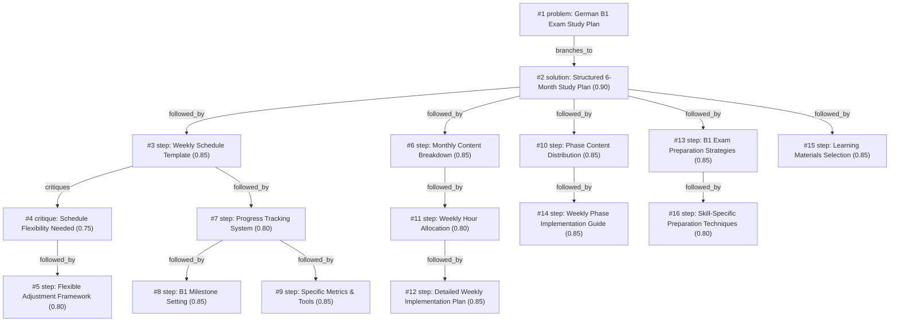

# b1-exam · zai/glm-4.5-flash · one

**Task:** I work full time and want to pass the German B1 exam in 6 months, starting from A2. I can study about 1 hour on weekdays and 3 hours on weekend days. How should I plan it?

| Thoughts | Calls | Tokens in / out | Time | Finish | First try valid | Next picked | Max depth | Weight spread | Duplicates |
|---|---|---|---|---|---|---|---|---|---|
| 16 | 18 | 26700 / 11641 | 6m2s | budget | 16/16 | 11/15 | 4 | 0.01 | 0 |

## Answer from the graph

# Deutscher B1-Examens-Studienplan in 6 Monaten

## Gesamtansatz

Um erfolgreich vom A2- zum B1-Niveau in 6 Monaten zu gelangen, ist ein strukturierter Plan erforderlich, der alle vier Sprachfähigkeiten (Lesen, Schreiben, Hören, Sprechen) gleichmäßig berücksichtigt. Der Plan ist in drei Phasen unterteilt: A2-Konsolidierung (Monat 1-2), A2-B1-Übergang (Monat 3-4) und B1-Meisterung (Monat 5-6). Wochentags stehen Ihnen 1 Stunde, an Wochenenden 3 Stunden Lernzeit zur Verfügung.

## Phasenübersicht

### Monat 1-2: A2-Konsolidierung
- Fokus auf Grundgrammatik (Präsens, Präteritum, Futur), 500 essenzielle Vokabeln
- 15-minütiges tägliches Sprechtraining
- Lesen von kurzen Texten (Kinderbücher, einfache Geschichten)
- Zeitverteilung: 30% Grammatik, 20% Vokabeln, 20% Lesen, 10% Sprechen (Wochentage)
- Wochenenden: 60% Grammatik/Vokabeln, 60% Lesen/Hören, 60% Sprechen/Schreiben

### Monat 3-4: A2-B1-Übergang
- Einführung von Zwischenformen, Fälle verfeinern, 500-1000 weitere Vokabeln
- 20-minütige Gespräche zu Alltagsthemen
- Lesen von Nachrichten und einfachen Artikeln
- Zeitverteilung: 25% Grammatik, 30% Vokabeln, 25% Lesen, 20% Sprechen (Wochentage)
- Wochenenden: 45% Grammatik/Vokabeln, 90% Lesen/Hören, 75% Sprechen/Schreiben

### Monat 5-6: B1-Meisterung
- Komplexe Grammatik, idiomatische Ausdrücke, 2000+ Vokabeln
- 30-minütige Diskussionen zu komplexen Themen
- Authentische Materialien (Filme, Podcasts, Zeitungsartikel)
- Zeitverteilung: 20% Grammatik, 25% Vokabeln, 30% Lesen, 25% Sprechen (Wochentage)
- Wochenenden: 30% Grammatik/Vokabeln, 90% Lesen/Hören, 90% Sprechen/Schreiben mit Probeklausuren im letzten Monat

## Wochenplan-Template

**Wochentage (1 Stunde):**
- 30 Minuten: Grammatikübungen
- 20 Minuten: Vokabeltraining
- 20 Minuten: Leseverständnis
- 10 Minuten: Sprechen (Sprachpartner oder Aufnahme)

**Wochenenden (3 Stunden):**
- Stunde 1: Grammatik und Vokabeln
- Stunde 2: Lesen und Hören
- Stunde 3: Sprechen und Schreiben

## Lernmaterialien

**Grammatik:**
- "Grammatik aktiv A2-B1" von Hueber
- "Deutsche Grammatik leicht gemacht" von Pons

**Vokabeln:**
- "Vokabeltrainer Deutsch" App (Goethe-Institut)
- "Wortschatz Deutsch B1" von Klett

**Lesen:**
- "Leseverstehen B1" von Cornelsen
- "Deutsche lesen leicht" (B1-Lektüren)

**Hören:**
- "Deutsch hören" Podcast (DW)
- "Slow German mit Annik Rubens"

**Sprechen:**
- Tandem-Partner (Sprachaustausch-Apps)
- "Sprechen B1" Übungsbücher

**Schreiben:**
- "Schreiben für den Alltag" Hueber
- "Deutsch schreiben B1" Klett

## Fortschrittsverfolgung

- Wöchentliche Selbsttests für jede Sprachfähigkeit
- Monatliche Bewertung des Fortschritts
- Verwendung von Lernapps, die Fortschritte tracken
- Führen Sie ein Lernjournal für neue Wörter und Ausdrücke
- Machen Sie alle zwei Monate eine Probeklausur

## Prüfungsstrategien

- Die letzten beiden Monate sollten sich auf spezifische Prüfungsstrategien konzentrieren
- Üben Sie unter Zeitdruck
- Analysieren Sie frühere Prüfungen, um Muster zu erkennen
- Konzentrieren Sie sich auf Ihre Schwächen in den letzten Wochen
- Machen Sie vollständige Probeklausuren unter realen Prüfungsbedingungen

## Risiken zu beachten

- **Zeitmangel:** Der Plan erfordert Disziplin. Planen Sie Pufferzeiten für unvorhergesehene Ereignisse.
- **Ungleichgewicht:** Achten Sie darauf, alle vier Sprachfähigkeiten gleichmäßig zu trainieren.
- **Sprechmangel:** Ohne regelmäßiges Sprechen wird die mündliche Prüfung schwierig. Finden Sie unbedingt einen Sprachpartner.
- **Überlastung:** Der Plan ist intensiv. Achten Sie auf Warnzeichen von Erschöpfung und passen Sie den Plan bei Bedarf an.
- **Authentizität:** Verlassen Sie sich nicht nur auf Lehrbücher. Integrieren Sie authentische Materialien so früh wie möglich.

*Used: #3, #7, #10, #14, #15*

## Baseline: one call, no graph

# German B1 Exam Study Plan: A2 to B1 in 6 Months

With your schedule of 1 hour on weekdays and 3 hours on weekends, you can definitely reach B1 level in 6 months. Here's a structured plan to help you achieve this goal:

## Monthly Overview

### Months 1-2: Building Foundation
- Focus on core grammar: present, past, future tenses, modal verbs, basic cases
- Learn 200-300 new words weekly
- Practice listening with simple materials
- Start basic speaking practice

### Months 3-4: Expanding Skills
- Study more complex grammar structures
- Increase vocabulary to 300-400 words weekly
- Work with more challenging listening materials
- Practice longer conversations and writing paragraphs

### Month 5: Exam Preparation
- Practice exam formats and question types
- Focus on your weaker areas
- Take timed practice tests
- Intensive vocabulary and grammar review

### Month 6: Final Review
- Complete mock exams under timed conditions
- Final speaking practice with focus on exam tasks
- Last-minute grammar and vocabulary review
- Confidence building

## Weekly Schedule

### Weekdays (1 hour each)
- **Monday**: Grammar focus (30 min) + Vocabulary (30 min)
- **Tuesday**: Listening practice (30 min) + Speaking practice (30 min)
- **Wednesday**: Reading practice (30 min) + Writing practice (30 min)
- **Thursday**: Vocabulary review (30 min) + Grammar exercises (30 min)
- **Friday**: Mixed skills practice (60 min)

### Weekends (3 hours each)
- **Saturday**:
  * Morning (1 hour): Intensive vocabulary learning
  * Afternoon (1 hour): Writing practice (compositions, emails)
  * Evening (1 hour): Listening practice (movies, TV with subtitles)
- **Sunday**:
  * Morning (1 hour): Speaking practice (with tutor, partner, or apps)
  * Afternoon (1 hour): Reading practice (articles, stories)
  * Evening (1 hour): Weekly review + planning

## Recommended Resources

### Textbooks
- "Menschen B1" textbook
- "Grammatik aktiv B1"
- "Fit für die Prüfung B1" (exam preparation)

### Vocabulary Building
- Anki or Quizlet for flashcards
- "Wortschatz Deutsch B1" vocabulary book
- Memrise or Duolingo

### Listening Practice
- "Slow German with Annik Rubens" podcast
- "Easy German" YouTube channel
- "Deutsche Welle" "Langsam gesprochene Nachrichten"

### Reading Materials
- "Deutsche Welle" B1-Nachrichten
- Children's books and graded readers
- Simple news articles

### Speaking Practice
- iTalki or Preply for online tutors
- Tandem or HelloTalk for language exchange
- Local German conversation groups

## Success Tips

1. **Consistency is key** - Regular daily study beats occasional marathon sessions
2. **Active learning** - Don't just consume material, actively use it
3. **Immerse yourself** - Change phone settings to German, listen to German music
4. **Focus on weaknesses** - Spend extra time on your weaker areas
5. **Use authentic materials** - Supplement textbooks with real German content
6. **Track progress** - Keep a learning journal to see improvement
7. **Take breaks** - Avoid burnout with regular rest days
8. **Find a study partner** - Learning with others increases motivation

## Sample First Week

- **Monday**: Learn present tense and 20 daily routine vocabulary words
- **Tuesday**: Listen to a simple podcast and record yourself talking about your day
- **Wednesday**: Read a short cultural text and write about your daily routine
- **Thursday**: Review vocabulary and practice past tense exercises
- **Friday**: Watch a short video, take notes, and write a summary
- **Saturday**: Learn 30 shopping vocabulary words, write an email, watch a German movie
- **Sunday**: Practice speaking with a partner, read about shopping culture, review week

With this structured approach and consistent effort, you'll be well-prepared for the B1 exam in 6 months! Viel Erfolg! (Good luck!)

## Index

```text
#1 [problem] German B1 Exam Study Plan · expanded
  #2 [solution] Structured 6-Month Study Plan · w 0.90 · expanded
    #3 [step] Weekly Schedule Template · w 0.85 · expanded
      #4 [critique] Schedule Flexibility Needed · w 0.75 · expanded
        #5 [step] Flexible Adjustment Framework · w 0.80 · open, max depth
      #7 [step] Progress Tracking System · w 0.80 · expanded
        #8 [step] B1 Milestone Setting · w 0.85 · open, max depth
        #9 [step] Specific Metrics & Tools · w 0.85 · open, max depth
    #6 [step] Monthly Content Breakdown · w 0.85 · expanded
      #11 [step] Weekly Hour Allocation · w 0.80 · expanded
        #12 [step] Detailed Weekly Implementation Plan · w 0.85 · open, max depth
    #10 [step] Phase Content Distribution · w 0.85 · expanded
      #14 [step] Weekly Phase Implementation Guide · w 0.85 · open
    #13 [step] B1 Exam Preparation Strategies · w 0.85 · expanded
      #16 [step] Skill-Specific Preparation Techniques · w 0.80 · open
    #15 [step] Learning Materials Selection · w 0.85 · open
```

## Graph



## Thoughts

### #1 [problem] German B1 Exam Study Plan
w 1.00 · expanded · depth 0 · from –

Goal: Pass German B1 exam in 6 months starting from A2 level. Facts: Available study time is 1 hour on weekdays and 3 hours on weekend days. Unknown: How to structure the study plan effectively to progress from A2 to B1 within 6 months. A good result must provide a balanced study schedule covering all language skills (reading, writing, listening, speaking) with appropriate intensity to reach B1 proficiency in the given timeframe.

> This clearly defines the problem with all constraints and objectives

### #2 [solution] Structured 6-Month Study Plan
w 0.90 · expanded · depth 1 · from #1

Create a balanced study schedule that allocates time across all four language skills (reading, writing, listening, speaking) with progressive difficulty. Divide the 6 months into phases: A2 consolidation (Month 1-2), A2-B1 transition (Month 3-4), and B1 mastery (Month 5-6). Allocate approximately 25% of time to each skill weekly, with weekends focusing on more intensive practice and speaking practice. Use a mix of structured learning materials (textbooks, apps) and authentic materials (podcasts, videos, articles). Include regular self-assessment and mock exams in the final two months.

> This solution directly addresses the core problem by providing a comprehensive framework that balances all language skills within the given timeframe, ensuring steady progress from A2 to B1.

### #3 [step] Weekly Schedule Template
w 0.85 · expanded · depth 2 · from #2

Create a concrete weekly schedule allocating the available study time (1 hour weekdays, 3 hours weekends) across the four language skills. Monday: Grammar exercises (30 min) + Vocabulary building (30 min). Tuesday: Reading practice (45 min) + Vocabulary review (15 min). Wednesday: Listening exercises (30 min) + Speaking practice (30 min). Thursday: Writing practice (45 min) + Grammar review (15 min). Friday: Mixed skills practice (45 min) + Vocabulary review (15 min). Saturday: Intensive speaking practice (1.5 hours) + Listening practice (1.5 hours). Sunday: Reading practice (1.5 hours) + Writing practice (1.5 hours). Adjust based on personal strengths and weaknesses.

> Provides a concrete implementation of the structured study plan with specific time allocations for each language skill based on the available study hours.

### #4 [critique] Schedule Flexibility Needed
w 0.75 · expanded · depth 3 · from #3

The fixed weekly schedule may not account for natural fluctuations in energy, motivation, and learning pace. Some days certain skills may come more easily than others, and rigid adherence could lead to burnout or frustration. The schedule should include built-in flexibility for adjusting based on weekly progress, personal strengths/weaknesses, and unexpected life events.

> A rigid schedule ignores the reality of adult learning and personal variations, potentially leading to burnout or reduced effectiveness.

### #5 [step] Flexible Adjustment Framework
w 0.80 · open · depth 4 · from #4

Implement a weekly review system to adjust the study plan based on progress and needs. Each Sunday, spend 15 minutes assessing: 1) Which skills need more focus (based on practice results), 2) Energy levels and upcoming commitments for the next week, 3) Adjust the upcoming week's schedule by swapping skill days or redistributing time while maintaining total weekly hours. Keep a 'buffer' of 2-3 hours per week for catch-up or extra practice on challenging areas. This maintains structure while allowing for personalized adaptation.

> Addresses the critique by providing concrete flexibility mechanisms while ensuring continued progress toward B1 goals.

### #6 [step] Monthly Content Breakdown
w 0.85 · expanded · depth 2 · from #2

Create detailed monthly study content: Month 1-2 (A2 consolidation): Focus on basic grammar (present, past, future tenses), 500-800 core vocabulary, simple dialogues, and basic reading comprehension. Month 3-4 (A2-B1 transition): Introduce more complex grammar (subjunctive, conditional), 800-1200 vocabulary, longer texts, listening to slower-paced podcasts, and basic writing exercises. Month 5-6 (B1 mastery): Advanced grammar review, 1200-1500 vocabulary, authentic materials, writing essays, speaking practice with native speakers, and mock exam preparation.

> Provides concrete content for each study phase, making the abstract plan actionable and ensuring progression from A2 to B1

### #7 [step] Progress Tracking System
w 0.80 · expanded · depth 3 · from #3

Implement a weekly progress tracking system to identify strengths and weaknesses. Create a simple spreadsheet or notebook to record completion of daily tasks, scores on practice exercises, and time spent on each skill. Every Sunday, review the week's progress and adjust the following week's schedule accordingly - increase time for weaker skills, maintain focus on stronger ones. This creates a dynamic learning plan that responds to your actual development rather than sticking rigidly to the initial template.

> Enables data-driven adjustments to the study schedule based on actual progress, addressing the flexibility concern while maintaining structure

### #8 [step] B1 Milestone Setting
w 0.85 · open · depth 4 · from #7

Create specific monthly milestones aligned with CEFR B1 requirements: Month 1-2: Master A2 grammar fundamentals and 800+ core vocabulary; Month 3-4: Achieve B1-level reading comprehension (understand main ideas of texts) and basic conversation skills; Month 5: Complete B1 writing tasks (emails, descriptions) and listening comprehension (follow main points of clear standard speech); Month 6: Full B1 exam simulation with target scores: Reading 70%, Listening 75%, Writing 60%, Speaking 65%. Set weekly mini-goals to track progress toward these milestones.

> Provides concrete benchmarks to measure progress against actual B1 exam requirements, making the tracking system more meaningful and goal-oriented.

### #9 [step] Specific Metrics & Tools
w 0.85 · open · depth 4 · from #7

Create a detailed tracking system with specific metrics: vocabulary words learned (target 15-20/week), grammar concepts mastered, reading comprehension scores (%), writing samples rated (1-5 scale), listening exercises completed, speaking practice hours, and mock exam scores. Use a combination of digital tools (Excel/Google Sheets for quantitative data, language apps like Anki for vocabulary tracking, voice recorder for speaking practice) and physical notebooks for qualitative notes. Color-code progress in the spreadsheet (green=excellent, yellow=good, red=needs improvement) to visually identify patterns.

> Provides concrete implementation details for the progress tracking system with measurable metrics and practical tools.

### #10 [step] Phase Content Distribution
w 0.85 · expanded · depth 2 · from #2

Break down the 6-month plan into three content phases: Month 1-2 (A2 consolidation): Focus on basic grammar, vocabulary building, simple conversations, and reading short texts. Month 3-4 (A2-B1 transition): Introduce intermediate grammar structures, expand vocabulary to 1500-2000 words, practice longer conversations, and read more complex texts. Month 5-6 (B1 mastery): Advanced grammar, specialized vocabulary, fluency practice, authentic materials, and exam-specific techniques.

> Provides clear progression path from A2 to B1 with appropriate content distribution across the timeline

### #11 [step] Weekly Hour Allocation
w 0.80 · expanded · depth 3 · from #6

For each month, allocate study hours across skills: Month 1-2: Weekdays (1hr): 20min grammar, 20min vocabulary, 20min reading/listening; Weekends (3hrs): 1hr speaking practice, 1hr writing exercises, 1hr review. Month 3-4: Weekdays: 15min grammar, 25min vocabulary, 20min reading, 20min listening; Weekends: 1.5hr speaking/writing, 1hr authentic materials, 0.5hr review. Month 5-6: Weekdays: 15min advanced grammar, 20min vocabulary, 25min reading/listening; Weekends: 2hr speaking/writing practice, 1hr mock exams/review.

> Provides concrete time allocation to make the monthly content breakdown actionable within available hours

### #12 [step] Detailed Weekly Implementation Plan
w 0.85 · open · depth 4 · from #11

Create a concrete weekly schedule with specific activities for each study session: Weekdays (1hr): 20min grammar (use textbooks like 'Grammatik aktiv' or online exercises), 20min vocabulary (Anki flashcards with 15 new words daily), 20min reading/listening (read simple texts or listen to slow podcasts like 'Coffee Break German'). Weekends (3hrs): Saturday - 1hr speaking practice (language exchange via apps like Tandem or HelloTalk), 1hr writing exercises (write short paragraphs about daily topics), 1hr review (practice previous week's material). Sunday - 1.5hr authentic materials (watch German shows with subtitles, read news articles on DW), 1hr consolidation (focus on weak areas identified during the week), 0.5hr planning (prepare for next week's topics).

> Provides concrete implementation details for the hour allocation, making the plan actionable with specific resources and activities.

### #13 [step] B1 Exam Preparation Strategies
w 0.85 · expanded · depth 2 · from #2

Develop specific strategies for each section of the B1 exam (reading comprehension, writing, listening comprehension, and speaking). Include practice with past exam papers, understanding the scoring criteria, time management during the exam, and techniques for each question type. Create a dedicated exam practice schedule in the final 2 months with mock exams under timed conditions to build exam familiarity and reduce test anxiety.

> Directly addresses the goal of passing the B1 exam by focusing on exam-specific preparation rather than just general language learning.

### #14 [step] Weekly Phase Implementation Guide
w 0.85 · open · depth 3 · from #10

For each phase, create detailed weekly implementation plans: Phase 1 (Weeks 1-8): Focus on core grammar (present, past, future tenses), 500 essential vocabulary words, 15-min daily speaking practice, and reading children's stories/simple texts. Allocate: 30min grammar, 20min vocab, 20min reading, 10min speaking on weekdays; weekends: 60min grammar/vocab, 60min reading/listening, 60min speaking/writing. Phase 2 (Weeks 9-16): Introduce subjunctive, cases refinement, 500-1000 more words, 20-min conversations, reading news/simple articles. Allocate: 25min grammar, 30min vocab, 25min reading, 20min speaking on weekdays; weekends: 45min grammar/vocab, 90min reading/listening, 75min speaking/writing. Phase 3 (Weeks 17-24): Focus on complex grammar, idiomatic expressions, 2000+ words, 30-min discussions, authentic materials. Allocate: 20min grammar, 25min vocab, 30min reading, 25min speaking on weekdays; weekends: 30min grammar/vocab, 90min reading/listening, 90min speaking/writing with mock exams in final month.

> Provides concrete weekly implementation for each phase with specific time allocations and progression of difficulty

### #15 [step] Learning Materials Selection
w 0.85 · open · depth 2 · from #2

Identify and select appropriate learning resources for each skill area, including textbooks, apps, online courses, authentic materials, and practice exams. Recommend specific resources for each language skill (reading, writing, listening, speaking) and level (A2 consolidation, A2-B1 transition, B1 mastery). Include both structured learning materials and authentic content to develop real-world language proficiency.

> Essential for effective implementation of the study plan with appropriate resources for each skill and level

### #16 [step] Skill-Specific Preparation Techniques
w 0.80 · open · depth 3 · from #13

Develop targeted preparation methods for each B1 exam skill area: reading comprehension strategies (skimming, scanning, vocabulary building), writing approaches (structure planning, common topics, grammar accuracy), listening techniques (note-taking, recognizing patterns, focus on key information), and speaking methods (fluency exercises, common topics, pronunciation practice). Include specific resources and practice activities for each skill.

> This thought provides concrete methods to implement the general exam preparation strategies

