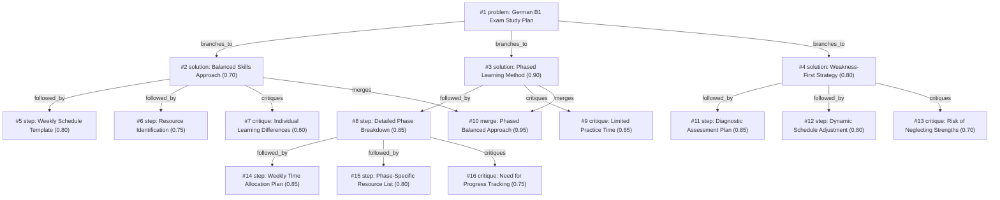

# b1-exam · zai/glm-4.5-flash · siblings

**Task:** I work full time and want to pass the German B1 exam in 6 months, starting from A2. I can study about 1 hour on weekdays and 3 hours on weekend days. How should I plan it?

| Thoughts | Calls | Tokens in / out | Time | Finish | First try valid | Next picked | Max depth | Weight spread | Duplicates |
|---|---|---|---|---|---|---|---|---|---|
| 16 | 8 | 11378 / 8978 | 4m41s | budget | 5/6 | 5/5 | 3 | 0.08 | 0 |

Failures: check 1

## Answer from the graph

# German B1 Exam Study Plan for Working Professionals

To successfully reach B1 level from A2 in 6 months while working full-time, I recommend a phased balanced approach that combines structured learning with balanced skill development.

## Study Plan Structure

### Phase 1: Foundation Building (Months 1-2)
Focus on building strong grammar fundamentals and basic vocabulary while introducing basic communication skills.
- **Time allocation**: 40% grammar, 30% vocabulary, 20% reading/listening, 10% speaking
- **Weekdays**: 30 minutes on grammar/vocabulary, 20 minutes on reading, 10 minutes on listening
- **Weekends**: 2 hours on grammar/vocabulary, 1 hour reading/listening, 30 minutes speaking, 30 minutes review
- **Specific goals**: Master present, past, future tenses; learn 200 basic vocabulary words; begin simple conversations

### Phase 2: Skill Development (Months 3-4)
Shift focus to developing comprehension skills while maintaining grammar and vocabulary growth.
- **Time allocation**: 30% grammar, 25% vocabulary, 30% reading/listening, 15% speaking
- **Weekdays**: 30 minutes grammar/vocabulary, 25 minutes reading, 15 minutes listening
- **Weekends**: 1.5 hours grammar/vocabulary, 2 hours reading/listening, 1 hour speaking, 1 hour review
- **Specific goals**: Master complex grammar structures; learn 300 more vocabulary words; understand authentic content; participate in longer conversations

### Phase 3: Application and Exam Preparation (Months 5-6)
Focus on applying your skills through writing and speaking practice, with intensive exam preparation.
- **Time allocation**: 20% grammar, 20% vocabulary, 20% reading/listening, 40% speaking/writing
- **Weekdays**: 20 minutes grammar/vocabulary, 20 minutes reading, 20 minutes writing/listening
- **Weekends**: 1 hour grammar/vocabulary, 1 hour reading/listening, 3 hours writing/speaking practice, 1 hour mock exams
- **Specific goals**: Practice writing emails and essays; develop fluency in speaking; complete full mock exams; strengthen weak areas

## Implementation Tips

1. **Create a consistent schedule**: Stick to your study times as much as possible, but allow some flexibility for busy days.

2. **Use quality resources**: Invest in a good B1 textbook, vocabulary app, listening materials (podcasts, videos), and speaking partners (language exchange apps or tutors).

3. **Track your progress**: Take bi-weekly mini-tests and full mock exams at the end of each month to identify areas needing improvement.

4. **Balance your approach**: While following the phase structure, ensure you're still practicing all four skills regularly, even when one area is the primary focus.

## Risks to Watch

1. **Neglecting speaking practice**: With limited time, speaking often gets sidelined. Make it a non-negotiable part of your weekend routine.

2. **Not adapting to your learning style**: If you find certain areas easier or harder than expected, adjust your time allocation accordingly.

3. **Insufficient real-world practice**: Supplement structured learning with real German content (TV shows, news, podcasts) to develop natural language use.

4. **Burnout**: Consistency is more important than intensity. If you miss a day, don't try to double up—just get back on track.

5. **Progress plateaus**: If you feel stuck for more than two weeks, consider adjusting your approach or seeking additional resources.

*Used: #3, #7, #8, #9, #10, #14, #16*

## Baseline: one call, no graph

# German Learning Plan: A2 to B1 in 6 Months

With your study schedule (1 hour on weekdays, 3 hours on weekends), you have approximately 286 hours total over 6 months. This is achievable with a structured approach. Here's how to plan your progression:

## Weekly Structure

**Weekdays (1 hour daily):**
- 15 minutes: Vocabulary building (flashcards, apps like Anki)
- 25 minutes: Grammar study and exercises
- 20 minutes: Reading practice
- 5 minutes: Quick review

**Weekends (3 hours each day):**
- Saturday:
  - 1 hour: Listening practice (podcasts, videos)
  - 1 hour: Speaking practice (tutor, language exchange)
  - 1 hour: Writing practice (emails, descriptions)
- Sunday:
  - 1 hour: Grammar review and complex exercises
  - 1 hour: Reading comprehension with analysis
  - 1 hour: Vocabulary expansion and thematic learning

## Monthly Focus Areas

**Month 1: Foundation Building**
- Core grammar review (present, past, future tenses; modal verbs)
- Basic vocabulary expansion (500-600 new words)
- Simple listening practice
- Resources: "Grammatik aktiv A2-B1" textbook, DW Learn German

**Month 2: Expanding Communication**
- Developing speaking confidence
- Vocabulary for daily situations (shopping, food, directions)
- Simple writing exercises
- Resources: "Tischgespräche" conversation book, language exchange apps

**Month 3: Intermediate Grammar**
- More complex grammar (subjunctive, passive voice)
- Listening to authentic materials
- Reading comprehension strategies
- Resources: "Grammatik und Übungen B1", "Slow German" podcast

**Month 4: Comprehension Skills**
- Understanding native speech
- Reading authentic texts
- Writing coherent paragraphs
- Resources: "Deutsch perfekt" magazine, news for learners

**Month 5: Expression and Fluency**
- Improving speaking fluency
- Writing longer texts
- Complex grammar structures
- Resources: "Menschen B1" textbook, conversation groups

**Month 6: Exam Preparation**
- Familiarization with exam format
- Timed practice for all sections
- Mock exams
- Resources: Past exam papers, exam preparation books

## Recommended Resources

1. **Textbooks:**
   - "Menschen B1" (Hueber Verlag)
   - "Grammatik aktiv A2-B1"
   - "Ziel B1" (Cornelsen)

2. **Digital Resources:**
   - Anki or Quizlet for vocabulary
   - Duolingo for practice
   - Goethe-Institute materials

3. **Listening:**
   - "Slow German" podcast
   - "Coffee Break German"
   - German music and YouTube channels

4. **Speaking Practice:**
   - iTalki or Preply for tutors
   - Tandem or HelloTalk for language exchange
   - Meetup groups for German speakers

5. **Reading:**
   - "Deutsch perfekt" magazine
   - Graded readers for B1 level
   - Children's books

## Success Tips

1. **Consistency is key:** Regular daily study beats occasional long sessions
2. **Active learning:** Take notes, create flashcards, practice speaking aloud
3. **Immersion:** Surround yourself with German (phone settings, social media)
4. **Set specific weekly goals:** Track your progress
5. **Focus on weak areas:** Identify and spend extra time on difficult skills
6. **Simulate exam conditions:** Practice under timed conditions as exam approaches

With this plan and consistent effort, you should reach B1 level in 6 months. Viel Erfolg! (Good luck!)

## Index

```text
#1 [problem] German B1 Exam Study Plan · expanded
  #2 [solution] Balanced Skills Approach · w 0.70 · expanded
    #5 [step] Weekly Schedule Template · w 0.80 · open
    #6 [step] Resource Identification · w 0.75 · open
    #7 [critique] Individual Learning Differences · w 0.60 · open
  #3 [solution] Phased Learning Method · w 0.90 · expanded
    #8 [step] Detailed Phase Breakdown · w 0.85 · expanded
      #14 [step] Weekly Time Allocation Plan · w 0.85 · open
      #15 [step] Phase-Specific Resource List · w 0.80 · open
      #16 [critique] Need for Progress Tracking · w 0.75 · open
    #9 [critique] Limited Practice Time · w 0.65 · open
    #10 [merge] Phased Balanced Approach · w 0.95 · open · also from #2
  #4 [solution] Weakness-First Strategy · w 0.80 · expanded
    #11 [step] Diagnostic Assessment Plan · w 0.85 · open
    #12 [step] Dynamic Schedule Adjustment · w 0.80 · open
    #13 [critique] Risk of Neglecting Strengths · w 0.70 · open
```

## Graph



## Thoughts

### #1 [problem] German B1 Exam Study Plan
w 1.00 · expanded · depth 0 · from –

Goal: Pass German B1 exam in 6 months starting from A2 level. Constraints: Full-time job limits study time to 1 hour on weekdays and 3 hours on weekends. Unknown: How to structure the limited study time effectively to cover all B1 requirements. A good plan must balance language skills (reading, writing, listening, speaking), grammar, vocabulary building, and exam practice within the given time constraints.

> This is the core problem that defines all aspects of the challenge

### #2 [solution] Balanced Skills Approach
w 0.70 · expanded · depth 1 · from #1

Dedicate equal time to all language skills (reading, writing, listening, speaking) and grammar/vocabulary each week. For example: 2 hours grammar, 2 hours vocabulary, 2 hours reading, 2 hours listening, 2 hours writing, 1 hour speaking practice spread across the week.

> Ensures comprehensive coverage of all B1 requirements but may not allow deep focus on any particular skill.

### #3 [solution] Phased Learning Method
w 0.90 · expanded · depth 1 · from #1

Divide the 6 months into phases: Months 1-2 focus on grammar foundations and basic vocabulary; Months 3-4 focus on reading and listening comprehension; Months 5-6 focus on writing, speaking, and exam practice. Adjust time allocation weekly based on progress.

> Builds skills progressively, allowing for deeper understanding and practice at each stage before moving to more complex skills.

### #4 [solution] Weakness-First Strategy
w 0.80 · expanded · depth 1 · from #1

Begin with a diagnostic assessment to identify weakest areas, then allocate more time to those areas first. For example, if speaking is weak, spend 40% of time on speaking initially, gradually reducing as skills improve while maintaining balance.

> Addresses personal learning gaps early but requires accurate self-assessment and may neglect stronger skills if not carefully managed.

### #5 [step] Weekly Schedule Template
w 0.80 · open · depth 2 · from #2

Design a detailed weekly schedule that allocates the available study time (5 hours weekdays, 6 hours weekends) to each skill area according to the balanced approach, considering energy levels and natural learning rhythms.

> A concrete schedule template makes the balanced approach practical and implementable

### #6 [step] Resource Identification
w 0.75 · open · depth 2 · from #2

Research and select high-quality learning materials for each skill area (grammar books, vocabulary apps, reading materials, listening resources, writing exercises, speaking partners)

> Appropriate resources are essential for effective learning in each skill area

### #7 [critique] Individual Learning Differences
w 0.60 · open · depth 2 · from #2

The balanced approach assumes equal time allocation to all skills, but learners may have different strengths and weaknesses. Consider adjusting time allocation based on personal progress and diagnostic assessments.

> Not all skills require equal attention from every learner

### #8 [step] Detailed Phase Breakdown
w 0.85 · expanded · depth 2 · from #3

Month 1: Core grammar (present, past, future tenses) + 200 basic vocabulary words (15 min/day). Month 2: More complex grammar (subjunctive, cases) + 300 vocabulary words (15 min/day). Month 3: Reading practice (articles, short stories) + listening exercises (podcasts, dialogues) (20 min/day). Month 4: Advanced reading comprehension + listening to authentic content (25 min/day). Month 5: Writing practice (emails, essays) + speaking exercises (30 min/day). Month 6: Full exam practice + weak area reinforcement (35 min/day).

> Provides concrete weekly goals for each phase making the abstract plan actionable

### #9 [critique] Limited Practice Time
w 0.65 · open · depth 2 · from #3

This approach may not allocate sufficient time for speaking practice and real-world language use, which are critical for B1 level. The structured phases might also not allow enough flexibility for individual progress differences or unexpected challenges.

> Identifies a significant gap in the phased approach regarding speaking practice and flexibility

### #10 [merge] Phased Balanced Approach
w 0.95 · open · depth 2 · from #3, #2

Combine the structured timeline of #3 with the balanced skill development of #2. Each phase maintains all four skills (reading, writing, listening, speaking) but with different emphasis: Phase 1: 40% grammar, 30% vocab, 20% reading/listening, 10% speaking. Phase 2: 30% grammar, 25% vocab, 30% reading/listening, 15% speaking. Phase 3: 20% grammar, 20% vocab, 20% reading/listening, 40% speaking/writing practice.

> Merges the benefits of structured timeline with balanced skill development

### #11 [step] Diagnostic Assessment Plan
w 0.85 · open · depth 2 · from #4

Create a comprehensive diagnostic test covering all B1 skills (reading, writing, listening, speaking, grammar, vocabulary) to identify specific weaknesses within the first week. Allocate 4-5 hours for this assessment, potentially spread across 2-3 days.

> Critical for accurately identifying which areas need the most attention when implementing a weakness-first approach.

### #12 [step] Dynamic Schedule Adjustment
w 0.80 · open · depth 2 · from #4

Implement a bi-weekly review system where progress is assessed and study time is redistributed. As weaknesses improve (e.g., from 40% to 25% of study time), gradually increase focus on other areas while maintaining minimum time for all skills.

> Ensures the plan adapts as skills improve, preventing stagnation and maintaining balanced development.

### #13 [critique] Risk of Neglecting Strengths
w 0.70 · open · depth 2 · from #4

Over-focusing on weaknesses may cause strengths to deteriorate or plateau. Maintain minimum time allocation for each skill (e.g., 15% even for strongest areas) to preserve existing abilities.

> Important counterbalance to prevent neglecting already proficient skills while addressing weaknesses.

### #14 [step] Weekly Time Allocation Plan
w 0.85 · open · depth 3 · from #8

Create a detailed weekly schedule: Weekdays (5 hours total): 30 min grammar/vocabulary, 20 min reading, 10 min listening. Weekends (6 hours total): 2 hours grammar/vocabulary, 2 hours reading/listening practice, 1 hour writing/speaking, 1 hour review/assessment. Include buffer time for difficult topics and flexibility for busy days.

> Makes the abstract monthly plan concrete with specific time allocation that fits the user's constraints

### #15 [step] Phase-Specific Resource List
w 0.80 · open · depth 3 · from #8

Month 1-2: 'Grammatik aktiv A2-B1' textbook, Anki vocabulary cards, DW Learn German app. Month 3-4: 'B1 Lektüre' reading book, 'Audiotrainer B1', Deutsche Welle podcasts. Month 5-6: 'B1 Schreibtraining', iTalki conversation practice, past exam papers. Include digital resources like YouTube channels and language exchange platforms.

> Provides concrete materials for each phase to implement the learning plan effectively

### #16 [critique] Need for Progress Tracking
w 0.75 · open · depth 3 · from #8

The plan lacks regular assessment points to track progress against B1 requirements. Without monthly self-tests or mock exams, learners may not identify weaknesses until too late. Suggest adding bi-weekly mini-tests and a full mock exam at the end of each month.

> Addresses the critical gap of measuring progress to ensure the plan leads to exam readiness

