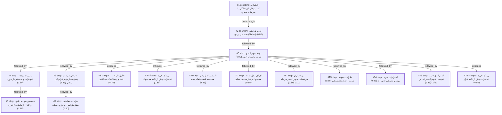

# bakery · ollama-cloud/gemma4:31b · one

**Task:** می‌خواهم در محله‌ام در تهران یک کسب‌وکار کوچک فروش نان خانگی راه بیندازم. حدود ۵۰ میلیون تومان سرمایه دارم و فقط آشپزخانهٔ خانه‌ام را. از کجا و چطور شروع کنم؟

| Thoughts | Calls | Tokens in / out | Time | Finish | First try valid | Next picked | Max depth | Weight spread | Duplicates |
|---|---|---|---|---|---|---|---|---|---|
| 16 | 18 | 27968 / 5318 | 53s | budget | 15/16 | 5/15 | 4 | 0.05 | 1 |

Failures: no_tool_call 1

## Answer from the graph

برای راه‌اندازی کسب‌وکار نان خانگی با سرمایه ۵۰ میلیون تومان در محیط خانه، بهترین استراتژی این است که به جای رقابت با نانوایی‌های صنعتی، بر روی **«نان‌های تخصصی و نیچ» (Niche)** تمرکز کنید (مانند نان‌های رژیمی، نان‌های تخمیر طبیعی یا Sourdough و نان‌های محلی خاص). این کار باعث می‌شود ارزش افزوده محصول شما بالا برود و مشتریان محله حاضر باشند قیمت بیشتری پرداخت کنند.

در ادامه، نقشه راه گام‌به‌گام برای شروع این مسیر آورده شده است:

### گام اول: تست محصول و تایید بازار (بدون هزینه زیاد)
پیش از آنکه سرمایه خود را صرف تجهیزات گران‌قیمت کنید، باید بدانید محله شما چه نانی را می‌پسندد:
*   **تولید محدود:** یک منوی کوچک (۳ تا ۵ نوع نان) طراحی کنید.
*   **تست رایگان:** نمونه‌های کوچک نان را بین همسایگان و کسب‌وکارهای محلی توزیع کنید.
*   **سیستم بازخورد:** از یک گروه واتس‌اپ یا تلگرام محلی استفاده کنید تا نظرات مردم درباره طعم، بافت و قیمت پیشنهادی را بگیرید. این کار ریسک تولید محصول نامحبوب را از بین می‌برد.

### گام دوم: مدیریت بودجه و تجهیزات
سرمایه ۵۰ میلیونی شما باید هوشمندانه تخصیص یابد تا نقدینگی برای دوران ابتدایی حفظ شود:
*   **خرید تدریجی:** ابتدا از تجهیزات موجود در خانه استفاده کنید و فقط ابزارهای حیاتی (مانند ترازو دیجیتال دقیق و دم‌سنج) را بخرید.
*   **تخصیص بودجه پیشنهادی:** حدود ۱۵ تا ۲۰ میلیون تومان برای تجهیزات اولیه (مانند یک فر کوچک اما حرفه‌ای)، ۱۰ میلیون تومان برای مواد اولیه ماه اول و باقی مبلغ را به عنوان سرمایه در گردش و هزینه بسته‌بندی نگه دارید.
*   **ارتقاء بر اساس تقاضا:** تجهیزات گران‌تر (مانند همزن‌های صنعتی) را تنها زمانی بخرید که تقاضای بازار تایید شد و حجم سفارشات بالا رفت.

### گام سوم: عملیاتی کردن سفارش‌گیری و توزیع
برای اینکه آشپزخانه خانه به آشوب نکشد و هدررفت مواد نداشته باشید:
*   **سیستم پیش‌سفارش (Pre-order):** از مدل پیش‌سفارش استفاده کنید. برای مثال، روزهای خاصی (شنبه و سه‌شنبه) را برای پخت تعیین کنید و سفارش‌ها را تا ۴۸ ساعت قبل از طریق گوگل‌فرم یا پیام مستقیم بگیرید.
*   **بازاریابی محلی:** یک صفحه اینستاگرام برای نمایش بهداشت محیط کار و کیفیت نان‌ها بسازید.
*   **توزیع بهینه:** محدوده تحویل را محدود کنید (مثلاً فقط تحویل پیاده در محله یا استفاده از پیک محلی).
*   **بسته‌بندی:** از بسته‌بندی‌های ساده اما بهداشتی استفاده کنید که حس «خانگی بودن» را منتقل کند و حتماً کارت ویزیتی حاوی شماره تماس در آن قرار دهید.

### ریسک‌هایی که باید مراقب باشید:
۱. **ریسک مالی:** از خرید تجهیزات گران‌قیمت پیش از تایید نهایی محصول توسط مشتریان خودداری کنید.
۲. **ریسک بهداشتی:** ظرفیت آشپزخانه خود را تحلیل کنید تا تولیدات شما باعث ایجاد مزاحمت (مانند بوی شدید یا آردپاشی زیاد) برای همسایگان نشود و استانداردهای بهداشتی را به شدت رعایت کنید.
۳. **مدیریت زمان:** به دلیل محدودیت فضا، از پخت‌های انبوه و ناگهانی پرهیز کنید و حتماً بر اساس تقویم پخت پیش بروید.

*Used: #1, #2, #3, #4, #5, #6, #7, #8, #9, #16*

## Baseline: one call, no graph

راه اندازی یک کسب‌وکار خانگی با سرمایه ۵۰ میلیون تومان در تهران کاملاً امکان‌پذیر است، چون شما هزینه اجاره مغازه را ندارید. برای اینکه این مسیر را اصولی طی کنید و سرمایه‌تان هدر نرود، این نقشه راه گام‌به‌گام را دنبال کنید:

### ۱. تعیین «محصول برنده» (نیچ مارکت)
شما نمی‌توانید همه جور نانی بپزید. با توجه به فضای آشپزخانه و تجهیزات، روی یک یا دو محصول تخصصی تمرکز کنید. 
*   **پیشنهادها:** نان‌های رژیمی (کتو، بدون گلوتن)، نان‌های سنتی با کیفیت بالا (مثل نان سنگک خانگی یا نان تافتون)، یا نان‌های مدرن (سourdough یا نان‌های میوه‌ای و 견ور).
*   **نکته:** محصولی را انتخاب کنید که در محله‌تان کمتر باشد یا کیفیت موجود در بازار پایین باشد.

### ۲. مدیریت سرمایه ۵۰ میلیون تومانی (بودجه‌بندی)
سرمایه شما برای شروع خوب است، اما باید هوشمندانه خرج کنید:
*   **تجهیزات (۲۰ تا ۳۰ میلیون):** اگر فر شما ضعیف است، اولین اولویت خرید یک فر صنعتی کوچک یا فر کنوکشن است که دمای یکنواختی داشته باشد. همچنین خرید یک همزن صنعتی کوچک (در صورت نیاز) یا ترازوهای دقیق دیجیتال.
*   **مواد اولیه (۱۰ میلیون):** خرید آرد و مواد اولیه به‌صورت عمده (از بازارهای تهران مثل بازار تهران یا میدان میثاق) برای کاهش هزینه.
*   **بسته‌بندی (۵ میلیون):** بسته‌بندی شیک و بهداشتی (کیسه‌های کاغذی کرافت، برچسب لوگو) نان خانگی را از نان معمولی متمایز می‌کند.
*   **تبلیغات و ذخیره (۵ تا ۱۰ میلیون):** برای روزهای اول و تبلیغات محلی.

### ۳. استانداردسازی و بهداشت
حتی اگر در خانه می‌پزید، باید استانداردهای یک bakery را داشته باشید:
*   **بهداشت:** استفاده از دستکش، کلاه آشپزی و نظافت دقیق محیط. مشتریان نان خانگی به شدت روی «تمیزی» حساس هستند.
*   **دستورالعمل (Recipe):** هر نان باید دقیقاً با گرم (ترازو) اندازه‌گیری شود تا هر روز طعم و کیفیت یکسانی داشته باشد.

### ۴. استراتژی فروش و بازاریابی در محله
در تهران، محله‌ها اکوسیستم خاص خودشان را دارند:
*   **نمونه رایگان:** کوچک‌ترین تکه‌های نان خود را در بسته‌بندی‌های کوچک به همسایه‌ها و کسب‌وکارهای محلی (مثل کافی‌شاپ‌های کوچک یا سوپرمارکت‌ها) بدهید تا امتحان کنند.
*   **اینستاگرام محلی:** یک پیج بسازید و در بیو بنویسید «ارسال سریع در محله [نام محله]». از قابلیت Location در استوری‌ها استفاده کنید.
*   **گروه‌های تلگرامی/واتس‌اپی محله:** اکثر محله‌های تهران گروه‌های همسایگی دارند؛ اینجا بهترین جا برای معرفی محصول شماست.
*   **سفارشات پیش‌فروش (Pre-order):** برای اینکه دورریز نداشته باشید، سیستم «سفارش امروز برای فردا» را اجرا کنید.

### ۵. مدل توزیع و ارسال
*   **تحویل درب منزل:** در ابتدای کار، خودتان یا یک فرد آشنا در محله را برای تحویل نان‌ها در نظر بگیرید.
*   **نقطه تحویل:** می‌توانید با یک سوپرمارکت یا کافی‌شاپ محلی توافق کنید که نان‌های شما را (با درصد سود کم) در ویترینشان قرار دهند.

### جدول زمان‌بندی برای شروع:
| هفته | فعالیت اصلی | هدف |
| :--- | :--- | :--- |
| **هفته اول** | تحقیق بازار و تست دستور پخت | رسیدن به بهترین طعم نان |
| **هفته دوم** | خرید تجهیزات و مواد اولیه عمده | آماده‌سازی زیرساخت آشپزخانه |
| **هفته سوم** | طراحی لوگو و سفارش بسته‌بندی | ایجاد هویت بصری برای برند |
| **هفته چهارم** | توزیع نمونه رایگان و شروع سفارشات | جذب اولین مشتریان واقعی |

**یک توصیه طلایی:**
از روز اول سعی نکنید حجم زیاد تولید کنید. ابتدا با تعداد کم شروع کنید، بازخورد بگیرید و سپس هر ماه بخشی از سود را دوباره روی خرید تجهیزات بهتر (مثلاً یک ورزنه برقی) سرمایه‌گذاری کنید.

## Index

```text
#1 [problem] راه‌اندازی کسب‌وکار نان خانگی با سرمایه محدود · expanded
  #2 [solution] تولید نان‌های تخصصی و نیچ (Niche) · w 0.80 · expanded
    #3 [step] تهیه تجهیزات و تست محصول اولیه · w 0.90 · expanded
      #4 [step] مدیریت بودجه تجهیزات و سیستم بازخورد · w 0.90 · expanded
        #5 [step] تخصیص بودجه دقیق و کانال ارتباطی بازخورد · w 0.95 · done
      #6 [step] طراحی سیستم پیش‌سفارش و بازاریابی محلی · w 0.85 · expanded
        #7 [step] جزئیات عملیاتی سفارش‌گیری و توزیع محلی · w 0.90 · open, max depth
      #8 [critique] تحلیل ظرفیت فضا و ریسک‌های بهداشتی · w 0.70 · done
      #9 [critique] ریسک خرید تجهیزات پیش از تایید محصول · w 0.85 · done
      #10 [step] تامین مواد اولیه و محاسبه قیمت تمام شده · w 0.85 · open
      #11 [step] اجرای مدل تست محصول و نظرسنجی محلی · w 0.85 · done
      #12 [step] بهینه‌سازی هزینه‌های تجهیزات در مرحله تست · w 0.80 · done
      #13 [step] طراحی تقویم تست و فرم نظرسنجی · w 0.85 · open
      #14 [step] استراتژی خرید بهینه و تدریجی تجهیزات · w 0.85 · done
      #15 [step] استراتژی خرید تدریجی تجهیزات بر اساس تقاضا · w 0.85 · done
      #16 [critique] ریسک خرید تجهیزات پیش از تایید بازار · w 0.80 · done
```

## Graph



## Thoughts

### #1 [problem] راه‌اندازی کسب‌وکار نان خانگی با سرمایه محدود
w 1.00 · expanded · depth 0 · from –

هدف: راه‌اندازی یک کسب‌وکار کوچک فروش نان خانگی در یکی از محله‌های تهران.
منابع موجود: ۵۰ میلیون تومان سرمایه، استفاده از آشپزخانه منزل.
محدودیت‌ها: بودجه محدود، فضای کاری خانگی، قوانین بهداشتی و مجوزهای احتمالی.
ناشناخته‌ها: نوع نان مورد پسند مشتریان محله، استراتژی قیمت‌گذاری، روش‌های توزیع و بازاریابی محلی.
نتیجه مطلوب: ایجاد یک مدل کسب‌وکار عملیاتی که با سرمایه موجود قابل اجرا باشد، سودآور باشد و از نظر بهداشتی و قانونی ریسک کمی داشته باشد.

> این گره تمام ابعاد مسئله، محدودیت‌ها و اهداف را برای شروع برنامه‌ریزی تعریف می‌کند.

### #2 [solution] تولید نان‌های تخصصی و نیچ (Niche)
w 0.80 · expanded · depth 1 · from #1

تمرکز بر نان‌های تخصصی و با ارزش افزوده بالا (مانند نان‌های رژیمی، sourdough یا نان‌های محلی خاص) برای جذب مشتریان محله و کاهش رقابت با نانوایی‌های صنعتی، با استفاده از تجهیزات موجود و خرید متمرکز مواد اولیه.

> با سرمایه کم، رقابت در قیمت با نانوایی‌های صنعتی ممکن نیست، پس باید روی کیفیت و تخصص تمرکز کرد.

### #3 [step] تهیه تجهیزات و تست محصول اولیه
w 0.90 · expanded · depth 2 · from #2

برای شروع تولید نان‌های تخصصی، ابتدا باید تجهیزات ضروری (مانند فر با دمای قابل تنظیم، همزن صنعتی کوچک یا ترازو دیجیتال) تهیه شود، سپس یک منوی محدود (۳ تا ۵ نوع نان) بر اساس تقاضای محله طراحی شده و در نهایت نمونه‌هایی برای تست رایگان به همسایگان و کسب‌وکارهای محلی توزیع شود تا بازخورد اولیه گرفته شود.

> این گام عملیاتی‌ترین روش برای تبدیل ایده نیچ به محصول واقعی با بودجه محدود است.

### #4 [step] مدیریت بودجه تجهیزات و سیستم بازخورد
w 0.90 · expanded · depth 3 · from #3

برای بهینه‌سازی بودجه ۵۰ میلیونی، ابتدا لیست تجهیزات موجود در خانه بررسی شود. سپس اولویت خرید تجهیزات بر اساس «تولید کم‌حجم اما با کیفیت» باشد (مثلاً خرید یک فر کوچک اما حرفه‌ای به جای فر بزرگ قدیمی). برای تست محصول، یک «روز بازخورد» تعریف شود که در آن نمونه‌های کوچک نان با یک پرسشنامه ساده در مورد طعم، بافت و قیمت پیشنهادی به همسایگان داده شود تا ریسک تولید انبوه نان نامحبوب کاهش یابد.

> این گام عملیاتی می‌کند که چگونه بودجه محدود مدیریت شود و بازخوردها به داده‌های قابل اندازه‌گیری تبدیل شوند.

### #5 [step] تخصیص بودجه دقیق و کانال ارتباطی بازخورد
w 0.95 · done · depth 4 · from #4

برای مدیریت بهینه بودجه، مبلغ ۱۵ تا ۲۰ میلیون تومان برای تجهیزات اولیه (فر، ترازو، ظروف تخمیر) اختصاص یابد، ۱۰ میلیون تومان برای مواد اولیه ماه اول، و باقی مبلغ به عنوان سرمایه در گردش برای هزینه‌های پیش‌بینی نشده و بسته‌بندی نگه داشته شود. در مورد سیستم بازخورد، استفاده از یک گروه واتس‌اپ یا تلگرام محلی برای دریافت نظرات سریع و ایجاد حس نزدیکی با مشتریان محله پیشنهاد می‌شود تا روند اصلاح محصول در لحظه انجام شود.

> This provides a concrete financial breakdown and a modern communication tool for feedback, turning the general plan into a practical action.

### #6 [step] طراحی سیستم پیش‌سفارش و بازاریابی محلی
w 0.85 · expanded · depth 3 · from #3

برای تبدیل تست محصول به فروش واقعی، باید یک استراتژی بازاریابی محلی و دیجیتال کوچک طراحی شود. این شامل ایجاد یک صفحه اینستاگرام برای نمایش کیفیت و بهداشت محیط کار، استفاده از گروه‌های تلگرامی یا واتس‌اپ محله، و ارائه سیستم پیش‌سفارش (Pre-order) برای جلوگیری از هدررفت مواد اولیه و مدیریت بهتر زمان پخت در آشپزخانه خانگی است.

> بعد از تست محصول، گام حیاتی تبدیل تست‌کنندگان به مشتریانPaying است.

### #7 [step] جزئیات عملیاتی سفارش‌گیری و توزیع محلی
w 0.90 · open · depth 4 · from #6

برای عملیاتی کردن سیستم پیش‌سفارش و بازاریابی، گام‌های زیر اجرا شود: ۱. تعریف روزهای خاص پخت (مثلاً شنبه و سه‌شنبه) برای خوشه‌بندی سفارشات. ۲. ایجاد فرم ساده (گوگل فرم یا پیام مستقیم) برای ثبت سفارش تا ۴۸ ساعت قبل. ۳. تعیین محدوده تحویل (مثلاً فقط پیاده در محله یا ارسال با پیک محلی). ۴. طراحی بسته‌بندی ساده اما بهداشتی و زیبا که حس «خانگی بودن» را منتقل کند و کارت بازدید کوچک حاوی شماره تماس و اینستاگرام در آن قرار گیرد.

> This converts the marketing strategy into a concrete operational workflow.

### #8 [critique] تحلیل ظرفیت فضا و ریسک‌های بهداشتی
w 0.70 · done · depth 3 · from #3

بررسی محدودیت‌های ظرفیت آشپزخانه و تحلیل ریسک بهداشتی: بررسی اینکه آیا فضای فعلی برای تولید مقیاس کوچک کافی است و شناسایی نقاط بحرانی بهداشتی (مانند کنترل آرد و دفع ضایعات) برای جلوگیری از مشکلات احتمالی با همسایگان یا مراجع بهداشتی در آینده.

> قبل از خرید تجهیزات، باید ظرفیت واقعی فضا و ریسک‌های بهداشتی در محیط خانگی ارزیابی شود تا سرمایه هدر نرود.

### #9 [critique] ریسک خرید تجهیزات پیش از تایید محصول
w 0.85 · done · depth 3 · from #3

برای کاهش ریسک مالی در مرحله تست، به جای خرید تجهیزات گران‌قیمت در شروع، ابتدا از تجهیزات موجود در خانه استفاده شود و تنها موارد حیاتی (مانند ترازو دیجیتال دقیق و دم‌سنج) خریداری شوند. سپس با تحلیل بازخوردهای مرحله تست، لیست خرید تجهیزات حرفه‌ای‌تر (مانند فر مخصوص یا میکسرهای قوی‌تر) بر اساس نوع نانی که بیشترین تقاضا را دارد، تدوین شود تا از هدررفت سرمایه ۵۰ میلیونی جلوگیری گردد.

> It is risky to buy equipment before knowing which product sells best.

### #10 [step] تامین مواد اولیه و محاسبه قیمت تمام شده
w 0.85 · open · depth 3 · from #3

تعیین لیست مواد اولیه با کیفیت اما مقرون‌به‌صرفه، شناسایی تامین‌کنندگان عمده در تهران برای کاهش هزینه‌ها (مانند بازار یا تامین‌کنندگان آرد تخصصی) و ایجاد یک جدول هزینه-به‌سود برای هر نوع نان جهت اطمینان از حاشیه سود مناسب قبل از شروع تولید انبوه.

> تامین مواد اولیه و محاسبه قیمت تمام شده برای بقای مالی کسب‌وکار حیاتی است.

### #11 [step] اجرای مدل تست محصول و نظرسنجی محلی
w 0.85 · done · depth 3 · from #3

برای تست محصول، ابتدا یک لیست از نان‌های هدف (مثلاً نان تست multigrain، باگت خانگی، یا نان‌های رژیمی) تهیه شود. سپس در قالب "بسته‌های تست" کوچک، نمونه‌ها به همراه یک پرسشنامه ساده (یا کد QR برای گوگل فرم) به همسایگان نزدیک توزیع شود تا سلیقه محلی، قیمت قابل قبول و زمان مورد نظر برای خرید مشخص گردد.

> این گام عملیاتی می‌کند که چگونه تست محصول در مرحله ۳ انجام شود تا از اتلاف مواد جلوگیری شود.

### #12 [step] بهینه‌سازی هزینه‌های تجهیزات در مرحله تست
w 0.80 · done · depth 3 · from #3

برای بهینه‌سازی هزینه در مرحله تست، به جای خرید تجهیزات گران‌قیمت، ابتدا از تجهیزات موجود در خانه استفاده شود و تنها مواردی که تاثیر مستقیم بر کیفیت نان دارند (مانند یک ترازو دقیق یا سنگی مخصوص فر) خریداری شوند. همچنین، تست محصول باید در گروه‌های کوچک (مثلاً ۵ همسایه نزدیک) انجام شود تا هزینه‌ی مواد اولیه در مرحله آزمون و خطا کنترل گردد.

> این گام ریسک مالی را در ابتدای مسیر کاهش می‌دهد و اجازه می‌دهد پیش از هزینه کردن بخش بزرگی از ۵۰ میلیون تومان، تقاضا تایید شود.

### #13 [step] طراحی تقویم تست و فرم نظرسنجی
w 0.85 · open · depth 3 · from #3

برای تست محصول اولیه، باید یک تقویم آزمایشی ۲ هفته‌ای طراحی شود: هفته اول تولید ۲ نوع نان پرطرفدار (مثلاً نان تست سبوس‌دار و نان گردو) برای توزیع رایگان بین ۱۰ همسایه نزدیک و هفته دوم تولید نان‌های تخصصی‌تر (مثل سوردو) برای دریافت سفارش‌های کوچک. در هر مرحله، یک فرم ساده (کاغذی یا آنلاین) برای ثبت نظر درباره طعم، بافت و قیمت پیشنهادی تهیه شود تا داده‌های واقعی برای نهایی کردن منو به دست آید.

> این گام عملیاتی می‌کند که چگونه تست محصول از یک ایده کلی به یک فرآیند اجرایی تبدیل شود.

### #14 [step] استراتژی خرید بهینه و تدریجی تجهیزات
w 0.85 · done · depth 3 · from #3

برای کاهش ریسک مالی، به جای خرید تجهیزات گران‌قیمت در ابتدا، از تجهیزات موجود در خانه استفاده شود و تنها مواردی که مستقیماً بر کیفیت نهایی اثر می‌گذارند (مانند ترازو دیجیتال دقیق برای ثبات طعم یا یک سنگ پخت برای نان‌های خاص) خریداری شوند. همچنین از اجاره تجهیزات یا خرید دست‌دوم تمیز برای تجهیزاتی مثل همزن استفاده شود تا بخش بزرگی از ۵۰ میلیون تومان برای بازاریابی و مواد اولیه حفظ گردد.

> بهینه‌سازی سرمایه اولیه برای جلوگیری از اتلاف بودجه روی تجهیزات غیرضروری قبل از تایید بازار.

### #15 [step] استراتژی خرید تدریجی تجهیزات بر اساس تقاضا
w 0.85 · done · depth 3 · from #3

برای کاهش ریسک مالی، به جای خرید تجهیزات گران‌قیمت در ابتدا، از تجهیزات موجود در خانه استفاده شود و تنها موارد ضروری (مانند ترازو دقیق و دم‌سنج) خریداری شوند. سپس بر اساس حجم سفارشات واقعی در مرحله تست، تجهیزات حرفه‌ای‌تر (مانند فرهای کانوکشن کوچک یا میکسرها) به صورت تدریجی تهیه گردند.

> این گام ریسک سرمایه‌گذاری اولیه را کاهش داده و اجازه می‌دهد بر اساس تقاضای واقعی تجهیزات خریداری شوند.

### #16 [critique] ریسک خرید تجهیزات پیش از تایید بازار
w 0.80 · done · depth 3 · from #3

برای کاهش ریسک مالی، به جای خرید تجهیزات گران‌قیمت در ابتدای کار، ابتدا از تجهیزات موجود در خانه استفاده شود و تنها ابزارهای حیاتی (مانند ترازو دیجیتال برای دقت در فرمولاسیون و دم‌سنج) خریداری شوند. سپس با تحلیل بازخوردهای مرحله تست، تجهیزات تخصصی‌تر (مانند فر حرفه‌ای‌تر یا همزن) به صورت تدریجی و از سود حاصله یا باقی‌مانده سرمایه تهیه شوند.

> Preventing over-investment before market validation is crucial for a small budget.

