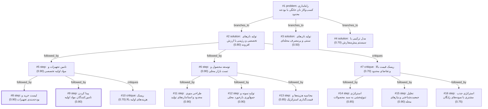

# bakery · ollama-cloud/gemma4:31b · siblings

**Task:** می‌خواهم در محله‌ام در تهران یک کسب‌وکار کوچک فروش نان خانگی راه بیندازم. حدود ۵۰ میلیون تومان سرمایه دارم و فقط آشپزخانهٔ خانه‌ام را. از کجا و چطور شروع کنم؟

| Thoughts | Calls | Tokens in / out | Time | Finish | First try valid | Next picked | Max depth | Weight spread | Duplicates |
|---|---|---|---|---|---|---|---|---|---|
| 16 | 8 | 9972 / 4261 | 36s | budget | 6/6 | 5/5 | 3 | 0.08 | 0 |

## Answer from the graph

برای شروع کسب‌وکار نان خانگی با سرمایه ۵۰ میلیون تومان در تهران، بهترین استراتژی، تمرکز بر **«نان‌های تخصصی و رژیمی با ارزش افزوده»** است. چرا که تولید نان‌های سنتی و پرمصرف به دلیل حجم تولید بالا، نیاز به تجهیزات صنعتی بزرگ و قیمت پایین دارد که با بودجه و فضای شما سازگار نیست. اما نان‌های تخصصی (مانند سوردو، نان‌های multigrain یا رژیمی) حاشیه سود بالاتر و تقاضای خاصی در تهران دارند.

در ادامه، نقشه راه اجرایی شما در سه مرحله آورده شده است:

### گام اول: تجهیزات و تامین مواد اولیه
برای اینکه سرمایه‌تان سریع تمام نشود، از خرید تجهیزات بسیار گران‌قیمت در ابتدای کار پرهیز کنید و در صورت امکان به سراغ تجهیزات دست‌دوم تمیز بروید.
*   **لیست خرید پیشنهادی:**
    *   یک فر کانوکشن (Convection) با کیفیت (حدود ۱۵ تا ۲۰ میلیون تومان).
    *   همزن صنعتی کوچک یا استند میکسر (۱۰ تا ۱۵ میلیون تومان).
    *   ترازو دیجیتال دقیق و ظرف‌های تخمیر مخصوص (حدود ۵ میلیون تومان).
*   **تامین مواد:** شناسایی تامین‌کنندگان آرد تخصصی (مانند آرد جو، کتان یا آردهای با پروتئین بالا) در تهران برای کاهش هزینه‌های خرید خرد.
*   **بودجه:** حدود ۳۰ تا ۴۰ میلیون تومان برای تجهیزات و باقی‌مانده برای مواد اولیه و بسته‌بندی رزرو شود.

### گام دوم: توسعه محصول و تست بازار
به جای ارائه یک لیست طولانی، روی **۳ تا ۵ محصول کلیدی** تمرکز کنید (مثلاً: نان سوردو کلاسیک، نان تست چندغله و یک نوع نان رژیمی خاص).
*   **استانداردسازی:** دستورالعمل‌های دقیق بنویسید تا کیفیت نان در هر بار پخت یکسان باشد.
*   **محاسبه قیمت:** هزینه دقیق هر قرص نان (مواد اولیه + برق و گاز + زمان شما) را محاسبه کرده و با توجه به ارزش افزوده، قیمت‌گذاری کنید.
*   **تست محلی:** نمونه‌های کوچک و رایگان را بین همسایگان و آشنایان توزیع کنید تا بازخورد بگیرید و تقاضای واقعی محله را بسنجید.

### گام سوم: استراتژی فروش و جذب مشتری
*   **سیستم پیش‌سفارش:** برای جلوگیری از دورریز و هدررفت مواد، از مدل پیش‌سفارش (مثلاً سفارش تا دوشنبه برای تحویل چهارشنبه) استفاده کنید.
*   **توزیع:** ابتدا از طریق شبکه‌های اجتماعی محلی یا گروه‌های واتس‌اپ و تلگرام محله شروع کنید.

### ریسک‌های کلیدی و راهکارهای مقابله
۱. **ریسک تقاضای محدود:** ممکن است برخی ساکنان محله نان‌های تخصصی را گران بدانند یا با آن‌ها آشنا نباشند.
   *   *راهکار:* یک یا دو نوع نان «نیمه‌تخصصی» با قیمت مناسب‌تر در منو داشته باشید تا طیف بیشتری از مشتریان را جذب کنید.
۲. **اتمام سریع سرمایه:** خرید تجهیزات بیش از حد صنعتی قبل از تایید بازار.
   *   *راهکار:* با تجهیزات موجود در خانه یا خریدهای مرحله‌ای شروع کنید و هرگاه تعداد سفارش‌ها بالا رفت، تجهیزات را ارتقا دهید.

*Used: #1, #2, #5, #6, #7, #8, #10, #11*

## Baseline: one call, no graph

راه اندازی یک کسب‌وکار خانگی با بودجه ۵۰ میلیون تومان در تهران، با توجه به تقاضای بالا برای محصولات «سالم» و «خانگی»، ایده‌ی بسیار هوشمندانه‌ای است. چون شما فضای آشپزخانه را دارید، هزینه‌ی اجاره (که بزرگ‌ترین هزینه است) حذف شده و می‌توانید بیشتر روی کیفیت و بازاریابی تمرکز کنید.

در اینجا نقشه راه گام‌به‌گام برای شما آورده شده است:

### گام اول: تعیین «محصول برنده» (Niche)
شما نمی‌توانید هر نوع نانی را بپزید. برای شروع، روی ۱ یا ۲ محصول تخصصی تمرکز کنید تا هم کیفیت بالا برود و هم هدررفت مواد اولیه کم شود.
*   **پیشنهادها:** نان‌های رژیمی (جو، کینوا، دانه کامل)، نان‌های خاص (سوردو - Sourdough)، نان‌های سنتی با کیفیت بالا یا نان‌های شیرین و پذیرایی.
*   **تحقیق محله:** ببینید همسایگان شما چه چیزی را کم دارند؟ (مثلاً اگر در محله‌ای هستید که خانواده‌های جوان و ورزشکار زیاد هستند، نان‌های multigrain یا رژیمی عالی هستند).

### گام دوم: تجهیزات و بودجه‌بندی (۵۰ میلیون تومان)
بیشترین هزینه شما صرف تجهیزات اولیه و مواد اولیه ماه اول می‌شود.
۱. **فر:** اگر فر خانگی شما کوچک است، سعی کنید یک فر برقی صنعتی کوچک یا فرهای کانوکشن (Convection) بخرید که دمای یکنواختی داشته باشند.
۲. **میکسر/همزن:** برای حجم‌های بیشتر، یک همزن ایستاده (Stand Mixer) با کاسه استیل ضروری است تا دستتان خسته نشود و بافت نان یکدست شود.
۳. **ترازو و ابزار:** ترازو دیجیتال (بسیار حیاتی برای تکرارپذیری کیفیت)، سینی‌های پخت، کف دسته‌ها و ابزارهای برش.
۴. **بسته‌بندی:** کیسه‌های کاغذی شیک، برچسب (لوگو) و روبان. (ظاهر محصول در فروش خانگی ۵۰٪ ارزش کار است).

**توزیع پیشنهادی بودجه:**
*   تجهیزات (فر و همزن): ۲۰ تا ۳۰ میلیون تومان.
*   مواد اولیه ماه اول: ۵ تا ۱۰ میلیون تومان.
*   بسته‌بندی و برندینگ اولیه: ۳ تا ۵ میلیون تومان.
*   سرمایه در گردش (احتیاط): ۱۰ میلیون تومان.

### گام سوم: استانداردسازی و قیمت‌گذاری
*   **دستورالعمل دقیق:** هر گرم آرد و هر میلی‌لیتر آب را یادداشت کنید. مشتری باید نانی را که امروز می‌خرد، ماه آینده هم با همان کیفیت دریافت کند.
*   **محاسبه هزینه:** هزینه برق، گاز، آب، مواد اولیه و «دستمزد خودتان» را حساب کنید. سپس حاشیه سود (مثلاً ۳۰٪ تا ۵۰٪) را اضافه کنید. قیمت را با نانوایی‌های صنعتی مقایسه نکنید، چون شما «محصول خاص و خانگی» می‌فروشید.

### گام چهارم: بازاریابی در محله (رشد سریع)
چون در تهران هستید، از ابزارهای محلی استفاده کنید:
۱. **اینستاگرام محله‌ای:** صفحه‌ای بسازید و در بیو بنویسید «تولید نان خانگی در محله [نام محله]». از استوری‌ها برای نشان دادن مراحل پخت (بهداشتی بودن) استفاده کنید.
۲. **نمونه رایگان (تستر):** کوچک‌ترین و موثرترین راه! مقداری از نان خود را تکه تکه کنید و با یک یادداشت کوچک برای همسایگان یا در گروه‌های تلگرامی/واتس‌اپی محله بفرستید.
۳. **سفارشات پیش‌فروش:** برای اینکه نانی هدر نرود، سیستم «سفارش امروز برای فردا» را راه بیندازید.

### گام پنجم: توزیع و تحویل
*   **تحویل درب منزل:** در ابتدا خودتان یا یک فرد مورد اعتماد در محله تحویل دهید.
*   **پیک:** با پیک‌های محلی یا اپلیکیشن‌های ارسال سریع قرارداد ببندید.

### نکات طلایی برای موفقیت:
*   **بهداشت:** عکس‌هایی از محیط تمیز آشپزخانه و استفاده از دستکش و کلاه بهداشتی منتشر کنید. این موضوع اعتماد مشتری را جلب می‌کند.
*   **تنوع محدود:** هر هفته یک «نان ویژه» (Special) معرفی کنید تا مشتریان برای امتحان کردن آن مشتاق شوند.
*   **گوش دادن به مشتری:** از مشتریان بپرسید نان را چطور می‌خواهند (مثلاً نمک کمتر یا تردتر) و سریعاً تغییر دهید.

**خلاصه مسیر:**
تخصص انتخاب کنید $\rightarrow$ تجهیزات ضروری بخرید $\rightarrow$ نمونه رایگان پخش کنید $\rightarrow$ سفارشات پیش‌فروش بگیرید $\rightarrow$ با سود حاصله، تجهیزات را ارتقا دهید.

## Index

```text
#1 [problem] راه‌اندازی کسب‌وکار نان خانگی با بودجه محدود · expanded
  #2 [solution] تولید نان‌های تخصصی و رژیمی با ارزش افزوده · w 0.80 · expanded
    #5 [step] تامین تجهیزات و مواد اولیه تخصصی · w 0.90 · expanded
      #8 [step] لیست خرید و بودجه‌بندی تجهیزات · w 0.90 · done
      #9 [step] پیدا کردن تامین‌کنندگان مواد اولیه · w 0.80 · done
      #10 [critique] ریسک هزینه‌های اولیه بالا · w 0.70 · open
    #6 [step] توسعه محصول و تست بازار محلی · w 0.90 · expanded
      #11 [step] طراحی منوی محدود و استانداردهای تولید · w 0.90 · open
      #12 [step] تولید نمونه و جمع‌آوری بازخورد محلی · w 0.90 · open
      #13 [step] محاسبه هزینه‌ها و قیمت‌گذاری استراتژیک · w 0.85 · open
    #7 [critique] ریسک قیمت بالا و تقاضای محدود · w 0.70 · expanded
      #14 [step] استراتژی تنوع‌بخشی به سبد محصولات · w 0.85 · open
      #15 [step] تحلیل جمعیت‌شناختی و نیازهای محله · w 0.90 · open
      #16 [step] استراتژی جذب مشتری با نمونه‌های رایگان · w 0.75 · open
  #3 [solution] تولید نان‌های سنتی و پرمصرف محله‌ای · w 0.50 · open
  #4 [solution] مدل ترکیبی با سیستم پیش‌سفارش · w 0.70 · open
```

## Graph



## Thoughts

### #1 [problem] راه‌اندازی کسب‌وکار نان خانگی با بودجه محدود
w 1.00 · expanded · depth 0 · from –

هدف: راه‌اندازی یک کسب‌وکار کوچک فروش نان خانگی در یکی از محله‌های تهران.
داده‌ها و محدودیت‌ها:
- سرمایه اولیه: ۵۰ میلیون تومان.
- مکان: آشپزخانه منزل (بدون اجاره محیط تجاری).
- بازار هدف: همسایگان و ساکنان محله.

موارد نامشخص:
- نوع نان (سنتی، رژیمی، فانتزی یا تخصصی).
- استراتژی قیمت‌گذاری و توزیع.
- مجوزهای مورد نیاز برای تولید خانگی.
- تجهیزات فعلی آشپزخانه و نیاز به خرید تجهیزات جدید.

نتیجه مطلوب: یک برنامه اجرایی گام‌به‌گام (Roadmap) که با بودجه ۵۰ میلیون تومان، از مرحله تولید تا فروش و سودآوری را پوشش دهد و ریسک مالی را به حداقل برساند.

> این گره تمام ابعاد مسئله، محدودیت‌ها و اهداف کاربر را به طور دقیق تعریف می‌کند.

### #2 [solution] تولید نان‌های تخصصی و رژیمی با ارزش افزوده
w 0.80 · expanded · depth 1 · from #1

تمرکز بر نان‌های تخصصی و رژیمی (مثل نان sourdough، نان multigrain یا نان‌های بدون گلوتن). این محصولات قیمت بالاتری دارند، تقاضای خاصی در تهران دارند و با تجهیزات ساده‌تر (اما با کیفیت) قابل تولید هستند و رقابت کمتری نسبت به نان‌های سنتی دارند.

> این روش سودآوری بیشتری دارد و با بودجه محدود، ارزش افزوده ایجاد می‌کند.

### #3 [solution] تولید نان‌های سنتی و پرمصرف محله‌ای
w 0.50 · open · depth 1 · from #1

تولید نان‌های سنتی و محبوبی (مثل نان تافتون خانگی، نان بربری یا نان‌های محلی) برای طیف گسترده‌تری از همسایگان. تمرکز بر حجم فروش بیشتر و قیمت پایین‌تر برای جذب سریع مشتری در محله.

> ریسک پذیرش توسط مشتری کمتر است اما سود هر واحد پایین‌تر است.

### #4 [solution] مدل ترکیبی با سیستم پیش‌سفارش
w 0.70 · open · depth 1 · from #1

ترکیبی از نان‌های رژیمی برای مشتریان خاص و نان‌های فانتزی/صبحانه برای خانواده‌ها. استفاده از سیستم پیش‌سفارش (Pre-order) برای جلوگیری از دورریز مواد اولیه و مدیریت بهتر بودجه ۵۰ میلیونی.

> تعادل بین سودآوری و حجم فروش را برقرار می‌کند.

### #5 [step] تامین تجهیزات و مواد اولیه تخصصی
w 0.90 · expanded · depth 2 · from #2

بررسی تجهیزات مورد نیاز (فر صنعتی کوچک، همزن، ترازو دیجیتال و ظروف تخمیر) و تخمین هزینه خرید آن‌ها از بودجه ۵۰ میلیونی. همچنین شناسایی تامین‌کنندگان آرد تخصصی و مواد اولیه باکیفیت در تهران.

> اولین قدم اجرایی برای مدل تخصصی، آماده‌سازی زیرساخت تولید است.

### #6 [step] توسعه محصول و تست بازار محلی
w 0.90 · expanded · depth 2 · from #2

طراحی منوی محدود (۳ تا ۵ نوع نان)، تست کیفیت، تعیین قیمت بر اساس هزینه مواد اولیه و ارزش افزوده، و ایجاد نمونه‌های رایگان برای توزیع بین همسایگان و آشنایان جهت بازخورد.

> تایید محصول توسط مشتری قبل از شروع فروش گسترده ضروری است.

### #7 [critique] ریسک قیمت بالا و تقاضای محدود
w 0.70 · expanded · depth 2 · from #2

ریسک بالای قیمت نهایی محصول برای برخی از لایه‌های جامعه محله و احتمال پایین بودن تقاضا برای نان‌های بسیار خاص (مثل بدون گلوتن) در برخی مناطق تهران. راهکار: ارائه یک یا دو مورد نان نیمه‌تخصصی با قیمت مناسب‌تر.

> محصولات گران‌قیمت ممکن است بازار هدف کوچکی در یک محله خاص داشته باشند.

### #8 [step] لیست خرید و بودجه‌بندی تجهیزات
w 0.90 · done · depth 3 · from #5

خرید تجهیزات ضروری: یک فرtoconvection با کیفیت (حدود ۱۵-۲۰ میلیون)، همزن صنعتی کوچک یا استند میکسر (۱۰-۱۵ میلیون)، ترازو دیجیتال دقیق و ظرف‌های تخمیر پلاستیکی یا سبد‌های مخصوص (۵ میلیون). باقی‌مانده بودجه برای مواد اولیه و بسته‌بندی رزرو شود.

> تخصیص دقیق بودجه برای تجهیزات پایه جهت مدیریت سرمایه ۵۰ میلیونی.

### #9 [step] پیدا کردن تامین‌کنندگان مواد اولیه
w 0.80 · done · depth 3 · from #5

شناسایی تامین‌کنندگان آرد تخصصی (مانند آرد نان‌های ارگانیک یا آردهای بدون گلوتن) در بازارهای تهران (مثل بازار تهران یا تامین‌کنندگان آنلاین) برای خرید عمده جهت کاهش هزینه تمام شده هر قرص نان.

> دسترسی به مواد اولیه باکیفیت و قیمت مناسب کلید سودآوری در مدل تخصصی است.

### #10 [critique] ریسک هزینه‌های اولیه بالا
w 0.70 · open · depth 3 · from #5

خطر خرید تجهیزات بیش از حد گران یا صنعتی در ابتدای کار که منجر به اتمام سریع سرمایه شود، بدون اینکه تقاضای بازار تایید شده باشد. پیشنهاد می‌شود ابتدا با تجهیزات موجود یا خرید دست‌دوم تمیز شروع شود.

> جلوگیری از Burn-rate بالای سرمایه در مرحله تست.

### #11 [step] طراحی منوی محدود و استانداردهای تولید
w 0.90 · open · depth 3 · from #6

انتخاب ۳ تا ۵ محصول کلیدی (مثلاً: نان تست multigrain، نان sourdough کلاسیک، و یک نوع نان رژیمی خاص مثل کتان یا جو). تهیه دستورالعمل‌های استاندارد برای تکرارپذیری کیفیت و محاسبه دقیق هزینه هر قرص نان.

> تعیین دقیق محصول اولین قدم عملی برای محاسبه بودجه و تست بازار است.

### #12 [step] تولید نمونه و جمع‌آوری بازخورد محلی
w 0.90 · open · depth 3 · from #6

تولید نمونه‌های کوچک (Mini-loaves) و توزیع آن‌ها در بین همسایگان، گروه‌های تلگرامی/واتس‌اپی محله و آشنایان. طراحی یک فرم ساده یا پرسشنامه برای دریافت بازخورد در مورد طعم، بافت و قیمت پیشنهادی.

> تست بازار واقعی ریسک تولید انبوه محصول نامحبوب را کاهش می‌دهد.

### #13 [step] محاسبه هزینه‌ها و قیمت‌گذاری استراتژیک
w 0.85 · open · depth 3 · from #6

تعیین قیمت فروش بر اساس فرمول: (هزینه مواد + هزینه انرژی + استهلاک تجهیزات + دستمزد ساعتی) + حاشیه سود (مثلاً ۳۰٪). مقایسه قیمت نهایی با نان‌های مشابه در نانوایی‌های تخصصی تهران برای اطمینان از رقابتی بودن.

> قیمت‌گذاری غلط در ابتدای کار می‌تواند منجر به ضرر یا عدم استقبال شود.

### #14 [step] استراتژی تنوع‌بخشی به سبد محصولات
w 0.85 · open · depth 3 · from #7

برای کاهش ریسک، باید طیف محصولات به گونه‌ای طراحی شود که هم نان‌های «لوکس و گران» (مثل Sourdough) برای جذب حاشیه سود بالا و هم نان‌های «ساده‌تر اما باکیفیت» (مثل نان جو یا نان سبوس‌دار) برای جذب مشتریان روزمره وجود داشته باشد. این کار باعث می‌شود کسب‌وکار به یک گروه کوچک از مشتریان وابسته نباشد.

> provides a concrete way to mitigate the risk mentioned in the critique.

### #15 [step] تحلیل جمعیت‌شناختی و نیازهای محله
w 0.90 · open · depth 3 · from #7

بررسی دقیق سطح درآمدی و فرهنگ غذایی محله مورد نظر در تهران. اگر محله سنتی است، تمرکز بر نان‌های سالم‌تر سنتی (مثل نان سنگک خانگی با مواد ارگانیک) بهتر است تا نان‌های کاملاً غربی. اگر محله مدرن است، نان‌های رژیمی و تخصصی بیشتر می‌فروشند.

> directs the product choice based on market research to avoid the demand risk.

### #16 [step] استراتژی جذب مشتری با نمونه‌های رایگان
w 0.75 · open · depth 3 · from #7

استفاده از سیستم «تست رایگان» یا «نمونه‌های کوچک» در ابتدای مسیر برای آشنا کردن مردم محله با طعم نان‌های تخصصی و کاهش مقاومت آن‌ها در برابر قیمت بالاتر.

> reduces the barrier to entry for high-priced niche products.

