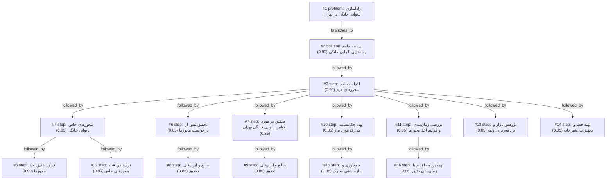

# bakery · zai/glm-4.5-flash · one

**Task:** می‌خواهم در محله‌ام در تهران یک کسب‌وکار کوچک فروش نان خانگی راه بیندازم. حدود ۵۰ میلیون تومان سرمایه دارم و فقط آشپزخانهٔ خانه‌ام را. از کجا و چطور شروع کنم؟

| Thoughts | Calls | Tokens in / out | Time | Finish | First try valid | Next picked | Max depth | Weight spread | Duplicates |
|---|---|---|---|---|---|---|---|---|---|
| 16 | 18 | 32849 / 13297 | 6m14s | budget | 16/16 | 10/15 | 4 | 0.00 | 1 |

## Answer from the graph

برای راه‌اندازی کسب‌وکار نان خانگی در تهران با سرمایه ۵۰ میلیون تومان و استفاده از آشپزخانه خانه، باید مراحل زیر را به ترتیب دنبال کنید:

## مراحل اولیه: اخذ مجوزهای لازم

1. **تحقیق در مورد قوانین نانوایی خانگی تهران**: قبل از هر اقدامی، باید قوانین و مقررات مربوط به نانوایی خانگی در تهران را به طور کامل بررسی کنید. این کار شامل استعلام از شهرداری منطقه و مشاوره با اداره بهداشت است.

2. **تهیه مدارک مورد نیاز**: مدارک شناسایی (شناسنامه، کارت ملی)، گواهی عدم سوء پیشینه، اجاره‌نامه یا سند مالکیت محل سکونت، و گواهی سلامت شخصی خود را آماده کنید.

3. **درخواست مجوزهای خاص**: باید مجوزهای زیر را دریافت کنید:
   - مجوز تولید مواد غذایی از اداره کل بهداشت استان تهران
   - گواهی انطباق با استانداردهای ملی ایران برای تولید نان (ISIRI)
   - مجوز محیط کار از اداره کار
   - مجوز استفاده از آشپزخانه خانگی برای اهداف تجاری از شهرداری

4. **بهبود آشپزخانه**: آشپزخانه خانه را مطابق استانداردهای بهداشتی اصلاح کنید. شامل نصب سیستم تهویه مناسب، جداسازی فضاهای کاری، و تجهیزات بهداشتی لازم.

## تجهیزات و مواد اولیه

با توجه به محدودیت فضای آشپزخانه، تجهیزات ضروری را با اولویت‌بندی خریداری کنید:
- فر صنعگی کوچک یا بزرگ (بسته به فضای موجود)
- میز کار استیل
- مخازن ذخیره‌سازی مواد اولیه
- ابزار پخت و پز استاندارد
- بسته‌بندی و برچسب‌گذاری محصولات

برای تامین مواد اولیه، به دنبال تامین‌کنندگان معتبر با کیفیت مناسب و قیمت مناسب باشید.

## برنامه‌ریزی محصول و قیمت‌گذاری

- محصولات متناسب با نیاز محله انتخاب کنید (نان‌های سنتی، نان‌های مدرن، یا ترکیبی از هر دو)
- قیمت‌گذاری رقابتی و سودآور انجام دهید، با در نظر گرفتن هزینه‌های مواد اولیه، نیروی کار، و سود مورد انتظار
- کیفیت محصول را حفظ کنید و از نظر بهداشتی کاملاً مطمئن باشید

## بازاریابی و فروش

- استراتژی بازاریابی محلی طراحی کنید (تبلیغات در محله، شبکه‌های اجتماعی محلی، همکاری با فروشگاه‌های محلی)
- سیستم توزیع منظم و قابل اعتماد ایجاد کنید
- مشتریان وفادار را با کیفیت محصول و خدمات خوب حفظ کنید

## مدیریت مالی

- بودجه دقیق تدوین کنید و هزینه‌ها را کنترل کنید
- سیستم حسابداری ساده برای ردیاب درآمد و هزینه‌ها ایجاد کنید
- بخشی از سرمایه را برای موارد غیرمنتظره کنار بگذارید

## ریسک‌های احتمالی

- **ریسک قانونی**: عدم دریافت مجوزهای لازم می‌تواند منجر به تعطیلی کسب‌وکار شود. حتماً تمام مراحل قانونی را با دقت طی کنید.
- **ریسک بهداشتی**: عدم رعایت استانداردهای بهداشتی می‌تواند منجر به بیماری مشتریان و از دست دادن اعتماد شود.
- **ریسک مالی**: عدم مدیریت صحیح هزینه‌ها می‌تواند منجر به زیان مالی شود. بودجه‌بندی دقیق و کنترل هزینه‌ها ضروری است.
- **ریسک رقابتی**: رقبای موجود در بازار ممکن است قیمت‌های پایین‌تر ارائه دهند. با تمرکز بر کیفیت و خدمات بهتر رقابت کنید.

با دنبال کردن این مراحل و توجه به نکات ذکر شده، می‌توانید کسب‌وکار نان خانگی موفق و قانونی در تهران راه‌اندازی کنید.

*Used: #3, #7, #4, #5, #12, #2*

## Baseline: one call, no graph

# راهنمای راه‌اندازی کسب‌وکار فروش نان خانگی در تهران

با سرمایه ۵۰ میلیون تومان و یک آشپزخانه خانگی، می‌توانید کسب‌وکار فروش نان خانگی را شروع کنید. این راهنمای قدم به قدم به شما کمک می‌کند:

## ۱. تحقیق بازار اولیه
- **بررسی محله**: ببینید چه نوع نانی در محله شما محبوب است (سنگک، تافتونی، لواش، بربری و...)
- **رقبا**: مغازه‌های نانوایی در اطراف را بررسی کنید
- **تقاضا**: مردم محله به دنبال نان خانگی باکیفیت‌تر هستند؟

## ۲. تخصص‌بخشی و انتخاب محصول
- روی یک یا دو نوع نان خاص تمرکز کنید (مثلاً نان سنگک یا نان جو)
- کیفیت و تازگی را به عنوان مزیت رقابتی خود قرار دهید
- با توجه به فضای محدود، تولید را محدود کنید

## ۳. تهیه تجهیزات (با بودجه ۵۰ میلیون)
- فر صنعتی کوچک (۲۰-۳۰ میلیون تومان)
- همزن خمیر و سینی‌های فر (۵-۱۰ میلیون تومان)
- ابزار برش و شکل‌دهی نان (۲-۵ میلیون تومان)
- بسته‌بندی ساده (۱۰-۱۵ میلیون تومان)
- گرم‌کن نان برای عرضه به مشتری (۵-۱۰ میلیون تومان)

## ۴. دریافت مجوزهای لازم
- مجوز از شهرداری برای فعالیت در مناطق مسکونی
- مجوز بهداشت از وزارت بهداشت (ضروری برای مواد غذایی)
- گواهی بهداشت آشپزخانه

## ۵. تولید و بسته‌بندی
- تولید را بر اساس تقاضا تنظیم کنید
- نان را صبح زود یا شب قبل برای فروش روزانه آماده کنید
- از بسته‌بندی بهداسی برای حفظ تازگی استفاده کنید
- تاریخ تولید روی بسته‌بندی درج شود

## ۶. راه‌های فروش
- فروش مستقیم در محله (با پیک یا از طریق در خانه)
- ایجاد صفحه اینستاگرام برای معرفی و فروش
- همکاری با مغازه‌های کوچک محلی
- ایجاد گروه واتس‌اپ برای مشتریان ثابت

## ۷. قیمت‌گذاری و مدیریت مالی
- قیمت‌گذاری بر اساس هزینه مواد و رقبا
- بودجه‌بندی دقیق برای مواد اولیه
- ذخیره بخشی از درآمد برای توسعه

## ۸. رعایت نکات بهداشتی
- تمیز نگه داشتن محیط کار
- استفاده از لوازم آشپزخانه استاندارد
- رعایت اصول شخصی بهداشتی

با شروع کوچک و تمرکز بر کیفیت، می‌توانید به تدریج کسب‌وکار خود را گسترش دهید. موفقیت شما به کیفیت نان، ارتباط با مشتریان و مدیریت بهینه بستگی دارد.

## Index

```text
#1 [problem] راه‌اندازی نانوایی خانگی در تهران · expanded
  #2 [solution] برنامه جامع راه‌اندازی نانوایی خانگی · w 0.80 · expanded
    #3 [step] اقدامات اخذ مجوزهای لازم · w 0.90 · expanded
      #4 [step] مجوزهای خاص نانوایی خانگی · w 0.85 · expanded
        #5 [step] فرآیند دقیق اخذ مجوزها · w 0.90 · open, max depth
        #12 [step] فرآیند دریافت مجوزهای خاص · w 0.90 · open, max depth
      #6 [step] تحقیق پیش از درخواست مجوزها · w 0.85 · expanded
        #8 [step] منابع و ابزارهای تحقیق · w 0.85 · open, max depth
      #7 [step] تحقیق در مورد قوانین نانوایی خانگی تهران · w 0.85 · expanded
        #9 [step] منابع و ابزارهای تحقیق · w 0.85 · open, max depth
      #10 [step] تهیه چک‌لیست مدارک مورد نیاز · w 0.85 · expanded
        #15 [step] جمع‌آوری و سازماندهی مدارک · w 0.85 · open, max depth
      #11 [step] بررسی زمان‌بندی و فرآیند اخذ مجوزها · w 0.85 · expanded
        #16 [step] تهیه برنامه اقدام با زمان‌بندی دقیق · w 0.85 · open, max depth
      #13 [step] پژوهش بازار و برنامه‌ریزی اولیه · w 0.85 · open
      #14 [step] تهیه فضا و تجهیزات آشپزخانه · w 0.85 · open
```

## Graph



## Thoughts

### #1 [problem] راه‌اندازی نانوایی خانگی در تهران
w 1.00 · expanded · depth 0 · from –

هدف راه‌اندازی یک کسب‌وکار کوچک فروش نان خانگی در محله محل سکونت در تهران با سرمایه حدود ۵۰ میلیون تومان و استفاده فقط از آشپزخانه خانه‌ای. محدودیت‌ها: سرمایه محدود، امکانات محدود به آشپزخانه خانه، عدم اطلاع از مقررات و مراحل قانونی، عدم تجربه در این زمینه. ناشناخته‌ها: مجوزهای لازم، تجهیزات مورد نیاز، منابع تامین مواد اولیه، قیمت‌گذاری، بازار هدف، استراتژی بازاریابی، رقبا در منطقه. نتیجه مطلوب: راه‌اندازی موفق کسب‌وکار نانوایی خانگی قانونی و سودآور با رعایت تمام مقررات بهداشتی و با حداقل سرمایه‌گذاری ممکن.

> این مشکل اصلی است که تمام مراحل بعدی باید برای حل آن طراحی شوند

### #2 [solution] برنامه جامع راه‌اندازی نانوایی خانگی
w 0.80 · expanded · depth 1 · from #1

برای راه‌اندازی نانوایی خانگی در تهران با سرمایه ۵۰ میلیون تومان، برنامه جامعی شامل: ۱) بررسی و اخذ مجوزهای لازم از شهرداری و بهداشت، ۲) تهیه تجهیزات ضروری با توجه به محدودیت فضای آشپزخانه، ۳) انتخاب محصولات متناسب با نیاز محله و منابع موجود، ۴) تامین مواد اولیه با کیفیت مناسب و قیمت مناسب، ۵) تعیین قیمت‌گذاری رقابتی و سودآور، ۶) طراحی استراتژی بازاریابی محلی، ۷) مدیریت مالی دقیق و کنترل هزینه‌ها، ۸) رعایت کامل استانداردهای بهداشتی و کیفیت محصول

> این برنامه جامع تمام جنبه‌های کلیدی راه‌اندازی کسب‌وکار را پوشش می‌دهد اما نیاز به جزئیات بیشتر در هر بخش دارد

### #3 [step] اقدامات اخذ مجوزهای لازم
w 0.90 · expanded · depth 2 · from #2

برای شروع کسب‌وکار، باید اولین قدم‌های عملی برای اخذ مجوزها را برداریم: ۱) مراجعه به شهرداری منطقه برای استعلام قوانین نانوایی‌های خانگی و دریافت فرم‌های مربوطه، ۲) مشاوره با اداره بهداشت برای آشنایی با الزامات بهداشتی تولید نان در فضای آشپزخانه خانگی، ۳) تهیه مدارک لازم (شناسنامه، کارت ملی، گواهی عدم سوء پیشینه، اجاره‌نامه یا سند مالکیت)، ۴) پرداخت هزینه‌های مربوطه و پیگیری درخواست‌ها، ۵) دریافت گواهی‌های بهداشتی و مجوزهای لازم قبل از شروع تولید و فروش

> این مرحله حیاتی است زیرا بدون مجوزهای قانونی، کسب‌وکار غیرقانونی شمرده شده و ممکن است منجر به بسته شدن کسب‌وکار و جریمه‌های سنگین شود

### #4 [step] مجوزهای خاص نانوایی خانگی
w 0.85 · expanded · depth 3 · from #3

پس از اقدامات اولیه برای اخذ مجوزهای عمومی، باید مجوزهای خاص نانوایی خانگی را دریافت کنیم: ۱) مجوز تولید مواد غذایی از اداره کل بهداشت استان تهران، ۲) گواهی انطباق با استانداردهای ملی ایران برای تولید نان (ISIRI)، ۳) مجوز محیط کار از اداره کار، ۴) مجوز استفاده از آشپزخانه خانگی برای اهداف تجاری از شهرداری، ۵) گواهی سلامت کارکنان (در صورت استخدام)، ۶) مجوز برچسب گذاری و بسته‌بندی محصولات، ۷) گواهی عدم وجود منع قانونی برای فعالیت تجاری در محل سکونت

> این مجوزها مشخصاً برای نانوایی خانگی ضروری هستند و بدون آنها کسب‌وکار غیرقانونی خواهد بود

### #5 [step] فرآیند دقیق اخذ مجوزها
w 0.90 · open · depth 4 · from #4

برای دریافت مجوزهای خاص نانوایی خانگی، مراحل عملی به شرح زیر است: ۱) مجوز تولید مواد غذایی: مراجعه به اداره کل بهداشت استان تهران، تکمیل فرم درخواست، ارائه مدارک شناسایی، گواهی عدم سوء پیشینه، و گزارش بهداشت محیط، پرداخت هزینه و انتظار برای بازرسی و دریافت مجوز (حدود ۲-۴ هفته). ۲) گواهی انطباق استاندارد: مراجعه به سازمان ملی استاندارد ایران، ارائه نمونه محصولات برای آزمایش، پرداخت هزینه آزمایش و دریافت گواهی انطباق (ISIRI). ۳) مجوز محیط کار: مراجعه به اداره کار، ارائه طرح کسب‌وکار، مدارک شناسایی، و دریافت مجوز محیط کار. ۴) مجوز استفاده از آشپزخانه خانگی: مراجعه به شهرداری منطقه، ارائه طرح بهبود آشپزخانه برای رعایت استانداردهای بهداشتی، دریافت مجوز. ۵) گواهی سلامت کارکنان: در صورت استخدام، کارکنان باید از مرکز بهداشت گواهی سلامت دریافت کنند. ۶) مجوز برچسب‌گذاری: هماهنگی با اداره بهداشت برای طراحی برچسب‌های استاندارد.

> این مرحله جزئیات عملی و زمان‌بندی دقیق اخذ مجوزهای خاص را ارائه می‌دهد که برای راه‌اندازی قانونی کسب‌وکار ضروری است.

### #6 [step] تحقیق پیش از درخواست مجوزها
w 0.85 · expanded · depth 3 · from #3

انجام تحقیقات جامع قبل از شروع فرآیند درخواست مجوزها: ۱) مطالعه دقیق قوانین و مقررات نانوایی‌های خانگی در تهران، ۲) مشاوره با افراد موفق در این حوزه، ۳) بررسی تجربیات دیگران در اخذ مجوزهای مشابه، ۴) شناسایی تمام مدارک مورد نیاز از قبل، ۵) آمادگی برای بازرسی‌های بهداشتی و ایمنی

> تحقیق جامع قبل از درخواست مجوزها می‌تواند از تاخیرها و مشکلات قانونی جلوگیری کند

### #7 [step] تحقیق در مورد قوانین نانوایی خانگی تهران
w 0.85 · expanded · depth 3 · from #3

برای شروع فرآیند اخذ مجوزها، باید ابتدا به طور دقیق قوانین و مقررات خاص نانوایی‌های خانگی در تهران را بررسی کنیم: ۱) شناسایی دقیق تمام نهادهای ذیربط (شهرداری، بهداشت، صنعت، معدن و تجارت)، ۲) تحقیق در مورد محدودیت‌های فضایی برای نانوایی خانگی در آشپزخانه مسکونی، ۳) بررسی استانداردهای بهداشتی خاص تولید نان در فضای خانگی، ۴) شناسایی مجوزهای الزامی و اختیاری، ۵) تحقیق در مورد محدودیت‌های تولید حجمی، ۶) بررسی قوانین مربوط به فروش و عرضه محصول، ۷) تحقیق در مورد مالیات‌ها و تعهدات قانونی

> این مرحله تحقیقاتی پایه و اساس موفقیت در اخذ مجوزها را فراهم می‌کند و از اتلاف وقت و هزینه جلوگیری می‌کند

### #8 [step] منابع و ابزارهای تحقیق
w 0.85 · open · depth 4 · from #6

شناسایی منابع معتبر و ابزارهای لازم برای انجام تحقیقات جامع: ۱) وبسایت‌های رسمی شهرداری تهران و وزارت بهداشت برای قوانین و مقررات، ۲) انجمن‌های صنفی نانوایی‌ها و کسب‌وکارهای خانگی برای دریافت اطلاعات عملی، ۳) مشاوره با کارشناسان حقوقی متخصص در حوزه کسب‌وکارهای خانگی، ۴) تحلیل بازار رقبا در محله هدف از طریق بازدید و پرس‌وجو، ۵) مطالعه کتاب‌ها و مقالات مرتبط با صنعت نان و تولید نان خانگی، ۶) استفاده از شبکه‌های اجتماعی و گروه‌های تخصصی برای به‌روزرسانی اطلاعات

> این مرحله به تحقیق‌کننده کمک می‌کند تا منابع معتبر و ابزارهای لازم را شناسایی کند و تحقیقاتش هدفمند و مؤثر باشد

### #9 [step] منابع و ابزارهای تحقیق
w 0.85 · open · depth 4 · from #7

برای انجام تحقیق مؤثر در مورد قوانین نانوایی خانگی تهران، باید از منابع و ابزارهای زیر استفاده کنیم: ۱) وبسایت رسمی شهرداری تهران و شهرداری‌های منطقه‌ای برای دسترسی به قوانین و مقررات، ۲) مراجعه حضوری به دفاتر خدمات الکترونیک و ادارات مربوطه برای دریافت اطلاعات به‌روز، ۳) تماس با ادارات بهداشت محیط و کار برای استعلام الزامات بهداشتی، ۴) جستجو در سامانه‌های ثبت اطلاعات کسب‌وکارها مانند ثبت شرکت‌ها، ۵) مطالعه کتب و مقالات حقوقی مرتبط با صنایع غذایی، ۶) استفاده از پایگاه‌های اطلاعاتی قانونی مانند قوانین ایران، ۷) مشاوره با وکلا یا مشاوران حقوقی متخصص در حوزه صنایع غذایی، ۸) بررسی تجربیات سایر نانوایی‌های خانگی موفق در تهران

> این منابع و ابزارها به کارآفرین کمک می‌کنند تا اطلاعات دقیق و به‌روز از قوانین و مقررات را به دست آورند و از اشتباهات احتمالی جلوگیری کنند

### #10 [step] تهیه چک‌لیست مدارک مورد نیاز
w 0.85 · expanded · depth 3 · from #3

تهیه چک‌لیست دقیق تمام مدارک لازم برای اخذ مجوزهای نانوایی خانگی: شناسنامه و کارت ملی، گواهی عدم سوء پیشینه، اجاره‌نامه یا سند مالکیت آشپزخانه، گواهی سلامت از پزشک، گواهی بهداشت محیط از شهرداری، نقشه آشپزخانه با مشخصات فنی، لیست تجهیزات موجود و مورد نیاز، برنامه تولید و فروش، اطلاعات مالی و سرمایه‌گذاری، بیمه‌های لازم

> این مرحله پایه و اساس فرآیند اخذ مجوزهاست و با آماده‌سازی کامل مدارک، زمان و هزینه صرفه‌جویی می‌کند

### #11 [step] بررسی زمان‌بندی و فرآیند اخذ مجوزها
w 0.85 · expanded · depth 3 · from #3

تعیین زمان‌بندی واقع‌بینانه برای اخذ تمام مجوزهای لازم: ۱) برآورد مدت زمان مورد نیاز برای هر مرحله (مطالعه قوانین، آماده‌سازی مدارک، ارسال درخواست، بازرسی، دریافت مجوز)، ۲) شناسایی مراحل موازی و متوالی برای بهینه‌سازی زمان، ۳) تدوین جدول زمانی با در نظر گرفتن زمان‌بندی ادارات دولتی و تعطیلات رسمی، ۴) آمادگی برای تمدید مجوزها و فرآیندهای اداری سالانه، ۵) ایجاد سیستم پیگیری برای جلوگیری از تاخیر در دریافت مجوزها

> زمان‌بندی دقیق برای اخذ مجوزها به برنامه‌ریزی کسب‌وکار و مدیریت منابع کمک می‌کند و از تاخیر در شروع فعالیت جلوگیری می‌نماید

### #12 [step] فرآیند دریافت مجوزهای خاص
w 0.90 · open · depth 4 · from #4

برای دریافت مجوزهای خاص نانوایی خانگی در تهران، باید مراحل زیر را به صورت دقیق دنبال کنیم: ۱) مراجعه حضوری به ادارات ذیربط (بهداشت، شهرداری، کار) برای دریافت فرم‌های مربوطه و مشاوره، ۲) تکمیل فرم‌ها با اطلاعات دقیق و صحیح در مورد نوع فعالیت، آشپزخانه و برنامه‌های بهداشتی، ۳) ارائه مدارک مورد نیاز (شناسنامه، کارت ملی، گواهی عدم سوء پیشینه، اجاره‌نامه یا سند مالکیت، گواهی سلامت، برنامه‌های بهداشتی)، ۴) پرداخت هزینه‌های مربوطه به صورت حضوری یا الکترونیک، ۵) بازرسی محل توسط کارشناسان مربوطه، ۶) اصلاح موارد نقص در صورت وجود، ۷) دریافت گواهی‌ها و مجوزهای پس از تأیید نهایی، ۸) تمدید مجوزها در مواعد مقرر

> این مرحله عملی و مشخص‌سازی فرآیند دریافت مجوزها به موفقیت در اخذ مجوزها کمک می‌کند

### #13 [step] پژوهش بازار و برنامه‌ریزی اولیه
w 0.85 · open · depth 3 · from #3

قبل از اقدام برای مجوزها، انجام پژوهش بازار محلی: ۱) بررسی تقاضا برای انواع نان در محله، ۲) شناسایی رقبای موجود و قیمت‌های آنها، ۳) تعیین محصولات اولیه با توجه به امکانات آشپزخانه، ۴) تهیه برنامه کسب‌وکار اولیه با برآورد هزینه‌ها و درآمدها، ۵) محاسبه قیمت‌گذاری بر اساس هزینه‌های مواد اولیه، نیروی کار و سود مورد انتظار

> پژوهش بازار اولیه به تصمیم‌گیری بهتر درباره محصولات و قیمت‌گذاری کمک می‌کند و ریسک شکست کسب‌وکار را کاهش می‌دهد

### #14 [step] تهیه فضا و تجهیزات آشپزخانه
w 0.85 · open · depth 3 · from #3

پس از اخذ مجوزهای لازم، باید فضای آشپزخانه خانه را برای تولید نان آماده کنیم: ۱) بررسی و اصلاح فضای موجود بر اساس استانداردهای بهداشتی، ۲) تهیه تجهیزات ضروری مانند فر مناسب، میز کار، ابزارهای خمیرگیری، سطل‌های ذخیره‌سازی و بسته‌بندی، ۳) ایجاد سیستم تهویه مناسب برای دود و بخار، ۴) نصب سیستم‌های نظافتی و ضدعفونی‌کننده، ۵) مدیریت بهینه فضای محدود برای حداکثر بهره‌وری، ۶) برنامه‌ریزی برای جابجایی مواد اولیه و محصولات نهایی

> تهیه فضای مناسب و تجهیزات ضروری برای تولید نان با کیفیت و رعایت بهداشت، نیازمند برنامه‌ریزی دقیق است

### #15 [step] جمع‌آوری و سازماندهی مدارک
w 0.85 · open · depth 4 · from #10

پس از تهیه چک‌لیست مدارک، مرحله جمع‌آوری و سازماندهی سیستماتیک آنها: ۱) ایجاد پوشه‌های مجزا برای هر دسته مدارک (شخصی، ملکی، بهداشتی، مالی)، ۲) تهیه نسخه‌های پشتیبان از تمام مدارک مهم، ۳) ترجمه مدارک به زبان انگلیسی در صورت نیاز برای مجوزهای خاص، ۴) اسکن دیجیتال تمام مدارک برای ذخیره‌سازی و ارسال آنلاین، ۵) ایجاد جدول زمانی برای پیگیری دریافت مدارک در حال تکمیل، ۶) مشاوره با متخصصان حقوقی برای بررسی صحت مدارک قبل از ارسال

> این مرحله عملی چک‌لیست را به اقدامات ملموس تبدیل کرده و از تاخیر در فرآیند اخذ مجوزها جلوگیری می‌کند

### #16 [step] تهیه برنامه اقدام با زمان‌بندی دقیق
w 0.85 · open · depth 4 · from #11

بر اساس تحلیل زمان‌بندی و فرآیند اخذ مجوزها، ایجاد برنامه عملیاتی با جزئیات زیر: ۱) تعیین تاریخ دقیق برای هر مرحله با در نظر گرفتن زمان‌بندی ادارات، ۲) اختصاص مسئول مشخص برای هر مرحله (مثلاً خود شما یا یک مسئول داخلی)، ۳) تعیین ملاقات‌های حضوری با ادارات با زمان‌بندی مشخص، ۴) ایجاد جدول پیگیری هفتگی برای دنبال کردن درخواست‌ها، ۵) آماده‌سازی مدارک پشتیبان برای جلوگیری از تاخیرهای ناشی از کمبود اطلاعات، ۶) تعیین زمان‌بندی برای پیگیری‌های تلفنی و الکترونیکی، ۷) برنامه‌ریزی برای شرایط اضطراری مانند نیاز به اطلاعات بیشتر یا بازرسی مجدد

> این برنامه عملیاتی تضمین می‌کند که فرآیند اخذ مجوزها بدون وقفه پیش برود و از تاخیرهای غیرضروری جلوگیری شود.

