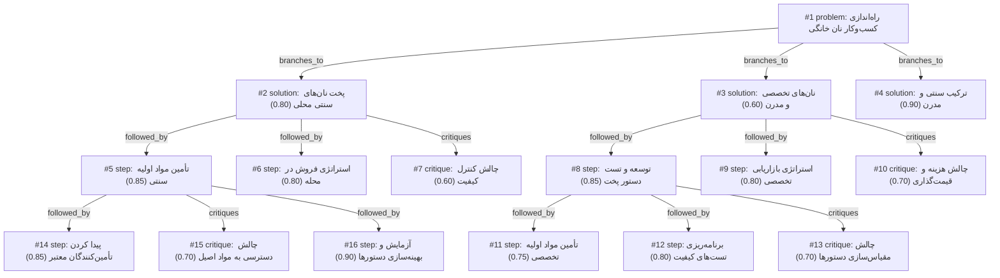

# bakery · zai/glm-4.5-flash · siblings

**Task:** می‌خواهم در محله‌ام در تهران یک کسب‌وکار کوچک فروش نان خانگی راه بیندازم. حدود ۵۰ میلیون تومان سرمایه دارم و فقط آشپزخانهٔ خانه‌ام را. از کجا و چطور شروع کنم؟

| Thoughts | Calls | Tokens in / out | Time | Finish | First try valid | Next picked | Max depth | Weight spread | Duplicates |
|---|---|---|---|---|---|---|---|---|---|
| 16 | 8 | 10004 / 8157 | 4m52s | budget | 6/6 | 5/5 | 3 | 0.08 | 1 |

## Answer from the graph

برای راه‌اندازی کسب‌وکار نان خانگی در تهران با سرمایه 50 میلیون تومان و استفاده از آشپزخانه خانه، بهترین رویکرد ترکیبی از تولید نان‌های سنتی محلی با برخی نان‌های تخصصی و مدرن است. این روش به شما امکان می‌دهد طیف گسترده‌تری از مشتریان را جذب کرده و در عین حال ریسک کمتری داشته باشید.

مراحل شروع کار:

1. **تحقیق و برنامه‌ریزی اولیه**:
   - محله خود را به دقت بررسی کنید تا بفهمید چه نوع نان‌هایی محبوبیت بیشتری دارند
   - لیستی از نان‌های سنتی تهران مانند سنگک، تافتون، بربری و نان‌های خانگی تهیه کنید
   - برای هر نوع نان، دستورالعمل‌های اصیل را جمع‌آوری کنید

2. **تأمین مواد اولیه**:
   - تأمین‌کنندگان محلی معتبر برای آرد، مخمر و سایر مواد اولیه سنتی پیدا کنید
   - حتماً از چند منبع مختلف خرید کنید تا کیفیت مواد را مقایسه کنید
   - در ابتدا مقادیر کمتری از مواد اولیه تهیه کنید تا پس از آزمایش و تایید، خریدهای بزرگتری انجام دهید

3. **آزمایش و بهینه‌سازی دستورها**:
   - دستورالعمل‌های سنتی را با مواد اولیه تأمین‌شده در آشپزخانه خانه آزمایش کنید
   - نتایج هر آزمایش را به دقت ثبت کنید (زمان پخت، دما، نسبت مواد و کیفیت نان نهایی)
   - پارامترها را برای دستیابی به بهترین نتیجه در آشپزخانه خانه تنظیم کنید

4. **توسعه محصولات**:
   - پس از تسلط بر نان‌های سنتی، چند نوع نان تخصصی و مدرن با مواد اولیه در دسترس اضافه کنید
   - این نان‌های تخصصی می‌تواند شامل نان‌های با غلات خاص، نان‌های بدون گلوتن یا نان‌های با طعم‌های منحصر به فرد باشد

5. **استراتژی فروش در محله**:
   - با مشتریان بالقوه در محله خود صحبت کنید و سلیقه آن‌ها را بشناسید
   - روش‌های فروش مختلف را آزمایش کنید: فروش مستقیم از خانه، فروش در میادین محلی، یا همکاری با فروشگاه‌های کوچک محلی
   - شبکه‌سازی با کسب‌وکارهای محلی دیگر برای تبادل مشتری یا فروش محصولات

6. **مدیریت کیفیت**:
   - برای هر批次 نان، معیارهای کیفیت مشخص تعریف کنید
   - بازخورد مشتریان را به دقت جمع‌آوری و ثبت کنید
   - بر اساس بازخوردها، فرآیند تولید را به طور مداوم بهبود ببخشید

ریسک‌های اصلی که باید مراقب باشید:

1. **چالش دسترسی به مواد اصیل**: پیدا کردن مواد اولیه با کیفیت ممکن است دشوار باشد. برای کاهش این ریسک، چند تأمین‌کننده مختلف داشته باشید و همیشه کیفیت مواد را قبل از استفاده بررسی کنید.

2. **کنترل کیفیت**: تولید نان‌های با کیفیت یکسان در مقیاس کوچک می‌تواند چالش برانگیز باشد. سیستم ثبت دقیق فرآیند و نتایج هر آزمایش را ایجاد کنید تا بتوانید کیفیت را ثابت نگه دارید.

3. **مقیاس‌سازی**: اگر کسب‌وکار رشد کند، ممکن است با چالش مقیاس‌سازی دستورها مواجه شوید. از ابتدا فرآیندهای خود را مستند کنید تا در آینده بتوانید به راحتی آنها را گسترش دهید.

4. **هزینه و قیمت‌گذاری**: قیمت‌گذاری مناسب برای حاشیه سود کافی و همزمان رقابتی بودن مهم است. هزینه‌های تمام شده را به دقت محاسبه کنید و قیمت‌ها را بر اساس بازار محله تنظیم نمایید.

با دنبال کردن این مراحل و مراقبت از ریسک‌های ذکر شده، می‌توانید کسب‌وکار نان خانگی موفقی در محله خود راه‌اندازی کنید.

*Used: #1, #2, #3, #4, #5, #6, #7, #10, #12, #13, #15, #16*

## Baseline: one call, no graph

# راه‌اندازی کسب‌وکار فروش نان خانگی در تهران

با ۵۰ میلیون تومان سرمایه و فقط با استفاده از آشپزخانه خانه، می‌توانید کسب‌وکار فروش نان خانگی را شروع کنید. در اینجا مراحل راه‌اندازی را به صورت گام به گام توضیح می‌دهم:

## ۱. تحقیق و برنامه‌ریزی اولیه
- **تحقیق بازار**: در محله خود تقاضا برای نان خانگی را بررسی کنید. با ساکنین محله صحبت کنید و ببینید چه نوع نانی بیشتر مورد پسند است.
- **رقابت**: نانوایی‌های اطراف را بررسی کنید و نقاط ضعف و قوت آن‌ها را شناسایی کنید.
- **برنامه کسب‌وکار**: یک برنامه ساده تهیه کنید که شامل محصولات، قیمت‌گذاری، مشتریان هدف و روش فروش باشد.

## ۲. مجوزهای لازم
- **مجوز بهداشت**: به مرکز بهداشت محله مراجعه و برای کسب مجوز تولید مواد غذایی خانگی اقدام کنید.
- **گواهی فنی و حرفه‌ای**: دوره‌های کوتاه آشپزی و نانوایی را ببینید تا مهارت خود را افزایش دهید.
- **کد اقتصادی**: برای ثبت کسب‌وکار خود کد اقتصادی دریافت کنید.

## ۳. تجهیزات و مواد اولیه
با ۵۰ میلیون تومان می‌توانید تجهیزات زیر را تهیه کنید:
- **فر صنعتی کوچک** (حدود ۱۵-۲۰ میلیون تومان)
- **دستگاه خمیرزن** (۵-۷ میلیون تومان)
- **ترازو دیجیتال** (۱-۲ میلیون تومان)
- **سینی‌های فر** (۲-۳ میلیون تومان)
- **ظروف و بسته‌بندی** (۳-۵ میلیون تومان)
- **مواد اولیه اولیه** (۱۰-۱۵ میلیون تومان)

## ۴. انتخاب محصولات
با شروع، روی ۳-۴ نوع نان تمرکز کنید:
- نان سنگک یا بربری
- نان تافتون
- نان لواش
- نان ماست و پنیر

## ۵. بازاریابی و فروش
- **فروش محلی**: به همسایه‌ها و فروشگاه‌های کوچک محلی پیشنهاد دهید.
- **شبکه‌های اجتماعی**: از اینستاگرام و تلگرام برای معرفی محصولات استفاده کنید.
- **نمونه‌های رایگان**: برای جذب مشتری اولیه، نمونه‌های کوچک رایگان ارائه دهید.
- **خدمات تحویل**: در محله محدود خدمات تحویل رایگان یا با هزینه کم ارائه دهید.

## ۶. مدیریت مالی
- هزینه‌ها را دقیق ثبت کنید.
- قیمت‌گذاری را طوری انجام دهید که حداقل ۳۰% سود داشته باشید.
- پس از ۳-۶ ماه، با درآمد حاصله تجهیزات بیشتری تهیه کنید.

## 7. توسعه کسب‌وکار
- پس از تثبیت مشتریان، می‌توانید تنوع محصولات را افزایش دهید.
- فروش به رستوران‌ها و کافه‌های کوچک محلی را شروع کنید.
- در صورت موفقیت، سرمایه‌گذاری بیشتری انجام دهید.

موفقیت شما به کیفیت نان، قیمت مناسب و ایجاد اعتماد در محله بستگی دارد. با شروع کوچک و تمرکز بر کیفیت، می‌توانید این کسب‌وکار را به تدریج توسعه دهید.

## Index

```text
#1 [problem] راه‌اندازی کسب‌وکار نان خانگی · expanded
  #2 [solution] پخت نان‌های سنتی محلی · w 0.80 · expanded
    #5 [step] تأمین مواد اولیه سنتی · w 0.85 · expanded
      #14 [step] پیدا کردن تأمین‌کنندگان معتبر · w 0.85 · open
      #15 [critique] چالش دسترسی به مواد اصیل · w 0.70 · open
      #16 [step] آزمایش و بهینه‌سازی دستورها · w 0.90 · open
    #6 [step] استراتژی فروش در محله · w 0.80 · open
    #7 [critique] چالش کنترل کیفیت · w 0.60 · open
  #3 [solution] نان‌های تخصصی و مدرن · w 0.60 · expanded
    #8 [step] توسعه و تست دستور پخت · w 0.85 · expanded
      #11 [step] تأمین مواد اولیه تخصصی · w 0.75 · open
      #12 [step] برنامه‌ریزی تست‌های کیفیت · w 0.80 · open
      #13 [critique] چالش مقیاس‌سازی دستورها · w 0.70 · open
    #9 [step] استراتژی بازاریابی تخصصی · w 0.80 · open
    #10 [critique] چالش هزینه و قیمت‌گذاری · w 0.70 · open
  #4 [solution] ترکیب سنتی و مدرن · w 0.90 · open
```

## Graph



## Thoughts

### #1 [problem] راه‌اندازی کسب‌وکار نان خانگی
w 1.00 · expanded · depth 0 · from –

هدف: راه‌اندازی کسب‌وکار کوچک فروش نان خانگی در محله تهران. محدودیت‌ها: ۵۰ میلیون تومان سرمایه و فقط دسترسی به آشپزخانه خانه. ناشناخته‌ها: مکان فروش، منابع تأمین مواد اولیه، مجوزهای لازم، قیمت‌گذاری، و چگونگی شروع. نتیجه مطلوب: راه‌اندازی موفق کسب‌وکار با حداکثر استفاده از منابع موجود و ایجاد درآمد پایدار.

> این مشکل اصلی است که باید حل شود

### #2 [solution] پخت نان‌های سنتی محلی
w 0.80 · expanded · depth 1 · from #1

تمرکز بر تولید و فروش انواع نان‌های سنتی و محلی تهران مانند سنگک، تافتون، بربری و نان‌های خانگی که در محله محبوبیت دارند. این رویکرد با سلیقه مشتریان محلی هماهنگ است و نیاز به سرمایه کمتری برای مواد اولیه دارد.

> پتانسیل فروش بالا در محله تهران، نیاز سرمایه کمتر، و تطابق با سلیقه محلی

### #3 [solution] نان‌های تخصصی و مدرن
w 0.60 · expanded · depth 1 · from #1

تولید و فروش انواع نان‌های تخصصی، ارگانیک، یا با مواد اولیه خاص مانند نان‌های سبوس‌دار، نان‌های بدون گلوتن، یا نان‌های با طعم‌های جدید. این رویکرد می‌تواند قیمت‌های بالاتری داشته باشد و مشتریان خاص جذب کند.

> حاشیه سود بالاتر و تمایز از رقبا، اما نیاز به آموزش و مواد اولیه خاص

### #4 [solution] ترکیب سنتی و مدرن
w 0.90 · open · depth 1 · from #1

ترکیبی از تولید نان‌های سنتی محلی با برخی نان‌های تخصصی و مدرن برای جذب طیف گسترده‌تری از مشتریان. این رویکرد ریسک کمتری دارد و امکان آزمایش بازار را فراهم می‌کند.

> تطبیق‌پذیری بالا، کاهش ریسک، و امکان گسترش بر اساس بازخورد مشتریان

### #5 [step] تأمین مواد اولیه سنتی
w 0.85 · expanded · depth 2 · from #2

پیدا کردن تأمین‌کنندگان محلی برای آرد، مخمر و سایر مواد اولیه سنتی. جمع‌آوری دستور العمل‌های اصیل و آزمایش آنها در آشپزخانه خانه.

> بدون مواد اولیه مناسب و دستور العمل‌های اصیل، کیفیت نان‌های سنتی تضمین نمی‌شود

### #6 [step] استراتژی فروش در محله
w 0.80 · open · depth 2 · from #2

ایجاد کانال‌های فروش محلی از طریق همسایه‌ها، مغازه‌های کوچک محلی، و استفاده از شبکه‌های اجتماعی محلی. قیمت‌گذاری رقابتی و ایجاد برنامه‌های وفاداری.

> فروش مستقیم در محله نیاز به سرمایه کمتری دارد و مشتریان وفادار ایجاد می‌کند

### #7 [critique] چالش کنترل کیفیت
w 0.60 · open · depth 2 · from #2

تولید نان‌های سنتی با کیفیت یکسان در مقیاس کوچک می‌تواند چالش برانگیز باشد. نیاز به آزمایش‌های مداوم و بهینه‌سازی فرآیند پخت برای حفظ کیفیت.

> کیفیت نامنظم می‌تواند به اعتبار کسب‌وکار آسیب بزند

### #8 [step] توسعه و تست دستور پخت
w 0.85 · expanded · depth 2 · from #3

طراحی و آزمایش دستورهای پخت برای نان‌های تخصصی مختلف (نان‌های ارگانیک، بدون گلوتن، نان‌های با مواد اولیه خاص). این شامل تست‌های مزه، بافت و ماندگاری محصول است.

> دستورپخت‌های جذاب و باکیفیت پایه اصلی موفقیت نان‌های تخصصی هستند

### #9 [step] استراتژی بازاریابی تخصصی
w 0.80 · open · depth 2 · from #3

ایجاد برند برای نان‌های تخصصی، استفاده از شبکه‌های اجتماعی برای معرفی محصولات، ارائه نمونه به مشتریان بالقوه در محله، و ایجاد بسته‌بندی جذاب برای محصولات.

> بازاریابی مؤثر برای محصولات تخصصی با قیمت بالاتر ضروری است

### #10 [critique] چالش هزینه و قیمت‌گذاری
w 0.70 · open · depth 2 · from #3

مواد اولیه تخصصی و ارگانیک معمولاً گران‌تر هستند و ممکن است قیمت‌های بالاتری برای مشتریان محلی جذاب نباشند. نیاز به تحقیق درباره تمایل پرداخت مشتریان محله.

> قیمت‌گذاری نامناسب می‌تواند باعث عدم فروش محصولات شود

### #11 [step] تأمین مواد اولیه تخصصی
w 0.75 · open · depth 3 · from #8

پیدا کردن تأمین‌کنندگان مواد اولیه باکیفیت برای نان‌های تخصصی مانند آرد ارگانیک، دانه‌های خاص، و افزودنی‌های طبیعی. بررسی قیمت‌ها و حداقل حجم سفارش‌ها با بودجه ۵۰ میلیون تومان.

> مواد اولیه باکیفیت پایه‌ای برای نان‌های تخصصی هستند و تأثیر مستقیمی بر موفقیت محصول دارند

### #12 [step] برنامه‌ریزی تست‌های کیفیت
w 0.80 · open · depth 3 · from #8

ایجاد سیستم تست مزه، بافت، ماندگاری و ظاهر برای هر نوع نان. تعیین معیارهای سنجش و برگزاری جلسات تست با گروه‌های مختلف مشتریان هدف.

> تست‌های منظم کیفیت تضمین می‌کند محصول نهایی استانداردهای مورد انتظار مشتریان را دارد

### #13 [critique] چالش مقیاس‌سازی دستورها
w 0.70 · open · depth 3 · from #8

تست‌های آزمایشگاهی ممکن است با تولید تجاری تفاوت داشته باشند. نیاز به آزمایش تولید در مقیاس واقعی و تنظیم دستورها برای تکرارپذیری.

> بسیاری از دستورهای موفق در آزمایشگاه در مقیاس تجاری با مشکل مواجه می‌شوند

### #14 [step] پیدا کردن تأمین‌کنندگان معتبر
w 0.85 · open · depth 3 · from #5

جستجو و شناسایی تأمین‌کنندگان محلی معتبر برای آرد باکیفیت، مخمر طبیعی و سایر مواد اولیه سنتی. مذاکره درباره قیمت‌های عمده‌خریدی و شرایط پرداخت.

> این مرحله برای تضمین کیفیت مواد اولیه و کنترل هزینه‌ها حیاتی است

### #15 [critique] چالش دسترسی به مواد اصیل
w 0.70 · open · depth 3 · from #5

تأمین مواد اولیه سنتی و اصیل ممکن است دشوار باشد و کیفیت متغیر داشته باشد. نیاز به بررسی چند منبع مختلف و ایجاد روابط پایدار با تأمین‌کنندگان.

> ریسک کیفیت مواد اولیه می‌تواند بر نتیجه نهایی تأثیر مستقیم بگذارد

### #16 [step] آزمایش و بهینه‌سازی دستورها
w 0.90 · open · depth 3 · from #5

آزمایش دستورالعمل‌های سنتی با مواد اولیه تأمین‌شده و ثبت نتایج. تنظیم زمان پخت، دما و نسبت مواد برای دستیابی به بهترین نتیجه در آشپزخانه خانه.

> این مرحله برای تضمین کیفیت و یکنواختی محصول نهایی ضروری است

