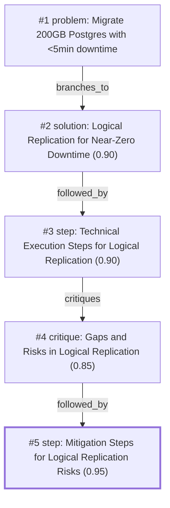

# db-move · ollama-cloud/gemma4:31b · one

**Task:** We have to move a 200 GB PostgreSQL 14 database to a new server in another data center. The app may be down for at most 5 minutes. How should we do it?

| Thoughts | Calls | Tokens in / out | Time | Finish | First try valid | Next picked | Max depth | Weight spread | Duplicates |
|---|---|---|---|---|---|---|---|---|---|
| 5 | 7 | 7679 / 2834 | 19s | model | 5/5 | 3/4 | 4 | 0.00 | 0 |

## Answer from the graph

To migrate a 200 GB PostgreSQL 14 database between data centers with less than 5 minutes of downtime, the best approach is to use **Logical Replication**. Unlike physical replication, logical replication allows the target database to be online and writable, and it enables a near-instantaneous cutover.

### Execution Plan

**1. Preparation and Schema Migration**
*   **Target Setup:** Install PostgreSQL 14 on the new server. Adjust `postgresql.conf` to ensure `max_wal_senders` and `max_replication_slots` are sufficiently configured.
*   **Schema Export:** Use `pg_dump -s` to export the schema only from the source and import it into the target. Logical replication does not replicate the schema (DDL), only the data.

**2. Establishing Replication**
*   **Source Publication:** On the source server, run: `CREATE PUBLICATION migration_pub FOR ALL TABLES;`
*   **Target Subscription:** On the target server, run: `CREATE SUBSCRIPTION migration_sub CONNECTION 'host=source_ip ...' PUBLICATION migration_pub;`
*   **Initial Sync:** PostgreSQL will begin copying the 200 GB of existing data. The application remains fully operational during this time.

**3. Monitoring and Validation**
*   **Lag Tracking:** Monitor `pg_stat_replication` (source) and `pg_stat_subscription` (target). Do not begin the cutover until the replication lag is near zero.
*   **Integrity Check:** Perform row count comparisons or checksums on critical tables to ensure the data is consistent.

**4. The Cutover (The <5 Minute Window)**
*   **Traffic Stop:** Set the source database to read-only mode or stop the application to prevent new writes.
*   **Final Sync:** Wait a few seconds for the final WAL (Write Ahead Log) entries to replicate to the target.
*   **Sequence Update:** Because logical replication does not sync sequence values, run a script on the target to update all sequences to their current maximum values (e.g., using `setval` based on `SELECT max(id) FROM table`).
*   **Redirect:** Update the application connection strings to point to the new server and restart the app.

### Risks and Mitigations

*   **Sequence Desynchronization:** If sequences are not manually updated during cutover, the application will encounter primary key violations upon the first insert. **Mitigation:** Run a sequence synchronization script immediately before restarting the app.
*   **Schema Changes:** Any `ALTER TABLE` commands executed during the migration will break replication. **Mitigation:** Enforce a strict "Schema Freeze" policy from the moment the subscription is created until the migration is complete.
*   **Large Objects (Blobs):** Logical replication does not support Large Objects. **Mitigation:** If using LOBs, these must be migrated via a separate file-level transfer or a custom script.
*   **Network Latency:** High latency between data centers can increase replication lag. **Mitigation:** Use a dedicated network tunnel and monitor the lag closely to ensure the final sync happens within seconds.

*Used: #2, #3, #4, #5*

## Baseline: one call, no graph

Moving a 200 GB database with only a 5-minute downtime window requires a **Logical Replication** strategy. A standard `pg_dump` or physical backup will take hours to transfer and restore, far exceeding your window.

Here is the professional architectural approach to achieve this.

### The Strategy: Logical Replication
Unlike physical replication (which clones the whole disk), logical replication streams individual data changes. This allows you to synchronize the data while the old server is still live, reducing the "cutover" time to just a few seconds of DNS/Connection string updates.

---

### Step-by-Step Execution Plan

#### 1. Prepare the Target Server
Install PostgreSQL 14 on the new server. Ensure the `postgresql.conf` and `pg_hba.conf` are configured to allow connections from the source server.

#### 2. Configure the Source Server (Publisher)
You must change the Write Ahead Log (WAL) level to support logical replication.
*   **Edit `postgresql.conf`**:
    ```ini
    wal_level = logical
    max_replication_slots = 10
    max_wal_senders = 10
    ```
*   **Restart PostgreSQL** (This is the only restart required on the source, which happens *before* the migration window).
*   **Update `pg_hba.conf`**: Add an entry to allow the target server's IP to connect for replication.

#### 3. Schema Migration (The "Skeleton")
Logical replication does **not** replicate the schema (tables, indexes, views, constraints).
*   Dump only the schema from the source:
    ```bash
    pg_dump -s -U username -d dbname > schema.sql
    ```
*   Restore the schema to the target server:
    ```bash
    psql -U username -d dbname < schema.sql
    ```

#### 4. Establish the Replication Stream
*   **On the Source (Publisher)**: Create a publication for all tables.
    ```sql
    CREATE PUBLICATION migration_pub FOR ALL TABLES;
    ```
*   **On the Target (Subscriber)**: Create the subscription. This will trigger the initial "snapshot" (copying the 200GB) while the app is still running.
    ```sql
    CREATE SUBSCRIPTION migration_sub 
    CONNECTION 'host=source_ip port=5432 user=rep_user password=pwd dbname=dbname' 
    PUBLICATION migration_pub;
    ```
*   **Monitor Progress**: The target will now copy the 200GB. You can track this in `pg_stat_replication` on the source. Wait until the status is "caught up."

#### 5. The Cutover (The 5-Minute Window)
Once the data is synchronized and the lag is near zero, perform the following sequence:

1.  **Stop Application Traffic**: Put the app in maintenance mode or stop the services.
2.  **Verify Sync**: Ensure the target has received the final few transactions.
3.  **Sync Sequences**: Logical replication does **not** sync sequence values (IDs). You must manually update them on the target:
    *   Run a script to get the `last_value` of all sequences from the source and apply `setval()` to the target.
4.  **Redirect Traffic**: Update your application's connection strings or update your DNS record to point to the new server.
5.  **Start Application**: Bring the app back online.

---

### Critical Technical Considerations

*   **Primary Keys**: Logical replication requires every table to have a **Primary Key**. If you have tables without PKs, you must set `REPLICA IDENTITY FULL` on those tables, but be warned: this significantly slows down the source server.
*   **Network Latency**: Since the servers are in different data centers, ensure you have a stable connection. Use a VPN or SSH tunnel if the traffic isn't encrypted.
*   **Disk Space**: Ensure the target server has enough space for the 200GB plus temporary overhead for the initial load.
*   **Rollback Plan**: If the cutover fails, your "Old" server is still fully intact. Simply point the connection strings back to the old IP.

### Summary Checklist
| Phase | Action | Downtime? |
| :--- | :--- | :--- |
| **Prep** | `wal_level = logical` $\rightarrow$ Restart | No (or brief scheduled) |
| **Sync** | Schema dump $\rightarrow$ Subscription $\rightarrow$ Data Copy | No |
| **Cutover** | Stop App $\rightarrow$ Update Sequences $\rightarrow$ Change IP | **Yes (< 5 mins)** |

## Index

```text
#1 [problem] Migrate 200GB Postgres with <5min downtime · expanded
  #2 [solution] Logical Replication for Near-Zero Downtime · w 0.90 · expanded
    #3 [step] Technical Execution Steps for Logical Replication · w 0.90 · expanded
      #4 [critique] Gaps and Risks in Logical Replication · w 0.85 · expanded
        #5 [step] Mitigation Steps for Logical Replication Risks · w 0.95 · done
```

## Graph



## Thoughts

### #1 [problem] Migrate 200GB Postgres with <5min downtime
w 1.00 · expanded · depth 0 · from –

Goal: Migrate a 200 GB PostgreSQL 14 database to a new server in a different data center.
Facts & Limits:
- Database size: 200 GB.
- Maximum allowed downtime: 5 minutes.
- Location: Different data center (network latency and bandwidth are factors).
- Version: PostgreSQL 14.
Unknowns: 
- Network bandwidth between data centers.
- Read/Write load during migration.
- Availability of a staging environment.
Success Criteria:
- Data integrity is maintained.
- Application downtime is strictly under 5 minutes.
- Minimal data loss (Zero RPO preferred).

> Defines the core constraints and goals of the migration task.

### #2 [solution] Logical Replication for Near-Zero Downtime
w 0.90 · expanded · depth 1 · from #1

Use Logical Replication to synchronize data in real-time. 
1. Set up the target server with the same schema.
2. Create a publication on the source and a subscription on the target.
3. Wait for initial data sync to complete while the app is live.
4. Perform a switchover: stop the app, ensure the last few transactions are replicated, point the app to the new server, and restart.
This minimizes downtime to the time it takes to redirect traffic and restart the app.

> Logical replication allows for near-zero downtime migrations across different servers and data centers.

### #3 [step] Technical Execution Steps for Logical Replication
w 0.90 · expanded · depth 2 · from #2

Detailed execution plan for Logical Replication:
1. Prepare target: Install PG 14, configure postgresql.conf (max_wal_senders, max_replication_slots).
2. Schema migration: Export schema only (pg_dump -s) from source and import to target.
3. Publication: Run 'CREATE PUBLICATION migration_pub FOR ALL TABLES' on source.
4. Subscription: Run 'CREATE SUBSCRIPTION migration_sub CONNECTION '...' PUBLICATION migration_pub' on target.
5. Monitoring: Monitor 'pg_stat_replication' on source and 'pg_stat_subscription' on target until lag is minimal.
6. Cutover: Set source to read-only (or stop app), wait for LSN to match, update app connection strings, restart app.

> Provides the concrete technical steps to implement the high-weight solution.

### #4 [critique] Gaps and Risks in Logical Replication
w 0.85 · expanded · depth 3 · from #3

Potential issues with Logical Replication for this specific case:
1. Sequences: Logical replication does not synchronize sequence values. If the app relies on sequences for IDs, they will be out of sync upon cutover, leading to primary key violations.
2. Large Objects/Blobs: LOBs are not replicated logically.
3. DDL Changes: Any schema changes made during the sync phase will break replication.
4. Network Latency: High latency between DCs might cause replication lag to persist, extending the window needed for the final sync during cutover.
Mitigation: Manual sequence update script before app restart; strict schema freeze during migration.

> Logical replication is powerful but has well-known gaps like sequences and DDL that could cause the 5-minute window to fail or cause data corruption.

### #5 [step] Mitigation Steps for Logical Replication Risks
w 0.95 · done · depth 4 · from #4

To resolve the risks identified in #4, the final cutover process must be modified:
1. Sequence Synchronization: Just before restarting the application, run a script on the target server that iterates through all sequences and sets their value to the current maximum value from the source server (e.g., using `setval` based on `SELECT max(id) FROM table`).
2. Schema Freeze: Implement a mandatory 'Change Freeze' policy on the database schema from the moment the subscription is created until the cutover is complete.
3. Network Optimization: Use a dedicated tunnel or compressed transfer if latency is high, and monitor 'pg_stat_replication' to ensure the lag is near zero before triggering the 5-minute window.
4. Validation: Run a checksum or row count comparison on a subset of critical tables to ensure data integrity before the final switch.

> Directly addresses the gaps in logical replication to ensure the 5-minute window is achievable without data corruption or app errors.

