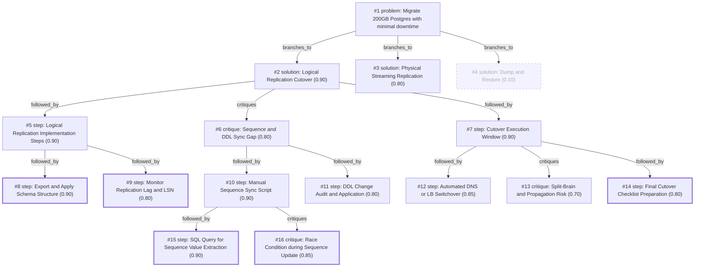

# db-move · ollama-cloud/gemma4:31b · siblings

**Task:** We have to move a 200 GB PostgreSQL 14 database to a new server in another data center. The app may be down for at most 5 minutes. How should we do it?

| Thoughts | Calls | Tokens in / out | Time | Finish | First try valid | Next picked | Max depth | Weight spread | Duplicates |
|---|---|---|---|---|---|---|---|---|---|
| 16 | 9 | 10531 / 3475 | 38s | budget | 7/7 | 6/6 | 4 | 0.10 | 0 |

## Answer from the graph

To migrate a 200 GB PostgreSQL 14 database across data centers with a maximum downtime of 5 minutes, the most effective approach is **Logical Replication**. Unlike a physical backup, logical replication allows the new database to remain online and synchronized with the source in real-time, reducing the final cutover to a simple connection switch.

### Implementation Steps

**1. Preparation and Schema Sync**
*   **Target Setup:** Install PostgreSQL 14 on the new server.
*   **Schema Migration:** Use `pg_dump --schema-only` to export the structure (tables, indexes, constraints, and views) from the source and apply it to the target. Logical replication only synchronizes data, not the database schema.
*   **Source Configuration:** Set `wal_level = logical` in the `postgresql.conf` on the source server and restart the service.

**2. Establishing Replication**
*   **Create Publication:** On the source server, create a `PUBLICATION` for all tables you wish to migrate.
*   **Create Subscription:** On the target server, create a `SUBSCRIPTION` to pull the data from the source.
*   **Synchronization:** Wait for the initial data copy to complete. Monitor the replication lag and LSN (Log Sequence Number) to ensure the target is nearly up-to-date with the source.

**3. The Cutover Window (The 5-Minute Window)**
To ensure data integrity and meet the downtime limit, follow this precise sequence:
1.  **Stop Traffic:** Put the application into read-only mode or stop the application services to prevent new writes.
2.  **Verify Lag:** Confirm that the replication lag is zero and the target has received all remaining WAL records.
3.  **Sync Sequences:** Since logical replication does not sync sequences, manually export the current value of all sequences from the source and update them on the target to prevent primary key collisions.
4.  **Redirect Traffic:** Update the application connection strings. To minimize this time, use a DNS switch or a Load Balancer update to point to the new server globally.
5.  **Go Live:** Bring the application back online.

### Risks to Watch

*   **Sequence Gaps:** If you forget to manually synchronize sequences during the cutover, the first few writes to the new database will likely fail due to duplicate key errors.
*   **DDL Changes:** Any schema changes (adding columns, altering types) made to the source during the replication period must be manually applied to the target.
*   **Split-Brain:** In a cross-datacenter move, ensure that the old server is completely inaccessible to the application immediately after the switch to avoid "split-brain," where some app nodes write to the old server and some to the new one.
*   **Network Propagation:** DNS changes can be slow to propagate. A Load Balancer or a virtual IP is preferred to ensure the switch happens within the 5-minute limit.

*Used: #1, #2, #5, #6, #7, #8, #12, #13*

## Baseline: one call, no graph

To migrate a 200 GB database with a downtime limit of 5 minutes, a standard `pg_dump` and `pg_restore` is not an option, as transferring 200 GB and rebuilding indexes would take hours.

You must use **Logical Replication**. This allows you to sync the data in the background while the application is still running on the old server.

Here is the step-by-step execution plan:

### 1. Prepare the Source (Old Server)
You need to ensure the source database is configured to send replication data.

*   **Edit `postgresql.conf`**:
    ```conf
    wal_level = logical
    max_replication_slots = 10 
    max_wal_senders = 10
    ```
    *(Note: Changing `wal_level` requires a restart of the PostgreSQL service).*
*   **Edit `pg_hba.conf`**:
    Allow the new server's IP to connect for replication.
    ```conf
    host replication replication_user <new_server_ip>/32 md5
    ```

### 2. Prepare the Destination (New Server)
Install PostgreSQL 14 on the new server.

*   **Schema Migration**: Logical replication does **not** copy the database schema (tables, views, types, constraints). You must migrate the structure first.
    ```bash
    # Dump only the schema (no data) from old server
    pg_dump -s -U username -d dbname > schema.sql
    
    # Restore schema to new server
    psql -U username -d dbname -f schema.sql
    ```

### 3. Set Up Logical Replication
Now, sync the actual data.

*   **On the Source Server**: Create a publication for all tables.
    ```sql
    CREATE PUBLICATION my_migration_pub FOR ALL TABLES;
    ```
*   **On the Destination Server**: Create a subscription. This will trigger the initial copy of the 200 GB and then start streaming real-time changes.
    ```sql
    CREATE SUBSCRIPTION my_migration_sub 
    CONNECTION 'host=<old_server_ip> port=5432 user=replication_user password=secret dbname=dbname' 
    PUBLICATION my_migration_pub;
    ```
*   **Monitor Progress**: Wait until the initial copy is finished and the servers are "in sync." You can check this via `pg_stat_subscription` on the new server.

### 4. The Cutover (The 5-Minute Window)
Once the lag is near zero, perform the switch:

1.  **Stop the Application**: Turn off the app or put it in "Maintenance Mode" to stop all writes to the old database.
2.  **Final Sync**: Wait a few seconds for the last few transactions to reach the new server.
3.  **Update Sequences**: Logical replication does not sync sequences (Auto-increments). You must update them on the new server to avoid "duplicate key" errors.
    *   *Tip: Use a script to run `SELECT setval('sequence_name', nextval('sequence_name'))` for all sequences.*
4.  **Redirect Traffic**: Update your application connection strings (DNS or Environment Variables) to point to the new server IP.
5.  **Restart Application**: Bring the app back online.

### Summary of the Workflow
| Phase | Action | App Status | Downtime |
| :--- | :--- | :--- | :--- |
| **Phase 1** | Config & Schema Transfer | Running | 0 mins |
| **Phase 2** | Initial Sync (200GB) | Running | 0 mins |
| **Phase 3** | Continuous Streaming | Running | 0 mins |
| **Phase 4** | Stop App $\rightarrow$ Sync Sequences $\rightarrow$ Point to New DB $\rightarrow$ Start App | **Offline** | **< 5 mins** |

### Critical Warnings
*   **Primary Keys**: Every table **must** have a Primary Key. If a table doesn't have one, you must set `REPLICA IDENTITY FULL` on that table on the source, but be aware this increases WAL log size and slows down updates.
*   **Network**: Ensure the firewall between data centers allows port 5432. Use a VPN or SSH tunnel if the connection is over the public internet.

## Index

```text
#1 [problem] Migrate 200GB Postgres with minimal downtime · expanded
  #2 [solution] Logical Replication Cutover · w 0.90 · expanded
    #5 [step] Logical Replication Implementation Steps · w 0.90 · expanded
      #8 [step] Export and Apply Schema Structure · w 0.90 · done
      #9 [step] Monitor Replication Lag and LSN · w 0.80 · done
    #6 [critique] Sequence and DDL Sync Gap · w 0.80 · expanded
      #10 [step] Manual Sequence Sync Script · w 0.90 · expanded
        #15 [step] SQL Query for Sequence Value Extraction · w 0.90 · done
        #16 [critique] Race Condition during Sequence Update · w 0.85 · done
      #11 [step] DDL Change Audit and Application · w 0.80 · open
    #7 [step] Cutover Execution Window · w 0.90 · expanded
      #12 [step] Automated DNS or LB Switchover · w 0.85 · open
      #13 [critique] Split-Brain and Propagation Risk · w 0.70 · open
      #14 [step] Final Cutover Checklist Preparation · w 0.80 · done
  #3 [solution] Physical Streaming Replication · w 0.80 · open
  #4 [solution] Dump and Restore · w 0.10 · dead end
```

## Graph



## Thoughts

### #1 [problem] Migrate 200GB Postgres with minimal downtime
w 1.00 · expanded · depth 0 · from –

Goal: Migrate a 200 GB PostgreSQL 14 database to a new server in a different data center.
Facts & Limits:
- Database size: 200 GB.
- Version: PostgreSQL 14.
- Maximum allowable downtime: 5 minutes.
- Location: Cross-datacenter move (implies network latency and bandwidth constraints).
Unknowns:
- Network bandwidth between data centers.
- Read/Write load of the application.
- Availability of a staging/intermediate server.
Success Criteria:
- Data integrity is maintained.
- Downtime is under 5 minutes.
- Application connectivity is successfully pointed to the new server.

> This defines the technical constraints and the primary goal of the migration.

### #2 [solution] Logical Replication Cutover
w 0.90 · expanded · depth 1 · from #1

Use Logical Replication to synchronize data from the old server to the new server. Once the data is synchronized and the lag is minimal, perform a brief cutover by switching the application to the new server.

> Logical replication allows the database to remain online and active during the bulk of the data transfer.

### #3 [solution] Physical Streaming Replication
w 0.80 · open · depth 1 · from #1

Set up Physical Streaming Replication (Base Backup + WAL). Once the replica is caught up, promote the replica to primary and redirect traffic.

> Physical replication is generally more robust and easier to set up for full-instance migrations than logical replication.

### #4 [solution] Dump and Restore
w 0.10 · dead_end · depth 1 · from #1

Perform a full pg_dump/pg_restore. Stop the application, restore the data, and restart.

> For 200GB, the dump and restore time will far exceed the 5-minute downtime limit.

### #5 [step] Logical Replication Implementation Steps
w 0.90 · expanded · depth 2 · from #2

1. Set up the new PostgreSQL 14 instance.
2. Create the schema on the target server (logical replication does not replicate DDL).
3. Configure the source server's postgresql.conf (wal_level = logical) and restart.
4. Create a PUBLICATION on the source server for all tables.
5. Create a SUBSCRIPTION on the target server to pull the data.
6. Wait for initial synchronization to complete and monitor replication lag.

> This outlines the precise technical sequence required for logical replication.

### #6 [critique] Sequence and DDL Sync Gap
w 0.80 · expanded · depth 2 · from #2

Logical replication does not synchronize sequences or large objects automatically. If the application relies on sequences for primary keys, the target sequences will be out of sync at the time of cutover, leading to primary key collisions upon write.

> This identifies a critical failure point in the standard logical replication process.

### #7 [step] Cutover Execution Window
w 0.90 · expanded · depth 2 · from #2

1. Put the application in read-only mode or stop traffic.
2. Verify that the replication lag is zero.
3. Update sequences on the target server to the current values from the source.
4. Update application connection strings to point to the new server.
5. Bring the application back online.

> This defines the high-pressure window to ensure the 5-minute limit is met.

### #8 [step] Export and Apply Schema Structure
w 0.90 · done · depth 3 · from #5

Use pg_dump --schema-only to export the database structure from the source and apply it to the target. This ensures that all constraints, indexes, and views are present before logical replication begins, as the subscription only handles table data.

> Essential prerequisite for logical replication as it doesn't sync schema.

### #9 [step] Monitor Replication Lag and LSN
w 0.80 · done · depth 3 · from #5

Continuously monitor 'pg_stat_replication' on the source and 'pg_stat_subscription' on the target. Ensure that the 'replay_lsn' on the target is catching up to the source LSN to minimize the final cutover window.

> Necessary to ensure the 5-minute downtime window is achievable.

### #10 [step] Manual Sequence Sync Script
w 0.90 · expanded · depth 3 · from #6

Create a script to extract current sequence values from the source using `pg_get_serial_sequence` and `last_value`, and apply them to the target server immediately before the final cutover.

> Directly addresses the sequence gap identified in the critique.

### #11 [step] DDL Change Audit and Application
w 0.80 · open · depth 3 · from #6

Explicitly document a process for auditing DDL changes (ALTER TABLE, etc.) made on the source during the replication period and applying them to the target server manually, as logical replication only syncs DML.

> Ensures schema consistency since logical replication ignores DDL.

### #12 [step] Automated DNS or LB Switchover
w 0.85 · open · depth 3 · from #7

Implement a DNS switch or a Load Balancer update to minimize the time spent updating application connection strings, ensuring the redirect happens globally across all app nodes simultaneously.

> Updating connection strings in config files and restarting pods/services can exceed 5 minutes if not automated.

### #13 [critique] Split-Brain and Propagation Risk
w 0.70 · open · depth 3 · from #7

The 5-minute window is extremely tight for cross-datacenter network propagation and sequence updates. If the application is distributed, a staged rollout of the new connection string could lead to split-brain scenarios.

> Identifies the risk of split-brain and propagation delays during the critical cutover window.

### #14 [step] Final Cutover Checklist Preparation
w 0.80 · done · depth 3 · from #7

Create a pre-verified 'Cutover Checklist' including: stop app -> check lag -> sync sequences -> switch DNS -> start app. This ensures no step is missed under pressure.

> A structured checklist reduces human error which is the most likely cause of downtime exceeding the limit.

### #15 [step] SQL Query for Sequence Value Extraction
w 0.90 · done · depth 4 · from #10

Write a SQL query that iterates through all sequences in the public schema, selects their current value using `last_value` from the sequence object, and generates `SELECT setval('sequence_name', value);` statements to be executed on the target server.

> Provides the concrete technical implementation for the sequence sync.

### #16 [critique] Race Condition during Sequence Update
w 0.85 · done · depth 4 · from #10

The sequence sync must happen after the application is stopped (read-only mode) but before the application is pointed to the new server. If the app continues writing to the source, sequence values will change between extraction and cutover.

> Identifies a critical timing dependency to prevent ID collisions.

