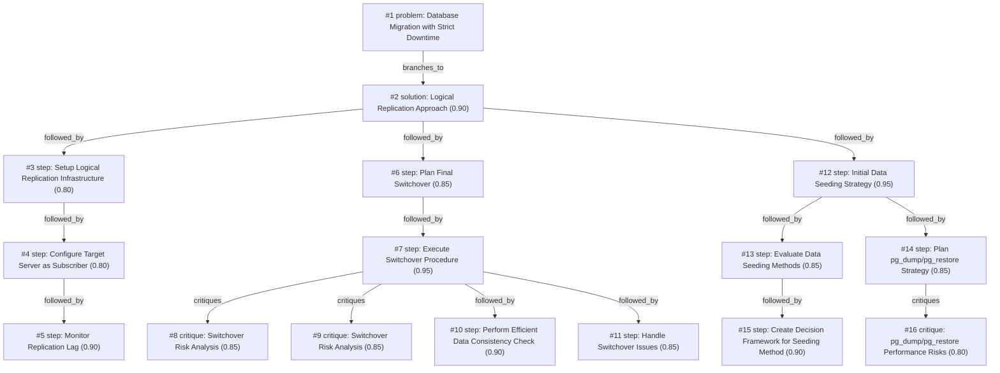

# db-move · zai/glm-4.5-flash · one

**Task:** We have to move a 200 GB PostgreSQL 14 database to a new server in another data center. The app may be down for at most 5 minutes. How should we do it?

| Thoughts | Calls | Tokens in / out | Time | Finish | First try valid | Next picked | Max depth | Weight spread | Duplicates |
|---|---|---|---|---|---|---|---|---|---|
| 16 | 19 | 29846 / 28613 | 16m21s | budget | 15/17 | 9/16 | 4 | 0.03 | 1 |

Failures: no_tool_call 1, schema 1, max_tokens 1

## Answer from the graph

# Migrating PostgreSQL Database with Minimal Downtime

To migrate your 200 GB PostgreSQL 14 database to a new server in another data center with only 5 minutes of downtime, I recommend using logical replication. This approach allows you to continuously sync data between servers and perform a quick final switchover.

## Step-by-Step Approach:

### 1. Initial Data Seeding
First, transfer the initial 200GB dataset to the target server. Since logical replication requires compatible initial data, you'll need to choose an efficient method:
- Evaluate options like pg_dump/pg_restore, file system replication, rsync of data directory, or physical replication
- Consider transfer speed, complexity, data consistency guarantees, and resource requirements
- Select the method that best fits your environment and timeline

### 2. Setup Logical Replication Infrastructure
- Configure the source database as a publisher by creating publications of all tables
- Set up the target server as a subscriber
- Ensure proper network connectivity between data centers
- Begin the replication process and allow it to catch up

### 3. Monitor and Prepare
- Continuously monitor replication lag to ensure it remains minimal
- Prepare for the final switchover by creating a detailed plan
- Test the process and ensure application compatibility with the new server
- Prepare rollback procedures in case issues arise

### 4. Execute the Final Switchover (within your 5-minute window)
1. Stop application connections to the source database
2. Verify replication lag is minimal (less than 1 second)
3. Stop logical replication on the target server
4. Perform a final data consistency check using tools like pg_dump with --serializable-deferrable
5. Update application configuration to point to the new server
6. Restart the application and verify functionality
7. Monitor for any issues post-switchover

## Critical Risks to Watch:

1. **Connection Issues**: The application may not cleanly release all database connections, preventing source database shutdown
   - Mitigation: Implement proper connection draining procedures before switchover

2. **Network Latency**: Network delays between data centers could cause application timeouts during configuration change
   - Mitigation: Pre-configure application with both connection strings and test network performance

3. **Data Consistency**: Inconsistent data state if replication lag exceeds expectations
   - Mitigation: Implement thorough verification procedures and have rollback scripts ready

4. **Configuration Errors**: Application might be configured incorrectly to point to the wrong database
   - Mitigation: Double-check configuration parameters and perform dry runs

5. **Rollback Complexity**: Insufficient rollback procedures if switchover fails
   - Mitigation: Develop and test comprehensive rollback scripts and ensure team members understand emergency procedures

By following this logical replication approach, you can minimize downtime to within your 5-minute window while maintaining data integrity throughout the migration process.

*Used: #2, #3, #4, #5, #6, #7, #8, #9, #10, #12, #13, #15*

## Baseline: one call, no graph

# Moving a 200 GB PostgreSQL 14 Database to a New Data Center with Minimal Downtime

Moving a large database like this (200 GB) between data centers with only 5 minutes of downtime requires careful planning. Here's the recommended approach:

## Recommended Method: Streaming Replication with Switchover

This method minimizes downtime by synchronizing data before the final switchover.

### Phase 1: Preparation (Do this well before the migration window)

1. **Set up the new server**:
   - Install PostgreSQL 14 with similar configuration to your current server
   - Ensure sufficient disk space (200 GB + overhead)
   - Configure network connectivity between data centers

2. **Configure the source server for replication**:
   - Edit `postgresql.conf`:
     ```
     wal_level = replica
     max_wal_senders = 5
     max_replication_slots = 5
     wal_log_hints = on
     ```
   - Edit `pg_hba.conf` to allow replication connections from the new server
   - Create a replication user:
     ```sql
     CREATE USER replicator WITH REPLICATION ENCRYPTED PASSWORD 'strongpassword';
     ```

3. **Create a base backup of the source**:
   ```bash
   pg_basebackup -h localhost -U replicator -D /path/to/backup -Fp -Xs -R -P -v
   ```

4. **Set up the new server as a standby**:
   - Transfer the backup to the new server
   - Configure `postgresql.conf` on the new server:
     ```
     hot_standby = on
     primary_conninfo = 'host=source_server_ip user=replicator password=strongpassword'
     ```
   - Start PostgreSQL on the new server

5. **Monitor replication**:
   - Check replication status:
     ```sql
     SELECT * FROM pg_stat_replication;
     ```
   - Ensure replication lag is minimal before proceeding

### Phase 2: Final Migration (During your 5-minute maintenance window)

1. **Final synchronization**:
   - Stop application writes to the source database
   - Wait for replication to catch up all remaining changes:
     ```sql
     SELECT pg_current_wal_lsn() = pg_last_wal_replay_lsn() AS caught_up;
     ```

2. **Execute the switchover**:
   - On the new server, promote it to primary:
     ```bash
     pg_ctl promote -D /path/to/data
     ```
   - Update your application configuration to point to the new server
   - Start your application

3. **Verify the migration**:
   - Check that your application is functioning correctly
   - Monitor PostgreSQL logs for any errors

### Alternative Approach: pg_dump with Parallel Processing

If streaming replication isn't feasible:

1. **Create a parallel dump** from the source:
   ```bash
   pg_dump -j 4 -F d -f backup.dump dbname
   ```

2. **Transfer and restore** to the new server:
   ```bash
   pg_restore -j 4 -d dbname backup.dump
   ```

3. **For minimal downtime**:
   - Set up logical replication (pglogical) to catch up recent changes
   - During maintenance window, stop writes, wait for final sync, then switch

## Important Considerations

1. **Network bandwidth**: Ensure sufficient bandwidth between data centers
2. **Testing**: Practice the migration in a non-production environment first
3. **Rollback plan**: Keep the old server running initially in case you need to revert
4. **Monitoring**: After migration, closely monitor performance and functionality
5. **Documentation**: Record all steps and configurations for future reference

This approach should allow you to complete the migration within your 5-minute downtime window while ensuring data integrity.

## Index

```text
#1 [problem] Database Migration with Strict Downtime · expanded
  #2 [solution] Logical Replication Approach · w 0.90 · expanded
    #3 [step] Setup Logical Replication Infrastructure · w 0.80 · expanded
      #4 [step] Configure Target Server as Subscriber · w 0.80 · expanded
        #5 [step] Monitor Replication Lag · w 0.90 · open, max depth
    #6 [step] Plan Final Switchover · w 0.85 · expanded
      #7 [step] Execute Switchover Procedure · w 0.95 · expanded
        #8 [critique] Switchover Risk Analysis · w 0.85 · open, max depth
        #9 [critique] Switchover Risk Analysis · w 0.85 · open, max depth
        #10 [step] Perform Efficient Data Consistency Check · w 0.90 · open, max depth
        #11 [step] Handle Switchover Issues · w 0.85 · open, max depth
    #12 [step] Initial Data Seeding Strategy · w 0.95 · expanded
      #13 [step] Evaluate Data Seeding Methods · w 0.85 · expanded
        #15 [step] Create Decision Framework for Seeding Method · w 0.90 · open, max depth
      #14 [step] Plan pg_dump/pg_restore Strategy · w 0.85 · expanded
        #16 [critique] pg_dump/pg_restore Performance Risks · w 0.80 · open, max depth
```

## Graph



## Thoughts

### #1 [problem] Database Migration with Strict Downtime
w 1.00 · expanded · depth 0 · from –

Goal: Move a 200 GB PostgreSQL 14 database to a new server in another data center while keeping application downtime to at most 5 minutes. Facts: Database size is 200GB, PostgreSQL 14 version, destination is in another data center. Unknown: Best migration method, network bandwidth, timing considerations. Good result: Complete database migration with minimal downtime, data integrity maintained, application resumes normal operation within 5-minute window.

> This defines the core problem with all constraints and requirements

### #2 [solution] Logical Replication Approach
w 0.90 · expanded · depth 1 · from #1

Use PostgreSQL's logical replication to continuously sync data between servers, then perform a quick final switchover. Set up logical replication on the source database, create publication of all tables, set up logical replication on the target server as a subscriber, allow replication to catch up, then during the 5-minute window, stop application, stop logical replication, point application to new server, and resume. This allows for minimal downtime as only the final switchover needs to happen within the 5-minute window.

> This approach is highly suitable for large databases with strict downtime requirements as it allows continuous synchronization until the final cutover.

### #3 [step] Setup Logical Replication Infrastructure
w 0.80 · expanded · depth 2 · from #2

Configure logical replication on source PostgreSQL 14 server by enabling logical replication in postgresql.conf, creating a publication for all tables, and setting up appropriate replication user with proper privileges.

> Essential first step to establish data synchronization between servers

### #4 [step] Configure Target Server as Subscriber
w 0.80 · expanded · depth 3 · from #3

Set up the target PostgreSQL 14 server as a logical replication subscriber by configuring it to connect to the source server's publication, creating the replication user with appropriate privileges, and subscribing to all published tables.

> This is essential for completing the logical replication setup and is the counterpart to the source server configuration

### #5 [step] Monitor Replication Lag
w 0.90 · open · depth 4 · from #4

Continuously monitor the replication lag between source and target servers to ensure all data has been synchronized before proceeding with the final switchover. Use PostgreSQL's built-in monitoring tools or pg_stat_replication view to track replication progress and identify any tables that might be lagging significantly.

> Critical step to ensure data consistency before switchover and minimize risk of data loss during the migration.

### #6 [step] Plan Final Switchover
w 0.85 · expanded · depth 2 · from #2

Prepare for the final switchover by creating a detailed switchover plan, testing the process, ensuring application compatibility with the new server, and preparing rollback procedures in case issues arise.

> Proper planning and testing of the switchover is essential to ensure a successful transition within the 5-minute downtime window.

### #7 [step] Execute Switchover Procedure
w 0.95 · expanded · depth 3 · from #6

During the 5-minute maintenance window: 1) Stop application connections to source database, 2) Verify replication lag is minimal (< 1 second), 3) Stop logical replication on target server, 4) Perform final data consistency check, 5) Update application configuration to point to new server, 6) Restart application and verify functionality, 7) Monitor for any issues post-switchover.

> This step directly addresses the core constraint of 5-minute downtime by providing a concrete, time-bound procedure for the actual switchover.

### #8 [critique] Switchover Risk Analysis
w 0.85 · open · depth 4 · from #7

Potential issues during switchover include: network latency between data centers affecting final sync, application connection pooling not releasing connections immediately, transactional consistency if application writes during switchover, and rollback complexity if issues arise. Mitigation: Implement connection draining before switchover, use transaction isolation controls, have rollback scripts ready, and conduct dry runs.

> Identifying and planning for risks is crucial for a successful switchover within the tight 5-minute window

### #9 [critique] Switchover Risk Analysis
w 0.85 · open · depth 4 · from #7

Several critical risks during switchover: 1) Application may not cleanly release all database connections, causing lingering processes that prevent source database shutdown, 2) Network latency between data centers could cause application timeouts during configuration change, 3) Inconsistent data state if replication lag exceeds expectations despite verification, 4) Application configuration errors pointing to wrong database, 5) Insufficient rollback procedures if switchover fails. Mitigation: Test connection draining procedures, pre-configure application with both connection strings, implement automated rollback scripts, perform dry runs of entire process, ensure all team members understand emergency procedures.

> Critical risks that could cause switchover failure beyond 5-minute window, requiring mitigation strategies

### #10 [step] Perform Efficient Data Consistency Check
w 0.90 · open · depth 4 · from #7

Execute a final data consistency check using tools like pg_dump with --serializable-deferrable or pg_verify_checksums on critical tables to ensure data integrity within the 5-minute window. For large tables, sample verification or checksum comparison of recently modified data only may be necessary. Document exact checksums and verification times for rollback if needed.

> Critical for ensuring data integrity during switchover while respecting the strict 5-minute downtime constraint

### #11 [step] Handle Switchover Issues
w 0.85 · open · depth 4 · from #7

Prepare for and handle potential issues during switchover such as network timeouts, connection problems, or unexpected replication lag. Have pre-defined troubleshooting steps and rollback procedures ready to execute within the 5-minute window if needed.

> Critical to have contingency plans for unexpected problems during the time-sensitive switchover

### #12 [step] Initial Data Seeding Strategy
w 0.95 · expanded · depth 2 · from #2

Develop a plan to efficiently transfer the initial 200GB dataset to the target server before setting up logical replication. Consider options like pg_dump/pg_restore, file system replication, or rsync for initial data transfer. This is critical because logical replication only works when the target database has compatible initial data.

> Without proper initial data seeding, logical replication cannot be established, making this a foundational step for the entire migration process.

### #13 [step] Evaluate Data Seeding Methods
w 0.85 · expanded · depth 3 · from #12

Compare different initial data transfer methods for the 200GB PostgreSQL database: 1) pg_dump/pg_restore - reliable but slower, good for moderate datasets; 2) File system replication (pgBackRest, WAL-E) - faster, more complex setup; 3) rsync of data directory - quick but requires careful handling of PostgreSQL files; 4) Physical replication - efficient but requires similar PostgreSQL versions and configuration; 5) Cloud transfer services - good for cross-datacenter transfers but adds cost. Evaluate each based on transfer speed, complexity, data consistency guarantees, and resource requirements.

> This step is crucial because the choice of initial seeding method significantly impacts the overall migration timeline and success probability.

### #14 [step] Plan pg_dump/pg_restore Strategy
w 0.85 · expanded · depth 3 · from #12

Develop detailed strategy for using pg_dump and pg_restore to transfer the initial 200GB dataset. This includes creating a compressed dump of the source database, transferring it to the target server (considering network bandwidth between data centers), and restoring it with appropriate configuration settings. Plan for parallel dumps of large tables to improve performance and estimate timing based on network transfer speeds and server capabilities.

> This is a reliable and well-documented method for initial PostgreSQL data seeding that works well across different PostgreSQL versions.

### #15 [step] Create Decision Framework for Seeding Method
w 0.90 · open · depth 4 · from #13

Develop a scoring system to select the optimal data seeding method based on: transfer speed (must complete within reasonable timeframe), complexity of implementation, data consistency guarantees (critical for production), resource requirements (CPU, memory, network bandwidth), compatibility with PostgreSQL 14, and cost. Assign weights to each criterion based on project priorities and score each method to make a data-driven decision.

> A structured decision framework will ensure we select the most appropriate data seeding method that balances speed, reliability, and complexity for this specific 200GB cross-datacenter migration.

### #16 [critique] pg_dump/pg_restore Performance Risks
w 0.80 · open · depth 4 · from #14

For a 200GB database, pg_dump/pg_restore may face performance bottlenecks including long dump times due to single-threaded operation, potential memory issues during large restores, and network transfer delays between data centers. Consider timing estimates based on network bandwidth and server resources.

> Identifies critical performance concerns that could jeopardize the 5-minute downtime window if not properly addressed

