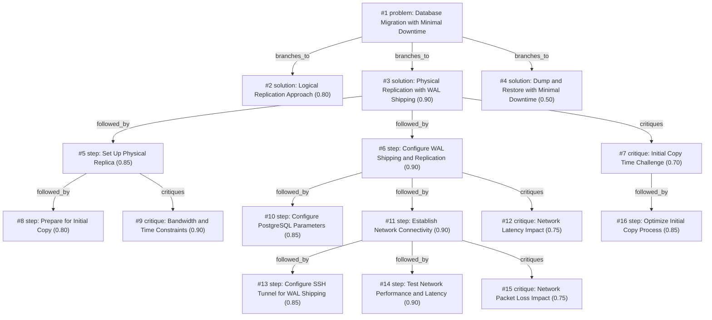

# db-move · zai/glm-4.5-flash · siblings

**Task:** We have to move a 200 GB PostgreSQL 14 database to a new server in another data center. The app may be down for at most 5 minutes. How should we do it?

| Thoughts | Calls | Tokens in / out | Time | Finish | First try valid | Next picked | Max depth | Weight spread | Duplicates |
|---|---|---|---|---|---|---|---|---|---|
| 16 | 9 | 10866 / 8026 | 5m12s | budget | 7/7 | 6/6 | 4 | 0.09 | 0 |

## Answer from the graph

# PostgreSQL Database Migration with Minimal Downtime

To migrate your 200GB PostgreSQL 14 database to a new server in another data center with maximum 5 minutes of downtime, I recommend using Physical Replication with WAL Shipping. This approach minimizes downtime by establishing a replica in the new data center and then switching applications to it once it's fully synchronized.

## Migration Steps

### Phase 1: Initial Setup and Preparation
1. **Prepare for Initial Copy**: Begin preparing the new server in the target data center with PostgreSQL 14 installed and similar configuration to the current server.

2. **Optimize Initial Copy Process**: 
   - Compress the initial data transfer to reduce bandwidth requirements
   - Consider using parallel transfer methods if available
   - Schedule the initial copy during low-traffic periods

3. **Set Up Physical Replica**:
   - Use `pg_basebackup` to create a physical copy of your database
   - Apply appropriate PostgreSQL parameters for replication
   - Ensure proper file permissions and ownership

### Phase 2: Network Configuration
1. **Establish Network Connectivity**:
   - Configure firewall rules between data centers for replication port (default 5432)
   - Set up VPN or direct connection for secure data transfer

2. **Configure SSH Tunnel for WAL Shipping**:
   - Establish SSH tunnel between primary and replica servers
   - Update pg_hba.conf to allow replication connections via the tunnel
   - Test connectivity using pg_basebackup with SSH tunnel option

3. **Test Network Performance and Latency**:
   - Measure network bandwidth between data centers using tools like iperf
   - Test replication performance by simulating WAL shipping
   - Calculate estimated time for initial sync and ongoing replication

### Phase 3: PostgreSQL Replication Setup
1. **Configure PostgreSQL Parameters**:
   - Set `wal_level = replica` on the primary server
   - Adjust `max_wal_senders` based on replication needs
   - Configure `archive_command` for continuous WAL archiving

2. **Set Up WAL Shipping and Replication**:
   - Configure streaming replication on the replica
   - Set up recovery parameters on the replica to receive WAL files
   - Start the replica and verify it's connecting to the primary

3. **Monitor Replication Lag**:
   - Use `pg_stat_replication` to monitor replication status
   - Adjust `wal_sender_timeout` and `wal_receiver_timeout` as needed
   - Implement alerts for replication lag exceeding thresholds

### Phase 4: Final Migration
1. **Wait for Synchronization**:
   - Monitor replication until the replica is fully synchronized
   - Perform a final checkpoint on the primary to minimize remaining WAL to transfer

2. **Execute the Cutover**:
   - Stop application writes to the database
   - Wait for remaining WAL files to be applied on the replica
   - Promote the replica to primary using `pg_ctl promote`
   - Update application connection settings to point to the new server
   - Restart the application

3. **Post-Migration Tasks**:
   - Verify application functionality on the new server
   - Clean up old primary server if no longer needed
   - Update monitoring and alerting configurations

## Key Risks and Mitigation

1. **Initial Copy Time Challenge**:
   - The 200GB initial copy could take significant time depending on network bandwidth
   - **Mitigation**: Optimize compression, use parallel transfers, and begin the process early

2. **Network Latency Impact**:
   - Cross-data center network latency may cause replication lag
   - **Mitigation**: Test network performance, tune timeout parameters, and monitor replication lag

3. **Network Packet Loss Impact**:
   - Packet loss between data centers can cause replication delays
   - **Mitigation**: Implement connection retry logic, increase WAL shipping timeouts, and consider redundant network paths

4. **Data Integrity**:
   - Ensure no data is lost during the migration
   - **Mitigation**: Perform verification checks before and after migration

This approach should allow you to complete the migration within your 5-minute downtime window while maintaining data integrity and minimizing application disruption.

*Used: #3, #5, #6, #7, #8, #10, #11, #12, #13, #14, #15, #16*

## Baseline: one call, no graph

# Migrating a 200 GB PostgreSQL Database with Minimal Downtime

To migrate a 200 GB PostgreSQL 14 database to a new server in another data center with only 5 minutes of allowed downtime, I recommend using **streaming replication** for near-zero downtime. Here's how to do it:

## Phase 1: Preparation (Before Maintenance Window)

1. **Set up the new server**:
   - Install PostgreSQL 14 with identical configuration to the source
   - Ensure sufficient disk space (at least 200 GB + additional space for WAL)

2. **Initialize replication**:
   ```bash
   # On source server
   pg_basebackup -h localhost -U replicator -Fp -Xs -P -R /path/to/backup
   ```
   - Transfer this backup to the new server

3. **Configure replication**:
   - Set up replication user on source with REPLICATION privilege
   - Configure recovery.conf on the replica to enable streaming replication

4. **Test replication**:
   - Verify the replica is receiving changes
   - Monitor replication lag until it's consistently minimal

## Phase 2: Final Migration (During 5-Minute Window)

1. **Final preparations**:
   - Notify users about upcoming maintenance
   - Prepare application config to point to new DB

2. **Execute migration**:
   - Stop all application writes (start of downtime)
   - Wait for in-progress transactions to complete
   - Verify replication has caught up (`pg_stat_replication`)
   - Stop PostgreSQL on source server
   - Promote replica to primary:
     ```bash
     pg_ctl promote -D /path/to/data
     ```
   - Update application configuration to point to new DB
   - Start application (end of downtime)

## Alternative Approach: Logical Replication

If streaming replication isn't feasible:

1. **Set up logical replication**:
   ```sql
   -- On source
   CREATE PUBLICATION mypub FOR ALL TABLES;
   
   -- On destination
   CREATE SUBSCRIPTION mysub CONNECTION 'host=source_server dbname=mydb' PUBLICATION mypub;
   ```

2. **Execute migration**:
   - Stop application writes
   - Wait for replication to catch up
   - Drop subscription on destination
   - Update application config

## Important Considerations

- **Network bandwidth**: Ensure sufficient bandwidth between data centers for replication
- **WAL management**: Monitor WAL growth during migration
- **Testing**: Perform a test migration if possible
- **Rollback plan**: Have a contingency plan if issues arise

This approach ensures minimal downtime while maintaining data integrity throughout the migration process.

## Index

```text
#1 [problem] Database Migration with Minimal Downtime · expanded
  #2 [solution] Logical Replication Approach · w 0.80 · open
  #3 [solution] Physical Replication with WAL Shipping · w 0.90 · expanded
    #5 [step] Set Up Physical Replica · w 0.85 · expanded
      #8 [step] Prepare for Initial Copy · w 0.80 · open
      #9 [critique] Bandwidth and Time Constraints · w 0.90 · open
    #6 [step] Configure WAL Shipping and Replication · w 0.90 · expanded
      #10 [step] Configure PostgreSQL Parameters · w 0.85 · open
      #11 [step] Establish Network Connectivity · w 0.90 · expanded
        #13 [step] Configure SSH Tunnel for WAL Shipping · w 0.85 · open, max depth
        #14 [step] Test Network Performance and Latency · w 0.90 · open, max depth
        #15 [critique] Network Packet Loss Impact · w 0.75 · open, max depth
      #12 [critique] Network Latency Impact · w 0.75 · open
    #7 [critique] Initial Copy Time Challenge · w 0.70 · expanded
      #16 [step] Optimize Initial Copy Process · w 0.85 · open
  #4 [solution] Dump and Restore with Minimal Downtime · w 0.50 · open
```

## Graph



## Thoughts

### #1 [problem] Database Migration with Minimal Downtime
w 1.00 · expanded · depth 0 · from –

Goal: Move 200GB PostgreSQL 14 database to a new server in another data center with maximum 5 minutes application downtime. Facts: Large database size (200GB), PostgreSQL 14 version, cross-data center migration, strict 5-minute downtime requirement. Unknowns: Network bandwidth between data centers, server specifications, current database configuration, backup/restore capabilities, replication options. Good result requires: Complete migration, ≤5 minutes downtime, data integrity maintained, application continuity preserved.

> This is the core problem that defines the task constraints and objectives.

### #2 [solution] Logical Replication Approach
w 0.80 · open · depth 1 · from #1

Use PostgreSQL logical replication to continuously sync data to the new server. Set up logical replication slots on the primary server, create a replication user, configure the standby server to connect as a logical replica, and then switch over to the new server when ready.

> Provides near-zero downtime by continuously replicating changes during the migration process

### #3 [solution] Physical Replication with WAL Shipping
w 0.90 · expanded · depth 1 · from #1

Create a physical replica using pg_basebackup, then continuously ship WAL files to keep the replica in sync. When ready to switch, promote the replica to primary and update application connection settings.

> Most reliable method for large databases with minimal downtime, leveraging PostgreSQL's built-in replication capabilities

### #4 [solution] Dump and Restore with Minimal Downtime
w 0.50 · open · depth 1 · from #1

Perform a logical dump (pg_dump) during low usage, transfer the dump file, restore on the new server, then switch application connections. For the final sync, use a small period of downtime to catch up any changes made during the dump/restore process.

> Simple approach but risky for 200GB database as the dump/restore process itself may exceed 5 minutes

### #5 [step] Set Up Physical Replica
w 0.85 · expanded · depth 2 · from #3

Use pg_basebackup to create a physical replica of the primary database. This creates a complete copy of the database cluster including all data files. This initial copy will be the starting point for our replica.

> Essential first step to establish the replica foundation

### #6 [step] Configure WAL Shipping and Replication
w 0.90 · expanded · depth 2 · from #3

Set up continuous archiving and streaming replication. Configure wal_level=replica, max_wal_senders, and archive_command on the primary. Set up recovery.conf on the replica to receive WAL files via streaming replication.

> Critical for keeping replica synchronized with primary

### #7 [critique] Initial Copy Time Challenge
w 0.70 · expanded · depth 2 · from #3

The initial 200GB copy via pg_basebackup could take significant time depending on network bandwidth between data centers. This may delay the start of replication and extend the overall migration timeline.

> Major potential bottleneck in the migration process

### #8 [step] Prepare for Initial Copy
w 0.80 · open · depth 3 · from #5

Check available disk space on the target server (at least 200GB + overhead), verify network bandwidth between data centers, ensure sufficient I/O capacity on both source and target servers, and prepare connection parameters for pg_basebackup.

> Proper preparation ensures the initial copy operation will succeed and complete efficiently.

### #9 [critique] Bandwidth and Time Constraints
w 0.90 · open · depth 3 · from #5

The initial 200GB copy over the network may take hours depending on available bandwidth. With a 5-minute downtime requirement, this initial copy must be completed well before the final cutover. Consider using faster network connections or alternative initial copy methods if bandwidth is insufficient.

> Network bandwidth limitations could prevent completing the initial copy within required timeframes.

### #10 [step] Configure PostgreSQL Parameters
w 0.85 · open · depth 3 · from #6

Set wal_level=replica, max_wal_senders=5, max_replication_slots=2, synchronous_commit=off, archive_command to ship WAL files to remote storage. Adjust checkpoint_timeout to 30min to reduce WAL volume.

> Essential configuration for WAL shipping and streaming replication

### #11 [step] Establish Network Connectivity
w 0.90 · expanded · depth 3 · from #6

Configure firewall rules between data centers for replication port (default 5432). Set up SSH tunnel or VPN for secure WAL shipping. Test network bandwidth and latency between servers.

> Critical foundation for cross-data center replication to function

### #12 [critique] Network Latency Impact
w 0.75 · open · depth 3 · from #6

Cross-data center network latency may cause replication lag, potentially increasing final cutover time. Monitor replication lag with pg_stat_replication and consider tuning wal_sender_timeout and wal_receiver_timeout parameters.

> Important consideration that could affect the 5-minute downtime requirement

### #13 [step] Configure SSH Tunnel for WAL Shipping
w 0.85 · open · depth 4 · from #11

Set up SSH tunnel between primary and replica servers for secure WAL shipping. Configure pg_hba.conf to allow replication connections via SSH tunnel. Test connectivity using pg_basebackup with SSH tunnel option.

> Secure tunneling is essential for protecting WAL data during transfer

### #14 [step] Test Network Performance and Latency
w 0.90 · open · depth 4 · from #11

Measure network bandwidth between data centers using tools like iperf. Test replication performance by simulating WAL shipping. Calculate estimated time for initial sync and ongoing replication.

> Network performance directly impacts replication lag and migration timeline

### #15 [critique] Network Packet Loss Impact
w 0.75 · open · depth 4 · from #11

Network packet loss between data centers can cause replication delays and potential data inconsistencies. Implement connection retry logic and monitor replication lag. Consider increasing WAL shipping timeout parameters.

> Packet loss is a common issue in cross-data center networks that can affect replication

### #16 [step] Optimize Initial Copy Process
w 0.85 · open · depth 3 · from #7

To address the initial copy time challenge, implement several optimization strategies: 1) Use parallel transfer tools like rsync with --partial and --bwlimit to maximize bandwidth utilization, 2) Compress data during transfer using gzip or zstd, 3) Split the database into logical chunks if possible for parallel transfers, 4) Consider using pg_basebackup with --max-rate to control bandwidth usage and avoid overwhelming the network, 5) Pre-stage as much OS and PostgreSQL configuration as possible on the destination server to minimize post-copy work.

> These optimizations can significantly reduce the initial copy time while maintaining data integrity and staying within network constraints.

