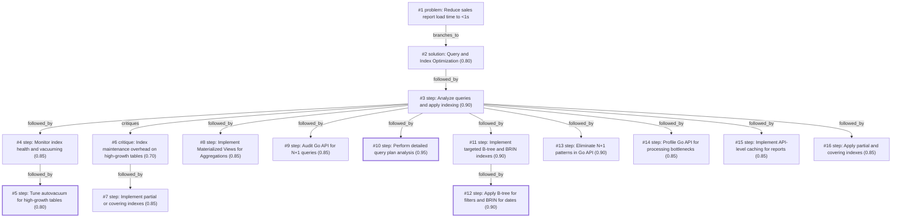

# report-page · ollama-cloud/gemma4:31b · one

**Task:** Our internal sales report page takes about 12 seconds to load. It runs on PostgreSQL behind a Go API, the data grows by 50,000 rows a day, and the team is two developers. How should we make it load in under 1 second?

| Thoughts | Calls | Tokens in / out | Time | Finish | First try valid | Next picked | Max depth | Weight spread | Duplicates |
|---|---|---|---|---|---|---|---|---|---|
| 16 | 19 | 27407 / 4166 | 1m52s | budget | 16/17 | 4/16 | 4 | 0.06 | 0 |

Failures: no_tool_call 2

## Answer from the graph

To reduce your sales report load time from 12 seconds to under 1 second with a small team of two developers, you should focus on a high-impact, database-first optimization strategy. Given the growth rate of 50,000 rows per day, the goal is to reduce disk I/O and CPU load without creating an unmaintainable index overhead.

### Recommended Approach

**1. Diagnostic Phase (Immediate)**
Before changing code, identify exactly why the query is slow. Run `EXPLAIN (ANALYZE, BUFFERS)` on the specific query powering the report. This will tell you if the database is performing expensive "Sequential Scans" (reading every row) or "External Merges" (sorting data on disk because it doesn't fit in RAM).

**2. Database Indexing Strategy**
Apply a hybrid indexing approach to balance read speed with the high daily write volume:
*   **B-tree Indexes:** Apply these to high-cardinality columns used in filters (e.g., `salesperson_id`, `region_id`, or `status`).
*   **BRIN (Block Range Index):** Use a BRIN index for the timestamp/date column. Since sales data is typically inserted sequentially, BRIN indexes are significantly smaller than B-trees and have much lower maintenance overhead, making them ideal for high-growth tables.
*   **Covering/Partial Indexes:** To further reduce I/O, use "Covering Indexes" (using the `INCLUDE` clause) to store frequently retrieved columns directly in the index, or "Partial Indexes" if the report only focuses on a subset of data (e.g., `WHERE status = 'completed'`).

**3. API Optimization**
Audit the Go API to ensure it isn't contributing to the latency:
*   **Eliminate N+1 Queries:** Ensure the API is not fetching a list of records and then running a separate query for each record to get related data. Use `JOIN`s or `IN` clauses to fetch all necessary data in a single round trip.
*   **Data Processing:** Profile the Go code to ensure the 12-second delay isn't caused by inefficient data transformation or serialization after the database has already returned the results.

### Risks to Watch
*   **Index Bloat:** Adding too many indexes on a table growing by 50k rows/day will slow down your `INSERT` operations and increase disk usage. Avoid redundant indexes.
*   **Vacuuming Overhead:** High-growth tables can suffer from "bloat." Ensure your PostgreSQL `autovacuum` settings are tuned to keep up with the daily volume to prevent performance degradation over time.
*   **Maintenance Window:** Creating indexes on large production tables can lock the table. Always use `CREATE INDEX CONCURRENTLY` to avoid taking the report page offline during the optimization process.

*Used: #1, #2, #3, #6, #10, #11, #12, #13, #14*

## Baseline: one call, no graph

To bring a 12-second load time down to under 1 second with a small team, you need to avoid "over-engineering" (like introducing Kafka or NoSQL) and focus on the **"Low Hanging Fruit"** of database performance.

Here is the step-by-step roadmap to optimize your sales report.

---

### Step 1: Identify the Bottleneck (The "Where")
Before changing code, find out exactly why it is slow. 
*   **Log the Query:** Capture the exact SQL query being sent by the Go API.
*   **Run `EXPLAIN ANALYZE`:** Run the query directly in PostgreSQL prefixed with `EXPLAIN (ANALYZE, BUFFERS)`.
    *   **Look for "Seq Scan":** This means Postgres is reading every single row on the disk.
    *   **Look for "External Merge Disk":** This means your `work_mem` is too low, and Postgres is sorting data on the hard drive instead of in RAM.

### Step 2: Database Optimization (The "Quick Wins")
Since your data grows by 50k rows/day, your table likely has millions of rows. 

**1. Proper Indexing**
If your report filters by `date`, `store_id`, or `sales_rep`, you need indexes on those columns.
*   **B-Tree Indexes:** For equality (`=`) and range (`>`, `<`) filters.
*   **Composite Indexes:** If you always filter by `store_id` AND `date`, a single index on `(store_id, date)` is significantly faster than two separate indexes.

**2. Avoid `SELECT *`**
Reports often only need 5 columns out of 50. Selecting only the necessary columns reduces I/O and network overhead between Postgres and Go.

**3. Optimize Aggregations**
If you are doing `SUM()` or `COUNT()` over millions of rows every time the page loads, you will never hit <1s consistently.
*   **Avoid `DISTINCT` if possible:** It triggers heavy sorting.
*   **Use Approximate Counts:** If a "rough" number is okay for a dashboard, use `reltuples` from `pg_class`.

### Step 3: Architectural Changes (The "Scaling")
If indexes aren't enough, you need to change how the data is accessed.

**1. Materialized Views (The "Gold Standard" for Reports)**
Instead of calculating sales on the fly, create a **Materialized View**. This saves the result of the query to a physical table.
*   **Implementation:** `CREATE MATERIALIZED VIEW daily_sales_summary AS SELECT ...`
*   **Refresh Strategy:** Since you add 50k rows a day, refresh the view every hour or every night: `REFRESH MATERIALIZED VIEW CONCURRENTLY daily_sales_summary;`
*   **Result:** The API now queries a pre-computed table of 365 rows (one per day) instead of 18 million rows.

**2. Database Partitioning**
Since sales data is time-series, use **Declarative Partitioning** by date (e.g., monthly partitions).
*   Postgres will use "Partition Pruning" to ignore all data from previous years/months, scanning only the relevant partition.

### Step 4: Go API Layer Optimizations
**1. Pagination**
Never return "all" results to the frontend. Implement `LIMIT` and `OFFSET` (or better, **keyset pagination** using `WHERE id > last_id`) to keep the payload small.

**2. Concurrent Fetching**
If your report page has 4 different charts, don't run 4 queries sequentially. Use Go's `goroutines` and `errgroup` to fetch the data for all 4 charts in parallel.

**3. Caching (Redis or In-Memory)**
If the data only updates once a day, cache the final JSON response in Redis for 1 hour. The load time will drop to ~10ms.

---

### Summary Checklist for the 2-Developer Team

| Priority | Action | Effort | Impact |
| :--- | :--- | :--- | :--- |
| **1** | `EXPLAIN ANALYZE` $\rightarrow$ Add missing indexes | Low | High |
| **2** | Replace `SELECT *` with specific columns | Low | Medium |
| **3** | Implement a **Materialized View** | Medium | Massive |
| **4** | Add Redis caching for the API response | Medium | Massive |
| **5** | Table Partitioning (by month) | High | High |

## Index

```text
#1 [problem] Reduce sales report load time to <1s · expanded
  #2 [solution] Query and Index Optimization · w 0.80 · expanded
    #3 [step] Analyze queries and apply indexing · w 0.90 · expanded
      #4 [step] Monitor index health and vacuuming · w 0.85 · expanded
        #5 [step] Tune autovacuum for high-growth tables · w 0.80 · done
      #6 [critique] Index maintenance overhead on high-growth tables · w 0.70 · expanded
        #7 [step] Implement partial or covering indexes · w 0.85 · open, max depth
      #8 [step] Implement Materialized Views for Aggregations · w 0.85 · open
      #9 [step] Audit Go API for N+1 queries · w 0.85 · open
      #10 [step] Perform detailed query plan analysis · w 0.95 · done
      #11 [step] Implement targeted B-tree and BRIN indexes · w 0.90 · expanded
        #12 [step] Apply B-tree for filters and BRIN for dates · w 0.90 · done
      #13 [step] Eliminate N+1 patterns in Go API · w 0.90 · open
      #14 [step] Profile Go API for processing bottlenecks · w 0.85 · open
      #15 [step] Implement API-level caching for reports · w 0.85 · open
      #16 [step] Apply partial and covering indexes · w 0.85 · open
```

## Graph



## Thoughts

### #1 [problem] Reduce sales report load time to <1s
w 1.00 · expanded · depth 0 · from –

Goal: Reduce the load time of an internal sales report page from ~12 seconds to <1 second.
Facts: 
- Stack: PostgreSQL DB, Go API.
- Data Growth: 50,000 new rows per day.
- Resources: 2 developers.
Unknowns: 
- The specific query causing the slowdown.
- Current indexing strategy.
- Hardware specifications/bottlenecks (CPU, RAM, I/O).
- Data distribution and total table size.
- Whether the report is real-time or can be slightly delayed.
Success Criteria: A scalable solution implemented by a small team that ensures the page loads in under 1 second consistently as data continues to grow.

> This defines the objective and constraints clearly to guide the technical approach.

### #2 [solution] Query and Index Optimization
w 0.80 · expanded · depth 1 · from #1

Optimize the current query and database schema to reduce execution time. This involves using EXPLAIN ANALYZE to find bottlenecks, adding missing indexes (B-tree, BRIN for time-series), and optimizing the Go API to avoid N+1 query patterns.

> The most direct and least invasive approach to improve performance without changing architecture.

### #3 [step] Analyze queries and apply indexing
w 0.90 · expanded · depth 2 · from #2

Use EXPLAIN ANALYZE to identify sequential scans or expensive joins, then create targeted indexes (e.g., B-tree on filters, BRIN for the growth-heavy timestamp column) and rewrite the Go API to fetch data in bulk to eliminate N+1 queries.

> Provides a concrete sequence of technical actions to implement the optimization solution.

### #4 [step] Monitor index health and vacuuming
w 0.85 · expanded · depth 3 · from #3

Verify index efficiency and check for 'bloat' using pg_stat_user_indexes. If the data grows by 50k rows/day, ensure that the vacuuming process is keeping up to prevent index degradation, and check if partial indexes are applicable for frequently accessed 'active' data ranges.

> Ensures that indexes remain performant over time given the high daily growth rate.

### #5 [step] Tune autovacuum for high-growth tables
w 0.80 · done · depth 4 · from #4

Set up autovacuum tuning parameters specifically for the sales table (e.g., adjusting scale_factor and cost_limit) to handle the high daily insert rate and prevent table bloat, ensuring that the query planner continues to use the most efficient index paths.

> Specific configuration of autovacuum is critical for high-write tables to maintain performance over time.

### #6 [critique] Index maintenance overhead on high-growth tables
w 0.70 · expanded · depth 3 · from #3

While indexes speed up reads, adding too many on a table growing by 50k rows/day increases write latency and bloat. We must balance read performance with the overhead of index maintenance and check if partial indexes or covering indexes (INCLUDE clause) can reduce I/O.

> High growth rates make index maintenance a critical risk.

### #7 [step] Implement partial or covering indexes
w 0.85 · open · depth 4 · from #6

Evaluate if the report targets a specific subset of data (e.g., only the last 30 days). If so, implement partial indexes (WHERE created_at > '...') to keep the index size small and maintenance costs low, or use a covering index to avoid heap fetches entirely for common report columns.

> Provides a concrete technical mitigation for the index overhead mentioned in the critique.

### #8 [step] Implement Materialized Views for Aggregations
w 0.85 · open · depth 3 · from #3

Check if the report aggregates data (SUM, COUNT) over large ranges. If so, create a materialized view that refreshes periodically or use a summary table updated by triggers to avoid scanning millions of rows per request.

> Aggregations on high-growth tables are a primary cause of slowdowns that indexing alone cannot solve.

### #9 [step] Audit Go API for N+1 queries
w 0.85 · open · depth 3 · from #3

Review the Go API's database interaction layer to ensure that the report isn't making hundreds of small queries (N+1) instead of one large join or an IN clause. Check for inefficient ORM usage that might be generating suboptimal SQL.

> Solving the database query is useless if the API layer introduces significant latency through round-trips.

### #10 [step] Perform detailed query plan analysis
w 0.95 · done · depth 3 · from #3

Run 'EXPLAIN (ANALYZE, BUFFERS)' on the report query to distinguish between CPU-bound processing and I/O-bound disk reads. Focus on identifying 'Seq Scan' on large tables and 'External Merge' on sorts.

> Concrete diagnostic action needed before indexing to avoid guessing.

### #11 [step] Implement targeted B-tree and BRIN indexes
w 0.90 · expanded · depth 3 · from #3

Identify columns frequently used in WHERE, JOIN, and ORDER BY clauses. Create B-tree indexes for high-cardinality filters and consider BRIN (Block Range Index) for the timestamp column since data is added sequentially, reducing index size and maintenance overhead.

> Concrete implementation of the indexing strategy mentioned in #3.

### #12 [step] Apply B-tree for filters and BRIN for dates
w 0.90 · done · depth 4 · from #11

Create B-tree indexes for equality and range filters (e.g., salesperson_id, region) and a BRIN index for the creation_date/transaction_date column. This leverages the sequential nature of sales data growth to keep index size small and avoid the performance degradation typically seen with massive B-tree indexes on time-series data.

> Provides the concrete technical implementation for the index strategy.

### #13 [step] Eliminate N+1 patterns in Go API
w 0.90 · open · depth 3 · from #3

Review Go API handlers to ensure that for every report request, the number of database queries is constant (O(1)) regardless of the number of rows returned, specifically checking for loops that execute SELECT statements.

> N+1 queries are a common cause of high latency in Go APIs and should be addressed alongside DB indexing.

### #14 [step] Profile Go API for processing bottlenecks
w 0.85 · open · depth 3 · from #3

Review the Go API logic to ensure that the data fetched from PostgreSQL is not being processed in expensive loops or performing additional database calls per row (N+1). Use a tool like pprof or basic logging to measure the time spent in the DB vs the time spent in the API layer.

> Ensures the bottleneck isn't in the application layer before focusing solely on DB indexes.

### #15 [step] Implement API-level caching for reports
w 0.85 · open · depth 3 · from #3

Implement a caching layer (e.g., Redis) or use the Go API to cache report results for a short duration (e.g., 5-15 minutes), as internal reports often don't require second-by-second precision.

> Caching is a high-impact way to hit <1s goals when query optimization alone might struggle with massive growth.

### #16 [step] Apply partial and covering indexes
w 0.85 · open · depth 3 · from #3

Implement a strategy to use Partial Indexes for frequently filtered states (e.g., 'active' or 'pending' sales) or Covering Indexes (using INCLUDE) to allow Index-Only Scans, reducing the need to fetch data from the heap for common report columns.

> Refines the indexing strategy to further reduce I/O for high-growth tables.

