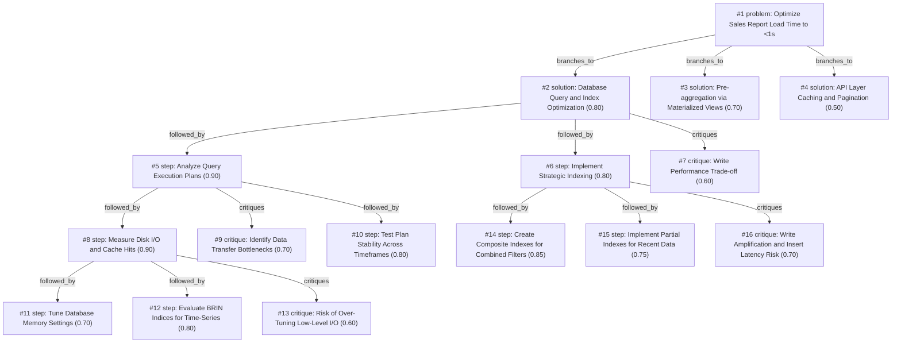

# report-page · ollama-cloud/gemma4:31b · siblings

**Task:** Our internal sales report page takes about 12 seconds to load. It runs on PostgreSQL behind a Go API, the data grows by 50,000 rows a day, and the team is two developers. How should we make it load in under 1 second?

| Thoughts | Calls | Tokens in / out | Time | Finish | First try valid | Next picked | Max depth | Weight spread | Duplicates |
|---|---|---|---|---|---|---|---|---|---|
| 16 | 8 | 9160 / 3351 | 24s | budget | 6/6 | 5/5 | 4 | 0.10 | 0 |

## Answer from the graph

To reduce your sales report load time from 12 seconds to under 1 second with a small team of two developers, you should focus on the highest ROI area: **Database Query and Index Optimization**. 

Given your data growth rate (50k rows/day), the goal is to move away from full table scans toward targeted data retrieval.

### Recommended Implementation Path

**Step 1: Diagnostic Analysis**
Before changing code, identify exactly where the time is being spent:
*   **Run `EXPLAIN ANALYZE`**: Execute your report queries with this command to see if the bottleneck is a "Sequential Scan" (reading the whole table), a slow "Index Scan," or high "Sorting" costs.
*   **Check Buffers**: Use `EXPLAIN (ANALYZE, BUFFERS)` to determine if the database is hitting the disk too often or if the data fits in the cache.
*   **Test Timeframes**: Run these plans for different date ranges (e.g., 1 day vs. 30 days). This helps identify the "tipping point" where the PostgreSQL query planner decides to abandon an index and switch to a slow sequential scan.

**Step 2: Strategic Indexing**
Based on the diagnostics, implement the following:
*   **B-Tree Indexes**: Add indexes to columns used in `WHERE` clauses and `JOIN` conditions.
*   **BRIN Indices**: Since sales data is typically time-series (inserted chronologically), consider **BRIN (Block Range Index)** for timestamp columns. BRIN indexes are significantly smaller than B-Trees, reducing I/O and maintenance overhead as the table grows.
*   **Composite Indexes**: If the report always filters by two fields (e.g., `store_id` AND `sale_date`), a single composite index is more efficient than two separate ones.

**Step 3: API and Data Transfer Audit**
Ensure the bottleneck isn't happening after the database returns the data:
*   Check if the Go API is requesting too many raw rows and performing aggregation in memory. 
*   Verify that the JSON serialization of a massive result set isn't the cause of the latency.

### Risks to Watch

*   **Write Amplification**: Every index you add slows down your 50,000 daily inserts. Avoid "over-indexing"; only add indexes that the `EXPLAIN` plan proves are necessary.
*   **The "Aggregation Ceiling"**: If your report requires aggregating millions of rows in real-time, index tuning alone may not reach the <1s goal. If performance plateaus, your next step should be **Pre-aggregation via Materialized Views** to store summarized daily totals.
*   **Low-Level Over-Tuning**: Avoid spending too much time tuning database memory settings or OS-level I/O unless the query plans show that the logic is already optimal.

*Used: #1, #2, #5, #7, #8, #9, #10, #12, #13*

## Baseline: one call, no graph

With a two-person team and a data growth rate of 1.5M rows per month, you cannot afford complex infrastructure (like Hadoop or Snowflake). You need "high-leverage" wins.

Here is the systematic approach to move from 12 seconds to <1 second.

---

### Phase 1: The "Low Hanging Fruit" (Quick Wins)
Before changing code, find out *why* it is slow.

**1. Explain Analyze**
Run your report query directly in PostgreSQL with `EXPLAIN ANALYZE`. 
*   **Look for "Seq Scan":** This means Postgres is reading the entire table from disk.
*   **Look for "External Merge Disk":** This means your `sort` or `join` is too big for memory (RAM) and is spilling to disk.

**2. Targeted Indexing**
If you see a Seq Scan on a filtered column (e.g., `WHERE sale_date > '2023-01-01'`), add a B-Tree index. 
*   **Pro Tip:** Use **Composite Indexes**. If your report always filters by `store_id` AND `sale_date`, a single index on `(store_id, sale_date)` is significantly faster than two separate indexes.

**3. Select Only What You Need**
Ensure your Go API isn't doing `SELECT *`. Fetching 50 columns when you only display 5 increases network latency and memory usage.

---

### Phase 2: Architectural Optimization (The Go/SQL Layer)
If indexes aren't enough, you are likely calculating aggregates (SUM, AVG, COUNT) on the fly over millions of rows.

**1. Database Views / Materialized Views**
If the report doesn't need to be "real-time" (e.g., 1-hour delay is okay), use a **Materialized View**.
*   It saves the result of the complex query to a physical table.
*   Loading becomes a simple `SELECT * FROM mv_sales_report`, which takes milliseconds.
*   Refresh it via a cron job: `REFRESH MATERIALIZED VIEW CONCURRENTLY mv_sales_report;`

**2. Pagination and Filtering**
Ensure the API isn't trying to send 100,000 rows to the frontend. 
*   Implement **Keyset Pagination** (using `WHERE id > last_id` instead of `OFFSET`) to keep query times constant as the dataset grows.

---

### Phase 3: Scaling for Growth (The "Future-Proof" Layer)
Since you grow by 50k rows/day, a single table will eventually slow down regardless of indexes.

**1. Declarative Partitioning**
Partition your sales table by **Range (Time)**. 
*   Split your data by month (e.g., `sales_2023_10`, `sales_2023_11`).
*   PostgreSQL will perform **"Partition Pruning,"** meaning if the user filters for "Last 30 Days," Postgres ignores 90% of the tables and only scans the relevant ones.

**2. Pre-Aggregation (The "Summary Table" Pattern)**
Instead of calculating totals from the raw `sales` table every time, create a `daily_sales_summary` table.
*   Every night, run a script that aggregates yesterday's 50k rows into a few summary rows.
*   Your report then queries the summary table (thousands of rows) instead of the raw table (millions of rows).

---

### Summary Checklist for the 2-Dev Team:

| Effort | Action | Expected Gain |
| :--- | :--- | :--- |
| **Low** | `EXPLAIN ANALYZE` $\rightarrow$ Add Index | 12s $\rightarrow$ 3s |
| **Low** | Remove `SELECT *` $\rightarrow$ Specific columns | 3s $\rightarrow$ 2s |
| **Med** | Materialized View (with 1hr refresh) | 2s $\rightarrow$ 0.2s |
| **Med** | Summary Tables (Pre-aggregation) | Constant speed |
| **High** | Table Partitioning by Month | Long-term stability |

**My recommendation:** Start with **Explain Analyze $\rightarrow$ Composite Indexes**. If that doesn't hit <1s, implement a **Materialized View**. This requires the least amount of code change for the highest performance gain.

## Index

```text
#1 [problem] Optimize Sales Report Load Time to <1s · expanded
  #2 [solution] Database Query and Index Optimization · w 0.80 · expanded
    #5 [step] Analyze Query Execution Plans · w 0.90 · expanded
      #8 [step] Measure Disk I/O and Cache Hits · w 0.90 · expanded
        #11 [step] Tune Database Memory Settings · w 0.70 · open, max depth
        #12 [step] Evaluate BRIN Indices for Time-Series · w 0.80 · open, max depth
        #13 [critique] Risk of Over-Tuning Low-Level I/O · w 0.60 · open, max depth
      #9 [critique] Identify Data Transfer Bottlenecks · w 0.70 · open
      #10 [step] Test Plan Stability Across Timeframes · w 0.80 · open
    #6 [step] Implement Strategic Indexing · w 0.80 · expanded
      #14 [step] Create Composite Indexes for Combined Filters · w 0.85 · open
      #15 [step] Implement Partial Indexes for Recent Data · w 0.75 · open
      #16 [critique] Write Amplification and Insert Latency Risk · w 0.70 · open
    #7 [critique] Write Performance Trade-off · w 0.60 · open
  #3 [solution] Pre-aggregation via Materialized Views · w 0.70 · open
  #4 [solution] API Layer Caching and Pagination · w 0.50 · open
```

## Graph



## Thoughts

### #1 [problem] Optimize Sales Report Load Time to <1s
w 1.00 · expanded · depth 0 · from –

Goal: Reduce internal sales report page load time from ~12s to <1s.
Facts:
- Tech Stack: PostgreSQL DB, Go API.
- Data Growth: +50,000 rows per day (rapidly increasing dataset).
- Team Size: 2 developers (limited bandwidth for over-engineering).
Unknowns:
- Current query execution plans and bottlenecks (CPU, I/O, locks).
- Current indexing strategy.
- Data aggregation level (raw rows vs. summarized views).
- API processing overhead vs. DB latency.
Success Criteria: Consistent sub-second response time while maintaining a sustainable maintenance overhead for a small team.

> Initial definition of the task goals and constraints.

### #2 [solution] Database Query and Index Optimization
w 0.80 · expanded · depth 1 · from #1

Focus on database-level optimization: analyze query plans (EXPLAIN ANALYZE), add missing indices (B-Tree or BRIN for time-series data), and optimize the SQL queries themselves. This is the highest ROI for a small team.

> Most 12s load times are caused by sequential scans or poor indexing in PostgreSQL.

### #3 [solution] Pre-aggregation via Materialized Views
w 0.70 · open · depth 1 · from #1

Introduce a pre-aggregated reporting table or Materialized View that updates periodically (e.g., hourly or daily). The API then queries the summary table instead of aggregating millions of raw rows on every request.

> With 50k rows/day, raw aggregation will eventually fail regardless of indexing.

### #4 [solution] API Layer Caching and Pagination
w 0.50 · open · depth 1 · from #1

Implement caching at the API layer (e.g., Redis or in-memory) for common report parameters and paginate the results to reduce the data transfer volume.

> Caching provides immediate speedups for repeated requests, though it doesn't fix the underlying slow query.

### #5 [step] Analyze Query Execution Plans
w 0.90 · expanded · depth 2 · from #2

Use EXPLAIN ANALYZE to identify if the bottleneck is a Sequential Scan, a slow Index Scan, or high sorting costs. Focus on the slowest part of the execution plan.

> Diagnosis is the mandatory first step before applying any fix.

### #6 [step] Implement Strategic Indexing
w 0.80 · expanded · depth 2 · from #2

Implement B-Tree indexes on filter columns (e.g., date, region) and consider BRIN indexes for large time-series data to reduce index size and speed up range scans.

> Indices are the most common cause of slow reads in growing datasets.

### #7 [critique] Write Performance Trade-off
w 0.60 · open · depth 2 · from #2

Risk: Adding too many indices can slow down the 50k daily inserts. We need to balance read performance with write throughput.

> Addressing the trade-off between read speed and write speed is critical given the growth rate.

### #8 [step] Measure Disk I/O and Cache Hits
w 0.90 · expanded · depth 3 · from #5

Run 'EXPLAIN (ANALYZE, BUFFERS)' on the production-like dataset to check for disk I/O bottlenecks and cache misses, specifically looking for "Seq Scan" on large tables.

> Buffers provide critical info on whether the query is hitting disk or RAM.

### #9 [critique] Identify Data Transfer Bottlenecks
w 0.70 · open · depth 3 · from #5

Check if the slow load is due to a large result set being transferred to the Go API, causing high memory allocation or JSON serialization overhead.

> The bottleneck might not be the query execution but the data transfer volume.

### #10 [step] Test Plan Stability Across Timeframes
w 0.80 · open · depth 3 · from #5

Compare execution plans for different date ranges (e.g., 1 day vs 30 days) to see if the query planner switches from index scans to sequential scans as data volume grows.

> Postgres planner behavior changes based on statistics and table size.

### #11 [step] Tune Database Memory Settings
w 0.70 · open · depth 4 · from #8

Increase work_mem for the session to reduce on-disk sorting for large report aggregations, and check if the shared_buffers are sufficient for the working set size.

> Memory configuration directly impacts whether data is read from disk or RAM during report generation.

### #12 [step] Evaluate BRIN Indices for Time-Series
w 0.80 · open · depth 4 · from #8

If the dataset is very large and time-ordered, B-Tree indices might become bloated; consider BRIN (Block Range Index) for the timestamp columns to reduce index size and I/O.

> BRIN indices are highly effective for large, naturally ordered time-series data common in sales reports.

### #13 [critique] Risk of Over-Tuning Low-Level I/O
w 0.60 · open · depth 4 · from #8

Measuring buffers is helpful, but if the problem is the sheer volume of rows being aggregated in real-time, tuning I/O alone won't reach <1s. Need to ensure this leads back to aggregation strategies.

> Prevents getting stuck in low-level tuning when a structural change (like pre-aggregation) might be necessary.

### #14 [step] Create Composite Indexes for Combined Filters
w 0.85 · open · depth 3 · from #6

Create composite indexes for common filter combinations (e.g., date_range + product_id) to allow the planner to use a single index for multiple constraints, reducing heap fetches.

> Composite indexes are critical for reports with multiple filters to avoid bitmap heap scans.

### #15 [step] Implement Partial Indexes for Recent Data
w 0.75 · open · depth 3 · from #6

Apply partial indexes for frequently accessed current-period data (e.g., only indexing the last 30 days) to keep index sizes small and in-memory.

> Reports usually target recent data; partial indices reduce overhead and disk I/O.

### #16 [critique] Write Amplification and Insert Latency Risk
w 0.70 · open · depth 3 · from #6

Adding too many indexes can significantly slow down the 50k daily row inserts and increase storage costs, potentially shifting the bottleneck to write latency.

> Write amplification is a major risk with high-volume inserts (50k/day).

