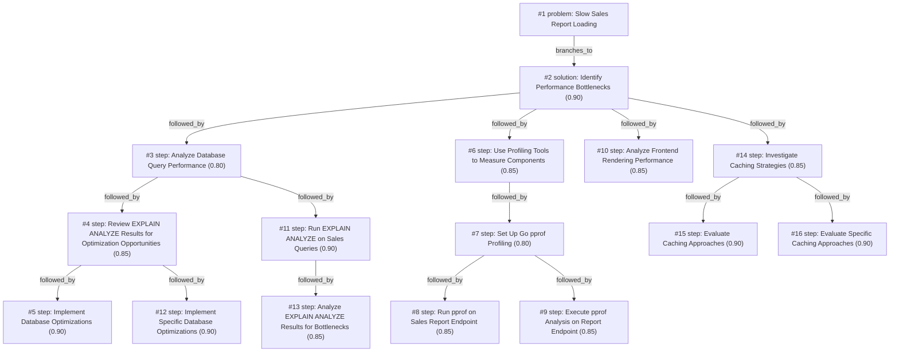

# report-page · zai/glm-4.5-flash · one

**Task:** Our internal sales report page takes about 12 seconds to load. It runs on PostgreSQL behind a Go API, the data grows by 50,000 rows a day, and the team is two developers. How should we make it load in under 1 second?

| Thoughts | Calls | Tokens in / out | Time | Finish | First try valid | Next picked | Max depth | Weight spread | Duplicates |
|---|---|---|---|---|---|---|---|---|---|
| 16 | 18 | 24110 / 11057 | 5m46s | budget | 16/16 | 12/15 | 4 | 0.01 | 2 |

## Answer from the graph

# Optimizing Sales Report Loading Performance

To reduce your sales report loading time from 12 seconds to under 1 second, I recommend a systematic approach focusing on identifying and addressing performance bottlenecks. Here's a step-by-step plan:

## Step 1: Performance Profiling and Bottleneck Identification
- Run EXPLAIN ANALYZE on your sales report queries to understand database performance characteristics
- Set up Go pprof profiling to measure the API endpoint's performance
- Analyze frontend rendering performance to identify any client-side bottlenecks

## Step 2: Database Optimization
- Based on EXPLAIN ANALYZE results, implement targeted database optimizations:
  - Add appropriate indexes to frequently queried columns
  - Restructure complex queries for better performance
  - Consider using materialized views for frequently accessed report data
  - Optimize JOIN operations and WHERE clauses

## Step 3: API Performance Enhancement
- Analyze pprof results to identify specific bottlenecks in your Go API
- Optimize code paths that consume the most resources
- Implement efficient data processing pipelines

## Step 4: Caching Strategy Implementation
- Evaluate and implement appropriate caching approaches:
  - Database-level caching with materialized views
  - API-level in-memory caching (e.g., Redis)
  - Frontend caching for static report components
  - Pre-aggregation of report data during off-peak hours
  - Implement cache invalidation strategies that account for the 50,000 daily row growth

## Step 5: Performance Validation
- Measure load times after each optimization
- Ensure performance gains are sustainable as data grows
- Monitor system resources to identify new bottlenecks

## Risks to Watch:
- Over-optimizing without proper measurement could waste development resources
- Caching strategies may introduce data consistency issues
- Database optimizations might have unintended consequences on other system components
- With only two developers, prioritize optimizations that offer the greatest performance gains
- The 50,000 daily row growth may eventually require additional architectural changes

*Used: #3, #7, #2, #14, #4, #11, #5, #6, #8, #9, #10, #15, #12, #13, #16*

## Baseline: one call, no graph

# Optimizing Your Sales Report Performance

To reduce your sales report page load time from 12 seconds to under 1 second, you'll need a multi-layered approach addressing database, API, and frontend optimization. Here's a comprehensive strategy:

## Database Optimization

1. **Indexing Strategy**
   - Add indexes on columns used in WHERE, JOIN, ORDER BY, and GROUP BY clauses
   - Consider composite indexes for frequently queried combinations
   - Example: `CREATE INDEX idx_sales_report_date ON sales_report(report_date)`

2. **Query Optimization**
   - Review and rewrite slow queries using `EXPLAIN ANALYZE`
   - Avoid SELECT * - only retrieve necessary columns
   - Implement query partitioning for large tables by date ranges

3. **Materialized Views**
   - Create pre-computed views for complex reports
   - Refresh periodically rather than computing on the fly
   ```sql
   CREATE MATERIALIZED VIEW mv_sales_summary AS
   SELECT report_date, customer_id, SUM(amount) as total_amount
   FROM sales_report
   GROUP BY report_date, customer_id;
   ```

4. **Data Archiving**
   - Move older data to archive tables
   - Keep only recent active data in the main tables

## API Optimization

1. **Implement Caching**
   - Add Redis or Memcached for frequent report queries
   - Cache results with appropriate expiration times
   ```go
   func GetSalesReport(params ReportParams) (ReportData, error) {
     cacheKey := fmt.Sprintf("sales_report:%v:%v", params.StartDate, params.EndDate)
     
     // Check cache first
     if cachedData, err := redis.Get(cacheKey); err == nil {
       return deserializeReportData(cachedData)
     }
     
     // Query database if not in cache
     data, err := queryDatabase(params)
     if err != nil {
       return ReportData{}, err
     }
     
     // Cache the result
     redis.Set(cacheKey, serializeReportData(data), time.Hour*24)
     return data, nil
   }
   ```

2. **Pagination and Data Reduction**
   - Implement server-side pagination
   - Allow clients to request only needed data fields
   - Add filtering options to reduce dataset size

3. **Background Processing**
   - Move report generation to background jobs
   - Implement a queue system for report processing
   - Allow users to request reports and be notified when ready

## Frontend Optimization

1. **Implement Client-Side Pagination**
   - Load only the current page of data
   - Add "load more" functionality or infinite scroll
   ```javascript
   async function loadSalesReportPage(page = 1, pageSize = 50) {
     const response = await fetch(`/api/sales-report?page=${page}&pageSize=${pageSize}`);
     const data = await response.json();
     updateReportDisplay(data);
   }
   ```

2. **Data Visualization Optimization**
   - Use efficient charting libraries
   - Implement virtual scrolling for large datasets
   - Consider server-side rendering for charts

## Infrastructure Improvements

1. **Read Replicas**
   - Set up PostgreSQL read replicas
   - Route reporting queries to replicas to reduce load on primary database

2. **Database Configuration**
   - Optimize PostgreSQL settings (shared_buffers, work_mem)
   - Consider increasing maintenance resources for index creation

## Implementation Priority

With a two-person team, focus on these quick wins first:

1. **Week 1-2:**
   - Database indexing optimization
   - Implement API caching
   - Add pagination to API endpoints

2. **Week 3-4:**
   - Create materialized views for complex reports
   - Implement frontend pagination
   - Optimize frontend rendering

3. **Month 2:**
   - Set up read replicas
   - Implement background report generation
   - Add more sophisticated caching strategies

By systematically addressing these areas, you should be able to reduce your load time from 12 seconds to under 1 second while maintaining system performance as your data continues to grow.

## Index

```text
#1 [problem] Slow Sales Report Loading · expanded
  #2 [solution] Identify Performance Bottlenecks · w 0.90 · expanded
    #3 [step] Analyze Database Query Performance · w 0.80 · expanded
      #4 [step] Review EXPLAIN ANALYZE Results for Optimization Opportunities · w 0.85 · expanded
        #5 [step] Implement Database Optimizations · w 0.90 · open, max depth
        #12 [step] Implement Specific Database Optimizations · w 0.90 · open, max depth
      #11 [step] Run EXPLAIN ANALYZE on Sales Queries · w 0.90 · expanded
        #13 [step] Analyze EXPLAIN ANALYZE Results for Bottlenecks · w 0.85 · open, max depth
    #6 [step] Use Profiling Tools to Measure Components · w 0.85 · expanded
      #7 [step] Set Up Go pprof Profiling · w 0.80 · expanded
        #8 [step] Run pprof on Sales Report Endpoint · w 0.85 · open, max depth
        #9 [step] Execute pprof Analysis on Report Endpoint · w 0.85 · open, max depth
    #10 [step] Analyze Frontend Rendering Performance · w 0.85 · open
    #14 [step] Investigate Caching Strategies · w 0.85 · expanded
      #15 [step] Evaluate Caching Approaches · w 0.90 · open
      #16 [step] Evaluate Specific Caching Approaches · w 0.90 · open
```

## Graph



## Thoughts

### #1 [problem] Slow Sales Report Loading
w 1.00 · expanded · depth 0 · from –

Goal: Reduce sales report page load time from 12 seconds to under 1 second. Current setup: PostgreSQL database with Go API backend. Data grows by 50,000 rows daily. Team has 2 developers. Unknown: Specific performance bottlenecks in query execution, API processing, or data retrieval. Success criteria: Consistent sub-1 second load time for the report page.

> This is the core problem that needs to be solved - the slow loading sales report page.

### #2 [solution] Identify Performance Bottlenecks
w 0.90 · expanded · depth 1 · from #1

First analyze where the 12-second delay occurs: database query execution, API processing, data transfer, or frontend rendering. Use profiling tools to measure each component's contribution to the total load time.

> Without identifying the specific bottleneck, optimizations may be applied incorrectly, wasting development time.

### #3 [step] Analyze Database Query Performance
w 0.80 · expanded · depth 2 · from #2

Use EXPLAIN ANALYZE on the sales report queries to identify slow operations, missing indexes, or inefficient joins that are causing the database to take too long to return results.

> Database queries are likely the primary bottleneck given the large dataset growth and are critical to address first

### #4 [step] Review EXPLAIN ANALYZE Results for Optimization Opportunities
w 0.85 · expanded · depth 3 · from #3

Examine the query execution plans from EXPLAIN ANALYZE to identify specific optimization opportunities such as missing indexes, expensive full table scans, inefficient joins, or query patterns that could be rewritten for better performance.

> Directly follows the database analysis step and focuses on actionable findings from the query execution plans.

### #5 [step] Implement Database Optimizations
w 0.90 · open · depth 4 · from #4

Based on EXPLAIN ANALYZE results, create missing indexes, rewrite inefficient queries, optimize joins, or implement query caching to reduce database execution time.

> Directly addresses the database performance issues identified in the EXPLAIN ANALYZE results, which is likely the primary bottleneck causing the 12-second load time.

### #6 [step] Use Profiling Tools to Measure Components
w 0.85 · expanded · depth 2 · from #2

Implement application profiling (like Go's pprof, timing middleware), database query logging, and network monitoring to precisely measure time spent in each component

> Precise measurement is essential before optimization

### #7 [step] Set Up Go pprof Profiling
w 0.80 · expanded · depth 3 · from #6

Configure Go's built-in pprof profiling to measure CPU, memory, and goroutine usage in the API server. Add endpoints for accessing profiling data and integrate with the sales report endpoint to capture performance metrics during report generation.

> Directly measures application performance where we have full control and can make immediate optimizations

### #8 [step] Run pprof on Sales Report Endpoint
w 0.85 · open · depth 4 · from #7

Execute the sales report endpoint while pprof profiling is active to capture performance metrics during actual report generation. Analyze CPU profiles to identify hotspots, memory profiles to detect allocations, and goroutine profiles to identify potential concurrency issues.

> This will provide concrete data on where the 12-second delay occurs in the sales report generation process.

### #9 [step] Execute pprof Analysis on Report Endpoint
w 0.85 · open · depth 4 · from #7

Run the sales report endpoint while pprof profiling is active to capture performance data during actual report generation. Execute the report multiple times to gather consistent metrics and identify patterns in CPU usage, memory allocation, and goroutine behavior.

> Directly measures performance bottlenecks during the actual report generation process

### #10 [step] Analyze Frontend Rendering Performance
w 0.85 · open · depth 2 · from #2

Measure how long the frontend takes to render the sales report data, including JavaScript execution time, DOM manipulation, and rendering of large data tables. Use browser dev tools to identify bottlenecks in client-side processing.

> Frontend rendering can be a significant bottleneck, especially when displaying large datasets, and is often overlooked in backend-focused performance analysis.

### #11 [step] Run EXPLAIN ANALYZE on Sales Queries
w 0.90 · expanded · depth 3 · from #3

Execute EXPLAIN ANALYZE on all queries powering the sales report to identify specific bottlenecks, execution plans, and time spent on each operation.

> Directly provides concrete data on which queries are slow and why they're slow

### #12 [step] Implement Specific Database Optimizations
w 0.90 · open · depth 4 · from #4

Based on EXPLAIN ANALYZE findings, implement targeted database optimizations such as adding missing indexes, rewriting inefficient queries, optimizing joins, or implementing query result caching.

> Directly implements the optimization opportunities identified in the EXPLAIN ANALYZE review

### #13 [step] Analyze EXPLAIN ANALYZE Results for Bottlenecks
w 0.85 · open · depth 4 · from #11

Carefully examine the execution plans returned by EXPLAIN ANALYZE to identify specific bottlenecks such as full table scans, expensive joins, missing indexes, or inefficient query patterns that are causing the performance issues.

> Directly follows from running EXPLAIN ANALYZE and is necessary to identify the specific issues that need fixing

### #14 [step] Investigate Caching Strategies
w 0.85 · expanded · depth 2 · from #2

Analyze whether current implementation uses appropriate caching mechanisms and identify opportunities to implement caching for frequently accessed sales report data.

> Caching can dramatically improve performance for frequently accessed data, especially with growing datasets

### #15 [step] Evaluate Caching Approaches
w 0.90 · open · depth 3 · from #14

Assess different caching strategies for the sales report: 1) Database-level caching (materialized views, query result caching), 2) API-level caching (in-memory cache like Redis), 3) Frontend caching, 4) Pre-aggregation of report data. Consider tradeoffs between memory usage, cache invalidation complexity, and performance gains given the 50,000 daily row growth.

> Caching is critical for reducing 12-second load time, but requires careful selection given data growth rate and team size.

### #16 [step] Evaluate Specific Caching Approaches
w 0.90 · open · depth 3 · from #14

Assess different caching strategies including in-memory caching (Redis), materialized views in PostgreSQL, query result caching in Go API, and CDN caching for static report components. Consider data freshness requirements and cache invalidation strategies given the 50,000 rows/day growth rate.

> Directly addresses the caching investigation by evaluating specific technical approaches that could significantly reduce load times

