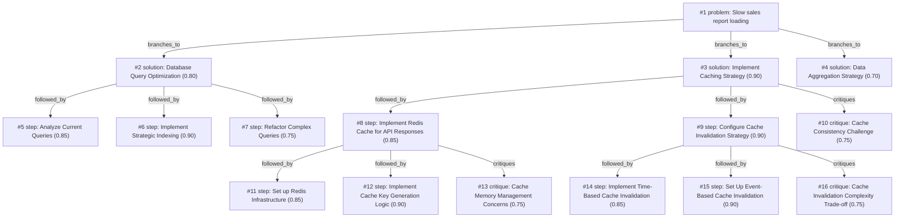

# report-page · zai/glm-4.5-flash · siblings

**Task:** Our internal sales report page takes about 12 seconds to load. It runs on PostgreSQL behind a Go API, the data grows by 50,000 rows a day, and the team is two developers. How should we make it load in under 1 second?

| Thoughts | Calls | Tokens in / out | Time | Finish | First try valid | Next picked | Max depth | Weight spread | Duplicates |
|---|---|---|---|---|---|---|---|---|---|
| 16 | 8 | 9225 / 5882 | 6m13s | budget | 6/6 | 5/5 | 3 | 0.07 | 0 |

## Answer from the graph

# Optimizing Sales Report Performance

To reduce the sales report loading time from 12 seconds to under 1 second, I recommend implementing a multi-pronged approach focusing on caching, database optimization, and data aggregation.

## Recommended Approach

### 1. Implement Caching Strategy
The most impactful solution is to add a Redis caching layer to store frequently accessed report data. This will dramatically reduce response times for repeated requests.

### 2. Database Query Optimization
Optimize the underlying database queries to reduce processing time:
- Analyze current queries to identify bottlenecks
- Implement strategic indexing for frequently queried columns
- Refactor complex queries to improve efficiency

### 3. Data Aggregation Strategy
For reports that don't require real-time data, implement pre-aggregation strategies to reduce query complexity.

## Implementation Steps

1. **Set up Redis infrastructure** to serve as your caching layer
2. **Implement cache key generation logic** based on query parameters, date ranges, and report types
3. **Configure Redis to cache API responses** with appropriate TTL values
4. **Implement time-based cache invalidation** to ensure data freshness
5. **Set up event-based cache invalidation** using PostgreSQL triggers to automatically update cache when data changes
6. **Analyze current database queries** to identify performance bottlenecks
7. **Implement strategic indexing** for frequently accessed columns
8. **Refactor complex queries** to optimize execution plans
9. **Establish cache memory management policies** to prevent memory saturation
10. **Consider data aggregation** for static reports that don't need real-time updates

## Risks to Watch

- **Cache consistency challenges**: With 50,000 new rows daily, ensure cached data remains synchronized with database changes
- **Memory management**: Without proper eviction policies, the cache could become saturated and degrade performance
- **Implementation complexity**: With only two developers, balance sophisticated solutions with maintainability
- **Data freshness**: Strike the right balance between performance gains and ensuring data is current enough for business needs

*Used: #3, #8, #9, #12, #14, #15, #16, #2, #5, #6, #7, #10, #13*

## Baseline: one call, no graph

# Optimizing Your Sales Report Performance

Reducing your report load time from 12 seconds to under 1 second will require a multi-pronged approach focusing on database, API, and frontend optimizations. Here's a strategic plan:

## Database Optimization

1. **Indexing Strategy**
   - Add indexes on columns used in WHERE, JOIN, and ORDER BY clauses
   - Use `EXPLAIN ANALYZE` to identify slow queries
   - Consider partial indexes for date-based queries

2. **Query Optimization**
   - Implement server-side pagination (LIMIT/OFFSET or keyset pagination)
   - Avoid SELECT * - retrieve only necessary columns
   - Use materialized views for frequently accessed report data

3. **Data Management**
   - Implement partitioning by date (50,000 rows/day grows quickly)
   - Archive older data to a separate table/database
   - Consider table inheritance for time-based data separation

## API Optimization (Go)

1. **Caching Layer**
   - Implement Redis or Memcached for report results
   - Use cache-aside pattern with appropriate TTLs
   - Cache pre-aggregated data at different levels

2. **Concurrent Processing**
   - Use goroutines to parallelize data fetching and processing
   - Implement worker pools for intensive operations

3. **Response Optimization**
   - Implement streaming responses for large datasets
   - Add response compression (gzip)
   - Consider GraphQL for more efficient data fetching

## Frontend Optimization

1. **Progressive Loading**
   - Implement lazy loading for report components
   - Show skeleton screens while data loads
   - Load visible data first, then additional content

2. **Data Visualization**
   - Use efficient charting libraries (e.g., Plotly, D3 with optimization)
   - Implement virtual scrolling for large tables
   - Consider drill-down interfaces instead of showing all data at once

## System Architecture

1. **Asynchronous Processing**
   - Generate reports in the background
   - Implement a "refresh now" button for urgent needs
   - Schedule heavy report generation during off-peak hours

2. **Pre-computation**
   - Pre-calculate common aggregations
   - Implement summary tables for different time periods
   - Consider a dedicated reporting database with denormalized data

## Implementation Strategy for Your Team

1. **Start with quick wins**:
   - Add proper indexes
   - Implement basic caching
   - Add pagination

2. **Medium-term improvements**:
   - Implement materialized views
   - Add query optimization
   - Implement frontend optimizations

3. **Long-term architecture**:
   - Consider read replicas for reporting
   - Implement asynchronous processing
   - Design a dedicated reporting service

With a team of two developers, focus on the highest-impact changes first. Start with database indexing and caching, as these typically provide the most significant performance improvements with the least development effort.

## Index

```text
#1 [problem] Slow sales report loading · expanded
  #2 [solution] Database Query Optimization · w 0.80 · expanded
    #5 [step] Analyze Current Queries · w 0.85 · open
    #6 [step] Implement Strategic Indexing · w 0.90 · open
    #7 [step] Refactor Complex Queries · w 0.75 · open
  #3 [solution] Implement Caching Strategy · w 0.90 · expanded
    #8 [step] Implement Redis Cache for API Responses · w 0.85 · expanded
      #11 [step] Set up Redis Infrastructure · w 0.85 · open
      #12 [step] Implement Cache Key Generation Logic · w 0.90 · open
      #13 [critique] Cache Memory Management Concerns · w 0.75 · open
    #9 [step] Configure Cache Invalidation Strategy · w 0.90 · expanded
      #14 [step] Implement Time-Based Cache Invalidation · w 0.85 · open
      #15 [step] Set Up Event-Based Cache Invalidation · w 0.90 · open
      #16 [critique] Cache Invalidation Complexity Trade-off · w 0.75 · open
    #10 [critique] Cache Consistency Challenge · w 0.75 · open
  #4 [solution] Data Aggregation Strategy · w 0.70 · open
```

## Graph



## Thoughts

### #1 [problem] Slow sales report loading
w 1.00 · expanded · depth 0 · from –

The internal sales report page currently takes 12 seconds to load, which is unacceptable for user experience. The system uses PostgreSQL as database with a Go API frontend, and the data grows by 50,000 rows daily. With only two developers available, we need to identify performance bottlenecks and implement optimizations to achieve sub-second loading times. The specific causes of slowness, current query patterns, data structure, and caching strategy are unknown. A successful solution must maintain data accuracy while dramatically improving response time.

> This captures the core problem, given constraints, and what needs to be achieved

### #2 [solution] Database Query Optimization
w 0.80 · expanded · depth 1 · from #1

Analyze and optimize the PostgreSQL queries powering the sales report. This includes adding appropriate indexes, rewriting inefficient queries, and potentially implementing database partitioning to handle the growing dataset. With 50,000 new rows daily, query performance will degrade over time without proper indexing.

> Database queries are often the primary bottleneck for report loading times, and optimization can provide significant performance gains with moderate development effort.

### #3 [solution] Implement Caching Strategy
w 0.90 · expanded · depth 1 · from #1

Add caching layers at both the database and API levels. This could include implementing Redis or similar for caching frequently accessed report data, using HTTP caching headers, and potentially materialized views for static report data that doesn't need real-time updates.

> Caching can provide immediate and substantial performance improvements with relatively low implementation cost, especially for reports that may not need real-time data.

### #4 [solution] Data Aggregation Strategy
w 0.70 · open · depth 1 · from #1

Implement tiered data access where the report shows aggregated/summary data by default, with options to drill down into details. This reduces the amount of data transferred and processed while maintaining the ability to access detailed information when needed.

> For large datasets, reducing the amount of data processed is often more effective than optimizing individual queries, and this approach provides both performance and better user experience.

### #5 [step] Analyze Current Queries
w 0.85 · open · depth 2 · from #2

Use EXPLAIN ANALYZE and PostgreSQL's query planner to identify slow queries and performance bottlenecks in the sales report implementation.

> Identifying the specific slow queries is crucial before optimization can begin.

### #6 [step] Implement Strategic Indexing
w 0.90 · open · depth 2 · from #2

Add indexes on frequently filtered and joined columns in the sales data tables to improve query performance.

> Proper indexing can dramatically improve query speed for large datasets.

### #7 [step] Refactor Complex Queries
w 0.75 · open · depth 2 · from #2

Rewrite inefficient queries, simplify complex joins, and optimize WHERE clauses to reduce processing time.

> Well-structured queries perform better even with proper indexing.

### #8 [step] Implement Redis Cache for API Responses
w 0.85 · expanded · depth 2 · from #3

Set up Redis to cache frequently accessed sales report data at the API level. Cache common query results, report summaries, and dashboard data with appropriate TTL values to balance performance and freshness.

> Directly addresses the 12-second loading time by storing precomputed results

### #9 [step] Configure Cache Invalidation Strategy
w 0.90 · expanded · depth 2 · from #3

Implement automatic cache invalidation when underlying data changes, using PostgreSQL triggers or application-level logic to ensure cached data stays synchronized with database updates.

> Critical for maintaining data accuracy while leveraging performance benefits

### #10 [critique] Cache Consistency Challenge
w 0.75 · open · depth 2 · from #3

Caching introduces potential stale data issues, especially with 50k daily row growth. Need to balance between performance gains and data freshness requirements.

> Important consideration that could undermine the solution if not properly addressed

### #11 [step] Set up Redis Infrastructure
w 0.85 · open · depth 3 · from #8

Install Redis server, configure appropriate memory limits and persistence settings, and establish connection from Go application using a client library like go-redis.

> Essential foundation for caching functionality that directly addresses the performance bottleneck.

### #12 [step] Implement Cache Key Generation Logic
w 0.90 · open · depth 3 · from #8

Create a systematic approach to generating unique cache keys based on query parameters, date ranges, and report types to ensure proper caching of different report variations.

> Critical for effective caching without mixing different query results.

### #13 [critique] Cache Memory Management Concerns
w 0.75 · open · depth 3 · from #8

With 50,000 new rows daily, cache memory could become saturated without proper eviction policies and size limits, potentially degrading performance.

> Important scalability consideration that could undermine the caching solution if not addressed.

### #14 [step] Implement Time-Based Cache Invalidation
w 0.85 · open · depth 3 · from #9

Set appropriate TTL values for different report data types based on update frequency. For frequently changing data (like daily sales), use shorter TTLs (5-15 minutes). For less volatile data, use longer TTLs (1-4 hours). This balances data freshness with performance.

> Provides a straightforward approach to cache invalidation that works well with the team's limited resources.

### #15 [step] Set Up Event-Based Cache Invalidation
w 0.90 · open · depth 3 · from #9

Create PostgreSQL triggers that detect data changes in key tables and automatically invalidate related cache entries. This ensures cache consistency when data is modified through the API or other processes.

> More efficient than time-based invalidation as it only invalidates cache when data actually changes.

### #16 [critique] Cache Invalidation Complexity Trade-off
w 0.75 · open · depth 3 · from #9

Overly complex invalidation strategies may consume too many developer resources given the team size of two. The solution should balance sophistication with maintainability.

> With only two developers, overly complex caching solutions may become unsustainable.

