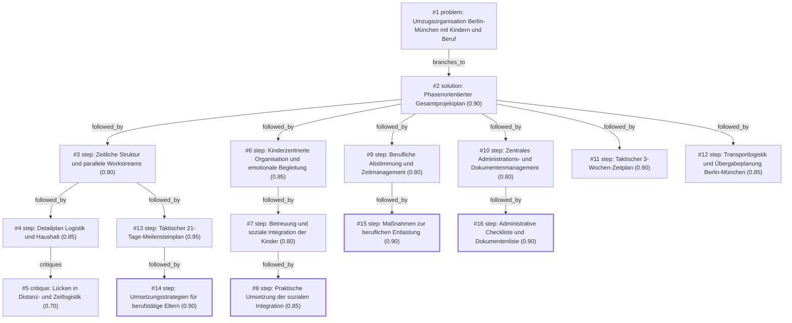

# umzug · ollama-cloud/gemma4:31b · one

**Task:** Wir ziehen in drei Wochen mit zwei Kindern (4 und 9 Jahre) von Berlin nach München. Beide Eltern arbeiten weiter. Wie organisieren wir den Umzug, damit nichts Wichtiges vergessen wird?

| Thoughts | Calls | Tokens in / out | Time | Finish | First try valid | Next picked | Max depth | Weight spread | Duplicates |
|---|---|---|---|---|---|---|---|---|---|
| 16 | 19 | 33623 / 6036 | 1m21s | budget | 13/17 | 8/16 | 4 | 0.05 | 0 |

Failures: no_tool_call 5

## Answer from the graph

Ein Umzug über 600 km mit zwei Kindern und voller Berufstätigkeit ist ein komplexes Projekt. Um den Stress zu minimieren und sicherzustellen, dass nichts vergessen wird, empfiehlt sich ein phasenorientierter Ansatz, der die Logistik, die Bedürfnisse der Kinder und die beruflichen Verpflichtungen parallel steuert.

### Der Strategische Ansatz
Teilen Sie die kommenden drei Wochen in drei klare Phasen ein. Da Sie beide arbeiten, setzen Sie auf das Prinzip der **„Power-Packing-Slots“**: Statt ganzer Tage nutzen Sie abends feste Zeitfenster von 30–60 Minuten für spezifische Kategorien (z. B. heute nur ein Regal im Flur), während die Wochenenden für die grobe Logistik reserviert bleiben.

---

### Der 3-Wochen-Zeitplan

#### Woche 1: Inventur & Fundament
*   **Logistik:** Sofortige Buchung des Transportunternehmens oder Mietwagens. Beschaffung von ausreichend Packmaterial.
*   **Ausmisten:** Radikales Aussortieren (Verkaufen/Spenden), um das Transportvolumen zu reduzieren.
*   **Kinder:** Finalisierung der Kita- und Schulanmeldungen in München.
*   **Beruf:** Abstimmung mit den Arbeitgebern über Urlaubstage oder Home-Office-Optionen für die Umzugswoche.

#### Woche 2: Packphase & Emotionen
*   **Systematisches Packen:** Beginnen Sie mit Dingen, die Sie nicht täglich brauchen (Keller $\rightarrow$ Gästezimmer $\rightarrow$ Wohnzimmer).
*   **Administration:** Kündigung von Verträgen in Berlin und Anmeldung von Diensten (Strom, Internet) in München.
*   **Kinder-Integration:** Begleiten Sie die Kinder emotional. Schaffen Sie Abschiedsrituale in Berlin und Vorfreude auf München. Lassen Sie die Kinder eine eigene „Überlebenskiste“ mit ihren absoluten Lieblingsstücken packen, die während der Reise griffbereit bleibt.

#### Woche 3: Finalisierung & Transfer
*   **Letzte Schritte:** Leeren des Kühlschranks, Packen der „First-Night-Box“ (Zahnbürsten, Bettwäsche, Kaffeemaschine, wichtige Medikamente).
*   **Übergabe:** Durchführung der Wohnungsübergabe in Berlin.
*   **Transport:** Reise nach München und erste Einrichtung der Prioritätsbereiche (Kinderzimmer zuerst!).

---

### Besondere Strategien für berufstätige Eltern
*   **Digitale Synchronisation:** Nutzen Sie eine gemeinsame Liste (z. B. Trello oder eine geteilte Notiz), damit beide Elternteile in Echtzeit sehen, was erledigt ist und Doppelarbeit vermieden wird.
*   **Delegation:** Erstellen Sie eine konkrete Liste für externe Helfer oder Verwandte (z. B. „Besorgung von Kartons“), um Ihren Kopf für die Arbeit und die Kinder frei zu halten.

### Risiken und Fallstricke (Watch-out)
*   **Die „Zeit-Falle“:** Unterschätzen Sie nicht die Zeit für die reine Fahrt und die Entladung in einer neuen Stadt. Planen Sie Pufferzeiten ein.
*   **Emotionale Überlastung:** Kinder (besonders die 4-Jährige) reagieren oft verzögert auf den Stress. Planen Sie bewusste „umzugsfreie“ Zeit für Spiel und Ruhe ein.
*   **Dokumentenverlust:** Erstellen Sie einen zentralen Ordner für alle wichtigen Papiere (Mietverträge, Zeugnisse, Impfpässe), der niemals im LKW landet, sondern im Handgepäck bleibt.

*Used: #1, #2, #3, #6, #7, #9, #10, #11, #13, #14, #15, #16*

## Baseline: one call, no graph

Ein Umzug über 600 Kilometer mit zwei Kindern und zwei berufstätigen Eltern ist ein großes Projekt, besonders in einem engen Zeitfenster von drei Wochen. Der Schlüssel zum Erfolg ist hier eine **strikte Priorisierung** und die **Delegation** von Aufgaben.

Hier ist Ihr Schritt-für-Schritt-Plan, um den Chaos-Faktor zu minimieren:

### 1. Sofort-Maßnahmen (Woche 1: Die Struktur)
In der ersten Woche geht es um die Logistik und die grobe Planung.

*   **Umzugsunternehmen vs. Eigenregie:** Bei dieser Distanz und zwei Kindern ist ein Full-Service-Unternehmen (inkl. Verpackung) die stressfreieste, aber teuerste Option. Wenn Sie es selbst machen: Mietwagen und Helfer sofort buchen.
*   **Die "Umzugs-Zentrale":** Legen Sie einen Ordner (digital oder physisch) an. Hier kommen alle Verträge, Bestätigungen und die Checkliste hinein.
*   **Ausmisten (Radikal):** Transportieren Sie nichts nach München, was Sie nicht lieben oder brauchen. Alles, was weg kann $\rightarrow$ eBay Kleinanzeigen, Altkleidercontainer oder Sperrmüll. Das reduziert das Packvolumen und den Stress.
*   **Kinder einbinden:** Erklären Sie den Kindern das Abenteuer. Lassen Sie das 9-jährige Kind eine eigene "Schatzkiste" packen, die während der Fahrt im Auto bleibt.

### 2. Die Pack-Strategie (Woche 2: Die Umsetzung)
Da Sie beide arbeiten, nutzen Sie die Abende und das Wochenende strategisch.

*   **Zonen-System:** Packen Sie Raum für Raum. Beschriften Sie die Kartons nicht nur mit "Wohnzimmer", sondern spezifisch: *"Wohnzimmer $\rightarrow$ Bücherregal oben links"* und einer kurzen Liste des Inhalts.
*   **Das "Überlebens-Kit" (Essential Box):** Packen Sie für jeden Familienmitglied einen Koffer/Karton, der so gepackt ist, als würden Sie eine Woche verreisen.
    *   Kleidung für 7 Tage, Zahnbürsten, wichtige Medikamente.
    *   Ladekabel, wichtige Dokumente.
    *   **Für die Kinder:** Lieblingskuscheltier, Malzeug, Tablet/Buch für die Fahrt.
*   **Küche strategisch entleeren:** Beginnen Sie, Vorräte aufzubrauchen. Packen Sie alles ein, was Sie nicht täglich brauchen (Backformen, Ersatzgeschirr).

### 3. Die finale Phase (Woche 3: Die Details)
Jetzt geht es um die bürokratischen und organisatorischen Feinheiten.

*   **Adressänderungen & Verträge:**
    *   Nachsendeservice der Post einrichten.
    *   Internet/Strom/Gas in Berlin kündigen/ummelden, in München anmelden.
    *   Kindergarten/Schule: Bestätigungen für die neuen Einrichtungen in München finalisieren.
*   **Die "Letzte-Meile-Liste":** Erstellen Sie eine Liste mit Dingen, die erst ganz zum Schluss in das Auto kommen (Kaffeemaschine, Toilettenpapier, Bettwäsche für die erste Nacht).
*   **Kinderbetreuung:** Wenn möglich, lassen Sie die Kinder in den letzten 2-3 Tagen vor dem eigentlichen Umzugstag bei den Großeltern oder Freunden. Das reduziert das Stresslevel für alle Beteiligten enorm.

### 4. Der Umzugstag & Die Ankunft
*   **Die Fahrt:** Planen Sie für die Strecke Berlin $\rightarrow$ München mit Kindern mindestens zwei große Pausen ein.
*   **Priorität in München:** Packen Sie als Erstes die Betten der Kinder auf. Wenn die Kinder einen sicheren Rückzugsort haben, können Sie und Ihr Partner in Ruhe die restlichen Kartons organisieren.
*   **Willkommens-Ritual:** Bestellen Sie am ersten Abend Pizza oder gehen Sie in ein lokales Restaurant. Das markiert den positiven Start im neuen Zuhause.

### Zusammenfassung der wichtigsten Prioritäten:

| Bereich | Fokus | Tool/Tipp |
| :--- | :--- | :--- |
| **Logistik** | Transport sichern | Jetzt buchen! |
| **Kinder** | Emotionale Sicherheit | "Überlebenskoffer" & Lieblingsspielzeug |
| **Arbeit** | Zeitmanagement | Home-Office Tage für Pack-Sessions nutzen |
| **Ordnung** | Effizienz | Detaillierte Karton-Beschriftung |

**Pro-Tipp für Berufstätige:** Wenn das Budget es zulässt, engagieren Sie für zwei Tage eine professionelle Reinigungsfirma für die alte Wohnung in Berlin. Das ist oft die stressigste Aufgabe am Ende und spart Ihnen wertvolle Zeit für die Familie.

## Index

```text
#1 [problem] Umzugsorganisation Berlin-München mit Kindern und Beruf · expanded
  #2 [solution] Phasenorientierter Gesamtprojektplan · w 0.90 · expanded
    #3 [step] Zeitliche Struktur und parallele Workstreams · w 0.90 · expanded
      #4 [step] Detailplan Logistik und Haushalt · w 0.85 · expanded
        #5 [critique] Lücken in Distanz- und Zeitlogistik · w 0.70 · open, max depth
      #13 [step] Taktischer 21-Tage-Meilensteinplan · w 0.95 · expanded
        #14 [step] Umsetzungsstrategien für berufstätige Eltern · w 0.90 · done
    #6 [step] Kinderzentrierte Organisation und emotionale Begleitung · w 0.85 · expanded
      #7 [step] Betreuung und soziale Integration der Kinder · w 0.80 · expanded
        #8 [step] Praktische Umsetzung der sozialen Integration · w 0.85 · done
    #9 [step] Berufliche Abstimmung und Zeitmanagement · w 0.80 · expanded
      #15 [step] Maßnahmen zur beruflichen Entlastung · w 0.90 · done
    #10 [step] Zentrales Administrations- und Dokumentenmanagement · w 0.80 · expanded
      #16 [step] Administrative Checkliste und Dokumentenliste · w 0.90 · done
    #11 [step] Taktischer 3-Wochen-Zeitplan · w 0.90 · open
    #12 [step] Transportlogistik und Übergabeplanung Berlin-München · w 0.85 · open
```

## Graph



## Thoughts

### #1 [problem] Umzugsorganisation Berlin-München mit Kindern und Beruf
w 1.00 · expanded · depth 0 · from –

Ziel: Ein strukturierter Plan für den Umzug von Berlin nach München innerhalb von drei Wochen.
Fakten: 
- Zeitrahmen: 3 Wochen.
- Personen: 2 Erwachsene, 2 Kinder (4 und 9 Jahre).
- berufliche Situation: Beide Eltern arbeiten weiter (Zeitmanagement kritisch).
- Distanz: ca. 600 km.
Unbekannt: 
- Umzugsvolumen (Möbelmenge).
- Budget.
- Unterstützung (Umzugsfirma vs. Selbstorganisation).
- Status der neuen Wohnung/Schulanmeldung/Kita in München.
Erfolgskriterien:
- Alle wichtigen Dokumente und Gegenstände werden transportiert.
- Kinder werden emotional und organisatorisch mitgenommen.
- Berufsleben wird mit minimalen Ausfällen aufrechterhalten.
- Ein Zeitplan liegt vor, der Stress reduziert.

> Defines the scope, constraints, and goals of the relocation process.

### #2 [solution] Phasenorientierter Gesamtprojektplan
w 0.90 · expanded · depth 1 · from #1

Ein ganzheitlicher Projektplan, der den Umzug in drei Phasen unterteilt (Vorbereitung, Durchführung, Nachbereitung) und spezifische Workstreams für Logistik, Kinder und Beruf definiert. Dieser Ansatz strukturiert die Komplexität durch Zeitachsen und Checklisten.

> Ein phasenorientierter Projektplan ist am besten geeignet, um Zeitdruck bei beruflicher Belastung zu managen.

### #3 [step] Zeitliche Struktur und parallele Workstreams
w 0.90 · expanded · depth 2 · from #2

Aufteilung des Plans in drei Zeitfenster: 
Woche 1: Inventur, Ausmisten, Buchung von Logistik und Anmeldung von Diensten.
Woche 2: Packphase, Vorbereitung der Kinder (Abschied/Vorfreude), Abstimmung mit Arbeitgebern.
Woche 3: Letzte Kisten, Transport-Logistik, Übergabe Berlin, Einzug München.
Zusätzlich drei parallele Workstreams: 'Logistik & Haushalt', 'Kinder & Schule/Kita', 'Beruf & Verwaltung'.

> Definiert die zeitliche und inhaltliche Struktur des Projektplans konkret.

### #4 [step] Detailplan Logistik und Haushalt
w 0.85 · expanded · depth 3 · from #3

Detaillierung des Workstreams 'Logistik & Haushalt' für Woche 1-3:
Woche 1: Entscheidung Umzugsfirma vs. Mietwagen; Aussortieren nach System 'Behalten, Spenden, Wegwerfen'; Bestellung von Umzugsmaterial.
Woche 2: Systematisches Packen nach Räumen; Kennzeichnung der Kisten (Inhalt + Zielraum in München); Packen einer 'Überlebenskiste' für die ersten 48h (inkl. Kinderbedarfe).
Woche 3: Demontage von Möbeln; Verladung; Endreinigung Berlin; Schlüsselübergabe.

> Dies konkretisiert den wichtigsten operativen Teil des Plans und gibt sofort umsetzbare Schritte vor.

### #5 [critique] Lücken in Distanz- und Zeitlogistik
w 0.70 · open · depth 4 · from #4

Die Logistik-Planung vernachlässigt die spezifischen Herausforderungen der Distanz (600 km) und der Zeitnot durch Berufstätigkeit. Es fehlen: 
1. Strategien zur Minimierung der Packzeit (z.B. professionelles Packservice-Angebot prüfen).
2. Die Logistik der Kinder während des eigentlichen Transporttages (Wer betreut sie? Reisen sie mit im LKW oder separat?).
3. Ein Plan für die Zwischenlagerung oder den Zeitversatz zwischen Auszug Berlin und Einzug München.

> The current logistic plan is too generic and doesn't account for the distance or the children's needs during the move.

### #6 [step] Kinderzentrierte Organisation und emotionale Begleitung
w 0.85 · expanded · depth 2 · from #2

Fokus auf die spezifischen Bedürfnisse der Kinder:
- 9-Jährige: Einbeziehung in die Planung (Packliste für das eigene Zimmer), Schulwechsel-Organisation, Abschied von Freunden.
- 4-Jährige: Emotionale Begleitung, 'Überlebenskoffer' mit Lieblingsspielzeug, Vorfreude auf München wecken.
- Gemeinsam: Routine beibehalten, soweit möglich; klare Kommunikation über das 'Warum' und 'Wie'.

> Die emotionalen und organisatorischen Bedürfnisse der Kinder sind ein kritischer Erfolgsfaktor, der in der Logistik-Sicht oft untergeht.

### #7 [step] Betreuung und soziale Integration der Kinder
w 0.80 · expanded · depth 3 · from #6

Konkrete Maßnahmen zur Implementierung der Kinderbetreuung und -integration:
- Betreuung während des Pack- und Transporttages: Organisation von Großeltern, Freunden oder einem professionellen Sitter in Berlin oder München, um Stress zu minimieren.
- Vor-Ort-Erkundung: Kurzer Besuch oder digitale Tour durch die neue Nachbarschaft und Spielplätze in München, um die Angst vor dem Unbekannten zu nehmen.
- Übergangshilfe: Checkliste für die Anmeldung in der neuen Schule/Kita und Organisation von Erstkontakten zu anderen Kindern in der Gegend.

> Operationalizes the emotional goals into concrete actions.

### #8 [step] Praktische Umsetzung der sozialen Integration
w 0.85 · done · depth 4 · from #7

Praktische Umsetzung der Integration:
- Schul- und Kita-Checkliste: Bestätigung der Plätze, Einreichung von Gesundheitszeugnissen, Kennenlernen der neuen Lehrer/Erzieher vorab per Mail oder Telefon.
- Soziales Onboarding: Recherche nach lokalen Vereinen, Musikschulen oder Sportgruppen in München, die den Interessen der Kinder entsprechen (z.B. Fußball, Tanzen), um schnell neue Kontakte zu knüpfen.
- Ritual für den Abschied: Organisieren eines kleinen Abschiedsfests in Berlin, um einen bewussten Abschluss zu schaffen, bevor der Neuanfang in München beginnt.

> Provides concrete, actionable tasks to ensure a smooth transition for the children's social and educational life.

### #9 [step] Berufliche Abstimmung und Zeitmanagement
w 0.80 · expanded · depth 2 · from #2

Ein dedizierter Workstream zur Abstimmung mit den Arbeitgebern: Beantragung von Homeoffice-Phasen für die Umzugswoche, Klärung von Sonderurlaub oder Überstundenabbau, und die Organisation der Übergabe in Berlin bzw. des Starts in München. Ziel ist es, die berufliche Belastung in den kritischen letzten 7 Tagen zu senken.

> Die berufliche Komponente wurde in den bisherigen Schritten vernachlässigt, obwohl sie laut Problemstellung kritisch ist.

### #10 [step] Zentrales Administrations- und Dokumentenmanagement
w 0.80 · expanded · depth 2 · from #2

Eine zentrale Dokumenten- und Administrationsliste (Master-Liste), die alle Termine, Verträge und Anmeldungen (Ummeldung, Strom, Internet, Versicherung) bündelt. Da beide Eltern arbeiten, ist eine geteilte digitale Liste (z.B. Trello, Notion oder Google Sheet) essenziell, um Redundanzen zu vermeiden und den Status in Echtzeit zu sehen.

> Administrative Koordination ist oft der größte Stressfaktor bei Fernumzügen und Berufstätigkeit.

### #11 [step] Taktischer 3-Wochen-Zeitplan
w 0.90 · open · depth 2 · from #2

Ein detaillierter Zeitplan für die letzten 21 Tage, aufgeteilt in Woche 1 (Ausmisten & Buchen), Woche 2 (Packen & Kündigen), Woche 3 (Finalisierung & Transport). Dies dient als taktisches Instrument, um die strategischen Workstreams (#3, #6, #9, #10) zu synchronisieren.

> Konkretisiert die zeitliche Struktur der Lösung #2 in einen direkt anwendbaren Kalender.

### #12 [step] Transportlogistik und Übergabeplanung Berlin-München
w 0.85 · open · depth 2 · from #2

Um die Lücken in der Logistik (Distanz 600km) und das Zeitmanagement zu schließen, muss ein konkreter Plan für den Transporttag und die Übergabe der Wohnungen erstellt werden. Dies beinhaltet: 1. Entscheidung Umzugsunternehmen vs. Mietwagen, 2. Planung von Übernachtungen für die Kinder während der Fahrt, 3. Zeitfenster für Schlüsselübergaben in Berlin und München, 4. Definition eines 'Überlebenskoffers' für die ersten 48 Stunden.

> The logistical gap between Berlin and Munich is the biggest risk factor for a 3-week timeline.

### #13 [step] Taktischer 21-Tage-Meilensteinplan
w 0.95 · expanded · depth 3 · from #3

Ein detaillierter Zeitplan für die letzten 21 Tage, der tägliche Meilensteine setzt. 
Tag 1-7: Ausmisten, Packmaterial beschaffen, Mietwagen/Firma fixieren, Kita/Schule in München finalisieren.
Tag 8-14: Packen nach Priorität (Keller -> Wohnzimmer -> Küche), Kündigung von Verträgen, Kinder-Abschiedsrituale.
Tag 15-21: letzte Kisten, Kühlschrank leeren, Wohnungsübergabe Berlin, Reise nach München, erste Einrichtung.
Besonderer Fokus auf 'Quick-Wins' pro Tag, um trotz Berufstätigkeit Fortschritte zu sehen.

> Provides the necessary tactical granularity to turn the general structure of #3 into actionable days.

### #14 [step] Umsetzungsstrategien für berufstätige Eltern
w 0.90 · done · depth 4 · from #13

Konkrete Umsetzung der 'Quick-Wins' für berufstätige Eltern: 
- Abends: 30-60 Minuten 'Power-Packing' (eine Kategorie/ein Regal).
- Wochenenden: Fokus auf große Möbel-Logistik und Ausmisten.
- Kinder-Integration: 'Schatzsuche' beim Packen (Kinder dürfen 5 Lieblingsstücke in eine eigene 'Überlebenskiste' packen).
- Delegieren: Liste von Aufgaben für externe Helfer oder Partner (z.B. Besorgungen).
- Digitale Checkliste (Trello/Shared Note), um Doppelarbeit zu vermeiden.

> Provides the actual execution mechanism for the milestones, making the plan realistic for working parents.

### #15 [step] Maßnahmen zur beruflichen Entlastung
w 0.90 · done · depth 3 · from #9

Konkrete Maßnahmen zur Zeitgewinnung:
1. Abstimmung von 'Work-from-anywhere' oder Homeoffice für die Woche des Umzugs, um Reisezeiten zu minimieren.
2. Vereinbarung von Kernarbeitszeiten mit dem Team, um feste Zeitfenster für Packarbeiten (morgens/abends) zu schaffen.
3. Identifikation von delegierbaren Aufgaben im Job, um die mentale Last in den letzten 7 Tagen zu reduzieren.
4. Klärung von Sonderurlaub für den eigentlichen Umzugstag und den ersten Tag in München.

> Provides actionable tactics for working parents to balance the move with their professional duties.

### #16 [step] Administrative Checkliste und Dokumentenliste
w 0.90 · done · depth 3 · from #10

Konkrete Liste der notwendigen administrativen Aufgaben: 
1. Kündigung/Umzug von Versorgern (Strom, Gas, Wasser, Internet) in Berlin.
2. Anmeldung der Versorger in München.
3. Ummeldung des Wohnsitzes (Bürgeramt Berlin/München).
4. Umschreibung von Versicherungen und Bankkonten.
5. Anmeldung der Kinder: Schule (9 J.) und Kita (4 J.) in München finalisieren.
6. Nachsendeservice der Post einrichten.
7. Dokumentenordner 'Umzug' (physisch/digital) für Mietverträge, Übergabeprotokolle und Zeugnisse.

> Provides the actual content for the administrative management mentioned in #10.

