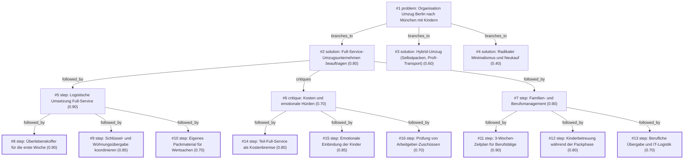

# umzug · ollama-cloud/gemma4:31b · siblings

**Task:** Wir ziehen in drei Wochen mit zwei Kindern (4 und 9 Jahre) von Berlin nach München. Beide Eltern arbeiten weiter. Wie organisieren wir den Umzug, damit nichts Wichtiges vergessen wird?

| Thoughts | Calls | Tokens in / out | Time | Finish | First try valid | Next picked | Max depth | Weight spread | Duplicates |
|---|---|---|---|---|---|---|---|---|---|
| 16 | 8 | 9558 / 3901 | 28s | budget | 6/6 | 5/5 | 3 | 0.10 | 0 |

## Answer from the graph

Ein Umzug über 600 km mit zwei Kindern und zwei berufstätigen Eltern innerhalb von drei Wochen ist ein ambitioniertes Projekt. Um den Stress zu minimieren und sicherzustellen, dass nichts Wichtiges vergessen wird, ist die effizienteste Strategie die Beauftragung eines **Full-Service-Umzugsunternehmens**. 

Da Ihre Zeit durch Beruf und Kinder stark limitiert ist, delegieren Sie die körperliche Arbeit (Verpacken, Transport, Auspacken) an Profis und konzentrieren sich auf die administrative und emotionale Steuerung.

### Der Schritt-für-Schritt-Plan

#### Woche 1: Administration & Logistik
*   **Umzugsfirma sichern:** Sofort virtuelle oder vor-Ort-Besichtigungen vereinbaren. Achten Sie beim Vertrag explizit auf eine umfassende Transportversicherung für die Langstrecke (Berlin $\rightarrow$ München).
*   **Berufliche Absprache:** Beantragen Sie Sonderurlaub oder Homeoffice für die kritischen Übergabetage. Klären Sie die IT-Logistik (Equipment-Transport oder Austausch).
*   **Finanzielle Prüfung:** Prüfen Sie, ob Ihre Arbeitgeber Umzugskostenbeihilfen oder Zuschüsse gewähren, um die Kosten des Full-Service-Umzugs zu senken.

#### Woche 2: Kinder & Vorbereitung
*   **Bildung & Betreuung:** Finalisieren Sie die Anmeldungen für Kita und Schule in München und koordinieren Sie die Abschiede in Berlin.
*   **Emotionale Einbindung:** Lassen Sie die Kinder (4 und 9 Jahre) eigene „Schatzkisten“ packen. Diese Kisten transportieren sie selbst im Auto, damit sie die Kontrolle über ihre wichtigsten Spielsachen behalten und sich nicht vom Chaos der Profi-Packer überfordert fühlen.
*   **Aussortieren:** Nutzen Sie kurze „Umzugs-Sprints“ nach Feierabend, um Dinge zu entsorgen, die nicht mit nach München sollen.

#### Woche 3: Transport & Ankunft
*   **Der Überlebenskoffer:** Packen Sie für alle Familienmitglieder einen Koffer für die ersten 72 Stunden. Inhalt: Wechselkleidung, wichtige Dokumente, Medikamente, Ladegeräte und Basics für die Kinder. So müssen Sie in den ersten Tagen nicht hektisch in Kisten suchen.
*   **Übergaben koordinieren:** Planen Sie die Schlüsselübergabe in Berlin und die Übernahme in München präzise.
*   **Wertsachen-Management:** Packen Sie Dokumente, Schmuck und sehr persönliche Gegenstände selbst in eigene Behälter, die Sie persönlich transportieren.

### Risiken und Fallstricke
*   **Kostenfaktor:** Ein Full-Service-Umzug über diese Distanz ist teuer. Setzen Sie ggf. auf einen „Teil-Full-Service“ (z.B. nur Transport und Grobmöbel-Verpackung), falls das Budget knapp wird.
*   **Überforderung der Kinder:** Der Anblick fremder Menschen, die die gesamte Wohnung einpacken, kann beängstigend sein. Kommunizieren Sie klar, was passiert, und schaffen Sie durch die „Schatzkisten“ Sicherheit.
*   **Zeitdruck:** Drei Wochen sind knapp. Wenn die neue Wohnung noch nicht bezugsfertig ist, muss zwingend eine Zwischenlagerung mit der Umzugsfirma vereinbart werden.

*Used: #1, #2, #5, #6, #7, #8, #11, #14, #15, #16*

## Baseline: one call, no graph

Ein Umzug über 500 Kilometer mit Kindern und laufendem Job ist ein logistisches Großprojekt. Da Sie nur noch drei Wochen Zeit haben, müssen Sie jetzt von der „Planungsphase“ in den „Umsetzungsmodus“ wechseln.

Hier ist Ihr strategischer Fahrplan, unterteilt in die wichtigsten Bereiche:

### 1. Die „Überlebens-Strategie“ für die Kinder (4 & 9 Jahre)
Kinder erleben einen Umzug oft als Kontrollverlust. Integrieren Sie sie, um Stress zu reduzieren.

*   **Das „Schatz-Paket“:** Jedes Kind bekommt einen eigenen Rucksack oder Koffer. Darin kommen die absoluten Lieblingsspielzeuge, ein Kuscheltier und ein paar Lieblingsbücher. Dieser Koffer reist *mit* ihnen im Auto, nicht im LKW.
*   **Die „Erste-Nacht-Box“:** Packen Sie eine Kiste nur für die Kinder (Schlafanzug, Zahnbürste, Lieblingsbecher, Nachtlicht), damit sie am ersten Abend in München sofort ihre gewohnte Routine haben.
*   **Einbindung:** Die 9-jährige Person kann helfen, Dinge zu sortieren oder Kisten zu beschriften. Die 4-jährige darf „helfen“, indem sie Aufkleber auf die Kisten klebt.

### 2. Arbeitsorganisation (Homeoffice & Übergabe)
Da beide Eltern weiterarbeiten, ist die Zeit die knappste Ressource.

*   **Block-Urlaub/Überstunden:** Versuchen Sie, die letzten 3-4 Tage vor dem Umzug und die ersten 2 Tage in München als Urlaub oder Homeoffice-Flex-Tage zu legen.
*   **Digitale Ablage:** Scannen Sie alle wichtigen Dokumente (Mietverträge, Geburtsurkunden, Zeugnisse) ein und legen Sie sie in eine Cloud. So haben Sie Zugriff, auch wenn die Papierform in Kiste 42 verschwunden ist.
*   **Arbeitsplatz-Kit:** Packen Sie Laptop, Ladekabel und Headset in eine separate, deutlich markierte Tasche, die nicht im LKW landet. So können Sie in München sofort wieder online gehen.

### 3. Logistik & Zeitplan (Die 3-Wochen-Liste)

#### Woche 1: Ausmisten & Organisieren (Jetzt!)
*   **Radikales Ausmisten:** Alles, was nicht nach München will, wird verkauft (eBay Kleinanzeigen/Vinted) oder gespendet. Weniger Volumen = weniger Stress und Kosten.
*   **Umzugsunternehmen vs. Selbstumzug:** Wenn noch nicht geschehen: Jetzt sofort buchen! Bei 500 km ist ein Profi-Unternehmen (oder ein Beiladungs-Service) oft stressfreier.
*   **Schule/Kita:** Abmeldung in Berlin, Anmeldung in München (falls noch nicht geschehen).

#### Woche 2: Pack-Phase
*   **Systematisches Packen:** Beschriften Sie Kisten nicht nur mit „Küche“, sondern mit „Küche – Töpfe/Pfannen“ und einer Zimmer-Zuweisung für die neue Wohnung.
*   **Farbleitsystem:** Nutzen Sie farbige Klebebänder für die verschiedenen Zimmer (z.B. Blau = Kinderzimmer, Gelb = Schlafzimmer).
*   **Verträge kündigen/ummelden:** Strom, Internet, GEZ, Versicherungen. Beachten Sie, dass Internet-Umschaltungen oft Wochen dauern!

#### Woche 3: Endspurt & Übergabe
*   **Kühlschrank leeren:** Vorräte aufbrauchen, damit nichts im LKW verdirbt.
*   **Koffer packen:** Packen Sie für die ganze Familie „Reisekoffer“ für die erste Woche (Kleidung, Hygiene), als ob Sie in den Urlaub fahren würden. So müssen Sie nicht am ersten Tag wütend nach dem Unterwäsche-Karton suchen.
*   **Wohnungsübergabe:** Termin für die Abnahme in Berlin fixieren.

### 4. Die „Notfall-Kiste“ (The Golden Box)
Diese Kiste kommt als letztes ins Auto/LKW und wird als erstes geöffnet. Inhalt:
*   Kaffeemaschine / Wasserkocher + Becher.
*   Toilettenpapier, Küchenrolle, Müllbeutel.
*   Basic-Werkzeug (Schraubenzieher, Hammer, Cuttermesser zum Kisten öffnen).
*   Seife, Handtücher, Zahnbürsten.
*   Ladekabel für alle Geräte.
*   Wichtige Dokumente und Medikamente.

### Zusammenfassung der Prioritäten:
1. **Kinder-Bedürfnisse** (Sicherheit und Routine gewährleisten).
2. **Arbeitsfähigkeit** (Technik griffbereit halten).
3. **Volumen reduzieren** (Nur mitnehmen, was wirklich gebraucht wird).
4. **Erste-Nacht-Logistik** (Koffer statt Kisten für die ersten 72 Stunden).

Viel Erfolg beim Umzug und einen guten Start in München!

## Index

```text
#1 [problem] Organisation Umzug Berlin nach München mit Kindern · expanded
  #2 [solution] Full-Service-Umzugsunternehmen beauftragen · w 0.80 · expanded
    #5 [step] Logistische Umsetzung Full-Service · w 0.90 · expanded
      #8 [step] Überlebenskoffer für die erste Woche · w 0.90 · done
      #9 [step] Schlüssel- und Wohnungsübergabe koordinieren · w 0.85 · done
      #10 [step] Eigenes Packmaterial für Wertsachen · w 0.70 · done
    #6 [critique] Kosten und emotionale Hürden · w 0.70 · expanded
      #14 [step] Teil-Full-Service als Kostenbremse · w 0.80 · done
      #15 [step] Emotionale Einbindung der Kinder · w 0.85 · done
      #16 [step] Prüfung von Arbeitgeber-Zuschüssen · w 0.70 · done
    #7 [step] Familien- und Berufsmanagement · w 0.90 · expanded
      #11 [step] 3-Wochen-Zeitplan für Berufstätige · w 0.90 · done
      #12 [step] Kinderbetreuung während der Packphase · w 0.80 · done
      #13 [step] Berufliche Übergabe und IT-Logistik · w 0.70 · done
  #3 [solution] Hybrid-Umzug (Selbstpacken, Profi-Transport) · w 0.60 · open
  #4 [solution] Radikaler Minimalismus und Neukauf · w 0.40 · open
```

## Graph



## Thoughts

### #1 [problem] Organisation Umzug Berlin nach München mit Kindern
w 1.00 · expanded · depth 0 · from –

Ziel: Ein stressfreier, vollständiger Umzug von Berlin nach München innerhalb von drei Wochen.
Fakten:
- Familie mit zwei Kindern (4 und 9 Jahre).
- Beide Eltern sind berufstätig.
- Distanz: Berlin -> München (~600km).
- Zeitrahmen: 21 Tage.

Unbekannte Variablen:
- Umzugsart (Firma vs. Eigenregie).
- Status der neuen Wohnung (bezugsfertig?).
- Flexibilität der Arbeitgeber (Homeoffice, Urlaub).
- Betreuung der Kinder während der Packphase.

Ein gutes Ergebnis muss:
- Einen detaillierten Zeitplan enthalten.
- Die Logistik für den Weitertransport regeln.
- Die Bedürfnisse der Kinder (Schule/Kita) berücksichtigen.
- Die berufliche Kontinuität sicherstellen.
- Eine Checkliste für kritische Fristen bieten.

> Defines the scope, constraints, and success criteria for the relocation task.

### #2 [solution] Full-Service-Umzugsunternehmen beauftragen
w 0.80 · expanded · depth 1 · from #1

Nutzung eines Full-Service-Umzugsunternehmens. Das Unternehmen übernimmt Verpacken, Transport und Auspacken. Fokus liegt auf Zeitersparnis und Stressreduktion für berufstätige Eltern.

> Maximale Entlastung bei knappem Zeitrahmen und beruflicher Belastung.

### #3 [solution] Hybrid-Umzug (Selbstpacken, Profi-Transport)
w 0.60 · open · depth 1 · from #1

Hybrid-Modell: Eigenregie beim Packen und Vorsortieren, professioneller Transport-Service für die Fernstrecke. Kombination aus Kostenkontrolle und Logistik-Sicherheit.

> Ausgewogener Kompromiss zwischen Kosten und Aufwand.

### #4 [solution] Radikaler Minimalismus und Neukauf
w 0.40 · open · depth 1 · from #1

Minimalistischer Ansatz: Nur das Nötigste mitnehmen, Möbel verkaufen/entsorgen, in München neu kaufen. Fokus auf schnelle Mobilität und geringen Logistikaufwand.

> Schnellste Umsetzung, reduziert aber den emotionalen Wert und erhöht die Kosten für Neuanschaffungen.

### #5 [step] Logistische Umsetzung Full-Service
w 0.90 · expanded · depth 2 · from #2

1. Sofortige Besichtigungstermine vereinbaren (virtuell oder vor Ort), um Angebote einzuholen. 
2. Verträge prüfen: Versicherung für Weitertransport (600km) sicherstellen.
3. Zeitplan mit dem Unternehmen abstimmen (Packtage vs. Transporttag).
4. Liste mit 'Nicht-verpackbaren' Dingen erstellen (Wertsachen, wichtige Dokumente, Medikamente).

> Concrete execution steps to implement the full-service option.

### #6 [critique] Kosten und emotionale Hürden
w 0.70 · expanded · depth 2 · from #2

Hohe Kostenbelastung. Da beide Eltern arbeiten, ist das Budget eventuell vorhanden, aber die Kosten für Full-Service auf 600km sind massiv. Zudem ist die emotionale Bindung der Kinder an Spielzeug bei fremden Packern oft problematisch (Chaos-Gefahr).

> Identifies financial and emotional risks.

### #7 [step] Familien- und Berufsmanagement
w 0.90 · expanded · depth 2 · from #2

1. Sonderurlaub/Homeoffice für die 'Übergabetage' beantragen.
2. Kita/Schule in München finalisieren (Anmeldung, Startdatum).
3. Kinder einbinden: Eigene 'Schatzkisten' packen, die sie selbst im Auto transportieren, um Kontrolle zu behalten.

> Addresses the family-specific constraints mentioned in the problem.

### #8 [step] Überlebenskoffer für die erste Woche
w 0.90 · done · depth 3 · from #5

Erstellung eines 'Überlebenskoffers' für die ersten 72 Stunden in München: Kleidung für Kinder, Basics, wichtige Dokumente, Ladegeräte, erste Mahlzeiten, damit nicht sofort Kisten gesucht werden müssen.

> Essenziell für die erste Phase nach der Ankunft, besonders mit Kindern.

### #9 [step] Schlüssel- und Wohnungsübergabe koordinieren
w 0.85 · done · depth 3 · from #5

Koordination der Schlüsselübergabe in Berlin und München: Zeitfenster für die Abgabe der alten und Übernahme der neuen Wohnung definieren, ggf. Übergabeprotokolle vorbereiten.

> Ein kritischer logistischer Punkt, der oft zu Stress führt.

### #10 [step] Eigenes Packmaterial für Wertsachen
w 0.70 · done · depth 3 · from #5

Prüfung der Verfügbarkeit von Packmaterial: Obwohl Full-Service, sollte eine kleine Menge an Kartons für persönliche Dinge/Wertsachen separat vorhanden sein.

> Vermeidet Abhängigkeit von der Firma bei sehr privaten Gegenständen.

### #11 [step] 3-Wochen-Zeitplan für Berufstätige
w 0.90 · done · depth 3 · from #7

Erstellung eines detaillierten 3-Wochen-Kalenders: Woche 1 (Administration & Aussortieren), Woche 2 (Verpacken & Kita/Schule-Abschlüsse), Woche 3 (Transport & Einzug). Festlegung von festen 'Umzugs-Sprints' nach Feierabend.

> A concrete timeline is essential to meet the 3-week deadline given both parents work.

### #12 [step] Kinderbetreuung während der Packphase
w 0.80 · done · depth 3 · from #7

Organisation einer temporären Betreuung oder 'Umzugshelfer-Babysitter' für die Kinder während der kritischen Pack- und Ladetage, um die Effizienz zu steigern und den Kindern Stress zu ersparen.

> Managing two children during a professional move is a major risk factor for stress and delays.

### #13 [step] Berufliche Übergabe und IT-Logistik
w 0.70 · done · depth 3 · from #7

Überprüfung der beruflichen Erreichbarkeit und Übergabe von Projekten in Berlin, falls physische Präsenz im Büro nicht mehr möglich ist, sowie Klärung der IT-Logistik (Versand von Hardware).

> Ensures professional continuity as requested in the problem definition.

### #14 [step] Teil-Full-Service als Kostenbremse
w 0.80 · done · depth 3 · from #6

Um die Kosten zu senken, kann man ein 'Teil-Full-Service'-Modell wählen: Die Firma packt nur die schweren/großen Möbel, während die Familie die persönlichen Gegenstände und Kinderzimmer selbst packt. Dies reduziert die Kosten und gibt den Kindern Kontrolle.

> Bietet einen Kompromiss zwischen Kosten und Komfort.

### #15 [step] Emotionale Einbindung der Kinder
w 0.85 · done · depth 3 · from #6

Einbeziehung der Kinder in den Prozess: Die 9-Jährige bekommt eine eigene 'Schatzkiste' für Dinge, die nicht in den LKW kommen, und die 4-Jährige darf entscheiden, welche drei Spielzeuge im Auto mitfahren. Dies mildert den Stress durch fremde Packer.

> Adressiert die emotionale Hürde der Kinder direkt.

### #16 [step] Prüfung von Arbeitgeber-Zuschüssen
w 0.70 · done · depth 3 · from #6

Prüfen, ob der Arbeitgeber einen Umzugskostenzuschuss oder Relocation-Services anbietet, um die hohen Kosten des Full-Service-Umzugs zu decken.

> Löst das finanzielle Problem durch externe Quellen.

