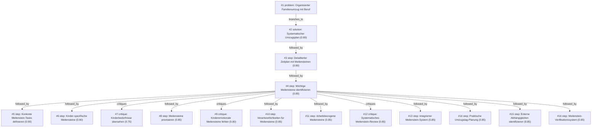

# umzug · zai/glm-4.5-flash · one

**Task:** Wir ziehen in drei Wochen mit zwei Kindern (4 und 9 Jahre) von Berlin nach München. Beide Eltern arbeiten weiter. Wie organisieren wir den Umzug, damit nichts Wichtiges vergessen wird?

| Thoughts | Calls | Tokens in / out | Time | Finish | First try valid | Next picked | Max depth | Weight spread | Duplicates |
|---|---|---|---|---|---|---|---|---|---|
| 16 | 18 | 27547 / 11518 | 5m57s | budget | 16/16 | 3/15 | 4 | 0.04 | 0 |

## Answer from the graph

Für einen erfolgreichen Umzug von Berlin nach München in drei Wochen mit zwei Kindern (4 und 9 Jahren) bei gleichzeitiger Weiterarbeit beider Eltern ist ein systematischer Ansatz entscheidend. Hier ist ein strukturierter Plan:

## Systematischer Umzugsplan

Ein strukturierter Ansatz mit detaillierter Zeitplanung, Verantwortungsaufteilung zwischen den Eltern, Betreuungsregelung für die Kinder während des Umzugs und umfassenden Checklisten für alle Aspekte des Umzugs ist die Grundlage.

## Detaillierter Zeitplan mit Meilensteinen

### Woche 1: Vorbereitung
- Behördengänge: Anmeldung in München, Kündigung der Berliner Wohnung
- Wohnungsbewegung: Neue Wohnung besichtigen, Mietvertrag formalisieren
- Kinderbetreuung organisieren: Neue Kita/Schule für die Kinder finden und anmelden
- Arbeitsgeber über Umzugszeit informieren und Arbeitsabstimmung besprechen
- Verantwortlichkeiten zwischen Eltern aufteilen

### Woche 2: Hauptphase
- Umzugsunternehmen vergleichen und buchen
- Hausrat systematisch packen (am besten Raum für Raum)
- Arbeitsorganisation für Umzugstag finalisieren
- Kinderbetreuung am Umzugstag organisieren
- Kinder auf Umzung vorbereiten

### Woche 3: Durchführung
- Letzte Packarbeiten (Tagesbedarf separat packen)
- Umzug durchführen
- Erste Einrichtung in München (Schlafzimmer, Kinderzimmer priorisieren)
- Behördengänge in München abschließen
- Arbeitsroutine schrittweise wieder aufnehmen

## Konkrete Aufgaben für Eltern

**Für Woche 1:**
- Meldeamt in München besuchen und anmelden
- Berliner Wohnung kündigen
- Neue Kita/Schule für Kinder besichtigen und anmelden
- Arbeitsgeber informieren und mögliche flexible Arbeitsregelungen besprechen
- Umzugsunternehmen anfragen und Angebote vergleichen

**Für Woche 2:**
- Umzugsunternehmen buchen
- Packmaterial besorgen
- Hausrat nach Wichtigkeit sortieren und packen
- Kinderbetreuung für Umzugstag organisieren
- Kinder auf Umzung vorbereiten

**Für Woche 3:**
- Letzte persönliche Gegenstände packen
- Umzug begleiten
- Wichtigste Möbel und Gegenstände in München aufbauen
- Kinder in neue Routine in München einführen

## Kinder-spezifische Maßnahmen

- Altersgerechte Gespräche mit den Kindern führen
- Lieblingsgegenstände für den Umzugstag separat packen
- Neue Schule/Kindergarten besichtigen und positiv darstellen
- Abschiedsveranstaltungen mit Freunden in Berlin organisieren
- Übergangsrituale für den ersten Tag in München vorbereiten
- Kinderbetreuung während des Umzugstages sicherstellen

## Wichtige Risiken und zu beachtende Aspekte

1. **Kinderbedürfnisse übersehen**: Achten Sie besonders auf die emotionalen und altersspezifischen Bedürfnisse Ihrer Kinder während des Umzugs. Der Umzug kann für Kinder besonders stressig sein.

2. **Emotionale Meilensteine für Kinder nicht vernachlässigen**: Bei Kindern im Alter von 4 und 9 Jahren sind emotionale Vorbereitung, Abschiednehmen von Freunden und der Aufbau in der neuen Umgebung entscheidend für eine positive Erfahrung.

3. **Systematisches Review**: Führen Sie regelmäßige Besprechungen zwischen den Eltern durch, um sicherzustellen, dass alle wichtigen Meilensteine identifiziert wurden und keine kritischen Bereiche übersehen werden.

4. **Externe Abhängigkeiten berücksichtigen**: Planen Sie Pufferzeiten für externe Dienstleistungen wie Umzugsunternehmen oder Behörden ein.

5. **Arbeitsabstimmung**: Stellen Sie sicher, dass beide Arbeitgeber frühzeitig über die Termine informiert sind und möglicherweise flexible Arbeitsregelungen vereinbart werden.

Ein erfolgreicher Umzug erfordert eine klare Kommunikation zwischen allen Familienmitgliedern, realistische Zeitplanung und die Berücksichtigung der besonderen Bedürfnisse der Kinder während des gesamten Prozesses.

*Used: #3, #7, #9, #12, #4, #5, #6*

## Baseline: one call, no graph

# Umzug von Berlin nach München mit Kindern: Organisationsplan

## Vorbereitungsphase (die nächsten 3 Wochen)

### 1. Umzugsunternehmen frühzeitig buchen
- Vergleichen Sie mindestens 3 Angebote
- Klären Sie, ob das Unternehmen Erfahrung mit Umzügen mit Kindern hat
- Fragen Sie nach speziellen Services wie Möbelmontage/ Demontage
- Buchen Sie den Umzugstermin so früh wie möglich

### 2. Dokumente organisieren
- Legen Sie alle wichtigen Dokumente zusammen (Geburtsurkunden, Reisepässe, Versicherungspolicen, Arbeitsverträge)
- Scannen Sie wichtige Dokumente und speichern Sie digital in der Cloud
- Erstellen Sie eine Mappe mit Kopien aller Dokumente für den Umzugstag

### 3. Haushalt aufräumen und sortieren
- Beginnen Sie mit dem Keller, Dachboden und Schränken
- Sortieren Sie in: behalten, spenden, verkaufen, wegwerfen
- Nutzen Sie den Verkauf von Unnötigem, um Umzugskosten zu reduzieren
- Packen Sie wenig genutzte Gegenstände zuerst

## Organisation während des Umzugs

### 1. Zeitplan erstellen
- Erstellen Sie einen detaillierten Zeitplan für die letzten 3 Wochen
- Planen Sie Pufferzeiten ein, besonders für die Kinder
- Koordinieren Sie den Umzug mit Ihren Arbeitgebern

### 2. Kinderbetreuung für den Umzugstag
- Organisieren Sie für den Umzugstag eine Betreuung für die Kinder
- Bei 4-Jährigem: Kindergarten oder Tagesmutter
- Bei 9-Jährigem: Freund der Familie oder Verwandter
- Planen Sie kleine Geschenke für die Betreuer als Dank

### 3. Umzugskisten beschriften
- Beschriften Sie jede Kiste mit Inhalt und Raum (z.B. "Küche - Tassen")
- Verwenden Sie Farbcodes für jeden Raum
- Packen Sie "Erstausstattungskisten" für jedes Zimmer mit den wichtigsten Dingen

## Umgang mit den Kindern

### 1. Kinder auf den Umzug vorbereiten
- Erklären Sie den Kindern altersgerecht, was passiert
- Lesen Sie Bücher über Umzüge für Kinder
- Lassen Sie die Kinder bei der Auswahl ihrer Sachen mitbestimmen
- Erstellen Sie zusammen einen "Abschiedsplan" für Berlin

### 2. Übergangsphase gestalten
- Behalten Sie Routinen so weit wie möglich bei
- Nehmen Sie vertraute Gegenstände (Kuscheltiere, Bücher) mit
- Erstellen Sie ein "Erstes-Nach-München"-Paket für jedes Kind mit Lieblingssachen

## Nach dem Umzug

### 1. Prioritäten setzen
- Richten Sie zuerst die Kinderzimmer ein
- Dann Küche und Badezimmer
- Arbeitsbereiche für die Eltern

### 2. Behördengänge in München
- Melden Sie sich bei der neuen Meldebehörde an
- Kündigen Sie die Berliner Anmeldungen
- Suchen Sie neue Ärzte, Kindergarten etc.
- Informieren Sie Schulen/Kitas über den Umzug

## Checkliste: Wichtige Dinge, die nicht vergessen werden dürfen

### Dokumente
- Reisepässe/Personalausweise
- Geburtsurkunden der Kinder
- Versicherungspolicen (Haftpflicht, Hausrat, Krankenversicherung)
- Arbeitsverträge und Gehaltsabrechnungen
- Schulzeugnisse und Impfausweise

### Haushalt
- Medikamente (in separater Box)
- Wichtige Kontaktdaten (alte und neue Nachbarn, Ärzte)
- Schlüssel (altes und neues Haus)
- Bankunterlagen und EC-Karten
- Telefonnummern und Adressen

### Kinder
- Lieblingsspielzeug und -bücher
- Kleidung für mehrere Tage
- Betten und Schlafutensilien
- Kinderwagen/autositz
- Snacks und Getränke für den Umzugstag

### Arbeit
- Arbeitsausweise und Firmenausweise
- Laptops und Arbeitsmaterial
- Telefonnummern der Kollegen und Vorgesetzten
- Homeoffice-Equipment

## Tipps für stressfreien Umzug mit Kindern

- Planen Sie Pausen ein, in denen die Kinder toben können
- Halten Sie den Umzugstag so kurz wie möglich
- Betrachten Sie den Umzug als Abenteuer für die Kinder
- Belohnen Sie die Kinder für ihre Geduld
- Bleiben Sie ruhig - Kinder spüren Stress der Eltern

Viel Erfolg bei Ihrem Umzug nach München!

## Index

```text
#1 [problem] Organisierter Familienumzug mit Beruf · expanded
  #2 [solution] Systematischer Umzugsplan · w 0.80 · expanded
    #3 [step] Detaillierter Zeitplan mit Meilensteinen · w 0.80 · expanded
      #4 [step] Wichtige Meilensteine identifizieren · w 0.85 · expanded
        #5 [step] Konkrete Meilenstein-Tasks definieren · w 0.90 · open, max depth
        #6 [step] Kinder-spezifische Meilensteine · w 0.90 · open, max depth
        #7 [critique] Kinderbedürfnisse übersehen · w 0.75 · open, max depth
        #8 [step] Meilensteine priorisieren · w 0.85 · open, max depth
        #9 [critique] Kinderemotionale Meilensteine fehlen · w 0.80 · open, max depth
        #10 [step] Verantwortlichkeiten für Meilensteine · w 0.85 · open, max depth
        #11 [step] Arbeitsbezogene Meilensteine · w 0.85 · open, max depth
        #12 [critique] Systematisches Meilenstein-Review · w 0.85 · open, max depth
        #13 [step] Integrierter Meilenstein-System · w 0.85 · open, max depth
        #14 [step] Praktische Umzugstag-Planung · w 0.85 · open, max depth
        #15 [step] Externe Abhängigkeiten identifizieren · w 0.85 · open, max depth
        #16 [step] Meilenstein-Verifikationssystem · w 0.85 · open, max depth
```

## Graph



## Thoughts

### #1 [problem] Organisierter Familienumzug mit Beruf
w 1.00 · expanded · depth 0 · from –

Ziel: Ein erfolgreicher Umzug von Berlin nach München in drei Wochen mit zwei Kindern (4 und 9 Jahre), wobei beide Eltern weiterhin arbeiten müssen. Gegebene Fakten: Zeitrahmen von 3 Wochen, zwei berufstätige Eltern, zwei kleine Kinder. Unbekannte: Welche Schritte sind notwendig, wie werden die Kinder betreut, wie wird die Arbeit koordiniert, welche Ressourcen werden benötigt. Ein gutes Ergebnis erfordert eine vollständige Checkliste, eine klare Zeitplanung, eine Betreuungsregelung für die Kinder während des Umzugs und eine Aufteilung der Verantwortlichkeiten zwischen den Eltern.

> Dies ist der Kernproblem des gesamten Umzugs, der alle Aspekte abdeckt

### #2 [solution] Systematischer Umzugsplan
w 0.80 · expanded · depth 1 · from #1

Ein strukturierter Ansatz mit detaillierter Zeitplanung, Verantwortungsaufteilung zwischen den Eltern, Betreuungsregelung für die Kinder während des Umzugs und umfassenden Checklisten für alle Aspekte des Umzugs.

> Dieser Ansatz adressiert alle Kernherausforderungen: Zeitdruck, Berufstätigkeit der Eltern, Betreuung der Kinder und Vollständigkeit der Organisation.

### #3 [step] Detaillierter Zeitplan mit Meilensteinen
w 0.80 · expanded · depth 2 · from #2

Ein schrittweiser Zeitplan für die drei Wochen vor dem Umzug mit wöchentlichen und täglichen Meilensteinen für alle relevanten Aufgaben wie Behördengänge, Packen, Transportorganisation, Wohnungseinrichtung etc.

> Ein detaillierter Zeitplan ist essenziell, um den stressigen Umzug mit begrenzter Zeit zu strukturieren und sicherzustellen, dass alle Aufgaben termingerecht erledigt werden.

### #4 [step] Wichtige Meilensteine identifizieren
w 0.85 · expanded · depth 3 · from #3

Konkrete Meilensteine für jede Woche vor dem Umzug definieren: Woche 1: Behördengänge (Anmeldung in München, Kündigung Berlin), Wohnungsbewegung, Kinderbetreuung organisieren. Woche 2: Hauptpackphase, Umzugsunternehmen buchen, Arbeitsorganisation planen. Woche 3: Letzte Packarbeiten, Umzug durchführen, erste Einrichtung in München.

> Diese spezifischen Meilensteine machen den Zeitplan praktisch umsetzbar und decken alle kritischen Aspekte ab.

### #5 [step] Konkrete Meilenstein-Tasks definieren
w 0.90 · open · depth 4 · from #4

Für jede Woche und jeden Meilenstein spezifische Aufgaben und Verantwortlichkeiten festlegen: Woche 1: Meldeamt München, Kündigung Berliner Wohnung, Kinderkita/Umschulung in München, Arbeitsgeber informieren. Woche 2: Umzugsunternehmen vergleichen und buchen, Hausrat packen (Raum-für-Raum), Arbeitsabstimmung für Umzugstag, Kinderbetreuung am Umzugstag organisieren. Woche 3: Letzte Packarbeiten (Tagesbedarf separat), Umzug durchführen, erste Einrichtung (Kinderzimmer, Schlafzimmer), Behördengänge in München abschließen, Arbeitsroutine wieder aufnehmen.

> Konkrete Task-Definition verhindert, dass wichtige Details vergessen werden und ermöglicht klare Verantwortlichkeitszuweisung.

### #6 [step] Kinder-spezifische Meilensteine
w 0.90 · open · depth 4 · from #4

Milesteine speziell für die Kinderbedürfnisse definieren: Vorbereitungsgespräche mit den Kindern altersgerecht durchführen, Lieblingsgegenstände für den Umzugstag packen, neue Schule/Kindergarten besichtigen, Abschiedsveranstaltungen in Berlin planen, Übergangsrituale für den ersten Tag in München vorbereiten, Kinderbetreuung während des Umzugstages organisieren.

> Kinder brauchen besondere Berücksichtigung bei einem Umzug, um den Stress zu minimieren und den Übergang zu erleichtern.

### #7 [critique] Kinderbedürfnisse übersehen
w 0.75 · open · depth 4 · from #4

Die identifizierten Meilensteine konzentrieren sich stark auf logistische Aspekte, vernachlässigen aber die emotionalen und altersspezifischen Bedürfnisse der Kinder während des Umzugsprozesses.

> Ein umfassender Umzug muss die Belange der Kinder berücksichtigen, da dies den Erfolg der gesamten Umzugsplanung beeinflusst.

### #8 [step] Meilensteine priorisieren
w 0.85 · open · depth 4 · from #4

Wichtige Meilensteine nach Dringlichkeit und Bedeutung priorisieren: Kritische Aufgaben (Behördengänge, Vertragskündigungen) zuerst bearbeiten, gefolgt von zeitkritischen Aufgaben (Umzugsunternehmen buchen, Kinderbetreuung organisieren) und dann von Aufgaben mit mehr Pufferzeit (Packen von weniger wichtigen Gegenständen).

> Priorisierung hilft, Ressourcen auf die wichtigsten Aufgaben zu konzentrieren und Zeitdruck zu minimieren.

### #9 [critique] Kinderemotionale Meilensteine fehlen
w 0.80 · open · depth 4 · from #4

Die bisher identifizierten Meilensteine vernachlässigen die emotionalen und psychologischen Aspekte des Umzugs für die Kinder. Bei Kindern im Alter von 4 und 9 Jahren sind emotionale Vorbereitung, Abschiednehmen von Freunden und der Aufbau in der neuen Umgebung entscheidend.

> Emotionale Vorbereitung der Kinder ist für einen erfolgreichen Umzug ebenso wichtig wie organisatorische Meilensteine

### #10 [step] Verantwortlichkeiten für Meilensteine
w 0.85 · open · depth 4 · from #4

Die identifizierten Meilensteine nach Verantwortlichkeiten aufteilen: Wer ist für welche Behördengänge zuständig? Wer organisiert die Kinderbetreuung? Wer packt welchen Bereich der Wohnung? Wer kümmert sich um die Arbeitssituation während des Umzugs?

> Klare Verantwortlichkeiten verhindern Doppelarbeit und sorgen dafür, dass alle Aufgaben erledigt werden

### #11 [step] Arbeitsbezogene Meilensteine
w 0.85 · open · depth 4 · from #4

Meilensteine identifizieren, die die berufliche Belastung der Eltern berücksichtigen: Genehmigungen für Arbeitszeit, Remote-Arbeitsmöglichkeiten, Übergangsregelungen für Projekte, Kommunikation mit Vorgesetzten und Kollegen.

> Wichtig, da beide Eltern weiterarbeiten müssen und der Umzug die Arbeitsbelastung zusätzlich erhöht.

### #12 [critique] Systematisches Meilenstein-Review
w 0.85 · open · depth 4 · from #4

Ein strukturiertes Review-Prozess erforderlich, um sicherzustellen, dass alle wichtigen Meilensteine identifiziert wurden und keine kritischen Bereiche übersehen werden.

> Ein systematischer Review-Prozess erhöht die Vollständigkeit der Meilenstein-Identifikation und reduziert das Risiko übersehener Aufgaben.

### #13 [step] Integrierter Meilenstein-System
w 0.85 · open · depth 4 · from #4

Ein ganzheitlicher Meilenstein-System entwickeln, der alle Aspekte kombiniert: praktische Umzugsaufgaben, emotionale Bedürfnisse der Familie, Arbeitsverpflichtungen und spezielle Anforderungen der Kinder. Dies schafft eine klare Übersicht und stellt sicher, dass keine wichtigen Bereiche übersehen werden.

> Ein integrierter Ansatz ermöglicht eine bessere Koordination aller Umzugsaspekte und reduziert das Risiko übersehener Aufgaben.

### #14 [step] Praktische Umzugstag-Planung
w 0.85 · open · depth 4 · from #4

Konkrete Planung für den eigentlichen Umzugstag: Notfallkoffer mit Dokumenten, Medikamenten, Kindersachen und Snacks vorbereiten; letzte Übernachtungsplanung für Kinder; Kontaktinformationen für Umzugsunternehmen und neue Nachbarn; Transport von Haustieren; Plan B bei Verspätungen oder Problemen.

> Der eigentliche Umzugstag ist der kritischste Punkt und benötigt eigene Vorbereitung, besonders mit Kindern.

### #15 [step] Externe Abhängigkeiten identifizieren
w 0.85 · open · depth 4 · from #4

Identifikation von externen Fristen und Abhängigkeiten wie Kündigungsfristen für Mietverträge, Schulwechselanmeldungen, Arbeitsgebermitteilungen, Behördentermine etc.

> Externe Fristen und Abhängigkeiten können den gesamten Umzugsplan maßgeblich beeinflussen und müssen frühzeitig berücksichtigt werden

### #16 [step] Meilenstein-Verifikationssystem
w 0.85 · open · depth 4 · from #4

Ein System zur Überprüfung, ob die definierten Meilensteine rechtzeitig erreicht werden, inklusive Eskalationsmechanismen bei Verzögerungen

> Wichtig um sicherzustellen, dass alle Meilensteine tatsächlich erreicht werden und der Umzug planmäßig verläuft

