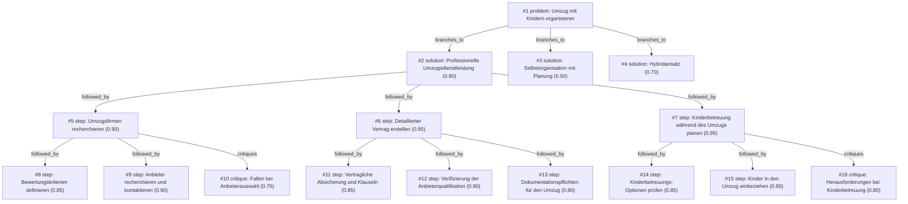

# umzug · zai/glm-4.5-flash · siblings

**Task:** Wir ziehen in drei Wochen mit zwei Kindern (4 und 9 Jahre) von Berlin nach München. Beide Eltern arbeiten weiter. Wie organisieren wir den Umzug, damit nichts Wichtiges vergessen wird?

| Thoughts | Calls | Tokens in / out | Time | Finish | First try valid | Next picked | Max depth | Weight spread | Duplicates |
|---|---|---|---|---|---|---|---|---|---|
| 16 | 8 | 10028 / 7457 | 3m23s | budget | 6/6 | 5/5 | 3 | 0.06 | 0 |

## Answer from the graph

Umzug mit Kindern organisieren: Ein umfassender Plan für den Umzug von Berlin nach München in drei Wochen

Empfohlener Ansatz:
Aufgrund der kurzen Frist von drei Wochen und der Tatsache, dass beide Eltern weiterarbeiten, empfiehlt sich die Beauftragung eines professionellen Umzugsservice. Dies ermöglicht Ihnen, sich auf Ihre Arbeit und die Vorbereitung der Kinder zu konzentrieren, während der logistische Teil des Umzugs von Experten übernommen wird.

Schritt-für-Schritt-Plan:

1. Umzugsunternehmen recherchieren:
   - Nutzen Sie Online-Plattformen, Empfehlungen von Freunden oder Kollegen sowie Branchenverzeichnisse
   - Kontaktieren Sie mindestens 3-5 Anbieter, um Vergleichsangebote einzuholen
   - Vereinbaren Sie persönliche Termine für Vor-Ort-Besichtigungen

2. Auswahl des richtigen Umzugsunternehmens:
   - Achten Sie auf Unternehmen mit Erfahrung in Fernumzügen und Familien
   - Vergleichen Sie Angebote hinsichtlich Preisgestaltung, Leistungen, Versicherungen und Kundenbewertungen
   - Prüfen Sie speziell die Erfahrungen mit Umzügen mit Kindern

3. Vertragsgestaltung:
   - Erstellen Sie einen detaillierten Leistungskatalog
   - Sichern Sie sich vertraglich ab mit klaren Klauseln
   - Stellen Sie sicher, dass spezielle Anforderungen für Kindergegenstände berücksichtigt werden

4. Kinderbetreuung planen:
   - Organisieren Sie die Betreuung für die Kinder während des Packens und des Umzugs
   - Infrage kommen Großeltern, Freunde oder professionelle Kinderbetreuung
   - Stellen Sie sicher, dass die Kinder in einer vertrauten Umgebung bleiben

5. Kinder in den Umzug einbeziehen:
   - Bereiten Sie die altersgerecht auf den Umzug vor
   - Erklären Sie den Prozess kindgerecht
   - Lassen Sie sie wichtige Gegenstände selbst packen
   - Beibehaltung vertrauter Routinen
   - Erstellen Sie ein "Übergangs-Bündel" mit Lieblingsspielzeug und Kleidung für die ersten Tage in München

Risiken und Herausforderungen:

1. Bei der Anbieterauswahl:
   - Achtung vor unseriösen Anbietern mit zu niedrigen Preisen (können versteckte Kosten bedeuten)
   - Mangelnde Transparenz bei Leistungen
   - Fehlender Versicherungsschutz
   - Unklare Zahlungsbedingungen
   - Fehlende schriftliche Bestätigung der Leistungen

2. Bei der Kinderbetreuung:
   - Kurzfristige Absagen von Betreuungspersonen
   - Unvorhergesehene Verzögerungen beim Umzug
   - Unzureichende Betreuungskapazität
   - Mögliche emotionale Reaktion der Kinder auf den Umzug

3. Allgemeine Risiken:
   - Zeitdruck durch den engen Zeitrahmen
   - Doppelbelastung durch Arbeit und Umzugsvorbereitungen
   - Mögliche Verzögerungen bei der Organisation

Um einen reibungslosen Umzug zu gewährleisten, sollten Sie frühzeitig beginnen, einen klaren Zeitplan erstellen und flexibel bleiben, insbesondere was die Betreuung der Kinder betrifft. Ein gut organisierter Umzug reduziert den Stress für die ganze Familie und ermöglicht einen sanften Übergang in die neue Umgebung.

*Used: #1, #2, #5, #7, #9, #10, #15, #16*

## Baseline: one call, no graph

# Umzug von Berlin nach München mit Kindern: Organisationsplan

## Allgemeine Planung und Vorbereitung
- Erstellen Sie einen detaillierten Zeitplan für die verbleibenden drei Wochen
- Legen Sie feste Prioritäten für Aufgaben fest
- Planen Sie ausreichend Pausen und Zeit für die Kinder ein
- Teilen Sie die Aufgaben fair zwischen den Eltern auf

## Aufgaben vor dem Umzug

### Behördliche Angelegenheiten
- Meldebescheinigung für München beantragen
- Schulwechsel für das 9-jährige Kind organisieren
- Kindergarten für das 4-jährige Kind in München suchen und anmelden
- Ärzte und Therapeuten für die Kinder in München finden
- Versicherungen ummelden (Haftpflicht, Hausrat, KFZ)
- Bankverbindungen aktualisieren

### Arbeitsplatz
- Arbeitgeber über Umzug informieren
- Homeoffice-Optionen für die Umzugszeit klären
- Arbeitszeiten ggf. anpassen

### Wohnung
- Neue Wohnung in München besichtigen und Schlüssel erhalten
- Alte Wohnung kündigen (falls noch nicht geschehen)
- Renovierungsarbeiten in neuer Wohnung planen
- Umzugsunternehmen beauftragen

### Dokumente
- Wichtige Dokumente sammeln und in einem separaten Ordner aufbewahren
- Reisepässe, Geburtsurkunden, Versicherungskarten, etc. griffbereit halten

## Packstrategie
- Früh anfangen mit weniger genutzten Dingen
- Room-by-Room-Packing: Jeder Raum wird einzeln gepackt, auf jeder Box den Raum und Inhalt vermerken
- "Erstöffnen"-Boxen für beide Wohnungen vorbereiten

### Besondere Aufmerksamkeit für Kinder
- Lieblingsspielzeuge und -bücher separat packen
- Bekleidung für die ersten Tage separat bereithalten
- Kinderbetten und -möbel als Letztes packen

## Besondere Überlegungen mit Kindern
- Kinder vorbereiten: Altergerecht über den Umzug sprechen, positive Aspekte betonen
- Abschiedsfeiern mit Freunden planen
- Betreuung für die Kinder am Umzugstag organisieren
- Kinder in die Packprozesse einbeziehen (ihre eigenen Kisten packen lassen)

## Umzugstag
- Früh aufstehen, um stressfrei zu beginnen
- Letzte Checks: Alle Fenster und Türen in alter Wohnung verschlossen, Zählerstände notieren
- In der neuen Wohnung: Wichtigste Möbel zuerst aufbauen, "Erstöffnen"-Boxen auspacken

## Ankunft in München
- Priorität auf Kinderzimmer und Küche legen
- Routinen für Kinder etablieren
- Nachbarschaft erkunden
- Neue Schule/Kita vorstellen

## Tipps für stressfreien Umzug mit Kindern
- Flexibilität bewahren
- Hilfe von Freunden und Familie annehmen
- Nicht zu viele Aufgaben auf einmal machen
- Positiv bleiben und Kinder ermutigen
- Belohnungen für Mitarbeit einplanen

Viel Erfolg bei Ihrem Umzug!

## Index

```text
#1 [problem] Umzug mit Kindern organisieren · expanded
  #2 [solution] Professionelle Umzugsdienstleistung · w 0.80 · expanded
    #5 [step] Umzugsfirmen recherchieren · w 0.90 · expanded
      #8 [step] Bewertungskriterien definieren · w 0.85 · open
      #9 [step] Anbieter recherchieren und kontaktieren · w 0.90 · open
      #10 [critique] Fallen bei Anbieterauswahl · w 0.75 · open
    #6 [step] Detaillierter Vertrag erstellen · w 0.85 · expanded
      #11 [step] Vertragliche Absicherung und Klauseln · w 0.85 · open
      #12 [step] Verifizierung der Anbieterqualifikation · w 0.90 · open
      #13 [step] Dokumentationspflichten für den Umzug · w 0.80 · open
    #7 [step] Kinderbetreuung während des Umzugs planen · w 0.95 · expanded
      #14 [step] Kinderbetreuungs-Optionen prüfen · w 0.85 · open
      #15 [step] Kinder in den Umzug einbeziehen · w 0.90 · open
      #16 [critique] Herausforderungen bei Kinderbetreuung · w 0.80 · open
  #3 [solution] Selbstorganisation mit Planung · w 0.50 · open
  #4 [solution] Hybridansatz · w 0.70 · open
```

## Graph



## Thoughts

### #1 [problem] Umzug mit Kindern organisieren
w 1.00 · expanded · depth 0 · from –

Ziel: Organisierung eines Umzugs von Berlin nach München in drei Wochen mit zwei Kindern (4 und 9 Jahre), während beide Eltern weiterarbeiten. Gegeben: Zeitrahmen von drei Wochen, berufstätige Eltern, zwei kleine Kinder. Unbekannt: Notwendige Schritte für den Umzug, Work-Life-Balance während des Umzugs, Kinderbetreuung während des Umzugs, Zeitplan, benötigte Dienstleistungen. Gutes Ergebnis: Ein umfassender Umzugsplan mit Zeitplan, der alle notwendigen Aspekte abdeckt, Strategien zur Vereinbarkeit von Beruf und Umzugsvorbereitungen, Berücksichtigung der Bedürfnisse der Kinder und eine Checkliste, um nichts Wichtiges zu vergessen.

> Dies ist der Kern des Problems, das eine vollständige Lösung erfordert

### #2 [solution] Professionelle Umzugsdienstleistung
w 0.80 · expanded · depth 1 · from #1

Einen professionellen Umzugsservice beauftragen, der den gesamten Prozess von Packen bis zum Transport übernimmt. Dies umfasst die Auswahl eines seriösen Unternehmens, Erstellung eines detaillierten Leistungskatalogs, Koordination der Termine und Sicherstellung, dass spezielle Anforderungen für Kindergegenstände berücksichtigt werden.

> Stärkste Lösung für Zeitknappheit und berufstätige Eltern, aber teurer

### #3 [solution] Selbstorganisation mit Planung
w 0.50 · open · depth 1 · from #1

Den Umzug komplett selbst organisieren: Mietwagen beschaffen, Verpackungsmaterial besorgen, Umzugshelfer organisieren, Zeitplan für Packen und Transport erstellen. Beide Eltern nehmen sich Urlaub oder arbeiten flexibel, um den Prozess gemeinsam zu bewältigen.

> Kostengünstig, aber sehr zeitaufwendig und anstrengend mit zwei kleinen Kindern

### #4 [solution] Hybridansatz
w 0.70 · open · depth 1 · from #1

Kombination aus professioneller Dienstleistung und Selbstorganisation: Fachfirmie für schwerere Gegenstände und Transport, Eltern kümmern sich um persönliche Gegenstände, Kleidung und Kinderbedarf. Teile des Haushalts werden vorgepackt, während andere Bereiche von Profis übernommen werden.

> Guter Kompromiss zwischen Kosten und Convenience, reduziert den Arbeitsaufwand erheblich

### #5 [step] Umzugsfirmen recherchieren
w 0.90 · expanded · depth 2 · from #2

Recherche und Auswahl seriöser Umzugsunternehmen mit Erfahrung in Fernumzügen und Familien. Vergleich von Angeboten, Preisgestaltung, Leistungen, Versicherungen und Kundenbewertungen. Fokus auf Unternehmen, die Erfahrung mit Umzügen mit Kindern haben.

> Grundlegende Voraussetzung für professionelle Umzugsdienstleistung

### #6 [step] Detaillierter Vertrag erstellen
w 0.85 · expanded · depth 2 · from #2

Erstellung eines detaillierten Leistungskatalogs mit allen vereinbarten Leistungen, Zeitplan, Kostenübersicht und Versicherungsleistungen. Klärung von Sonderwünschen wie spezielle Verpackung für Kindergegenstände, Spielzeug oder fragile Gegenstände.

> Vermeidung von Missverständnissen und Sicherstellung aller benötigten Leistungen

### #7 [step] Kinderbetreuung während des Umzugs planen
w 0.95 · expanded · depth 2 · from #2

Organisation der Betreuung für die Kinder während des Packens und des eigentlichen Umzugs. Dies kann durch Großeltern, Freunde oder professionelle Kinderbetreuung erfolgen. Sicherstellung, dass die Kinder in einer vertrauten Umgebung bleiben und nicht unnötig gestresst werden.

> Kritisch für die Work-Life-Balance der berufstätigen Eltern und das Wohlbefinden der Kinder

### #8 [step] Bewertungskriterien definieren
w 0.85 · open · depth 3 · from #5

Kriterien für die Auswahl von Umzugsunternehmen festlegen: Erfahrung mit Fernumzügen, Referenzen, Preisgestaltung, Versicherungsschutz, Zusatzleistungen (z.B. Möbelmontage, Entsorgung), Verfügbarkeit im gewünschten Zeitfenster und spezielle Anforderungen für Kindergegenstände.

> Klare Kriterien gewährleisten eine strukturierte und vergleichbare Auswahl der Anbieter.

### #9 [step] Anbieter recherchieren und kontaktieren
w 0.90 · open · depth 3 · from #5

Umzugsunternehmen über verschiedene Kanäle recherchieren: Online-Plattformen, Empfehlungen von Freunden/Kollegen, Branchenverzeichnisse. Mindestens 3-5 Anbieter kontaktieren, um Vergleichsangebote einzuholen und Termine für Vor-Ort-Besichtigungen vereinbaren.

> Umfassende Recherche und persönliche Vor-Ort-Termine sind entscheidend für eine fundierte Entscheidung.

### #10 [critique] Fallen bei Anbieterauswahl
w 0.75 · open · depth 3 · from #5

Achtung vor unseriösen Anbietern: zu niedrige Preise können versteckte Kosten bedeuten, mangelnde Transparenz bei Leistungen, fehlende Versicherungsschutz, unklare Zahlungsbedingungen und keine schriftliche Bestätigung der Leistungen.

> Erkennen potenzieller Risiken bei der Anbieterauswahl hilft, teure Fehler zu vermeiden.

### #11 [step] Vertragliche Absicherung und Klauseln
w 0.85 · open · depth 3 · from #6

Wichtige vertragliche Klauseln definieren: Haftung für Schäden, Zahlungsbedingungen, Stornierungsfristen, Gewährleistung, Nachträgliche Änderungen, Beschwerdemanagement und Eskalationswege. Klärung der Haftungsbeschränkungen und Zusatzversicherungen für wertvolle Gegenstände.

> Vertragliche Absicherung ist entscheidend, um spätere Konflikte und finanzielle Risiken zu vermeiden

### #12 [step] Verifizierung der Anbieterqualifikation
w 0.90 · open · depth 3 · from #6

Überprüfung der Unternehmenslizenz, Haftpflichtversicherung, Berufshaftpflichtversicherung, Referenzen einholen, Erfahrungen mit Familienumzügen erfragen, Gütesiegel prüfen (z.B. TÜV, Umzugsverband), Transportgenehmigungen und Mitarbeiterqualifikation verifizieren.

> Die Qualifikation des Anbieters ist entscheidend für einen reibungslosen und sicheren Umzug mit Kindern

### #13 [step] Dokumentationspflichten für den Umzug
w 0.80 · open · depth 3 · from #6

Erstellung einer detaillierten Inventarliste mit Fotos von wertvollen Gegenständen vor dem Umzug, Dokumentation des Zustands aller Möbel und Gegenstände, Einhaltung des Vertragsdokuments, Erstellung einer Checkliste für die Übergabe, Aufbewahrung aller Belege und Vertragsdokumente.

> Dokumentation schützt vor späteren Streitigkeiten und dient als Nachweis für versicherte Gegenstände

### #14 [step] Kinderbetreuungs-Optionen prüfen
w 0.85 · open · depth 3 · from #7

Untersuchung der verfügbaren Betreuungsmöglichkeiten: Großeltern, Freunde, professionelle Kinderbetreuungsdienste, Tagesmütter oder Kindergartenbetreuung während des Umzugs. Bewertung der Eignung basierend auf Alter der Kinder, Dauer des Umzugs und Vertrauensfaktor.

> Essential to evaluate all available options to ensure proper childcare

### #15 [step] Kinder in den Umzug einbeziehen
w 0.90 · open · depth 3 · from #7

Vorbereitung der Kinder auf den Umzug altersgerecht: Erklären des Prozesses, gemeinsames Packen ihrer wichtigsten Gegenstände, Beibehaltung vertrauter Routinen und Erstellen eines 'Übergangs-Bündels' mit Lieblingsspielzeug und Kleidung für die ersten Tage in München.

> Involving children reduces anxiety and helps them cope with the change

### #16 [critique] Herausforderungen bei Kinderbetreuung
w 0.80 · open · depth 3 · from #7

Mögliche Probleme: Kurzfristige Absagen von Betreuungspersonen, unvorhergesehene Verzögerungen beim Umzug, unzureichende Betreuungskapazität, emotionale Reaktion der Kinder auf den Umzug. Notwendigkeit von Backup-Planen und flexibler Zeitplanung.

> Anticipating challenges helps prevent problems during the move

