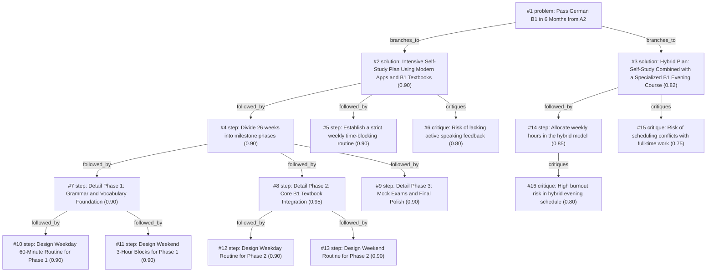

# b1-exam · gemini/gemini-3.5-flash-lite · index

**Task:** I work full time and want to pass the German B1 exam in 6 months, starting from A2. I can study about 1 hour on weekdays and 3 hours on weekend days. How should I plan it?

| Thoughts | Calls | Tokens in / out | Time | Finish | First try valid | Next picked | Max depth | Weight spread | Duplicates |
|---|---|---|---|---|---|---|---|---|---|
| 16 | 9 | 14444 / 3616 | 44s | budget | 7/8 | 6/7 | 4 | 0.03 | 2 |

Failures: schema 1

## Answer from the graph

Balancing a full-time job while preparing for the German B1 exam from an A2 level in 6 months is entirely achievable, provided you stick to a disciplined routine. Your schedule yields about **11 hours of study per week** (1 hour on weekdays, 3 hours on each weekend day), giving you a total of roughly **280 hours** over 26 weeks. 

Here is a structured, milestone-based self-study plan designed to maximize your time, cover all four exam modules (*Hören, Lesen, Schreiben, Sprechen*), and keep burnout at bay.

---

### The 26-Week Milestone Plan

Divide your 6 months into three distinct phases:

#### Phase 1: Grammar and Vocabulary Foundation (Weeks 1–8)
* **Objective:** Bridge the gap between A2 and B1 by solidifying foundational grammar (e.g., *Nebensätze*, passive voice, subjunctive/Konjunktiv II) and expanding your core vocabulary.
* **Weekday 60-Minute Routine:** 
  * 15 mins: Anki spaced repetition for vocabulary.
  * 30 mins: Grammar drills from an A2/B1 transition workbook.
  * 15 mins: Short reading or listening exercise (e.g., *Nachrichten Leicht*).
* **Weekend 3-Hour Blocks:** Dedicate these to deeper grammar reviews, tackling tricky sentence structures, and doing longer listening comprehension exercises.

#### Phase 2: Core B1 Textbook Integration (Weeks 9–18)
* **Objective:** Systematically work through a comprehensive B1 textbook series (such as *Netzwerk B1* or *Aspekte Neu*), aiming for roughly one chapter per week (10 chapters total).
* **Weekday 60-Minute Routine:**
  * 15 mins: Vocabulary review (Anki).
  * 30 mins: Reading and listening tasks directly from the textbook chapter.
  * 15 mins: Grammar exercises associated with that chapter.
* **Weekend 3-Hour Routine:**
  * **Saturday (Writing Focus):** Draft the chapter's assigned emails and opinion essays. Use tools like LanguageTool or AI to check your spelling and grammar.
  * **Sunday (Speaking & Review):** Answer B1 oral exam prompts based on the chapter's theme, record yourself to check fluency, and review all errors made during the week.

#### Phase 3: Exam-Specific Preparation & Polish (Weeks 19–26)
* **Objective:** Simulate real exam conditions, master the specific formats for *Hören, Lesen, Schreiben, Sprechen*, and fix persistent weak spots.
* **Routine:** Spend your weekday hours doing targeted mini-sections of past papers. Spend your weekend hours taking full, timed mock exams under strict test conditions, followed by rigorous self-correction.

---

### Risks and How to Mitigate Them

* **Risk of Lacking Active Speaking Feedback:** Self-study can leave a blind spot when it comes to pronunciation and spontaneous conversational output, which are vital for the B1 oral exam. 
  * *Mitigation:* Use AI voice tools (like ChatGPT voice mode) during your weekday/weekend routines to practice daily monologues and dialogues. Additionally, book 5 to 10 individual tutoring sessions on platforms like iTalki during Phase 3 to get professional feedback on your speaking and writing.
* **Risk of Burnout:** Studying 6 days a week while working full-time is demanding. 
  * *Mitigation:* Strict time-blocking is essential, but ensure you give yourself at least one full day or evening completely off to rest and prevent mental exhaustion.

*Used: #1, #2, #4, #6, #8, #12, #13*

## Index

```text
#1 [problem] Pass German B1 in 6 Months from A2 · expanded
  #2 [solution] Intensive Self-Study Plan Using Modern Apps and B1 Textbooks · w 0.90 · expanded
    #4 [step] Divide 26 weeks into milestone phases · w 0.90 · expanded
      #7 [step] Detail Phase 1: Grammar and Vocabulary Foundation · w 0.90 · expanded
        #10 [step] Design Weekday 60-Minute Routine for Phase 1 · w 0.90 · open, max depth
        #11 [step] Design Weekend 3-Hour Blocks for Phase 1 · w 0.90 · open, max depth
      #8 [step] Detail Phase 2: Core B1 Textbook Integration · w 0.95 · expanded
        #12 [step] Design Weekday Routine for Phase 2 · w 0.90 · open, max depth
        #13 [step] Design Weekend Routine for Phase 2 · w 0.90 · open, max depth
      #9 [step] Detail Phase 3: Mock Exams and Final Polish · w 0.90 · open
    #5 [step] Establish a strict weekly time-blocking routine · w 0.90 · open
    #6 [critique] Risk of lacking active speaking feedback · w 0.80 · open
  #3 [solution] Hybrid Plan: Self-Study Combined with a Specialized B1 Evening Course · w 0.82 · expanded
    #14 [step] Allocate weekly hours in the hybrid model · w 0.85 · expanded
      #16 [critique] High burnout risk in hybrid evening schedule · w 0.80 · open
    #15 [critique] Risk of scheduling conflicts with full-time work · w 0.75 · open
```

## Graph



## Thoughts

### #1 [problem] Pass German B1 in 6 Months from A2
w 1.00 · expanded · depth 0 · from –

Goal: Pass the German B1 exam in 6 months, starting from an A2 level. Constraints: Full-time work schedule, study capacity of ~1 hour on weekdays (Mon-Fri) and ~3 hours on weekend days (Sat-Sun), yielding roughly 11 hours of study per week (approx. 280 hours total over 26 weeks). Unknowns: Specific weak areas (reading, writing, listening, speaking), best structured curriculum for time-efficient learning, and milestone pacing. A successful plan must balance grammar, vocabulary, and all four exam skills (Hören, Lesen, Schreiben, Sprechen) within the limited weekly hours, incorporate regular practice tests, and prevent burnout.

> It accurately captures all goals, constraints, and success criteria stated in the task.

### #2 [solution] Intensive Self-Study Plan Using Modern Apps and B1 Textbooks
w 0.90 · expanded · depth 1 · from #1

Structure the 280 hours around a comprehensive B1 textbook series (e.g., 'Aspekte Neu' or 'Netzwerk B1') combined with spaced repetition for vocabulary (Anki), graded readers, and targeted grammar review. Weekday 1-hour sessions focus on vocabulary, grammar drills, or short reading/listening exercises. Weekend 3-hour blocks focus on intensive writing practice, simulated exam parts, and speaking monologues/conversations (using Tandem or AI tools).

> Directly utilizes the 11 hours per week with a structured, autonomous approach suited for a working professional.

### #3 [solution] Hybrid Plan: Self-Study Combined with a Specialized B1 Evening Course
w 0.82 · expanded · depth 1 · from #1

Enroll in a part-time online evening language course (2-3 hours per week) to cover speaking and structured feedback, while dedicating the remaining 8-9 hours of the weekly budget to textbook exercises, vocabulary building, and mock exams.

> Adds professional guidance and forced speaking practice, though it reduces flexibility.

### #4 [step] Divide 26 weeks into milestone phases
w 0.90 · expanded · depth 2 · from #2

Break down the 6 months into three distinct phases: Phase 1 (Weeks 1-8): Grammar and vocabulary foundation building using A2/B1 transition materials. Phase 2 (Weeks 9-18): Deep dive into B1 textbook chapters, focusing on integrated skills (Hören, Lesen, Schreiben, Sprechen). Phase 3 (Weeks 19-26): Exam-specific preparation, full mock tests under timed conditions, and fixing persistent weak spots.

> Clear phasing ensures the learner covers all ground without feeling overwhelmed by the entire B1 curriculum at once.

### #5 [step] Establish a strict weekly time-blocking routine
w 0.90 · open · depth 2 · from #2

Assign specific tasks to specific days to eliminate decision fatigue. Monday/Wednesday: 1 hour vocabulary (Anki) and grammar practice. Tuesday/Thursday: 1 hour reading/listening B1 articles or podcasts (e.g., 'Langsam gesprochene Nachrichten'). Friday: 1 hour free writing or reviewing mistakes. Saturday/Sunday: 3-hour blocks split between a textbook chapter, mock exam modules, and speaking practice.

> Given full-time work constraints, a rigid routine maximizes the 11 weekly hours effectively.

### #6 [critique] Risk of lacking active speaking feedback
w 0.80 · open · depth 2 · from #2

Self-study lacks real-time correction for pronunciation and spontaneous conversational output, which are crucial for the B1 speaking exam. Mitigation: Incorporate AI voice tools (like ChatGPT voice mode) for daily monologues and book at least 5-10 individual tutoring sessions on platforms like iTalki during Phase 3.

> Addresses the biggest blind spot of pure self-study for language exams.

### #7 [step] Detail Phase 1: Grammar and Vocabulary Foundation
w 0.90 · expanded · depth 3 · from #4

For Phase 1 (Weeks 1-8), focus heavily on closing A2 grammar gaps (e.g., Präteritum, subordinate clauses with 'dass/weil', Wechselpräpositionen) and acquiring core B1 vocabulary (~1000 high-frequency words) via Anki. Spend weekday hours strictly on flashcards and short grammar exercises, and weekend hours on reading short graded readers and doing initial writing prompts.

> Gives concrete, actionable details for the first milestone phase of the study plan.

### #8 [step] Detail Phase 2: Core B1 Textbook Integration
w 0.95 · expanded · depth 3 · from #4

For Phase 2 (Weeks 9-18), systematically work through 1 B1 textbook chapter per week (roughly 10 chapters total). Dedicate weekday hours to the textbook's listening and reading texts, and weekend hours to writing the chapter's assigned letters/emails and practicing speaking prompts based on the chapter's thematic vocabulary.

> Specifies how the core B1 textbook content should be paced during the middle phase.

### #9 [step] Detail Phase 3: Mock Exams and Final Polish
w 0.90 · open · depth 3 · from #4

For Phase 3 (Weeks 19-26), transition entirely to exam simulation. Spend weekday hours analyzing mistakes from past papers, reviewing complex grammar, and writing short essays. Use weekend 3-hour blocks to take complete mock exams (Goethe/ÖSD B1) under strict time limits, followed by thorough self-evaluation.

> Outlines the final exam-prep phase to ensure familiarity with the test format and time management.

### #10 [step] Design Weekday 60-Minute Routine for Phase 1
w 0.90 · open · depth 4 · from #7

Create a daily 60-minute template for Phase 1: 20 minutes Anki reviews for vocabulary and verb conjugation, 25 minutes focused grammar study from a workbook (e.g., Übungsgrammatik B1), and 15 minutes of active recall or listening to a slow German podcast like '14 Minuten'.

> Provides an actionable, highly structured daily routine that maximizes the limited weekday hour for Phase 1.

### #11 [step] Design Weekend 3-Hour Blocks for Phase 1
w 0.90 · open · depth 4 · from #7

Design the two 3-hour weekend sessions for Phase 1: Saturday for reading a B1 graded reader with vocabulary extraction, and Sunday for writing 5 short diary entries or personal letters using target grammar and doing self-correction.

> Utilizes the larger weekend blocks for productive, output-oriented skills without overwhelming the schedule.

### #12 [step] Design Weekday Routine for Phase 2
w 0.90 · open · depth 4 · from #8

For Phase 2 weekdays (60 minutes daily): Spend 15 minutes reviewing Anki vocabulary, 30 minutes reading/listening to the textbook chapter text, and 15 minutes doing grammar exercises associated with the chapter.

> Gives a concrete, actionable breakdown of the 60-minute weekday sessions during the core B1 textbook phase.

### #13 [step] Design Weekend Routine for Phase 2
w 0.90 · open · depth 4 · from #8

For Phase 2 weekends (3 hours per day): Saturday is dedicated to writing practice (drafting B1 essays and emails, checking grammar with AI or tools like LanguageTool). Sunday is dedicated to speaking practice (answering B1 oral exam prompts, recording oneself, or doing a 30-minute language exchange session) plus reviewing the week's errors.

> Splits the heavy weekend block into productive productive-skill sessions (writing and speaking) which need uninterrupted focus time.

### #14 [step] Allocate weekly hours in the hybrid model
w 0.85 · expanded · depth 2 · from #3

Structure the 11 weekly hours: 3 hours for the live evening course session, 5 hours during weekdays (1 hour/day) for app-based vocab and grammar drills, and 3 hours on Saturday or Sunday for textbook exercises and writing practice.

> Breaks down the time budget specifically for the hybrid approach, matching the user's weekly constraints.

### #15 [critique] Risk of scheduling conflicts with full-time work
w 0.75 · open · depth 2 · from #3

Fixed evening classes can conflict with work overtime or exhaustion from a full-time job, potentially leading to missed classes and wasted money.

> Highlights a major operational risk for working professionals choosing live courses.

### #16 [critique] High burnout risk in hybrid evening schedule
w 0.80 · open · depth 3 · from #14

Attending evening classes after a full-time workday and then squeezing heavy study into weekends leaves virtually no time for rest, drastically increasing the risk of mental fatigue and dropout.

> Identifies a critical sustainability flaw in the hybrid time allocation.

