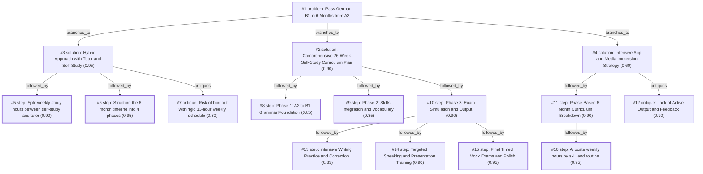

# b1-exam · gemini/gemini-3.5-flash-lite · path

**Task:** I work full time and want to pass the German B1 exam in 6 months, starting from A2. I can study about 1 hour on weekdays and 3 hours on weekend days. How should I plan it?

| Thoughts | Calls | Tokens in / out | Time | Finish | First try valid | Next picked | Max depth | Weight spread | Duplicates |
|---|---|---|---|---|---|---|---|---|---|
| 16 | 8 | 7284 / 2923 | 15s | budget | 7/7 | 0/6 | 3 | 0.08 | 0 |

## Answer from the graph

Passing the German B1 exam in 6 months while working full-time is an ambitious but entirely achievable goal. With your available time—1 hour on weekdays and 3 hours on each weekend day—you have a solid budget of about 11 hours per week, totaling roughly 270 hours over 26 weeks. 

To maximize this time and ensure you don't just learn German, but actually pass the exam (whether Goethe, telc, or ÖSD), a **Hybrid Approach combining structured self-study with a professional live tutor** is the most effective strategy.

Here is your comprehensive plan:

### The Weekly Time Breakdown
* **Self-Study (9 hours/week):** Focus on textbooks, grammar drills, vocabulary acquisition, reading, and listening comprehension. 
* **Live Tutor (2 hours/week):** Dedicate this to an online platform (like iTalki) — 1 hour for active speaking practice and 1 hour for reviewing your written texts and correcting mistakes.

---

### The 4-Phase 6-Month Timeline

**Phase 1: A2 Review and Core B1 Grammar (Months 1–2)**
* **Focus:** Solidify your A2 foundation and bridge the gap to B1 grammar.
* **Content:** Master complex sentence structures (Nebensätze with *weil, dass, obwohl*), passive voice, subjunctive mood (*Konjunktiv II*), and relative clauses. Use a dedicated B1 textbook (e.g., *Schritte International Neu 5+6* or *Aspekte neu B1*).

**Phase 2: Thematic Vocabulary and Skill Expansion (Months 3–4)**
* **Focus:** Broaden your vocabulary around typical B1 exam themes (work, environment, media, health, travel) and develop passive skills.
* **Content:** Read graded readers, German news for learners (like *Deutsche Welle's Langsam gesprochene Nachrichten*), and listen to podcasts. Start writing short diary entries or summaries.

**Phase 3: Exam Format Training and Output (Month 5)**
* **Focus:** Learn the specific tricks and structures of the B1 exam modules (*Lesen, Hören, Schreiben, Sprechen*).
* **Content:** Practice writing formal and informal emails, opinion pieces, and practicing the oral presentation (*Präsentation*) and discussion parts of the exam with your tutor.

**Phase 4: Full Mock Exams and Weak Spot Polishing (Month 6)**
* **Focus:** Build stamina and time management under exam conditions.
* **Content:** Take timed full mock exams using official practice books. Analyze every mistake, review weak grammar areas, and fine-tune your speaking fluency with your tutor.

---

### Risks to Watch: Avoiding Burnout
Working full-time while committing 11 hours every single week to rigorous studying creates a high risk of mental fatigue and burnout over a 6-month period. To keep your plan sustainable:
* **Build in flexibility:** Don't treat the schedule as an unyielding prison. If a work week is exceptionally draining, scale back to "light" study weeks (focusing only on passive listening or review) without feeling guilty.
* **Take rest days:** Protect at least one day over the weekend or a weekday evening entirely for rest and relaxation. 
* **Pace your motivation:** Celebrate small milestones—like finishing a difficult grammar chapter or successfully writing your first complete B1 letter—to keep your energy high.

*Used: #1, #3, #5, #6, #7, #8, #9, #10, #13, #14, #15, #16*

## Index

```text
#1 [problem] Pass German B1 in 6 Months from A2 · expanded
  #2 [solution] Comprehensive 26-Week Self-Study Curriculum Plan · w 0.90 · expanded
    #8 [step] Phase 1: A2 to B1 Grammar Foundation · w 0.85 · done
    #9 [step] Phase 2: Skills Integration and Vocabulary · w 0.85 · done
    #10 [step] Phase 3: Exam Simulation and Output · w 0.90 · expanded
      #13 [step] Intensive Writing Practice and Correction · w 0.85 · open
      #14 [step] Targeted Speaking and Presentation Training · w 0.90 · open
      #15 [step] Final Timed Mock Exams and Polish · w 0.95 · done
  #3 [solution] Hybrid Approach with Tutor and Self-Study · w 0.95 · expanded
    #5 [step] Split weekly study hours between self-study and tutor · w 0.90 · done
    #6 [step] Structure the 6-month timeline into 4 phases · w 0.95 · done
    #7 [critique] Risk of burnout with rigid 11-hour weekly schedule · w 0.80 · open
  #4 [solution] Intensive App and Media Immersion Strategy · w 0.60 · expanded
    #11 [step] Phase-Based 6-Month Curriculum Breakdown · w 0.90 · expanded
      #16 [step] Allocate weekly hours by skill and routine · w 0.95 · done
    #12 [critique] Lack of Active Output and Feedback · w 0.70 · open
```

## Graph



## Thoughts

### #1 [problem] Pass German B1 in 6 Months from A2
w 1.00 · expanded · depth 0 · from –

Goal: Pass the German B1 exam in 6 months.
Starting point: A2 level.
Time budget: ~1 hour per weekday (5 hours) + ~3 hours per weekend day (6 hours) = approx. 11 hours per week, totaling around 260-280 hours over 6 months.
Unknowns: Exact current proficiency gaps, best structured curriculum for this timeframe, exam registration details.
Good result: A concrete, week-by-week study plan covering reading, listening, writing, and speaking, aligned with standard B1 exam formats (Goethe, telc, or ÖSD), including regular mock tests and vocabulary acquisition.

> Establishes the core constraints, goals, and success criteria for the 6-month B1 study plan.

### #2 [solution] Comprehensive 26-Week Self-Study Curriculum Plan
w 0.90 · expanded · depth 1 · from #1

Divide the 6 months into phases: Months 1-2 for bridging A2 to early B1 grammar and core vocabulary; Months 3-4 for advanced B1 grammar, targeted reading/listening practice; Months 5-6 for exam-specific training, writing practice with feedback, and mock tests.

> A structured multi-phase curriculum directly addresses the 260-hour goal by allocating time logically from foundations to exam prep.

### #3 [solution] Hybrid Approach with Tutor and Self-Study
w 0.95 · expanded · depth 1 · from #1

Combine 8-10 hours of weekly self-study using textbooks and apps with 1-2 hours of weekly live conversation practice with a professional tutor (e.g., via iTalki) focusing heavily on B1 speaking and writing corrections.

> Balancing self-study with human interaction is crucial for mastering active skills like speaking and writing within a tight timeframe.

### #4 [solution] Intensive App and Media Immersion Strategy
w 0.60 · expanded · depth 1 · from #1

Rely primarily on digital B1 courses, flashcard apps (Anki), podcasts for learners (like DW's 'Nicos Weg' or 'Langsam Gesprochene Nachrichten'), and language exchange partners to accumulate the 260 hours flexibly.

> While flexible, this approach lacks structured accountability and targeted exam preparation compared to a tutor or curriculum.

### #5 [step] Split weekly study hours between self-study and tutor
w 0.90 · done · depth 2 · from #3

Allocate 9 hours per week to structured self-study (textbooks, grammar, vocabulary, listening, reading) and 2 hours per week to a live tutor on iTalki (1 hour for speaking practice, 1 hour for writing review).

> This directly operationalizes the hybrid approach matching the 11-hour weekly time budget.

### #6 [step] Structure the 6-month timeline into 4 phases
w 0.95 · done · depth 2 · from #3

Phase 1 (Months 1-2): A2 review and core B1 grammar. Phase 2 (Months 3-4): B1 thematic vocabulary and skill expansion (reading/listening). Phase 3 (Month 5): Exam format training and intensive writing/speaking. Phase 4 (Month 6): Full mock exams and weak spot polishing.

> Dividing the 6 months into logical chunks prevents overwhelm and ensures all exam components are covered systematically.

### #7 [critique] Risk of burnout with rigid 11-hour weekly schedule
w 0.80 · open · depth 2 · from #3

Working full time while committing 11 hours every single week to intensive studying can lead to mental fatigue. Introduce flexible 'light' weeks or rest days every month to ensure sustainability over 6 months.

> Addressing the sustainability of the plan is crucial for a full-time worker.

### #8 [step] Phase 1: A2 to B1 Grammar Foundation
w 0.85 · done · depth 2 · from #2

Dedicate Weeks 1 to 8 (Months 1-2) to mastering intermediate grammar structures (e.g., passive voice, relative clauses, indirect questions, and subclauses with 'ob' or 'während') using a dedicated B1 grammar workbook, dedicating 3 weekday sessions and Saturday to grammar and Sunday to vocabulary flashcards.

> A solid grammar foundation is critical before diving into complex B1 texts and productive skills.

### #9 [step] Phase 2: Skills Integration and Vocabulary
w 0.85 · done · depth 2 · from #2

During Weeks 9 to 16 (Months 3-4), focus heavily on receptive skills by reading graded B1 readers or news like 'Langsam gesprochene Nachrichten' and listening to podcasts, while learning 30-40 active B1 words per week using Anki.

> Directly builds the comprehension and vocabulary required for B1 reading and listening exam sections.

### #10 [step] Phase 3: Exam Simulation and Output
w 0.90 · expanded · depth 2 · from #2

For Weeks 17 to 26 (Months 5-6), focus on production (writing formal/informal emails, speaking prompts) and take timed practice exams every two weeks under real exam conditions, using platforms like Italki or a language exchange for speaking feedback.

> Practicing under exam conditions and getting human feedback on writing and speaking is essential for passing.

### #11 [step] Phase-Based 6-Month Curriculum Breakdown
w 0.90 · expanded · depth 2 · from #4

Break down the 6-month timeline into three 2-month phases: Phase 1 (Months 1-2) for grammar and core vocabulary consolidation, Phase 2 (Months 3-4) for thematic B1 topics and active skills, and Phase 3 (Months 5-6) for exam simulation and targeted weak-point correction.

> Structuring the 260 hours into clear milestones ensures steady progression from A2 to B1 without cramming.

### #12 [critique] Lack of Active Output and Feedback
w 0.70 · open · depth 2 · from #4

The app and media immersion approach lacks structured writing practice and speaking feedback, which are critical for the Goethe or telc B1 exams where human examiners evaluate output.

> Passive listening and apps alone won't prepare the student for producing B1-level texts and holding a coherent conversation.

### #13 [step] Intensive Writing Practice and Correction
w 0.85 · open · depth 3 · from #10

Dedicate Weeks 17 to 20 specifically to mastering the B1 writing modules, such as expressing opinions, writing formal and informal emails, and using online AI tools or human tutors to correct grammar, coherence, and register mistakes.

> Writing requires targeted practice and feedback to reach B1 standards.

### #14 [step] Targeted Speaking and Presentation Training
w 0.90 · open · depth 3 · from #10

Use Weeks 21 to 24 to practice the B1 speaking exam format (Part 1: discussing something together, Part 2: presenting a topic, Part 3: answering questions), recording yourself or booking weekly speaking sessions on Italki.

> Oral expression and spontaneity are critical for passing the oral part of the B1 exam.

### #15 [step] Final Timed Mock Exams and Polish
w 0.95 · done · depth 3 · from #10

In Weeks 25 and 26, take at least 3 complete, timed mock exams (Goethe or telc) under strict test conditions to build stamina, manage time effectively, and identify remaining weak spots before exam day.

> Full-length mock tests are essential for time management and exam readiness.

### #16 [step] Allocate weekly hours by skill and routine
w 0.95 · done · depth 3 · from #11

Distribute the 11 weekly hours into a sustainable weekly template: 4 weekday evenings for 1 hour of grammar/vocabulary/reading (Monday-Thursday), Friday for 1 hour of listening/podcasts, Saturday for 3 hours of focused writing and active speaking practice, and Sunday for 3 hours reviewing flashcards and doing a timed mini-module.

> Translating the macro phases into a concrete weekly routine ensures the learner actually hits the 11-hour target without burning out.

