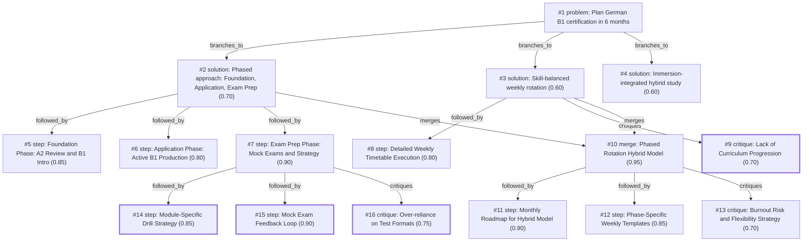

# b1-exam · ollama-cloud/gemma4:31b · index

**Task:** I work full time and want to pass the German B1 exam in 6 months, starting from A2. I can study about 1 hour on weekdays and 3 hours on weekend days. How should I plan it?

| Thoughts | Calls | Tokens in / out | Time | Finish | First try valid | Next picked | Max depth | Weight spread | Duplicates |
|---|---|---|---|---|---|---|---|---|---|
| 16 | 10 | 30931 / 10915 | 59s | budget | 1/9 | 5/8 | 3 | 0.06 | 0 |

Failures: schema 11

## Answer from the graph

To pass your German B1 exam in six months while working full-time, you need a strategy that balances steady linguistic growth with targeted exam preparation. With 11 hours available per week, your best approach is a **Phased Hybrid Model**.

### The 6-Month Roadmap

**Phase 1: Foundation (Months 1–2)**
*   **Goal:** Close any remaining A2 gaps and introduce core B1 grammar and vocabulary.
*   **Focus:** Understanding the "mechanics" of the language. Don't worry about exam formats yet; focus on building a solid base of intermediate structures (e.g., subordinate clauses, passive voice, and adjective endings).

**Phase 2: Application (Months 3–4)**
*   **Goal:** Move from passive understanding to active production.
*   **Focus:** Applying your knowledge. Start writing short essays, engaging in longer conversations, and listening to B1-level podcasts. This is where you bridge the gap between "knowing" the rule and "using" it.

**Phase 3: Exam Preparation (Months 5–6)**
*   **Goal:** Mastery of the exam format, timing, and strategy.
*   **Focus:** High-intensity drills and simulation. Use official materials (Goethe, TELC, or ÖSD) to ensure you are practicing the exact task types you will encounter.

---

### Weekly Execution Plan

To maintain balance without burnout, use a rotation for your weekdays and a "simulation" approach for your weekends.

**Weekdays (1 hour/day): Module-Specific Drills**
Dedicate each day to a specific skill to ensure no area is neglected:
*   **Monday:** Reading & Vocabulary expansion.
*   **Tuesday:** Listening comprehension.
*   **Wednesday:** Writing (practicing specific exam task types).
*   **Thursday:** Speaking & Pronunciation (record yourself or use a partner).
*   **Friday:** Grammar review and "weak point" cleanup.

**Weekends (3 hours/day): Simulation & Analysis**
*   **Saturday:** Complete a full-length mock exam under strict timed conditions. This builds the mental stamina required for the actual test.
*   **Sunday:** The **Feedback Loop**. Spend your time on "error analysis." Instead of just checking the correct answer, categorize *why* you missed it (e.g., "Vocabulary gap in the 'Environment' topic" or "Confusion with Dative cases"). Use this list to prioritize your study for the coming week.

---

### Risks to Watch For

1.  **The "Test-Taker" Trap:** There is a risk of becoming good at the *test* without becoming good at the *language*. If you only do mock exams, a slight change in topic on the actual test day can be disorienting. **Mitigation:** Spend 20% of your time on "real-world" German—read a news article or watch a video that has nothing to do with the exam.
2.  **Burnout:** Studying every single day after a full workday is demanding. Be flexible; if you miss a weekday, don't try to cram five hours on Saturday. Simply resume the rotation.
3.  **Passive Learning:** Avoid spending your hour just listening to audio. Ensure you are actively writing or speaking to move the knowledge into your long-term memory.

*Used: #1, #2, #7, #14, #15, #16*

## Index

```text
#1 [problem] Plan German B1 certification in 6 months · expanded
  #2 [solution] Phased approach: Foundation, Application, Exam Prep · w 0.70 · expanded
    #5 [step] Foundation Phase: A2 Review and B1 Intro · w 0.85 · open
    #6 [step] Application Phase: Active B1 Production · w 0.80 · open
    #7 [step] Exam Prep Phase: Mock Exams and Strategy · w 0.90 · expanded
      #14 [step] Module-Specific Drill Strategy · w 0.85 · done
      #15 [step] Mock Exam Feedback Loop · w 0.90 · done
      #16 [critique] Over-reliance on Test Formats · w 0.75 · done
  #3 [solution] Skill-balanced weekly rotation · w 0.60 · expanded
    #8 [step] Detailed Weekly Timetable Execution · w 0.80 · open
    #9 [critique] Lack of Curriculum Progression · w 0.70 · done
    #10 [merge] Phased Rotation Hybrid Model · w 0.95 · expanded · also from #2
      #11 [step] Monthly Roadmap for Hybrid Model · w 0.90 · open
      #12 [step] Phase-Specific Weekly Templates · w 0.85 · open
      #13 [critique] Burnout Risk and Flexibility Strategy · w 0.70 · open
  #4 [solution] Immersion-integrated hybrid study · w 0.60 · open
```

## Graph



## Thoughts

### #1 [problem] Plan German B1 certification in 6 months
w 1.00 · expanded · depth 0 · from –

Goal: Pass the German B1 exam within 6 months. 
Starting point: A2 level proficiency.
Constraints: 
- Time available: 1 hour/day (Mon-Fri) and 3 hours/day (Sat-Sun), totaling 11 hours per week.
- Total study time: Approx. 286 hours over 26 weeks.
Unknowns: Specific exam board (Goethe, TELC, ÖSD), current strengths/weaknesses within A2, and access to learning materials/tutors.
A good result must be a structured weekly/monthly study plan that balances the four core skills (Reading, Writing, Listening, Speaking) while fitting into a full-time work schedule.

> This defines the objective, constraints, and success criteria for the planning task.

### #2 [solution] Phased approach: Foundation, Application, Exam Prep
w 0.70 · expanded · depth 1 · from #1

Divide the 6 months into three phases: 
1. Month 1-2: Closing A2 gaps and introducing B1 grammar/vocab (Foundation).
2. Month 3-4: Active production and intermediate comprehension (Application).
3. Month 5-6: Intensive exam-specific drills and mock tests (Exam Prep).
This ensures the learner doesn't jump into test formats before they have the linguistic tools.

> A structured phased approach prevents burnout and ensures a logical progression from A2 to B1.

### #3 [solution] Skill-balanced weekly rotation
w 0.60 · expanded · depth 1 · from #1

Assign specific skills to specific days to ensure balance: 
- Mon/Wed: Grammar and Reading (1h).
- Tue/Thu: Listening and Vocabulary (1h).
- Fri: Writing practice (1h).
- Sat/Sun: Speaking (with partner/tutor) and comprehensive review/long-form reading (3h each).

> Ensures all four exam modules are covered weekly without overloading any single day.

### #4 [solution] Immersion-integrated hybrid study
w 0.60 · open · depth 1 · from #1

Combine formal study hours with 'passive' immersion to maximize time: 
- Formal hours: Textbook, grammar exercises, writing.
- Passive hours (commute/lunch): German podcasts, music, news apps (e.g., Deutsche Welle).
- This shifts the focus from 'studying' to 'using' the language during workdays.

> Effective for full-time workers to increase exposure beyond the strict 11-hour limit.

### #5 [step] Foundation Phase: A2 Review and B1 Intro
w 0.85 · open · depth 2 · from #2

Months 1-2 (approx. 88 hours). Focus: 40% on reviewing A2 weak points, 60% on new B1 grammar (Passive, Subordinate clauses, Konjunktiv II) and vocabulary. 
Weekly split: 4 weekdays for B1 grammar/vocab, 1 weekday for A2 review, weekends for reading/listening practice and consolidation.

> Establishes the necessary linguistic base before moving to active production.

### #6 [step] Application Phase: Active B1 Production
w 0.80 · open · depth 2 · from #2

Months 3-4 (approx. 88 hours). Focus: Transitioning from passive understanding to active use. 
Weekly split: 2 weekdays writing short essays/emails, 2 weekdays speaking practice (shadowing or tutor), 1 weekday vocabulary expansion. Weekends dedicated to long-form reading and listening comprehension tests.

> Bridges the gap between knowing grammar and using it for the B1 exam.

### #7 [step] Exam Prep Phase: Mock Exams and Strategy
w 0.90 · expanded · depth 2 · from #2

Months 5-6 (approx. 110 hours). Focus: Exam formats, timing, and strategy. 
Weekly split: Weekdays spent on specific module drills (e.g., Writing Part 1). Weekends dedicated to full-length mock exams under timed conditions to build stamina and identify remaining gaps.

> Critical for overcoming test anxiety and optimizing score based on specific board requirements.

### #8 [step] Detailed Weekly Timetable Execution
w 0.80 · open · depth 2 · from #3

Create a detailed weekly timetable for the rotation: 
- Mon: B1 Grammar topic + 2 reading texts.
- Tue: Podcast/Audio exercise + 20 new vocab words.
- Wed: Grammar application + article reading.
- Thu: Listening comprehension + vocabulary review (Anki/Flashcards).
- Fri: One B1-style letter/email writing task.
- Sat: 1h speaking practice, 1h complex text analysis, 1h review.
- Sun: 1h speaking simulation, 2h weak-point reinforcement.

> Provides the concrete execution steps for the rotation strategy.

### #9 [critique] Lack of Curriculum Progression
w 0.70 · done · depth 2 · from #3

The skill-balanced rotation lacks a progression mechanism. Simply rotating skills without increasing difficulty or moving through a B1 curriculum will lead to stagnation. It needs to be integrated with a structured B1 course book or syllabus to ensure all required B1 topics are covered before the exam.

> Identifies the critical flaw of 'maintenance' vs 'progression'.

### #10 [merge] Phased Rotation Hybrid Model
w 0.95 · expanded · depth 2 · from #3, #2

Combine the structured phases (Foundation, Application, Exam Prep) from #2 with the skill-balanced rotation of #3. Use the rotation as the 'weekly engine' but change the focus of the rotation based on which phase the user is in (e.g., in Foundation phase, Mon/Wed focus on A2 gaps; in Exam phase, Fri focuses on timed exam essays).

> The best approach combines a long-term roadmap with a disciplined weekly habit.

### #11 [step] Monthly Roadmap for Hybrid Model
w 0.90 · open · depth 3 · from #10

Create a monthly roadmap implementing the hybrid model: 
- Month 1-2 (Foundation): Rotation focuses on A2 review and B1 grammar basics. Weekends: Reading longer A2/B1 texts and vocabulary building.
- Month 3-4 (Application): Rotation focuses on complex B1 sentence structures and active usage. Weekends: Speaking practice with a partner and writing essays.
- Month 5-6 (Exam Prep): Rotation focuses on exam-style tasks under time pressure. Weekends: Full-length mock exams and error analysis.

> This translates the high-level merge into a concrete chronological timeline.

### #12 [step] Phase-Specific Weekly Templates
w 0.85 · open · depth 3 · from #10

Define the 'Weekly Engine' templates for each phase: 
- Template A (Foundation): Mon/Wed: A2/B1 Grammar (1h); Tue/Thu: Vocab/Listening (1h); Fri: Short writing (1h); Sat/Sun: Review & Reading (3h).
- Template B (Application): Mon/Wed: B1 Production (1h); Tue/Thu: Listening/Speaking (1h); Fri: B1 Essays (1h); Sat/Sun: Conversational practice & Audio (3h).
- Template C (Exam): Mon/Fri: Timed Writing (1h); Tue/Thu: Reading/Listening drills (1h); Wed: Grammar cleanup (1h); Sat/Sun: Mock tests (3h).

> Provides the specific daily structure the user needs to execute the plan.

### #13 [critique] Burnout Risk and Flexibility Strategy
w 0.70 · open · depth 3 · from #10

Risk: The user works full time and might suffer burnout or 'decision fatigue' if the plan is too rigid. 
Fix: Incorporate a 'buffer' system—e.g., if a weekday is missed, use 1 hour of Saturday's time to catch up, and allow one 'maintenance day' per month with no new material.

> Addresses the reality of full-time employment and sustainability.

### #14 [step] Module-Specific Drill Strategy
w 0.85 · done · depth 3 · from #7

Break down the 1-hour weekday sessions into targeted skill-drills: Monday (Reading/Vocab), Tuesday (Listening), Wednesday (Writing), Thursday (Speaking/Pronunciation), Friday (Grammar Review). Use official exam materials (Goethe/TELC) to ensure the vocabulary and task types match the actual test.

> Provides the concrete daily structure needed to make the weekday hour productive.

### #15 [step] Mock Exam Feedback Loop
w 0.90 · done · depth 3 · from #7

On weekends, complete a full mock exam. Spend the remaining weekend hours on 'error analysis': categorize mistakes (e.g., 'Case ending error' or 'Lack of vocab for environment topic') and create a targeted review list for the following weekdays.

> Ensures that mock exams are a learning tool, not just a measurement tool.

### #16 [critique] Over-reliance on Test Formats
w 0.75 · done · depth 3 · from #7

Focusing exclusively on mock exams in the final 2 months can lead to 'test-taking skill' without genuine language proficiency, making the learner vulnerable to slight variations in exam topics. Mitigation: Keep 20% of study time for spontaneous conversation or reading non-exam texts.

> Prevents the common mistake of memorizing patterns instead of learning the language.

