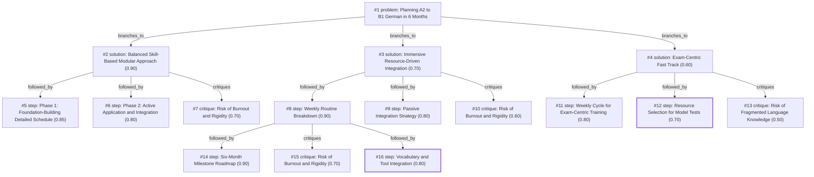

# b1-exam · ollama-cloud/gemma4:31b · path

**Task:** I work full time and want to pass the German B1 exam in 6 months, starting from A2. I can study about 1 hour on weekdays and 3 hours on weekend days. How should I plan it?

| Thoughts | Calls | Tokens in / out | Time | Finish | First try valid | Next picked | Max depth | Weight spread | Duplicates |
|---|---|---|---|---|---|---|---|---|---|
| 16 | 7 | 6437 / 3082 | 19s | budget | 6/6 | 0/5 | 3 | 0.10 | 3 |

## Answer from the graph

To pass the German B1 exam in six months while working full-time, you need a structured, phased approach that balances theoretical learning with active application. With 11 hours available per week, the key is to use your weekdays for focused, short-burst input and your weekends for deeper immersion and output.

### The Strategy: A Three-Phase Modular Approach

#### Phase 1: Foundation Building (Months 1–2)
The goal here is to bridge the gap from A2 and master core B1 grammar and vocabulary.
*   **Weekdays (1 hour):** Split your time between 30 minutes of B1 grammar (focusing on Passive voice, Subjunctive II, and relative clauses) and 30 minutes of vocabulary drills using flashcards or Anki.
*   **Weekends (3 hours):** Dedicate 1 hour to comprehensive reading, 1 hour to listening to B1-level podcasts (such as *Slow German*), and 1 hour to reviewing the mistakes you made during the week.

#### Phase 2: Active Application and Integration (Months 3–4)
Shift your focus from learning rules to using the language.
*   **Weekdays (1 hour):** Spend 30 minutes reading B1-level news articles or short stories and 30 minutes writing short essays or formal emails (typical of B1 exam tasks).
*   **Weekends (3 hours):** Prioritize output. Spend 1.5 hours on speaking practice (via a tutor or language exchange partner), 1 hour listening to authentic B1 media, and 30 minutes on vocabulary maintenance.

#### Phase 3: Exam Sprint (Months 5–6)
The final two months should be dedicated specifically to the format of your chosen exam (Goethe, Telc, or ÖSD).
*   **Focus:** Take full-length mock exams to build stamina and familiarize yourself with the timing.
*   **Targeted Correction:** Use your weekday hours to drill the specific areas where you lose points in the mock tests (e.g., if your listening score is low, replace grammar drills with listening exercises).

### Risks to Watch For

*   **Burnout and Rigidity:** Balancing a full-time job with 11 hours of study is demanding. If you have an exhausting workday, don't let a missed session derail your progress. 
*   **The Solution:** Implement a "Minimum Viable Study" rule. On high-stress days, commit to just 15 minutes of review. This maintains the habit and prevents the guilt of a "failed" day without causing burnout.

*Used: #1, #2, #5, #6, #7*

## Index

```text
#1 [problem] Planning A2 to B1 German in 6 Months · expanded
  #2 [solution] Balanced Skill-Based Modular Approach · w 0.90 · expanded
    #5 [step] Phase 1: Foundation-Building Detailed Schedule · w 0.85 · open
    #6 [step] Phase 2: Active Application and Integration · w 0.80 · open
    #7 [critique] Risk of Burnout and Rigidity · w 0.70 · open
  #3 [solution] Immersive Resource-Driven Integration · w 0.70 · expanded
    #8 [step] Weekly Routine Breakdown · w 0.90 · expanded
      #14 [step] Six-Month Milestone Roadmap · w 0.90 · open
      #15 [critique] Risk of Burnout and Rigidity · w 0.70 · open
      #16 [step] Vocabulary and Tool Integration · w 0.80 · done
    #9 [step] Passive Integration Strategy · w 0.80 · open
    #10 [critique] Risk of Burnout and Rigidity · w 0.60 · open
  #4 [solution] Exam-Centric Fast Track · w 0.60 · expanded
    #11 [step] Weekly Cycle for Exam-Centric Training · w 0.80 · open
    #12 [step] Resource Selection for Model Tests · w 0.70 · done
    #13 [critique] Risk of Fragmented Language Knowledge · w 0.50 · open
```

## Graph



## Thoughts

### #1 [problem] Planning A2 to B1 German in 6 Months
w 1.00 · expanded · depth 0 · from –

Goal: Pass the German B1 exam within 6 months starting from an A2 level. 
Constraints: Limited study time (1 hour/weekday, 3 hours/weekend day), totaling approximately 11 hours per week. 
Unknowns: Specific B1 exam provider (e.g., Goethe, Telc, ÖSD), current A2 proficiency strength, and available learning resources.
Success Criteria: A structured study plan that covers B1 grammar, vocabulary, and the four language skills (Reading, Writing, Listening, Speaking) while fitting into a full-time work schedule.

> This establishes the foundation and constraints for the entire planning process.

### #2 [solution] Balanced Skill-Based Modular Approach
w 0.90 · expanded · depth 1 · from #1

Divide the 6 months into three phases: 1. Foundation (Months 1-2: B1 grammar and core vocab), 2. Application (Months 3-4: Active usage and listening/reading immersion), 3. Exam Sprint (Months 5-6: Mock exams and targeted weakness correction). Use weekdays for focused input (grammar/vocab) and weekends for output (writing/speaking) and review.

> This provides a logical progression from learning to practicing to testing, respecting the time constraints.

### #3 [solution] Immersive Resource-Driven Integration
w 0.70 · expanded · depth 1 · from #1

Focus on integrating German into the full-time workday (passive listening during commutes, switching phone language) to supplement the 11 hours of active study. Use a B1-specific textbook (e.g., Menschen or Begegnungen) as the primary spine, dedicating weekdays to textbook chapters and weekends to conversational practice with a tutor or language exchange partner.

> Maximizes available time through passive learning, but relies heavily on finding a consistent external partner.

### #4 [solution] Exam-Centric Fast Track
w 0.60 · expanded · depth 1 · from #1

Prioritize the specific patterns of the B1 exam (Goethe/Telc) from the start. Spend 50% of all study time on 'Modellsätze' (model tests) and the other 50% on filling the grammar gaps identified by those tests. This approach optimizes for the test score rather than general fluency.

> High efficiency for passing the test, but risks creating 'Swiss cheese' knowledge with significant gaps in general communication.

### #5 [step] Phase 1: Foundation-Building Detailed Schedule
w 0.85 · open · depth 2 · from #2

Months 1-2 focus on B1 grammar (Passive, Subjunctive II, relative clauses) and expanding vocabulary to ~2500 words. Weekdays (1hr): 30m grammar exercises, 30m vocabulary drills (Anki/Flashcards). Weekends (3hrs): 1hr comprehensive reading, 1hr listening to podcasts (e.g., Slow German), 1hr reviewing the week's errors.

> Provides concrete daily actions for the first stage of the proposed solution.

### #6 [step] Phase 2: Active Application and Integration
w 0.80 · open · depth 2 · from #2

Months 3-4 shift from theory to usage. Weekdays (1hr): 30m B1-level reading (news/articles), 30m writing short essays or emails. Weekends (3hrs): 1.5hrs speaking practice (italki or language exchange), 1hr listening to authentic B1 media, 30m vocabulary maintenance.

> Ensures the transition from passive knowledge to active production required for B1.

### #7 [critique] Risk of Burnout and Rigidity
w 0.70 · open · depth 2 · from #2

The 11-hour weekly commitment is tight for a full-time worker. If a workday is exhausting, the 1-hour slot may be missed, leading to a backlog. Suggestion: Include a 'buffer day' or a 'minimum viable study' version (15 mins) for high-stress days to maintain the habit without guilt.

> Addresses the psychological reality of full-time work constraints.

### #8 [step] Weekly Routine Breakdown
w 0.90 · expanded · depth 2 · from #3

Divide the 11 active hours into a repeatable cycle: 
- Monday-Thursday: 1 hour each on textbook-based grammar and vocabulary (B1 units).
- Friday: 1 hour review and writing practice (short essays/emails).
- Saturday: 2 hours focused on Reading and Listening exercises from exam mocks.
- Sunday: 1 hour speaking session with a tutor/partner, 1 hour planning and review for the next week.

> Provides a concrete schedule that fits the user's specific time constraints.

### #9 [step] Passive Integration Strategy
w 0.80 · open · depth 2 · from #3

Implement a 'hidden' study hour daily: 
- Commute: Listen to B1-level podcasts (e.g., 'Slow German' or 'Coffee Break German').
- Work breaks: Use flashcards (Anki/Quizlet) for 10 minutes.
- Environment: Change smartphone and OS language to German to force familiarity with technical vocabulary.

> Maximizes the limited timeframe by utilizing dead time for language exposure.

### #10 [critique] Risk of Burnout and Rigidity
w 0.60 · open · depth 2 · from #3

The plan assumes consistent energy after a full workday. If the user is exhausted, the 1-hour weekday block may feel overwhelming, leading to abandonment. Recommendation: Implement a 'Minimum Viable Day' (15 mins) to maintain the habit during high-stress work weeks.

> Identifies a common failure point for working professionals and offers a mitigation strategy.

### #11 [step] Weekly Cycle for Exam-Centric Training
w 0.80 · open · depth 2 · from #4

Divide the 11 weekly hours: Weekdays (5 hours) dedicated to focused vocabulary and grammar drills derived from model tests. Weekends (6 hours) dedicated to simulated exam sections: Saturday for Reading and Listening (with analysis of errors), Sunday for Writing and Speaking (using prompts from model tests).

> Provides a concrete temporal structure that respects the user's time constraints.

### #12 [step] Resource Selection for Model Tests
w 0.70 · done · depth 2 · from #4

Identify and acquire official model sets (Modellsätze) from the chosen provider (Goethe or Telc). Use a B1-specific vocabulary list (Wortliste) and cross-reference every unknown word found in the model tests to ensure targeted learning.

> Essential for ensuring the 'Exam-Centric' approach is based on valid material.

### #13 [critique] Risk of Fragmented Language Knowledge
w 0.50 · open · depth 2 · from #4

Prioritizing model tests over a systematic textbook can lead to 'blind spots' in grammar or vocabulary that aren't frequently tested but are necessary for B1 comprehension. To mitigate this, a basic B1 grammar overview should be skimmed monthly.

> Identifies a significant weakness in the 'fast track' approach regarding long-term retention.

### #14 [step] Six-Month Milestone Roadmap
w 0.90 · open · depth 3 · from #8

Break the 6-month period into phases: 
- Months 1-3: Core B1 Content Acquisition. Complete the chosen B1 textbook, focusing on grammar and expanding vocabulary. 
- Month 4: Skill Integration. Transition from textbook exercises to authentic materials (news, podcasts) and longer writing tasks. 
- Months 5-6: Exam Simulation. Focus exclusively on mock exams, timing, and refining weak points based on test results.

> Provides the necessary chronological structure to ensure the weekly routine leads to the exam goal.

### #15 [critique] Risk of Burnout and Rigidity
w 0.70 · open · depth 3 · from #8

A strict 11-hour weekly schedule may be unsustainable for a full-time worker. If a workday is particularly stressful, missing a session can lead to a 'snowball effect' of feeling behind. The plan needs a 'buffer zone' or a simplified 'minimum viable study' version for bad days to maintain momentum.

> Identifies a common failure point in high-intensity study plans for working professionals.

### #16 [step] Vocabulary and Tool Integration
w 0.80 · done · depth 3 · from #8

Implement a Spaced Repetition System (SRS) like Anki or Quizlet to maximize the 1-hour weekday slots. Instead of spending the whole hour on a textbook, allocate 15 minutes to SRS flashcards (can be done during breaks at work) and 45 minutes to active textbook study, effectively increasing total study time without adding burden.

> Optimizes the limited time constraint by leveraging dead time and efficient memory techniques.

