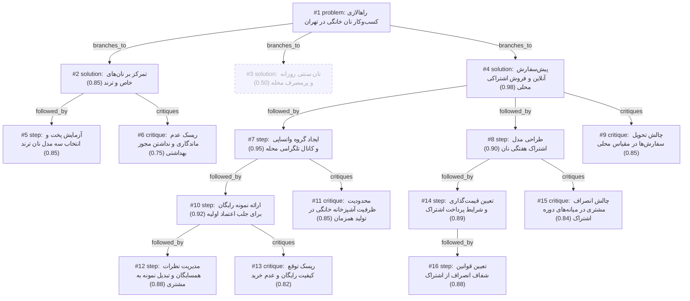

# bakery · gemini/gemini-3.5-flash-lite · index

**Task:** می‌خواهم در محله‌ام در تهران یک کسب‌وکار کوچک فروش نان خانگی راه بیندازم. حدود ۵۰ میلیون تومان سرمایه دارم و فقط آشپزخانهٔ خانه‌ام را. از کجا و چطور شروع کنم؟

| Thoughts | Calls | Tokens in / out | Time | Finish | First try valid | Next picked | Max depth | Weight spread | Duplicates |
|---|---|---|---|---|---|---|---|---|---|
| 16 | 9 | 12138 / 3755 | 19s | budget | 8/8 | 6/7 | 4 | 0.06 | 0 |

## Answer from the graph

راه‌اندازی کسب‌وکار نان خانگی در تهران با ۵۰ میلیون تومان سرمایه و استفاده از آشپزخانه منزل، یک ایده جذاب و کم‌ریسک است؛ به شرط آنکه با استراتژی دقیقِ «پیش‌سفارش» و تمرکز بر «بازار محلی» پیش بروید. با این بودجه می‌توانید تجهیزات اولیه مورد نیاز (مانند قالب‌های باکیفیت، آرد مرغوب، ابزار ورز دادن و بسته‌بندی مناسب) را تهیه کنید.

در ادامه، نقشه راه گام‌به‌گام و چالش‌هایی که باید مراقب آن‌ها باشید آورده شده است:

### گام‌های اجرایی برای شروع

۱. **آزمایش پخت و تمرکز بر نان‌های خاص و ترند:**
پیش از شروع فروش، سه مدل نان پرطرفدار و ترند (مانند نان‌های سبوس‌دار خاص، نان‌های خمیرترش یا فانتزی‌های سالم خانگی) را انتخاب کنید و چندبار در آشپزخانه خود بپزید تا به کیفیت ثابتی برسید. از نان‌های سنتی روزانه و ارزان‌قیمت محله دوری کنید، چون رقابت با نانوایی‌ها در آن بخش با مقیاس خانگی منطقی نیست.

۲. **ایجاد گروه واتساپی و کانال تلگرامی محله:**
یک کانال تلگرام یا گروه واتساپی مختص ساختمان، کوچه‌ها و بلوک‌های اطراف محله خود بسازید. خودتان را معرفی کنید، داستان کسب‌وکار کوچک‌تان را بگویید و روزهای مشخصی را برای پخت (مثلاً دوشنبه‌ها و پنج‌شنبه‌ها) اعلام کنید تا سفارش‌ها ثبت شوند.

۳. **طراحی مدل اشتراک هفتگی نان:**
برای پایداری درآمد، مدل فروش را بر پایه «اشتراک هفتگی» بچینید. مثلاً به مشتریان پیشنهاد دهید که با خرید اشتراک یک‌ماخه (هفته‌ای دو روز)، نان تازه خود را در ساعت مشخصی تحویل بگیرند. برای این کار، قیمت‌گذاری شفاف و شرایط پرداخت مشخصی در نظر بگیرید و قوانین انصراف از اشتراک (مثلاً اعلام ۲۴ ساعت قبل) را از ابتدا به صراحت بیان کنید.

۴. **ارائه نمونه رایگان برای جلب اعتماد اولیه:**
برای اعتمادسازی در میان همسایگان، تعداد محدودی از نان‌های پخته‌شده را به عنوان نمونه رایگان به مدیر ساختمان یا چند همسایه شاخص هدیه دهید. بلافاصله پس از توزیع، در گروه محلی پیگیر نظراتشان شوید و بلافاصله لینک ثبت سفارش هفته اول را همراه با تخفیف معرفی کنید.

---

### ریسک‌ها و چالش‌هایی که باید مراقب آن‌ها باشید

* **محدودیت ظرفیت آشپزخانه خانگی:** فر و فضای منزل شما محدود است. اگر تعداد سفارش‌ها ناگهان بالا برود، کیفیت نان افت می‌کند یا زمان‌بندی تحویل به هم می‌خورد. حتماً برای تعداد سفارش‌های هفتگی «سقف مشخص» تعیین کنید تا کیفیت حفظ شود.
* **چالش تحویل سفارش‌ها:** از آنجا که پخت در حجم محدود انجام می‌شود، استفاده از پیک موتوری سود شما را از بین می‌برد. بهترین راه حل این است که تحویل سفارش‌ها به صورت حضوری درب منزل خودتان در ساعات مشخص انجام شود یا تحویل همسایگان نزدیک را به صورت تجمیعی مدیریت کنید.
* **ریسک توقع کیفیت رایگان و قیمت‌گذاری:** ممکن است برخی همسایگان نمونه رایگان را بپسندند اما به دلیل بالاتر بودن قیمت نان خانگی نسبت به نانوایی سنتی، حاضر به خرید نشوند. برای حل این چالش، باید روی ارزش افزوده کار خود (سلامت مواد، بدون مواد افزودنی، تازگی مطلق و ارزش غذایی بالا) مانور دهید.
* **چالش‌های انصراف و عدم ماندگاری:** نان‌های خانگی فاقد مواد نگهدارنده هستند و ماندگاری پایینی دارند. همچنین ممکن است برخی مشتریان در میانه‌های دوره اشتراک درخواست انصراف و بازگشت وجه کنند که باید قوانین آن از قبل مکتوب و روشن باشد. همچنین مراقب الزامات بهداشتی خانگی باشید تا مشکلی از سمت هم ساختمان ایجاد نشود.

*Used: #1, #2, #4, #5, #6, #7, #8, #9, #10, #11, #12, #13, #14, #15, #16*

## Index

```text
#1 [problem] راهالازی کسب‌وکار نان خانگی در تهران · expanded
  #2 [solution] تمرکز بر نان‌های خاص و ترند · w 0.85 · expanded
    #5 [step] آزمایش پخت و انتخاب سه مدل نان ترند · w 0.85 · open
    #6 [critique] ریسک عدم ماندگاری و نداشتن مجوز بهداشتی · w 0.75 · open
  #3 [solution] نان سنتی روزانه و پرمصرف محله · w 0.50 · dead end
  #4 [solution] پیش‌سفارش آنلاین و فروش اشتراکی محلی · w 0.98 · expanded
    #7 [step] ایجاد گروه واتساپی و کانال تلگرامی محله · w 0.95 · expanded
      #10 [step] ارائه نمونه رایگان برای جلب اعتماد اولیه · w 0.92 · expanded
        #12 [step] مدیریت نظرات همسایگان و تبدیل نمونه به مشتری · w 0.88 · open, max depth
        #13 [critique] ریسک توقع کیفیت رایگان و عدم خرید · w 0.82 · open, max depth
      #11 [critique] محدودیت ظرفیت آشپزخانه خانگی در تولید همزمان · w 0.85 · open
    #8 [step] طراحی مدل اشتراک هفتگی نان · w 0.90 · expanded
      #14 [step] تعیین قیمت‌گذاری و شرایط پرداخت اشتراک · w 0.89 · expanded
        #16 [step] تعیین قوانین شفاف انصراف از اشتراک · w 0.88 · open, max depth
      #15 [critique] چالش انصراف مشتری در میانه‌های دوره اشتراک · w 0.84 · open
    #9 [critique] چالش تحویل سفارش‌ها در مقیاس محلی · w 0.85 · open
```

## Graph



## Thoughts

### #1 [problem] راهالازی کسب‌وکار نان خانگی در تهران
w 1.00 · expanded · depth 0 · from –

هدف: راه‌اندازی کسب‌وکار کوچک فروش نان خانگی در یکی از محله‌های تهران.
محدودیت‌ها و دارایی‌ها: ۵۰ میلیون تومان سرمایه اولیه، استفاده انحصاری از آشپزخانه منزل.
نامشخص‌ها: نوع دقیق نان پرمخاطب، نحوه بازاریابی محلی، تجهیزات لازم برای شروع با این بودجه، و الزامات قانونی احتمالی.
نتیجه مطلوبه: یک نقشه راه عملی، گام‌به‌گام و کم‌ریسک برای راه‌اندازی و فروش اولیه.

> این تفکر به دقت تمام محدودیت‌ها، دارایی‌ها و اهداف مسئله را تعریف می‌کند تا پایه و اساس حل مسئله باشد.

### #2 [solution] تمرکز بر نان‌های خاص و ترند
w 0.85 · expanded · depth 1 · from #1

تمرکز بر پخت نان‌های ترند و خاص (مانند نان‌های خمیر ترش، گیسو، یا نان‌های رژیمی و مغزدار) که سودآوری بالاتری دارند و در نانوایی‌های معمولی پیدا نمی‌شوند.

> با سرمایه و فضای محدود، رقابت با نان‌های سنتی ارزان ممکن نیست، پس باید روی ارزش افزوده بالا تمرکز کرد.

### #3 [solution] نان سنتی روزانه و پرمصرف محله
w 0.50 · dead_end · depth 1 · from #1

تولید انبوه نان‌های سنتی پرمصرف مثل لواش، سنگک یا بربری خانگی با کیفیت بالاتر و تحویل گرم به دست همسایگان.

> فضای آشپزخانه خانگی و فر خانگی برای تولید انبوه نان‌های سنتی مناسب نیست و حاشیه سود کمتری دارد.

### #4 [solution] پیش‌سفارش آنلاین و فروش اشتراکی محلی
w 0.98 · expanded · depth 1 · from #1

پخت بر اساس سفارش هفتگی و ایجاد کانال در شبکه‌های اجتماعی محلی (مثل تلگرام یا گروه‌های واتساپی ساختمان و محله) برای فروش بدون دورریز.

> این روش ریسک سرمایه‌گذاری را کم می‌کند چون مواد اولیه به اندازه سفارش تهیه می‌شود و دورریز نان به صفر می‌رسد.

### #5 [step] آزمایش پخت و انتخاب سه مدل نان ترند
w 0.85 · open · depth 2 · from #2

با بخش کوچکی از سرمایه، مواد اولیه باکیفیت تهیه کنید و سه مدل نان ترند (مثلا نان خمیرترش ساده، نان جو دوسر رژیمی، و نان مغزدار دارچینی) را در آشپزخانه خانگی بپزید تا بافت و ماندگاری آن‌ها در فر خانگی استانداردسازی شود.

> این گام عملیاتی برای اعتبارسنجی کیفیت محصول قبل از ورود به بازار است.

### #6 [critique] ریسک عدم ماندگاری و نداشتن مجوز بهداشتی
w 0.75 · open · depth 2 · from #2

نان‌های خانگی بدون مواد نگهدارنده ماندگاری کوتاهی دارند و فروش خانگی در تهران ممکن است با چالش‌های نظارت بهداشتی مواجه شود. راهکار این است که در ابتدا فروش را صرفا به صورت پیش‌سفارش محدود و در سطح آشنایان و همسایگان معتمد شروع کنید.

> اشاره به یک ریسک قانونی و اجرایی مهم و ارائه راهکار کاهش خطر.

### #7 [step] ایجاد گروه واتساپی و کانال تلگرامی محله
w 0.95 · expanded · depth 2 · from #4

راه‌اندازی یک کانال تلگرام و گروه واتساپی مختص ساختمان و کوچه‌های اطراف، معرفی اولیه خود، اعلام روزهای پخت (مثلا دوشنبه و پنج‌شنبه) و ثبت سفارش از طریق پیام مستقیم.

> این گام مستقیماً مدل فروش پیش‌سفارش را در سطح محلی فعال می‌کند.

### #8 [step] طراحی مدل اشتراک هفتگی نان
w 0.90 · expanded · depth 2 · from #4

ارائه بسته‌های اشتراک ۴ هفته‌ای با تخفیف ویژه (مثلا دریافت نان تازه هر دوشنبه و پنج‌شنبه) تا هم مشتری وفادار جذب شود و هم پیشاپیش سرمایه در گردش کوچکی تامین گردد.

> اشتراک هفتگی جریان نقدینگی ثابتی ایجاد می‌کند که با سرمایه ۵۰ میلیونی بسیار حیاتی است.

### #9 [critique] چالش تحویل سفارش‌ها در مقیاس محلی
w 0.85 · open · depth 2 · from #4

با توجه به اینکه آشپزخانه در منزل است و پخت در حجم محدود انجام می‌شود، هزینه و زمان ارسال پیک برای تعداد سفارش کم ممکن است سود را از بین ببرد. راه حل: تحویل حضوری درب منزل در ساعات مشخص یا تجمیع ارسال برای همسایگان نزدیک.

> لجستیک و تحویل پاشنه آشیل فروش خانگی است و باید از ابتدا حل شود.

### #10 [step] ارائه نمونه رایگان برای جلب اعتماد اولیه
w 0.92 · expanded · depth 3 · from #7

برای اعتمادسازی در گروه محله‌ای، تعداد محدودی نان تست یا بربری خانگی کوچک به عنوان نمونه رایگان به چند همسایه شاخص یا مدیر ساختمان هدیه دهید تا کیفیت کار دیده شود.

> در کسب‌وکار غذایی خانگی، اعتماد اولیه سخت به دست می‌آید و نمونه رایگان بهترین کاتالیزور فروش است.

### #11 [critique] محدودیت ظرفیت آشپزخانه خانگی در تولید همزمان
w 0.85 · open · depth 3 · from #7

فر و فضای خانگی محدود است؛ اگر تعداد سفارش‌های هفتگی از ظرفیت فر خانگی بیشتر شود، کیفیت افت می‌کند یا زمان‌بندی تحویل به هم می‌خورد. باید سقف سفارش هفتگی تعیین شود.

> پخت خانگی مقیاس‌پذیری پایینی دارد و مدیریت توقع مشتریان بسیار حیاتی است.

### #12 [step] مدیریت نظرات همسایگان و تبدیل نمونه به مشتری
w 0.88 · open · depth 4 · from #10

پس از اتمام توزیع نمونه‌های رایگان، بلافاصله در گروه پیام پیگیر نظرات شوید و از کسانی که نمونه دریافت کرده‌اند بخواهید نظرشان را بنویسند. بلافاصله لینک ثبت سفارش هفته اول را با تخفیف معرفی کنید.

> تبدیل بازخورد اولیه به سفارش قطعی نقطه عطف بازاریابی دهان‌به‌دهان است.

### #13 [critique] ریسک توقع کیفیت رایگان و عدم خرید
w 0.82 · open · depth 4 · from #10

ممکن است همسایگان نمونه رایگان را بپسندند اما به خاطر قیمت نان خانگی نسبت به نانوایی سنتی، حاضر به خرید نشوند. باید در کنار نمونه، ارزش افزوده (سلامت، بدون مواد افزودنی، تازگی) برجسته شود.

> آگاه کردن مشتری از توجیه اقتصادی نان خانگی برای حفظ نرخ تبدیل مهم است.

### #14 [step] تعیین قیمت‌گذاری و شرایط پرداخت اشتراک
w 0.89 · expanded · depth 3 · from #8

تعیین قیمت‌گذاری بسته‌های اشتراکی ماهانه به گونه‌ای که ۲۰ درصد تخفیف نسبت به خرید روزانه داشته باشد، اما کل مبلغ در ابتدا یا نیمه ماه دریافت شود تا سرمایه در گردش ۵۰ میلیونی تقویت گردد.

> دریافت پیشاپیش هزینه اشتراک، تنفس مالی خوبی به سرمایه ۵۰ میلیونی می‌دهد و خرید مواد اولیه را تسهیل می‌کند.

### #15 [critique] چالش انصراف مشتری در میانه‌های دوره اشتراک
w 0.84 · open · depth 3 · from #8

اگر مشتری پس از دو هفته از کیفیت ناراضی باشد یا بخواهد اشتراک را لغو کند، بازگرداندن پول پیچیده می‌شود؛ باید قوانین مشخصی برای استرداد وجه یا جایگزینی تدوین شود.

> مدیریت نارضایتی در مدل‌های اشتراکی برای کسب‌وکارهای خانگی بسیار حیاتی است.

### #16 [step] تعیین قوانین شفاف انصراف از اشتراک
w 0.88 · open · depth 4 · from #14

برای پیشگیری از ضرر در صورت لغو اشتراک میان‌دوره، شرایط قرارداد ساده‌ای تعیین شود: مشتری در صورت انصراف تا پیش از شروع هفته سوم، هزینه هفته‌های باقیمانده را (با کسر بهای نان‌های تحویل‌داده شده به نرخ آزاد) پس می‌گیرد، اما برای انصراف در هفته چهارم عودت وجهی انجام نمی‌شود.

> این گام قوانین مالی اشتراک را شفاف و منصفانه می‌کند و به چالش انصراف پاسخ عملی می‌دهد.

