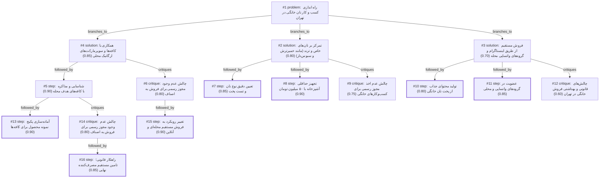

# bakery · gemini/gemini-3.5-flash-lite · path

**Task:** می‌خواهم در محله‌ام در تهران یک کسب‌وکار کوچک فروش نان خانگی راه بیندازم. حدود ۵۰ میلیون تومان سرمایه دارم و فقط آشپزخانهٔ خانه‌ام را. از کجا و چطور شروع کنم؟

| Thoughts | Calls | Tokens in / out | Time | Finish | First try valid | Next picked | Max depth | Weight spread | Duplicates |
|---|---|---|---|---|---|---|---|---|---|
| 16 | 9 | 8591 / 3481 | 36s | budget | 8/8 | 0/7 | 4 | 0.07 | 1 |

## Answer from the graph

راه‌اندازی کسب‌وکار نان خانگی در تهران با ۵۰ میلیون تومان سرمایه و استفاده از آشپزخانه منزل، یک ایده جذاب و کاملاً امکان‌پذیر است؛ به شرط آنکه هوشمندانه و قدم‌به‌قدم پیش بروید. با توجه به محدودیت فضا و سرمایه، نباید با نان‌های سنتی و ارزان قیمت رقابت کنید، بلکه بهترین رویکرد تمرکز بر **نان‌های خاص، سلامت‌محور و ترند (مانند نان‌های خمیرترش Sourdough، سبوس‌دار و آرتیزان)** است که حاشیه سود بالایی دارند و مشتریان حاضرند برای کیفیت آن‌ها هزینه کنند.

در ادامه، برنامه اجرایی، گام‌های شروع و ریسک‌هایی که باید مراقب آن‌ها باشید آورده شده است:

### گام‌های اجرایی برای شروع

۱. **تعیین دقیق نوع نان و تست پخت:**
   پیش از هر اقدامی، دستورپخت نان‌های انتخابی (مثلاً نان خمیرترش یا تست رژیمی) را چندین بار در خانه تمرین کنید تا کیفیت، بافت و طعم محصول کاملاً تثبیت و استاندارد شود.

۲. **تجهیز حداقلی آشپزخانه با ۵۰ میلیون تومان:**
   بودجه خود را هوشمندانه مدیریت کنید و صرفاً تجهیزات کلیدی بخرید:
   * یک فر برقی رومیزی باکیفیت مناسب پخت نان یا سنگ پخت (Baking Stone)
   * ترازو و ابزار دقیق اندازه‌گیری (برای پخت حرفه‌ای نان، دقت گرمی بسیار مهم است)
   * ظروف تخمیر (فرمنتیشن) خمیر
   * خرید مواد اولیه عمده و باکیفیت (انواع آرد مرغوب)

۳. **تولید محتوا و بازاریابی آنلاین محلی:**
   از مراحل جذاب آماده‌سازی خمیر، ورز دادن و پخت نان در فر ویدیوها و عکس‌های باکیفیت تهیه کنید. این محتوا را در اینستاگرام و به‌خصوص گروه‌های واتساپی و روبیکای محله‌تان منتشر کنید تا اعتماد مشتریان محلی جلب شود.

۴. **بازاریابی B2B (همکاری با کافه‌های محلی):**
   * **تهیه نمونه:** پکیج کوچکی از نمونه‌های پرکاربرد (مانند نان تست سبوس‌دار، نان باگت آرتیزان یا نان برگر) به همراه کارت ویزیت و اطلاعات تماس آماده کنید.
   * **مذاکره:** به ۳ تا ۵ کافه کوچک در محله خود به‌صورت حضوری مراجعه کنید، نمونه‌ها را به مدیر کافه تحویل دهید و پیشنهاد تامین روزانه و تازه نان مورد نیاز آن‌ها را بدهید.

---

### چالش‌ها و ریسک‌هایی که باید مراقب آن‌ها باشید

* **چالش مجوزهای قانونی و فروش به اصناف:** 
  از آنجا که کسب‌وکار شما خانگی است و مجوز رسمی وزارت بهداشت یا اصناف را ندارید، برخی از سوپرمارکت‌ها یا کافه‌های بزرگ ممکن است از خرید محصول شما به دلایل قانونی و بیمه‌ای خودداری کنند. 
  * **راهکار:** تمرکز اصلی خود را روی **فروش مستقیم به مصرف‌کننده نهایی (اهالی محله و سفارش‌های آنلاین)** یا همکاری با کافه‌های کوچک و دوستانه‌ای بگذارید که انعطاف‌پذیرتر هستند.
* **مدیریت حجم تولید و همسایگان:** 
  پخت نان با بو و تردد همراه است. برای جلوگیری از اعتراض همسایگان، حجم تولید را در ابتدا کنترل‌شده نگه دارید و بیشتر روی سفارش‌گیری قبلی و توزیع متمرکز عمل کنید.

*Used: #2, #3, #4, #5, #7, #8, #9, #10, #11, #13, #14, #16*

## Index

```text
#1 [problem] راه اندازی کسب و کار نان خانگی در تهران · expanded
  #2 [solution] تمرکز بر نان‌های خاص و ترند (مانند خمیرترش و سبوس‌دار) · w 0.80 · expanded
    #7 [step] تعیین دقیق نوع نان و تست پخت · w 0.85 · done
    #8 [step] تجهیز حداقلی آشپزخانه با ۵۰ میلیون تومان · w 0.90 · done
    #9 [critique] چالش عدم اخذ مجوز رسمی برای کسب‌وکارهای خانگی · w 0.75 · open
  #3 [solution] فروش مستقیم از طریق اینستاگرام و گروه‌های واتساپی محله · w 0.70 · expanded
    #10 [step] تولید محتوای جذاب از پخت نان خانگی · w 0.80 · done
    #11 [step] عضویت در گروه‌های واتساپی و محلی · w 0.85 · done
    #12 [critique] چالش‌های قانونی و بهداشتی فروش خانگی در تهران · w 0.60 · open
  #4 [solution] همکاری با کافه‌ها و سوپرمارکت‌های ارگانیک محلی · w 0.85 · expanded
    #5 [step] شناسایی و مذاکره با کافه‌های هدف محله · w 0.90 · expanded
      #13 [step] آماده‌سازی پکیج نمونه محصول برای کافه‌ها · w 0.90 · done
      #14 [critique] چالش عدم وجود مجوز رسمی برای فروش به اصناف · w 0.80 · expanded
        #16 [step] راهکار قانونی؛ تامین مستقیم مصرف‌کننده نهایی · w 0.85 · done
    #6 [critique] چالش عدم وجود مجوز رسمی برای فروش به اصناف · w 0.80 · expanded
      #15 [step] تغییر رویکرد به فروش مستقیم محله‌ای و آنلاین · w 0.90 · done
```

## Graph



## Thoughts

### #1 [problem] راه اندازی کسب و کار نان خانگی در تهران
w 1.00 · expanded · depth 0 · from –

هدف: راه‌اندازی کسب‌وکار فروش نان خانگی. محدودیت‌ها و امکانات: ۵۰ میلیون تومان سرمایه اولیه، استفاده صرفاً از آشپزخانه منزل، واقع در تهران. ناشناخته‌ها: نوع نان پرفروش، نحوه بازاریابی محلی، مجوزهای بهداشتی خانگی و لجستیک توزیع. نتیجه مطلوب: برنامه اجرایی گام‌به‌گام برای تولید و فروش سودآور با این امکانات محدود.

> این تفکر صورت مسئله، محدودیت‌ها و اهداف را به دقت مشخص می‌کند تا بستر برای ارائه راه حل فراهم شود.

### #2 [solution] تمرکز بر نان‌های خاص و ترند (مانند خمیرترش و سبوس‌دار)
w 0.80 · expanded · depth 1 · from #1

با توجه به سرمایه کم و پخت خانگی، به جای رقابت با نان‌های سنتی ارزان، روی نان‌های سلامت‌محور، تخصصی و ارگانیک مثل نان خمیرترش (Sourdough) و نان‌های رژیمی تمرکز کنیم که حاشیه سود بالایی دارند.

> نان‌های تخصصی مشتریان خاص خود را دارند و ارزش افزوده بالایی برای جبران محدودیت مقیاس خانگی فراهم می‌کنند.

### #3 [solution] فروش مستقیم از طریق اینستاگرام و گروه‌های واتساپی محله
w 0.70 · expanded · depth 1 · from #1

بدون نیاز به مغازه یا واسطه، از طریق شبکه‌های اجتماعی محلی، اینستاگرام و عضویت در گروه‌های واتساپی و تلگرامی ساختمان‌ها و محله‌های اطراف (مثل منطقه مسکونی خود)، سفارش هفتگی یا روزانه بگیریم.

> این روش هزینه‌های بازاریابی را به حداقل می‌رساند و ارتباط مستقیم با مشتریان محلی ایجاد می‌کند.

### #4 [solution] همکاری با کافه‌ها و سوپرمارکت‌های ارگانیک محلی
w 0.85 · expanded · depth 1 · from #1

پخت نان روزانه و تامین مستقیم نان برای کافه‌های کوچک محله یا سوپرمارکت‌های ارگانیک و خاص که به دنبال نان تازه و باکیفیت برای ساندویچ‌ها یا فروش به مشتریان هستند.

> این روش حجم فروش را تثبیت می‌کند و نیاز به بازاریابی تک‌به‌تک را کاهش می‌دهد.

### #5 [step] شناسایی و مذاکره با کافه‌های هدف محله
w 0.90 · expanded · depth 2 · from #4

مراجعه حضوری به ۳ تا ۵ کافه کوچک در محله، معرفی نمونه نان‌های خانگی، و پیشنهاد تامین نان تست، باگت آرتیزان یا نان صبحانه آن‌ها به صورت تازه و روزانه.

> این گام مستقیماً کانال فروش B2B را فعال کرده و مشتریان ثابتی ایجاد می‌کند.

### #6 [critique] چالش عدم وجود مجوز رسمی برای فروش به اصناف
w 0.80 · expanded · depth 2 · from #4

بسیاری از کافه‌ها و سوپرمارکت‌ها ممکن است برای خرید از یک آشپزخانه خانگی بدون مجوز رسمی بهداشت یا فاکتور رسمی مقاومت کنند.

> این ریسک حقوقی و قانونی می‌تواند مانع بزرگی برای این مدل فروش باشد و باید مدیریت شود.

### #7 [step] تعیین دقیق نوع نان و تست پخت
w 0.85 · done · depth 2 · from #2

ابتدا ۳ مدل نان مشخص (مثلاً نان خمیرترش کلاسیک، نان جو دوسر، و نان سبوس‌دار مغزدار) را انتخاب کنید و نمونه‌های اولیه را با امکانات موجود آشپزخانه بپزید تا از کیفیت و استقامت محصول مطمئن شوید.

> داشتن محصول باکیفیت و متمایز اولین شرط موفقیت این رویکرد است.

### #8 [step] تجهیز حداقلی آشپزخانه با ۵۰ میلیون تومان
w 0.90 · done · depth 2 · from #2

بودجه ۵۰ میلیونی را صرف خرید اقلام کلیدی کنید: یک فر برقی رومیزی باکیفیت یا سنگ پخت (Baking Stone)، ترازو و ابزار دقیق اندازه‌گیری، ظروف فرمنتیشن، و مواد اولیه عمده (آرد باکیفیت).

> این تجهیزات برای تولید نان‌های خاص در مقیاس خانگی کاملاً ضروری و متناسب با بودجه است.

### #9 [critique] چالش عدم اخذ مجوز رسمی برای کسب‌وکارهای خانگی
w 0.75 · open · depth 2 · from #2

فروش نان خانگی در تهران بدون مجوز وزارت بهداشت ممکن است با ریسک نظارت‌های محلی یا شکایت همسایگان (به دلیل بو یا تردد) مواجه شود. باید تولید را در حجم محدود نگه داشت و بیشتر از طریق سفارش‌گیری آنلاین عمل کرد.

> شناخت موانع قانونی و نظارتی از غافلگیری‌های بعدی جلوگیری می‌کند.

### #10 [step] تولید محتوای جذاب از پخت نان خانگی
w 0.80 · done · depth 2 · from #3

با گوشی موبایل از مراحل پخت نان، بوی خوب نان تازه در فضای خانه، و کیفیت مواد اولیه ویدیوهای کوتاه و باکیفیت بگیرید تا در اینستاگرام و واتساپ منتشر کنید و حس اعتماد و اشتها ایجاد شود.

> بازاریابی بصری قوی‌ترین ابزار برای فروش محصولات غذایی خانگی است.

### #11 [step] عضویت در گروه‌های واتساپی و محلی
w 0.85 · done · depth 2 · from #3

شناسایی و عضویت در گروه‌های واتساپی ساختمان‌ها، مجتمع‌های مسکونی و محله‌های اطراف (مثلاً گروه‌های مادران، دورهمی‌های محلی) و ارسال منوی هفتگی همراه با قیمت و شرایط ارسال.

> مستقیماً به جامعه هدف محلی دسترسی پیدا می‌کند بدون اینکه نیاز به هزینه تبلیغات کلان باشد.

### #12 [critique] چالش‌های قانونی و بهداشتی فروش خانگی در تهران
w 0.60 · open · depth 2 · from #3

فروش مواد غذایی خانگی در ایران بدون مجوز رسمی خانه کارگر یا وزارت بهداشت ممکن است با ریسک نظارت‌های بهداشتی محلی یا شکایت همسایگان به خاطر تردد پیک‌ها مواجه شود.

> ریسک قانونی و اجتماعی مهمی است که باید قبل از شروع جدی به آن فکر کرد.

### #13 [step] آماده‌سازی پکیج نمونه محصول برای کافه‌ها
w 0.90 · done · depth 3 · from #5

پخت نمونه‌های کوچک از ۳ مدل نان پرکاربرد در کافه‌ها (مانند نان باگت آرتیزان، نان تست سبوس‌دار و نان برگر) به همراه کارت ویزیت و اطلاعات تماس، برای ارائه جذاب به مدیران کافه‌ها.

> ارائه نمونه فیزیکی و باکیفیت بهترین راه متقاعد کردن کافه‌ها برای تغییر تامین‌کننده است.

### #14 [critique] چالش عدم وجود مجوز رسمی برای فروش به اصناف
w 0.80 · expanded · depth 3 · from #5

کافه‌ها و سوپرمارکت‌ها ممکن است برای خرید نان از یک آشپزخانه خانگی بدون مجوز رسمی اصناف و بهداشت دچار ریسک قانونی یا بیمه‌ای شوند.

> باید راهکاری مانند شروع با توافق غیررسمی یا تمرکز بر فروش مستقیم به مصرف‌کننده خانگی در کنار کافه‌ها در نظر گرفت.

### #15 [step] تغییر رویکرد به فروش مستقیم محله‌ای و آنلاین
w 0.90 · done · depth 3 · from #6

به جای فروش مستقیم به مغازه‌ها، تمرکز بر بازاریابی مستقیم به مصرف‌کننده (B2C) از طریق گروه‌ها و کانال‌های تلگرامی و واتساپی ساختمان‌ها و محله. در این روش نیاز به فاکتور رسمی نیست و اعتماد محلی جایگزین مجوزهای سخت‌گیرانه اصناف می‌شود.

> این گام مستقیماً چالش نداشتن مجوز رسمی برای فروش به اصناف را دور می‌زند و با کمترین هزینه قابل اجراست.

### #16 [step] راهکار قانونی؛ تامین مستقیم مصرف‌کننده نهایی
w 0.85 · done · depth 4 · from #14

با توجه به سخت‌گیری اصناف برای فروش به سوپرمارکت‌ها و کافه‌ها با سرمایه و امکانات خانگی، مدل کسب‌وکار را تغییر داده و مستقیماً روی فروش خانگی به مصرف‌کنندگان نهایی در محله (از طریق کانال‌های تلگرامی محلی، اینستاگرام و واتس‌اپ) تمرکز کنیم تا نیاز به مجوزهای سخت اصناف برای ورود به مغازه‌ها کاهش یابد.

> این گام مستقیماً چالش قانونی عدم مجوز اصناف را دور می‌زند و با تمرکز بر مشتری خرد محلی، ریسک کسب‌وکار را کاهش می‌دهد.

