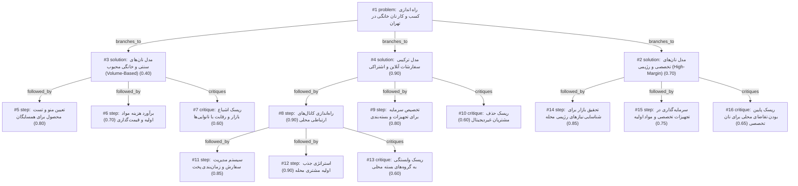

# bakery · ollama-cloud/gemma4:31b · index

**Task:** می‌خواهم در محله‌ام در تهران یک کسب‌وکار کوچک فروش نان خانگی راه بیندازم. حدود ۵۰ میلیون تومان سرمایه دارم و فقط آشپزخانهٔ خانه‌ام را. از کجا و چطور شروع کنم؟

| Thoughts | Calls | Tokens in / out | Time | Finish | First try valid | Next picked | Max depth | Weight spread | Duplicates |
|---|---|---|---|---|---|---|---|---|---|
| 16 | 8 | 22981 / 6814 | 33s | budget | 1/7 | 5/6 | 3 | 0.12 | 0 |

Failures: schema 7

## Answer from the graph

برای شروع کسب‌وکار نان خانگی در تهران با سرمایه ۵۰ میلیون تومان و استفاده از آشپزخانه منزل، بهترین استراتژی، اتخاذ یک **مدل ترکیبی (سفارشی و آنلاین)** است. از آنجایی که فضای شما محدود است، تولید بر اساس سفارش (Made-to-order) منطقی‌ترین راه برای جلوگیری از ضرایع و مدیریت بهینه سرمایه است.

در ادامه، نقشه راه عملیاتی شما در سه مرحله آورده شده است:

### گام اول: زیرساخت و شناسایی بازار
۱. **تحقیق محله‌ای:** ابتدا بررسی کنید همسایگان شما به چه نوع نانی نیاز دارند. آیا نان‌های رژیمی و تخصصی (مانند نان‌های بدون گلوتن یا جو) که حاشیه سود بالایی دارند مورد استقبال قرار می‌گیرند، یا نان‌های سنتی و محبوب خانگی؟
۲. **تخصیص سرمایه:** مبلغ ۵۰ میلیون تومان را بین خرید تجهیزات ضروری (مانند فر صنعتی کوچک یا همزن اگر نیاز است)، مواد اولیه باکیفیت و بسته‌بندی‌های شکیل تقسیم کنید.
۳. **تست محصول:** منوی خود را نهایی کرده و نمونه‌هایی را برای همسایگان نزدیک یا دوستان تست کنید تا کیفیت و طعم نان‌ها تایید شود.

### گام دوم: بازاریابی و جذب مشتری
۱. **راه‌اندازی کانال‌های ارتباطی:** یک گروه واتس‌اپ، تلگرام یا صفحه اینستاگرام محلی ایجاد کنید. برای شروع، در گروه‌های آپارتمانی یا گروه‌های محله‌ای فعال شوید و کسب‌وکارتان را معرفی کنید.
۲. **استراتژی جذب اولیه:** برای شکستن سد تردید مشتریان در مورد بهداشت و کیفیت، از «بسته‌های تست رایگان» یا «تخفیف ویژه برای اولین خرید» استفاده کنید.

### گام سوم: مدیریت عملیاتی
۱. **سیستم سفارش‌گیری:** برای جلوگیری از هرج‌ومرج، یک سیستم ساده (مانند فرم گوگل یا پیام مستقیم) برای ثبت سفارشات طراحی کنید.
۲. **زمان‌بندی پخت:** برای اینکه فشار کاری روی آشپزخانه منزل زیاد نشود و کیفیت افت نکند، روزهای مشخصی را برای پخت و تحویل تعیین کنید (مثلاً شنبه‌ها و سه‌شنبه‌ها).

---

### ریسک‌هایی که باید مراقب باشید:
*   **رقابت با نانوایی‌ها:** اگر نان‌های معمولی تولید کنید، رقابت با نانوایی‌های محلی سخت است. سعی کنید روی "تخصص"، "بهداشت" و "کیفیت خانگی" تمرکز کنید.
*   **وابستگی دیجیتال:** تکیه مطلق به گروه‌های آنلاین باعث می‌شود مشتریانی که با تکنولوژی آشنا نیستند (مانند سالمندان محله) را از دست بدهید.
*   **محدودیت رشد:** وابستگی شدید به گروه‌های بسته محلی ممکن است باعث شود کسب‌وکار شما در ابعاد کوچک باقی بماند.

*Used: #1, #2, #4, #8, #10, #11, #12, #13, #14, #15, #16*

## Index

```text
#1 [problem] راه اندازی کسب و کار نان خانگی در تهران · expanded
  #2 [solution] مدل نان‌های تخصصی و رژیمی (High-Margin) · w 0.70 · expanded
    #14 [step] تحقیق بازار برای شناسایی نیازهای رژیمی محله · w 0.85 · open
    #15 [step] سرمایه‌گذاری در تجهیزات تخصصی و مواد اولیه · w 0.75 · open
    #16 [critique] ریسک پایین بودن تقاضای محلی برای نان تخصصی · w 0.65 · open
  #3 [solution] مدل نان‌های سنتی و خانگی محبوب (Volume-Based) · w 0.40 · expanded
    #5 [step] تعیین منو و تست محصول برای همسایگان · w 0.80 · open
    #6 [step] برآورد هزینه مواد اولیه و قیمت‌گذاری · w 0.70 · open
    #7 [critique] ریسک اشباع بازار و رقابت با نانوایی‌ها · w 0.60 · open
  #4 [solution] مدل ترکیبی سفارشات آنلاین و اشتراکی · w 0.90 · expanded
    #8 [step] راه‌اندازی کانال‌های ارتباطی محلی · w 0.90 · expanded
      #11 [step] سیستم مدیریت سفارش و زمان‌بندی پخت · w 0.85 · open
      #12 [step] استراتژی جذب اولیه مشتری محله · w 0.90 · open
      #13 [critique] ریسک وابستگی به گروه‌های بسته محلی · w 0.60 · open
    #9 [step] تخصیص سرمایه برای تجهیزات و بسته‌بندی · w 0.80 · open
    #10 [critique] ریسک حذف مشتریان غیردیجیتال · w 0.60 · open
```

## Graph



## Thoughts

### #1 [problem] راه اندازی کسب و کار نان خانگی در تهران
w 1.00 · expanded · depth 0 · from –

هدف: ایجاد یک کسب‌وکار کوچک فروش نان خانگی در سطح محله‌ای در تهران.
داده‌ها و محدودیت‌ها:
- سرمایه اولیه: ۵۰ میلیون تومان.
- فضای عملیاتی: آشپزخانه منزل (بدون اجاره محیط تجاری).
- موقعیت جغرافیایی: تهران.
ناشناخته‌ها:
- نوع نان مورد تقاضای محله (سنتی، رژیمی، فانتزی).
- روش‌های توزیع و بازاریابی محلی.
- الزامات بهداشتی و قانونی برای تولید خانگی.
نتیجه مطلوب:
برنامه‌ای عملیاتی برای شروع تولید، قیمت‌گذاری، جذب مشتری و مدیریت سرمایه به گونه‌ای که کسب‌وکار پایدار باشد و سوددهی کوتاه‌مدت داشته باشد.

> این گره هدف اصلی، محدودیت‌ها و معیارهای موفقیت را به طور کامل تعریف می‌کند.

### #2 [solution] مدل نان‌های تخصصی و رژیمی (High-Margin)
w 0.70 · expanded · depth 1 · from #1

تمرکز بر تولید نان‌های خاص مانند نان sourdough، نان‌های بدون گلوتن، یا نان‌های multigrain که قیمت بالاتری دارند و مشتریان خاصی در تهران (مراکز شهر یا محله‌های مدرن) را جذب می‌کنند. این مدل نیاز به تجهیزات تخصصی‌تر اما حجم تولید کمتر دارد.

> با سرمایه کم، فروش محصولات با حاشیه سود بالا منطقی‌تر از رقابت با نانوایی‌های سنتی است.

### #3 [solution] مدل نان‌های سنتی و خانگی محبوب (Volume-Based)
w 0.40 · expanded · depth 1 · from #1

تولید نان‌های محبوب محله مانند نان‌های محلی، نان‌های شیرین یا نان‌های خانگی ساده که تقاضای روزمره دارند. تمرکز بر حجم فروش بیشتر و قیمت‌های رقابتی‌تر برای جذب حداکثری همسایگان.

> تقاضا برای این نان‌ها بیشتر است اما سود هر واحد کمتر است و رقابت با نانوایی‌های محلی سخت‌تر است.

### #4 [solution] مدل ترکیبی سفارشات آنلاین و اشتراکی
w 0.90 · expanded · depth 1 · from #1

استفاده از اینستاگرام و گروه‌های محلی واتس‌اپ/تلگرام برای دریافت سفارشات پیش‌پرداختی. تولید بر اساس سفارش (Made-to-order) برای جلوگیری از ضرایع و مدیریت بهینه سرمایه ۵۰ میلیونی.

> کمترین ریسک مالی را دارد زیرا تولید بر اساس تقاضای واقعی است و هزینه‌های بازاریابی را به حداقل می‌رساند.

### #5 [step] تعیین منو و تست محصول برای همسایگان
w 0.80 · open · depth 2 · from #3

انتخاب ۳ تا ۵ نوع نان پرطرفدار (مثلاً نان سیر، نان خانگی ساده، نان‌های محلی) و تهیه نمونه‌های کوچک برای توزیع رایگان بین همسایگان جهت دریافت بازخورد درباره طعم و قیمت احتمالی.

> قبل از هر هزینه‌ای باید تقاضای واقعی محله شناسایی شود.

### #6 [step] برآورد هزینه مواد اولیه و قیمت‌گذاری
w 0.70 · open · depth 2 · from #3

محاسبه دقیق هزینه هر قرص نان با توجه به قیمت فعلی آرد، خمیرمایه و برق/گاز در تهران، و تعیین قیمت فروش به گونه‌ای که هم رقابتی باشد و هم سود خالص توجیه کند.

> در مدل Volume-Based، حاشیه سود کم است و اشتباه در محاسبه قیمت منجر به ضرر می‌شود.

### #7 [critique] ریسک اشباع بازار و رقابت با نانوایی‌ها
w 0.60 · open · depth 2 · from #3

نان‌های سنتی در تهران به وفور و با قیمت پایین در نانوایی‌های محلی موجود هستند. فروش نان‌های کاملاً ساده در خانه ممکن است به دلیل قیمت بالاتر (به دلیل نبود تولید صنعتی) مورد استقبال نگیرد.

> این مدل ریسک عدم پذیرش قیمت توسط مشتری محله را دارد.

### #8 [step] راه‌اندازی کانال‌های ارتباطی محلی
w 0.90 · expanded · depth 2 · from #4

ایجاد یک گروه واتس‌اپ یا تلگرام مخصوص محله و معرفی محصولات از طریق تبلیغات در گروه‌های موجود (مثل گروه‌های آپارتمانی یا محله‌ای) برای جذب اولین مشتریان بدون هزینه تبلیغات.

> This is the lowest-cost way to validate demand in a specific neighborhood.

### #9 [step] تخصیص سرمایه برای تجهیزات و بسته‌بندی
w 0.80 · open · depth 2 · from #4

خرید تجهیزات ضروری (مانند فر صنعتی کوچک یا همزن) با بخشی از سرمایه ۵۰ میلیونی و اختصاص مبلغی برای بسته‌بندی شکیل که ارزش افزوده ایجاد کند و قیمت بالاتر را توجیه کند.

> Strategic allocation of capital is crucial to ensure quality and presentation.

### #10 [critique] ریسک حذف مشتریان غیردیجیتال
w 0.60 · open · depth 2 · from #4

وابستگی شدید به پلتفرم‌های آنلاین ممکن است باعث شود مشتریان محلی که با تکنولوژی آشنا نیستند (سالمندان) حذف شوند یا در صورت تغییر قوانین پلتفرم‌ها، دسترسی به مشتری قطع شود.

> Identifies a gap in the digital-only approach for a neighborhood business.

### #11 [step] سیستم مدیریت سفارش و زمان‌بندی پخت
w 0.85 · open · depth 3 · from #8

طراحی یک سیستم ساده برای ثبت سفارشات (مانند فرم گوگل یا پیام مستقیم) و تعیین زمان‌بندی مشخص برای پخت و تحویل (مثلاً شنبه‌ها و سه‌شنبه‌ها) تا فشار کاری روی آشپزخانه خانگی متمرکز نشود و کیفیت حفظ شود.

> بهبود کانال ارتباطی نیازمند یک فرآیند منظم برای مدیریت سفارش‌هاست تا از هرج و مرج جلوگیری شود.

### #12 [step] استراتژی جذب اولیه مشتری محله
w 0.90 · open · depth 3 · from #8

جذب مشتری از طریق ارائه 'بسته‌های تست رایگان' یا 'تخفیف اولین خرید' به اعضای گروه‌های محلی برای شکستن سد تردید در مورد کیفیت و بهداشت نان خانگی.

> در کسب‌وکارهای غذایی خانگی، تجربه اول مشتری کلیدی‌ترین عامل برای تبدیل شدن به مشتری دائم است.

### #13 [critique] ریسک وابستگی به گروه‌های بسته محلی
w 0.60 · open · depth 3 · from #8

وابستگی شدید به گروه‌های محلی ممکن است باعث شود کسب‌وکار در سطح کوچکی باقی بماند و با هرگونه تغییر در مدیریت گروه‌ها یا گزارش‌های منفی احتمالی، سریعاً آسیب ببیند.

> تمرکز زیاد روی کانال‌های بسته (مثل واتس‌اپ محله) ریسک انزوای برند را افزایش می‌دهد.

### #14 [step] تحقیق بازار برای شناسایی نیازهای رژیمی محله
w 0.85 · open · depth 2 · from #2

بررسی جمعیت محله برای یافتن افرادی با رژیم‌های خاص (دیابتی‌ها، گیاه‌خواران، یا ورزشکاران). ایجاد یک نظرسنجی ساده در گروه‌های محلی یا پرس‌وجو از داروخانه‌های اطراف برای تخمین تقاضا برای نان‌های بدون گلوتن یا کم‌کالری.

> The success of a high-margin niche depends entirely on identifying the specific demand in that neighborhood.

### #15 [step] سرمایه‌گذاری در تجهیزات تخصصی و مواد اولیه
w 0.75 · open · depth 2 · from #2

تخصیص بخشی از ۵۰ میلیون تومان برای خرید تجهیزات ضروری مانند فر با کنترل دمای دقیق، ترازوهای دیجیتال، و خرید مواد اولیه گران‌قیمت‌تر (مانند آرد بادام یا دانه‌های ارگانیک) که در نانوایی‌های معمولی یافت نمی‌شوند.

> Specialized breads require specific tools and ingredients to maintain the high quality that justifies the price.

### #16 [critique] ریسک پایین بودن تقاضای محلی برای نان تخصصی
w 0.65 · open · depth 2 · from #2

ممکن است در محله‌های سنتی یا کم‌درآمد تهران، تقاضا برای نان‌های گران‌قیمت رژیمی بسیار کم باشد. در این صورت، مدل High-Margin باید از دایره محله فراتر رفته و به سمت ارسال پیک در سطح شهر تغییر کند.

> Niche products often have a wider geographic demand than a single neighborhood can provide.

