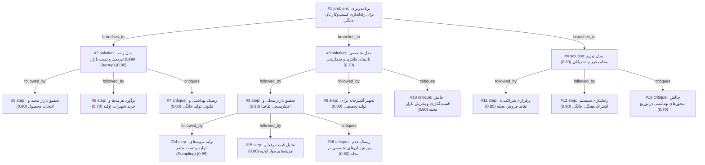

# bakery · ollama-cloud/gemma4:31b · path

**Task:** می‌خواهم در محله‌ام در تهران یک کسب‌وکار کوچک فروش نان خانگی راه بیندازم. حدود ۵۰ میلیون تومان سرمایه دارم و فقط آشپزخانهٔ خانه‌ام را. از کجا و چطور شروع کنم؟

| Thoughts | Calls | Tokens in / out | Time | Finish | First try valid | Next picked | Max depth | Weight spread | Duplicates |
|---|---|---|---|---|---|---|---|---|---|
| 16 | 7 | 7202 / 3358 | 25s | budget | 6/6 | 0/5 | 3 | 0.10 | 0 |

## Answer from the graph

برای راه‌اندازی این کسب‌وکار با سرمایه ۵۰ میلیون تومان و استفاده از فضای خانه، بهترین استراتژی، بهره‌گیری از مدل **«رشد تدریجی و تست بازار»** است. به جای سرمایه‌گذاری کلی در ابتدا، بهتر است با ریسک کم شروع کنید و بر اساس بازخورد مشتریان محله، مسیر خود را توسعه دهید.

در ادامه، نقشه راه عملیاتی شما در چهار مرحله آمده است:

### گام اول: تحقیق بازار و انتخاب محصول
قبل از خرید هرگونه تجهیزات گران‌قیمت، باید بدانید محله شما به چه نوع نانی نیاز دارد.
*   **شناسایی تقاضا:** در گروه‌های محلی (تلگرام، واتس‌اپ یا دیوار محله) نظرسنجی کنید. بررسی کنید آیا تقاضایی برای نان‌های رژیمی، نان‌های تخصصی (مانند سوردو یا بدون گلوتن) یا نان‌های سنتی با کیفیت بالا وجود دارد؟
*   **تولید نمونه (Sampling):** مقدار کمی از ۲ یا ۳ نوع نان منتخب را بپزید و به عنوان نمونه رایگان بین همسایگان و آشنایان توزیع کنید. بازخورد آن‌ها درباره طعم، بافت و قیمت احتمالی، دقیق‌ترین راهنما برای شماست.

### گام دوم: تجهیز بهینه و مدیریت هزینه‌ها
با توجه به سرمایه ۵۰ میلیونی، نباید تمام پول را در ابتدا خرج کنید.
*   **خرید تجهیزات ضروری:** ابتدا فقط وسایلی را بخرید که برای تولید مقیاس کوچک لازم هستند (مانند یک فر مناسب یا ظرف‌های تخمیر).
*   **تحلیل هزینه‌ها:** قیمت مواد اولیه را دقیق محاسبه کنید تا قیمت فروش شما هم برای مشتری جذاب باشد و هم سودآور.

### گام سوم: استراتژی فروش و توزیع
برای کاهش هزینه‌های جاری، از مدل‌های توزیع محله‌محور استفاده کنید:
*   **سیستم اشتراک:** مدل «اشتراک هفتگی» را راه بیندازید (مثلاً مشتری هر هفته ۲ عدد نان تازه در روزهای مشخص دریافت کند). این کار باعث پیش‌بینی دقیق تولید و درآمد شما می‌شود.
*   **توزیع محلی:** برای شروع، تحویل حضوری یا ارسال توسط پیک‌های محلی را در نظر بگیرید تا هزینه‌های لجستیک کاهش یابد.

### گام چهارم: ارتقا به مدل تخصصی (در صورت پذیرش بازار)
اگر متوجه شدید مشتریان شما به دنبال کیفیت بالاتر هستند، به تدریج به سمت نان‌های فانتزی و سفارشی با ارزش افزوده بالا بروید که قیمت فروش بیشتری دارند و حاشیه سود شما را افزایش می‌دهند.

---

### ریسک‌های مهمی که باید مدیریت کنید:
۱. **بهداشت و قانون:** تولید مواد غذایی در خانه ریسک‌های نظارتی دارد. استانداردهای بهداشتی را سخت‌گیرانه اجرا کنید تا هرگونه شکایت یا مشکل بهداشتی باعث توقف کسب‌وکارتان نشود.
۲. **پذیرش قیمت:** نان‌های تخصصی هزینه مواد اولیه بالایی دارند. مراقب باشید قیمت نهایی با قدرت خرید ساکنان محله شما همخوانی داشته باشد تا با عدم پذیرش بازار مواجه نشوید.
۳. **مزاحمت محلی:** به دلیل تردد مشتریان یا بوی پخت نان، مراقب باشید مزاحمتی برای همسایگان ایجاد نشود تا محیط کسب‌وکار شما در خانه صمیمی و آرام باقی بماند.

*Used: #1, #2, #3, #5, #7, #8, #10, #14, #16*

## Index

```text
#1 [problem] برنامه‌ریزی برای راه‌اندازی کسب‌وکار نان خانگی · expanded
  #2 [solution] مدل رشد تدریجی و تست بازار (Lean Startup) · w 0.90 · expanded
    #5 [step] تحقیق بازار محله و انتخاب محصول · w 0.80 · open
    #6 [step] برآورد هزینه‌ها و خرید تجهیزات اولیه · w 0.70 · open
    #7 [critique] ریسک بهداشتی و قانونی تولید خانگی · w 0.60 · open
  #3 [solution] مدل تخصصی نان‌های فانتزی و سفارشی · w 0.70 · expanded
    #8 [step] تحقیق بازار محلی و اعتبارسنجی تقاضا · w 0.90 · expanded
      #14 [step] تولید نمونه‌های اولیه و تست طعم (Sampling) · w 0.85 · open
      #15 [step] تحلیل قیمت رقبا و هزینه‌های مواد اولیه · w 0.80 · open
      #16 [critique] ریسک عدم پذیرش نان‌های تخصصی در محله · w 0.60 · open
    #9 [step] تجهیز آشپزخانه برای تولید تخصصی · w 0.80 · open
    #10 [critique] چالش قیمت‌گذاری و پذیرش بازار محله · w 0.60 · open
  #4 [solution] مدل توزیع محله‌محور و اشتراکی · w 0.60 · expanded
    #11 [step] برقراری شراکت با نقاط فروش محله · w 0.80 · open
    #12 [step] راه‌اندازی سیستم اشتراک هفتگی خانگی · w 0.90 · open
    #13 [critique] چالش مجوزهای بهداشتی در توزیع · w 0.70 · open
```

## Graph



## Thoughts

### #1 [problem] برنامه‌ریزی برای راه‌اندازی کسب‌وکار نان خانگی
w 1.00 · expanded · depth 0 · from –

هدف: راه‌اندازی یک کسب‌وکار کوچک فروش نان خانگی در یکی از محله‌های تهران.
داده‌ها و محدودیت‌ها:
- سرمایه اولیه: ۵۰ میلیون تومان.
- مکان: استفاده از آشپزخانه شخصی (مدل Home-based business).
- محدوده جغرافیایی: محله‌ای در تهران.
ناشناخته‌ها:
- نوع نان (سنتی، رژیمی، فانتزی) که بیشترین تقاضا را در محله دارد.
- استراتژی قیمت‌گذاری و توزیع (ارسال یا تحویل حضوری).
- الزامات بهداشتی و قانونی برای فروش مواد غذایی خانگی.
نتیجه مطلوب: یک برنامه عملیاتی برای شروع تولید و فروش که با سرمایه موجود سازگار باشد، ریسک مالی را به حداقل برساند و به سوددهی اولیه برسد.

> این گره تمام ابعاد مسئله از جمله محدودیت‌های مالی، مکانی و اهداف نهایی را به طور دقیق تعریف می‌کند.

### #2 [solution] مدل رشد تدریجی و تست بازار (Lean Startup)
w 0.90 · expanded · depth 1 · from #1

شروع با تولید محدود از یک یا دو نوع نان پرتقاضا (مثلاً نان‌های رژیمی یا نان‌های سنتی خاص) برای تست پذیرش مشتریان محله، بدون خرید تجهیزات گران‌قیمت در ابتدا، و بازگشت سرمایه سریع برای توسعه تجهیزات.

> با توجه به سرمایه محدود و ریسک مواد غذایی، تست بازار پیش از سرمایه‌گذاری کل مبلغ منطقی‌ترین راه است.

### #3 [solution] مدل تخصصی نان‌های فانتزی و سفارشی
w 0.70 · expanded · depth 1 · from #1

تمرکز بر روی محصولات با ارزش افزوده بالا (مانند نان‌های sourdough یا نان‌های بدون گلوتن) که قیمت فروش بالاتری دارند و مخاطبان خاصی را در تهران جذب می‌کنند، حتی با حجم تولید پایین‌تر.

> سودآوری در هر واحد محصول بیشتر است اما مخاطبان هدف محدودتر هستند و نیاز به مهارت تخصصی دارد.

### #4 [solution] مدل توزیع محله‌محور و اشتراکی
w 0.60 · expanded · depth 1 · from #1

توافق با فروشگاه‌های کوچک یا کافی‌شاپ‌های محله برای قرار دادن محصولات در ویترین آن‌ها یا ایجاد سیستم اشتراک هفتگی برای خانواده‌های محله (تحویل درب منزل در روزهای خاص).

> مشکل بازاریابی را حل می‌کند اما بخشی از سود را به واسطه می‌دهد یا نیاز به مدیریت لجستیک دارد.

### #5 [step] تحقیق بازار محله و انتخاب محصول
w 0.80 · open · depth 2 · from #2

شناسایی نیازهای محله از طریق نظرسنجی در گروه‌های محلی (تلگرام/واتس‌اپ) یا بررسی نانوایی‌های اطراف. بررسی اینکه آیا تقاضا برای نان‌های خاص (مثل نان sourdough، نان‌های بدون گلوتن یا نان‌های سنتی با کیفیت بالا) وجود دارد یا خیر تا محصول اول تعیین شود.

> بدون دانستن نیاز مشتری، سرمایه در محصولی بی‌تقاضا هدر می‌رود.

### #6 [step] برآورد هزینه‌ها و خرید تجهیزات اولیه
w 0.70 · open · depth 2 · from #2

اختصاص بخشی از ۵۰ میلیون تومان (مثلاً ۱۵-۲۰ میلیون) برای خرید مواد اولیه باکیفیت و تجهیزات ضروری (مانند فر صنعتی کوچک یا همزن اگر لازم باشد) و اختصاص مبلغی برای بسته‌بندی بهداشتی و جذاب.

> مدیریت بودجه در ابتدای کار برای جلوگیری از تمام شدن سریع سرمایه ضروری است.

### #7 [critique] ریسک بهداشتی و قانونی تولید خانگی
w 0.60 · open · depth 2 · from #2

فروش مواد غذایی در خانه ممکن است با چالش‌های نظارتی یا شکایات همسایگان (به دلیل بو یا تردد) مواجه شود. باید استانداردهای بهداشتی سختگیرانه اجرا شود و روشی برای مدیریت توزیع بدون ایجاد مزاحمت در محله پیدا شود.

> نادیده گرفتن مسائل بهداشتی می‌تواند باعث توقف کامل کسب‌وکار شود.

### #8 [step] تحقیق بازار محلی و اعتبارسنجی تقاضا
w 0.90 · expanded · depth 2 · from #3

بررسی بازار محله و شناسایی مشتریان هدف برای نان‌های تخصصی؛ ایجاد یک نظرسنجی ساده در گروه‌های محلی (تلگرام/واتس‌اپ) برای سنجش میزان تقاضا برای نان‌های رژیمی یا فانتزی.

> قبل از خرید تجهیزات گران‌قیمت، باید اطمینان حاصل شود که مشتری در آن محله خاص وجود دارد.

### #9 [step] تجهیز آشپزخانه برای تولید تخصصی
w 0.80 · open · depth 2 · from #3

سرمایه‌گذاری روی تجهیزات ضروری مانند فر با دمای دقیق، mixers صنعتی کوچک و ظرف‌های تخمیر؛ تخصیص بخشی از ۵۰ میلیون تومان برای خرید مواد اولیه باکیفیت (مانند آرد ارگانیک).

> تولید نان‌های تخصصی نیازمند ابزارهای دقیق‌تر از وسایل معمولی آشپزخانه است.

### #10 [critique] چالش قیمت‌گذاری و پذیرش بازار محله
w 0.60 · open · depth 2 · from #3

ریسک بالای هزینه مواد اولیه در نان‌های تخصصی و احتمال عدم پذیرش قیمت‌های بالا توسط همسایگان در محله‌های غیرتجملاتی.

> نان‌های فانتزی قیمت بالایی دارند که ممکن است با قدرت خرید محله‌ای خاص سازگار نباشد.

### #11 [step] برقراری شراکت با نقاط فروش محله
w 0.80 · open · depth 2 · from #4

شناسایی و مذاکره با فروشگاه‌های محلی و کافی‌شاپ‌ها برای توافق بر سر درصد فروش (Commission) یا اجاره ویترین کوچک، به همراه طراحی بسته‌بندی ساده اما جذاب که نام و شماره تماس کسب‌وکار را داشته باشد.

> این گام عملیاتی‌ترین راه برای تبدیل مدل توزیع به درآمد واقعی است.

### #12 [step] راه‌اندازی سیستم اشتراک هفتگی خانگی
w 0.90 · open · depth 2 · from #4

طراحی پکیج‌های اشتراکی (مثلاً نان تازه هر دو روز یکبار) برای خانواده‌های مجاور، ثبت سفارش از طریق واتس‌اپ/تلگرام و تعیین یک ساعت مشخص برای تحویل درب منزل جهت بهینه‌سازی زمان و هزینه تردد.

> سیستم اشتراک باعث ایجاد جریان نقدی پیش‌بینی‌پذیر و مشتریان وفادار می‌شود.

### #13 [critique] چالش مجوزهای بهداشتی در توزیع
w 0.70 · open · depth 2 · from #4

ریسک بهداشتی و قانونی: فروش مواد غذایی در فروشگاه‌ها بدون مجوز رسمی بهداشتی ممکن است منجر به جریمه شود یا فروشنده محلی به دلیل ترس از بازرسی، از پذیرش محصول خودداری کند.

> این یک مانع قانونی جدی در تهران است که می‌تواند مدل توزیع اشتراکی را با مشکل مواجه کند.

### #14 [step] تولید نمونه‌های اولیه و تست طعم (Sampling)
w 0.85 · open · depth 3 · from #8

پخت مقدار کمی از انواع نان‌های منتخب (مثلاً سوردو، نان ذرت یا نان‌های رژیمی) و توزیع رایگان آن‌ها بین همسایگان و اعضای گروه‌های محلی جهت دریافت بازخورد مستقیم درباره طعم، بافت و قیمت پیشنهادی.

> تست عملی محصول تنها راه اطمینان از پذیرش بازار قبل از سرمایه‌گذاری روی تجهیزات است.

### #15 [step] تحلیل قیمت رقبا و هزینه‌های مواد اولیه
w 0.80 · open · depth 3 · from #8

بررسی قیمت نان‌های مشابه در نانوایی‌های فانتزی محله و فروشگاه‌های آنلاین، و همزمان محاسبه دقیق هزینه مواد اولیه (آرد تخصصی، خمیرمایه و...) برای تعیین حاشیه سود هر قرص نان.

> قیمت‌گذاری اشتباه در ابتدای کار می‌تواند منجر به ضرر یا عدم جذب مشتری شود.

### #16 [critique] ریسک عدم پذیرش نان‌های تخصصی در محله
w 0.60 · open · depth 3 · from #8

ممکن است تقاضای محله برای نان‌های گران‌قیمت یا رژیمی کمتر از حد انتظار باشد و مشتریان ترجیح دهند نان‌های ارزان‌تر و سنتی بخرند؛ لذا باید برنامه جایگزینی (Pivot) برای نان‌های نیمه‌تخصصی‌تر در نظر گرفته شود.

> شناسایی ریسک تقاضای پایین ضروری است تا سرمایه ۵۰ میلیونی در تجهیزات تخصصی هدر نرود.

