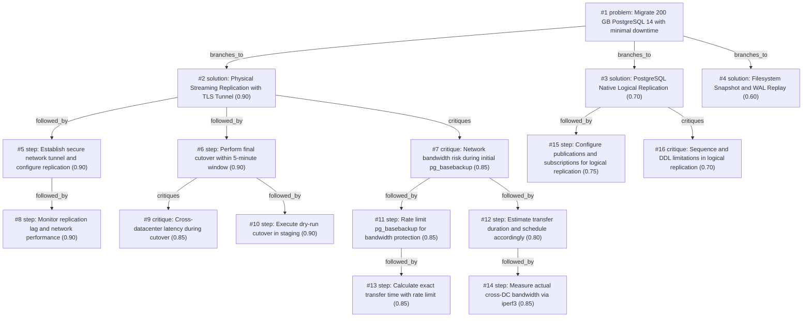

# db-move · gemini/gemini-3.5-flash-lite · index

**Task:** We have to move a 200 GB PostgreSQL 14 database to a new server in another data center. The app may be down for at most 5 minutes. How should we do it?

| Thoughts | Calls | Tokens in / out | Time | Finish | First try valid | Next picked | Max depth | Weight spread | Duplicates |
|---|---|---|---|---|---|---|---|---|---|
| 16 | 10 | 12992 / 2889 | 17s | budget | 9/9 | 7/8 | 4 | 0.04 | 0 |

## Answer from the graph

To migrate your 200 GB PostgreSQL 14 database to a new server in another data center with a maximum downtime of 5 minutes, the best approach is to use **PostgreSQL Native Physical Streaming Replication** combined with a secure network tunnel. 

Here is the step-by-step migration plan, along with the key risks to monitor.

---

### Step-by-Step Migration Plan

1. **Establish a Secure Network Tunnel**
   * Set up a secure network tunnel (such as WireGuard or `stunnel`) between the old and new data center servers to protect data in transit.

2. **Configure and Benchmark Network/Bandwidth**
   * Measure the actual cross-DC bandwidth via tools like `iperf3`. 
   * Configure `postgresql.conf` on the source server (`wal_level = replica`, appropriate `max_wal_senders`, etc.) and adjust `pg_hba.conf` to allow replication connections.

3. **Bootstrap the Replica with Rate Limiting**
   * Initiate the initial data sync using `pg_basebackup`. 
   * **Crucial:** Rate-limit `pg_basebackup` (using network-level limiters or `pv`) to prevent saturating the cross-datacenter link and starving other critical services.
   * *Alternative for very constrained bandwidth:* Seed the new server using an encrypted physical disk snapshot, then resume via streaming.

4. **Monitor Replication & WAL Catch-up**
   * Continuously monitor replication lag via `pg_stat_replication` and check network throughput to ensure the replica comfortably tracks the primary's WAL stream.

5. **Perform a Staging Dry-Run**
   * Execute a full dry-run of the cutover process in a staging environment. Measure exact timings to ensure the final switch fits safely within 3 minutes, leaving a 2-minute buffer.

6. **Execute Final Cutover (Within 5-Minute Window)**
   * **Stop the application** to halt incoming write transactions.
   * Monitor `pg_stat_replication` until the replication lag reaches **zero**.
   * **Promote the standby database** on the new server using `pg_ctl promote`.
   * **Update connection strings or DNS** to point the application to the new database server.
   * Start the application and verify its stability.

---

### Risks to Watch

* **Cross-DC Network Bandwidth & Latency:** A 200 GB initial transfer can heavily impact network links if unmanaged. Always rate-limit the initial sync and verify link performance beforehand. High latency during cutover can also slightly delay final WAL flushing and promotion notifications.
* **WAL Generation Rate:** If your application writes data faster than the cross-DC link can transmit WAL updates, the replica will fall behind. Monitor network throughput closely to ensure replication sustainability.

*Used: #1, #2, #5, #6, #7, #8, #9, #10, #11, #12, #13, #14*

## Index

```text
#1 [problem] Migrate 200 GB PostgreSQL 14 with minimal downtime · expanded
  #2 [solution] Physical Streaming Replication with TLS Tunnel · w 0.90 · expanded
    #5 [step] Establish secure network tunnel and configure replication · w 0.90 · expanded
      #8 [step] Monitor replication lag and network performance · w 0.90 · open
    #6 [step] Perform final cutover within 5-minute window · w 0.90 · expanded
      #9 [critique] Cross-datacenter latency during cutover · w 0.85 · open
      #10 [step] Execute dry-run cutover in staging · w 0.90 · open
    #7 [critique] Network bandwidth risk during initial pg_basebackup · w 0.85 · expanded
      #11 [step] Rate limit pg_basebackup for bandwidth protection · w 0.85 · expanded
        #13 [step] Calculate exact transfer time with rate limit · w 0.85 · open, max depth
      #12 [step] Estimate transfer duration and schedule accordingly · w 0.80 · expanded
        #14 [step] Measure actual cross-DC bandwidth via iperf3 · w 0.85 · open, max depth
  #3 [solution] PostgreSQL Native Logical Replication · w 0.70 · expanded
    #15 [step] Configure publications and subscriptions for logical replication · w 0.75 · open
    #16 [critique] Sequence and DDL limitations in logical replication · w 0.70 · open
  #4 [solution] Filesystem Snapshot and WAL Replay · w 0.60 · open
```

## Graph



## Thoughts

### #1 [problem] Migrate 200 GB PostgreSQL 14 with minimal downtime
w 1.00 · expanded · depth 0 · from –

Goal: Migrate a 200 GB PostgreSQL 14 database to a new server in a different data center. Limits: Maximum allowable application downtime is 5 minutes. Facts: Database size is 200 GB, cross-datacenter network latency and bandwidth will affect data transfer times, PostgreSQL 14 is the source and target version. Unknowns: Available network bandwidth between data centers, rate of write transactions (WAL generation rate). A good result achieves the migration within the 5-minute maintenance window with zero data loss and application stability on the new server.

> Accurately and completely captures the goal, constraints, facts, and unknowns of the migration task.

### #2 [solution] Physical Streaming Replication with TLS Tunnel
w 0.90 · expanded · depth 1 · from #1

Use native PostgreSQL physical streaming replication with a secure TLS tunnel (e.g., WireGuard or stunnel) across data centers. Initial sync via pg_basebackup or snapshot, then stream WAL until the 5-minute cutoff.

> PostgreSQL physical replication is extremely reliable, native, handles 200 GB easily, and minimizes final cutover time to a brief read-only switch.

### #3 [solution] PostgreSQL Native Logical Replication
w 0.70 · expanded · depth 1 · from #1

Use logical replication (pg_logical / native publication/subscription) to replicate the 200 GB database while the old system is live, then cut over the application.

> Logical replication allows selective table replication and schema flexibility, but setup overhead and sequence synchronization add complexity for 200 GB.

### #4 [solution] Filesystem Snapshot and WAL Replay
w 0.60 · open · depth 1 · from #1

Take a filesystem snapshot (EFS, EBS, ZFS) of the 200 GB DB, ship the snapshot or backup to the new DC, restore, and catch up with pg_rewind or streaming.

> Filesystem snapshots are fast for initial large data movement, but coordinating consistent states across different DC storage systems can be tricky.

### #5 [step] Establish secure network tunnel and configure replication
w 0.90 · expanded · depth 2 · from #2

Set up a WireGuard VPN or stunnel between the old and new servers. Configure pg_hba.conf and postgresql.conf on the source for replication (wal_level = replica, max_wal_senders, etc.), and bootstrap the replica using pg_basebackup over the secure tunnel.

> This is the necessary first implementation step for physical replication.

### #6 [step] Perform final cutover within 5-minute window
w 0.90 · expanded · depth 2 · from #2

Stop the application, monitor pg_stat_replication until lag reaches zero, promote the standby database on the new server using pg_ctl promote, and update DNS or connection strings to point the application to the new server.

> This executes the final migration steps during the allowed downtime window.

### #7 [critique] Network bandwidth risk during initial pg_basebackup
w 0.85 · expanded · depth 2 · from #2

Transferring 200 GB over cross-DC links could take a long time if bandwidth is constrained, saturating the link and delaying replication start. Mitigation: rate-limit pg_basebackup or seed using a physical disk/snapshot if bandwidth is very low.

> Identifies a critical operational bottleneck that could jeopardize the timeline.

### #8 [step] Monitor replication lag and network performance
w 0.90 · open · depth 3 · from #5

Continuously monitor replication lag using pg_stat_replication and network throughput to ensure the replica stays caught up with the primary before the cutover window.

> Essential step to verify that streaming replication is healthy and ready for the 5-minute cutover.

### #9 [critique] Cross-datacenter latency during cutover
w 0.85 · open · depth 3 · from #6

During the 5-minute window, network latency between DCs could delay the final WAL flush or promotion notification. Mitigate this by pre-fetching connection pools and running pg_ctl promote synchronously.

> Addresses the latency risk inherent in cross-datacenter cutovers.

### #10 [step] Execute dry-run cutover in staging
w 0.90 · open · depth 3 · from #6

Perform a test dry-run of the cutover steps in a staging environment to measure exact timing and ensure the sequence fits comfortably within the 3-minute mark, leaving a safety buffer.

> A dry-run ensures the 5-minute downtime limit is practically achievable.

### #11 [step] Rate limit pg_basebackup for bandwidth protection
w 0.85 · expanded · depth 3 · from #7

Use bandwidth throttling flags in pg_basebackup (--max-rate) or use pv/rsync limits to prevent saturating the production cross-DC link during business hours.

> Directly mitigates the bandwidth saturation risk without requiring physical disk shipping.

### #12 [step] Estimate transfer duration and schedule accordingly
w 0.80 · expanded · depth 3 · from #7

Calculate transfer time based on assumed available bandwidth (e.g., 200 GB at 100 Mbps takes ~4.5 hours; at 1 Gbps takes ~27 minutes) to schedule the initial sync safely in advance.

> Provides concrete planning figures to ensure the initial sync completes well ahead of the cutover window.

### #13 [step] Calculate exact transfer time with rate limit
w 0.85 · open · depth 4 · from #11

Given a 200 GB database and a chosen rate limit (e.g., 50 MB/s), compute the exact time required to complete pg_basebackup to ensure it finishes safely before the cutover window.

> Calculating the duration ensures the bandwidth throttling setting is realistic and won't bottleneck the overall migration schedule.

### #14 [step] Measure actual cross-DC bandwidth via iperf3
w 0.85 · open · depth 4 · from #12

Perform a test transfer of a 1 GB sample or measure actual peak throughput between the data centers using iperf3 during off-peak hours to replace assumptions with empirical data.

> Empirical bandwidth measurement avoids unexpected sync delays during the actual migration.

### #15 [step] Configure publications and subscriptions for logical replication
w 0.75 · open · depth 2 · from #3

Create publications on the primary PostgreSQL 14 instance for all tables, set up the subscriber on the new server, and perform initial table synchronization.

> Necessary concrete action to implement the logical replication solution (#3).

### #16 [critique] Sequence and DDL limitations in logical replication
w 0.70 · open · depth 2 · from #3

Native logical replication in PostgreSQL 14 does not replicate sequences automatically, nor does it replicate schema (DDL) changes, requiring manual scripting or extensions for schema sync.

> Highlights a major operational risk for logical replication that must be accounted for.

