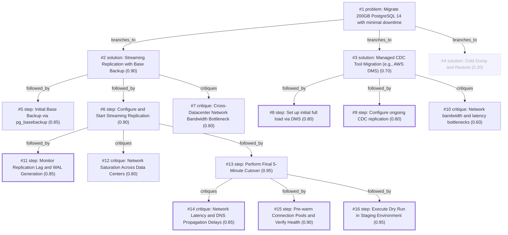

# db-move · gemini/gemini-3.5-flash-lite · path

**Task:** We have to move a 200 GB PostgreSQL 14 database to a new server in another data center. The app may be down for at most 5 minutes. How should we do it?

| Thoughts | Calls | Tokens in / out | Time | Finish | First try valid | Next picked | Max depth | Weight spread | Duplicates |
|---|---|---|---|---|---|---|---|---|---|
| 16 | 7 | 6324 / 2644 | 41s | budget | 6/6 | 0/5 | 4 | 0.11 | 0 |

## Answer from the graph

To migrate your 200 GB PostgreSQL 14 database to a new data center within a strict 5-minute maximum downtime window, the most reliable and efficient approach is to use **PostgreSQL Native Physical Streaming Replication with an Initial Base Backup**. 

Because a cold dump and restore would take far too long for a 5-minute window, streaming replication allows the new server to stay in sync continuously while the application remains live, leaving only a brief catch-up and promotion step for the cutover window.

Here is the step-by-step migration plan, the critical risks to watch, and essential mitigations.

---

### Step-by-Step Migration Plan

1. **Execute a Dry Run in Staging (Crucial):**
   * Perform a complete end-to-end dry run of the base backup, streaming replication catch-up, and cutover script in a staging environment that mimics your production network topology to validate your scripts and ensure you can hit the 5-minute target.

2. **Take the Initial Base Backup:**
   * On the new server (standby), initialize the base backup from the old primary database using `pg_basebackup` with compression enabled (e.g., streaming via `gzip` or `zstd`) to minimize cross-datacenter transfer times. 
   * *Tip:* Ensure the old server has adequate `max_wal_size` and enough `wal_keep_size` (or is backed up by replication slots) so WAL files aren't recycled while the base backup is running.

3. **Configure and Start Streaming Replication:**
   * Set up PostgreSQL streaming replication between the old primary and the new standby server. 
   * Start the standby server and ensure it is successfully receiving and continuously applying Write-Ahead Log (WAL) streams to catch up with ongoing production writes.

4. **Pre-warm and Verify Health:**
   * Before opening application traffic on the new server, prepare your tooling to run smoke tests, verify extension consistency, and pre-initialize connection pools to prevent connection storm latency spikes right after cutover.

5. **Perform the Final 5-Minute Cutover:**
   * **Stop the application** (starting your 5-minute downtime clock).
   * Monitor replication lag until it drops to **zero** (which should happen almost instantaneously once writes cease).
   * **Promote the standby server** to become the new primary using `pg_ctl promote`.
   * **Reroute application traffic:** Avoid traditional DNS propagation delays (which take too long). Instead, use a pre-configured low-TTL, a virtual IP (VIP), or an upstream proxy/load balancer layer to instantly point application connection strings to the new data center server.
   * Run your quick health checks/smoke tests and **start the application**.

---

### Risks to Watch & Mitigations

* **Cross-Datacenter Network Bottlenecks & Saturation:**
  * *Risk:* Transferring 200 GB and streaming high volumes of WAL traffic over a constrained or congested WAN link can saturate the network and degrade production application performance.
  * *Mitigation:* Measure bandwidth beforehand, compress streams during transmission, schedule the initial `pg_basebackup` during off-peak hours, and throttle bandwidth if necessary.
* **Network Latency & DNS Delays:**
  * *Risk:* Cross-datacenter latency can slow down final sync checks, and waiting for standard DNS propagation will easily blow past your 5-minute downtime limit.
  * *Mitigation:* Rely on a floating IP, VIP, or proxy layer for instant rerouting, and lower your DNS TTLs days in advance as a fallback.

*Used: #1, #2, #5, #6, #7, #11, #12, #13, #14, #15, #16*

## Index

```text
#1 [problem] Migrate 200GB PostgreSQL 14 with minimal downtime · expanded
  #2 [solution] Streaming Replication with Base Backup · w 0.90 · expanded
    #5 [step] Initial Base Backup via pg_basebackup · w 0.85 · open
    #6 [step] Configure and Start Streaming Replication · w 0.90 · expanded
      #11 [step] Monitor Replication Lag and WAL Generation · w 0.85 · done
      #12 [critique] Network Saturation Across Data Centers · w 0.80 · open
      #13 [step] Perform Final 5-Minute Cutover · w 0.95 · expanded
        #14 [critique] Network Latency and DNS Propagation Delays · w 0.85 · done
        #15 [step] Pre-warm Connection Pools and Verify Health · w 0.90 · done
        #16 [step] Execute Dry Run in Staging Environment · w 0.95 · done
    #7 [critique] Cross-Datacenter Network Bandwidth Bottleneck · w 0.80 · open
  #3 [solution] Managed CDC Tool Migration (e.g., AWS DMS) · w 0.70 · expanded
    #8 [step] Set up initial full load via DMS · w 0.80 · done
    #9 [step] Configure ongoing CDC replication · w 0.80 · done
    #10 [critique] Network bandwidth and latency bottlenecks · w 0.60 · open
  #4 [solution] Cold Dump and Restore · w 0.20 · dead end
```

## Graph



## Thoughts

### #1 [problem] Migrate 200GB PostgreSQL 14 with minimal downtime
w 1.00 · expanded · depth 0 · from –

Goal: Migrate a 200 GB PostgreSQL 14 database to a new server in a different data center. Constraints: Maximum allowed application downtime is 5 minutes. Facts: Database size is relatively small (200 GB), but cross-datacenter network latency and bandwidth will impact transfer times. Unknowns: Available network bandwidth between data centers, peak write load during migration. A successful result requires a consistent state on the new server, zero data loss, and completing the final switchover within the 5-minute downtime window.

> This accurately and comprehensively defines the core objective, constraints, and success criteria for the task.

### #2 [solution] Streaming Replication with Base Backup
w 0.90 · expanded · depth 1 · from #1

Use PostgreSQL streaming replication with logical or physical replication after taking an initial base backup. Bulk transfer the base backup via an efficient method (e.g., compressed dump or filesystem snapshot over dedicated network), stream the remaining WAL changes, and perform the cutover during the 5-minute window.

> Streaming replication keeps the replica in near-real-time sync, enabling a very fast final cutover.

### #3 [solution] Managed CDC Tool Migration (e.g., AWS DMS)
w 0.70 · expanded · depth 1 · from #1

Use AWS Database Migration Service (DMS) or a third-party tool to perform a full load followed by continuous change capture (CDC). Switch the application connection string at the final maintenance window.

> Managed CDC tools abstract the complexity of replication setup, though cross-datacenter latency still applies.

### #4 [solution] Cold Dump and Restore
w 0.20 · dead_end · depth 1 · from #1

Take a consistent pg_dump of the 200 GB database, compress it, transfer it over the network to the new server, and restore it while the application is down.

> Dead end because transferring and restoring 200 GB over a cross-datacenter link will likely exceed the 5-minute downtime limit.

### #5 [step] Initial Base Backup via pg_basebackup
w 0.85 · open · depth 2 · from #2

Take a base backup of the 200 GB database using pg_basebackup over an encrypted SSH tunnel or secure connection, or restore a compressed snapshot on the target server.

> This populates the new server with the vast majority of the data while the application remains fully online.

### #6 [step] Configure and Start Streaming Replication
w 0.90 · expanded · depth 2 · from #2

Set up PostgreSQL streaming replication from the old primary to the new standby server, ensuring continuous application of WAL logs to catch up with ongoing writes.

> Streaming replication keeps the new server synchronized with the live primary in near real-time.

### #7 [critique] Cross-Datacenter Network Bandwidth Bottleneck
w 0.80 · open · depth 2 · from #2

A 200 GB transfer over a limited or congested cross-datacenter WAN link might take too long or lag during high write loads. We must measure bandwidth beforehand and compress the initial stream.

> Network constraints can delay the initial sync or cause replication lag, jeopardizing the 5-minute cutover goal.

### #8 [step] Set up initial full load via DMS
w 0.80 · done · depth 2 · from #3

Configure AWS DMS to perform a full schema and data load from the source PostgreSQL 14 database to the target database in the new data center while the application remains fully operational.

> This is the necessary first phase of a CDC-based migration strategy.

### #9 [step] Configure ongoing CDC replication
w 0.80 · done · depth 2 · from #3

Enable PostgreSQL logical replication (walsender) so that AWS DMS can continuously capture and apply all write changes happening on the source database after the full load completes.

> Continuous replication keeps the target database in sync with the source until cutover.

### #10 [critique] Network bandwidth and latency bottlenecks
w 0.60 · open · depth 2 · from #3

Cross-datacenter replication may lag if the network bandwidth is saturated or latency is high, especially during peak write hours, risking replication delay exceeding the 5-minute window.

> This is a significant risk that could violate the downtime constraint if not properly monitored.

### #11 [step] Monitor Replication Lag and WAL Generation
w 0.85 · done · depth 3 · from #6

Continuously monitor replication lag, network throughput, and WAL generation rate using queries against pg_stat_replication and system metrics to ensure the standby can keep up with the primary's write load.

> Active monitoring is critical to detect bottlenecks or lag accumulation before the cutover window.

### #12 [critique] Network Saturation Across Data Centers
w 0.80 · open · depth 3 · from #6

High volume of WAL traffic or initial sync over a constrained cross-datacenter link can saturate the network, impacting application performance on the primary. Mitigate by throttling bandwidth or scheduling during off-peak hours.

> Cross-datacenter networks often have variable bandwidth and unexpected latency spikes.

### #13 [step] Perform Final 5-Minute Cutover
w 0.95 · expanded · depth 3 · from #6

Stop the application, wait for the replication lag to hit zero (which should be nearly instantaneous), promote the standby server to primary, and update connection strings or DNS to point to the new data center server.

> This executes the final migration step within the strict 5-minute downtime constraint.

### #14 [critique] Network Latency and DNS Propagation Delays
w 0.85 · done · depth 4 · from #13

Cross-datacenter latency can slow down synchronous or near-synchronous final sync checks, and traditional DNS propagation can take too long, violating the 5-minute downtime window. Mitigation: Use low TTLs set in advance and a floating IP or VIP/proxy layer for instant rerouting.

> Identifies critical risks during the cutover window and provides concrete mitigations.

### #15 [step] Pre-warm Connection Pools and Verify Health
w 0.90 · done · depth 4 · from #13

Before opening the application traffic on the new server, run smoke tests, verify extension consistency, and pre-initialize connection pools to prevent connection storm latency spikes during the cutover.

> Ensures the application becomes usable immediately after promotion without cold-start delays.

### #16 [step] Execute Dry Run in Staging Environment
w 0.95 · done · depth 4 · from #13

Perform a complete end-to-end dry run of the base backup, streaming replication catch-up, and cutover script in a staging environment that mimics the production network topology to validate the 5-minute target.

> Validates the entire procedure and uncovers hidden bottlenecks before the production migration window.

