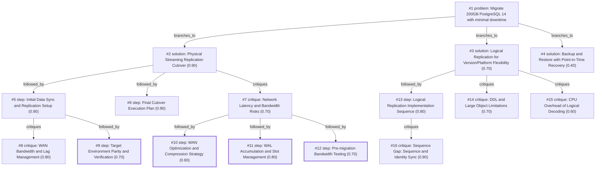

# db-move · ollama-cloud/gemma4:31b · index

**Task:** We have to move a 200 GB PostgreSQL 14 database to a new server in another data center. The app may be down for at most 5 minutes. How should we do it?

| Thoughts | Calls | Tokens in / out | Time | Finish | First try valid | Next picked | Max depth | Weight spread | Duplicates |
|---|---|---|---|---|---|---|---|---|---|
| 16 | 9 | 21014 / 5683 | 32s | budget | 3/8 | 6/7 | 3 | 0.10 | 0 |

Failures: schema 5, check 1

## Answer from the graph

To migrate a 200 GB PostgreSQL 14 database across data centers with a maximum downtime of 5 minutes, the most reliable approach is **Physical Streaming Replication**. This method ensures the destination is a bit-for-bit copy of the source, minimizing the cutover window to only the time it takes to promote the standby and update connection strings.

### Execution Plan

#### 1. Preparation and Initial Sync
*   **Configure Source:** Set `wal_level = replica` and ensure `max_wal_senders` is sufficient to accommodate the new standby.
*   **Baseline Transfer:** Use `pg_basebackup` to transfer the 200 GB dataset to the new server. To prevent network saturation between data centers, use compression (e.g., zstd) or a tool like `mbuffer` to manage the throughput.
*   **Initialize Standby:** Start the destination server in standby mode. It will begin consuming Write-Ahead Logs (WAL) from the primary to catch up with all transactions that occurred during the baseline transfer.

#### 2. Stabilization and Verification
*   **Monitor Lag:** Use `pg_stat_replication` on the primary server to monitor the replication lag. The standby must be "caught up" (near-zero lag) before attempting the cutover.
*   **Verify Parity:** Ensure the Log Sequence Number (LSN) on the standby is closely trailing the primary.

#### 3. Final Cutover (The 5-Minute Window)
*   **Stop Writes:** Put the application into read-only mode or stop the application services to ensure no new data is written to the source.
*   **Final Sync:** Wait a few seconds for the final remaining WAL records to stream to the destination.
*   **Promote Standby:** Execute `SELECT pg_promote();` or use `pg_ctl promote` on the new server to transition it from a read-only standby to a read-write primary.
*   **Redirect Traffic:** Update the application connection strings or DNS records to point to the new server's IP address.
*   **Resume Application:** Restart the application or disable read-only mode.

### Critical Risks to Manage
*   **WAN Bandwidth:** A 200 GB transfer across data centers can saturate the link, impacting production traffic. Use bandwidth throttling or compressed transfers to mitigate this.
*   **WAL Accumulation:** If the network is slow and the primary generates WAL files faster than the standby can consume them, the primary's disk may fill up. Use **replication slots** to ensure the primary does not delete WAL files until the standby has received them.
*   **Network Latency:** High latency can increase the time it takes for the final sync to complete. Ensure the network path is optimized before the cutover window begins.

*Used: #1, #2, #5, #6, #7, #8*

## Index

```text
#1 [problem] Migrate 200GB PostgreSQL 14 with minimal downtime · expanded
  #2 [solution] Physical Streaming Replication Cutover · w 0.90 · expanded
    #5 [step] Initial Data Sync and Replication Setup · w 0.90 · expanded
      #8 [critique] WAN Bandwidth and Lag Management · w 0.80 · open
      #9 [step] Target Environment Parity and Verification · w 0.70 · done
    #6 [step] Final Cutover Execution Plan · w 0.90 · open
    #7 [critique] Network Latency and Bandwidth Risks · w 0.70 · expanded
      #10 [step] WAN Optimization and Compression Strategy · w 0.80 · done
      #11 [step] WAL Accumulation and Slot Management · w 0.80 · done
      #12 [step] Pre-migration Bandwidth Testing · w 0.70 · done
  #3 [solution] Logical Replication for Version/Platform Flexibility · w 0.70 · expanded
    #13 [step] Logical Replication Implementation Sequence · w 0.80 · expanded
      #16 [critique] Sequence Gap: Sequence and Identity Sync · w 0.90 · open
    #14 [critique] DDL and Large Object Limitations · w 0.70 · open
    #15 [critique] CPU Overhead of Logical Decoding · w 0.60 · open
  #4 [solution] Backup and Restore with Point-in-Time Recovery · w 0.40 · open
```

## Graph



## Thoughts

### #1 [problem] Migrate 200GB PostgreSQL 14 with minimal downtime
w 1.00 · expanded · depth 0 · from –

Goal: Move a 200 GB PostgreSQL 14 database to a new server in a different data center. 
Constraints:
- Maximum allowable application downtime: 5 minutes.
- Database size: 200 GB.
- Location: Cross-data center migration (implies network latency/bandwidth considerations).

Unknowns:
- Network bandwidth between data centers.
- Current write volume (transaction rate).
- Ability to install tools or modify configurations on both source and destination.

A successful result must ensure zero data loss and complete the final cutover (DNS/Connection string change) within the 5-minute window.

> This defines the core objective, strict constraints, and success criteria for the migration.

### #2 [solution] Physical Streaming Replication Cutover
w 0.90 · expanded · depth 1 · from #1

Set up the new server as a physical standby using pg_basebackup or a filesystem snapshot. Once the standby is caught up with the primary, put the app in read-only mode, perform a final sync, and promote the standby to primary. This minimizes downtime to just the promotion and connection switch.

> Standard PostgreSQL method for near-zero downtime migration of large databases.

### #3 [solution] Logical Replication for Version/Platform Flexibility
w 0.70 · expanded · depth 1 · from #1

Use PostgreSQL logical replication to stream data from the source to the destination. This allows the destination to be online and accepts writes/reads for testing before the cutover. The cutover involves stopping writes on source and promoting the target.

> Highly flexible and allows for zero-downtime if managed carefully, but more complex to set up (requires primary keys on all tables).

### #4 [solution] Backup and Restore with Point-in-Time Recovery
w 0.40 · open · depth 1 · from #1

Take a full backup (pg_dump or pg_basebackup), restore it on the new server, and then replay WAL files until the point of cutover.

> Too slow for a 5-minute window unless combined with replication; restoring 200GB takes significantly longer than 5 minutes.

### #5 [step] Initial Data Sync and Replication Setup
w 0.90 · expanded · depth 2 · from #2

1. Configure source server for replication (wal_level=replica, max_wal_senders). 2. Run pg_basebackup on the new server to transfer the 200GB baseline. 3. Start the standby server and verify it is streaming WAL logs to keep up with the primary in real-time.

> This is the foundational technical process to get the data moved without downtime.

### #6 [step] Final Cutover Execution Plan
w 0.90 · open · depth 2 · from #2

1. Direct app to read-only mode or stop writes. 2. Verify LSN (Log Sequence Number) parity between source and destination. 3. Promote standby to primary using 'pg_ctl promote' or 'SELECT pg_promote()'. 4. Update DNS or application connection strings to point to the new server.

> This specifically addresses the 5-minute downtime constraint.

### #7 [critique] Network Latency and Bandwidth Risks
w 0.70 · expanded · depth 2 · from #2

Cross-data center transfers of 200GB may take hours and potentially saturate the link. If the WAL generation rate exceeds the network throughput, the standby will never catch up. We need to verify the bandwidth or use a compressed transfer tool like zstd with pg_basebackup.

> Identifies the primary risk factor for a cross-DC migration.

### #8 [critique] WAN Bandwidth and Lag Management
w 0.80 · open · depth 3 · from #5

To avoid saturating the cross-DC link and impacting production performance, use a tool like 'mbuffer' or 'rsync' for the initial transfer, or perform an offline backup transfer via physical disk if bandwidth is severely limited. Monitor the 'replication lag' (pg_stat_replication) to ensure the standby can handle the current write volume before planning the cutover.

> The 200GB transfer over a WAN could fail or impact the app if not managed with bandwidth limits and lag monitoring.

### #9 [step] Target Environment Parity and Verification
w 0.70 · done · depth 3 · from #5

Ensure the destination server has identical PostgreSQL version (14.x), identical locale/encoding, and sufficient storage. Configure 'hot_standby = on' to allow read-only queries on the new server during the sync phase to verify data integrity before the final switch.

> Correct environment parity is a prerequisite for physical replication to work.

### #10 [step] WAN Optimization and Compression Strategy
w 0.80 · done · depth 3 · from #7

To mitigate bandwidth risks, use pg_basebackup with the -Z (compression) flag or pipe the output through a high-performance compressor like zstd. Additionally, ensure the WAL archive is accessible via a separate, reliable path (e.g., S3 or a shared mount) to prevent the standby from falling behind during the initial base backup phase.

> Directly addresses the bandwidth risk identified in the critique.

### #11 [step] WAL Accumulation and Slot Management
w 0.80 · done · depth 3 · from #7

Use a physical replication slot on the primary to ensure WAL files are not deleted before the new standby has consumed them. Monitor the 'pg_replication_slots' view to track the lag; if the lag grows too large, the primary's disk may fill up, necessitating a temporary increase in storage or a faster network link.

> Ensures data integrity and availability during the sync process.

### #12 [step] Pre-migration Bandwidth Testing
w 0.70 · done · depth 3 · from #7

Run a network throughput test (e.g., using iperf3) between the source and destination data centers to estimate the transfer time for 200GB and determine if a physical shipment of disks or a dedicated line is required before attempting the migration.

> Provides empirical data to validate the feasibility of the timeline.

### #13 [step] Logical Replication Implementation Sequence
w 0.80 · expanded · depth 2 · from #3

1. Create destination schema manually (pg_dump -s). 2. Create Publication on source and Subscription on target. 3. Allow initial data sync to complete. 4. Monitor replication lag to ensure it's near zero. 5. Stop application traffic, verify final sync, and point app to new server.

> Provides the concrete operational sequence for implementing logical replication.

### #14 [critique] DDL and Large Object Limitations
w 0.70 · open · depth 2 · from #3

Logical replication does not replicate DDL (schema changes) or large objects (blobs) automatically. If the schema changes during the sync period, the replication will break or data will be inconsistent. Requires rigorous schema locking or a maintenance window for schema updates.

> Highlights a critical failure point of logical replication compared to physical replication.

### #15 [critique] CPU Overhead of Logical Decoding
w 0.60 · open · depth 2 · from #3

Logical replication is more CPU-intensive on the source than physical replication because it must decode the WAL. For a high-write database, this could impact performance of the live application during the synchronization phase.

> Addresses the performance impact on the source server during the migration process.

### #16 [critique] Sequence Gap: Sequence and Identity Sync
w 0.90 · open · depth 3 · from #13

Logical replication does not replicate sequence values (e.g., BIGSERIAL). If the app relies on these for primary keys, the new server will start sequences at 1, causing immediate unique constraint violations on the first write after cutover. A step must be added to manually sync sequence values immediately before opening the app for traffic.

> This is a critical failure point for logical replication migrations that would exceed the 5-minute downtime window if discovered late.

