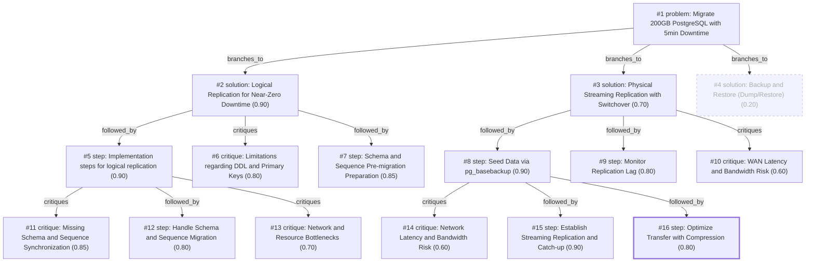

# db-move · ollama-cloud/gemma4:31b · path

**Task:** We have to move a 200 GB PostgreSQL 14 database to a new server in another data center. The app may be down for at most 5 minutes. How should we do it?

| Thoughts | Calls | Tokens in / out | Time | Finish | First try valid | Next picked | Max depth | Weight spread | Duplicates |
|---|---|---|---|---|---|---|---|---|---|
| 16 | 7 | 6425 / 2711 | 19s | budget | 6/6 | 0/5 | 3 | 0.13 | 1 |

## Answer from the graph

To migrate a 200 GB PostgreSQL 14 database between data centers with a maximum downtime of 5 minutes, the best approach is to use **Logical Replication**. This allows the data to be synchronized in the background while the application remains live, reducing the final cutover to a simple configuration change.

### Implementation Steps

1.  **Schema Preparation**
    *   Since logical replication does not replicate the database schema (DDL), you must first export the schema from the source server using `pg_dump -s` and restore it on the target server.
    *   Ensure all tables have primary keys. For tables without a primary key, you must set `REPLICA IDENTITY FULL` to allow updates and deletes to be replicated.

2.  **Set Up Replication**
    *   **On the Source Server:** Create a publication for all tables:
        `CREATE PUBLICATION migration_pub FOR ALL TABLES;`
    *   **On the Target Server:** Create a subscription to start the initial data sync:
        `CREATE SUBSCRIPTION migration_sub CONNECTION 'host=source_ip port=5432 user=rep_user password=... dbname=...' PUBLICATION migration_pub;`

3.  **Synchronization and Monitoring**
    *   Monitor `pg_stat_replication` (on source) and `pg_stat_subscription` (on target) to track the progress of the initial snapshot and the ongoing write stream.
    *   Wait until the replication lag is near zero.

4.  **Final Cutover (The 5-Minute Window)**
    *   Put the application into read-only mode to stop new writes.
    *   **Synchronize Sequences:** Since sequences are not replicated, manually update the sequences on the target server to match the current values on the source server.
    *   Verify that the Log Sequence Number (LSN) matches between both servers.
    *   Update the application connection strings or DNS to point to the new server.
    *   Drop the subscription on the target server and bring the application back to read-write mode.

### Risks to Watch

*   **DDL Changes:** Any schema changes made on the source after the initial `pg_dump` will not be replicated and must be applied manually to the target to prevent replication from breaking.
*   **Network Latency:** Because the servers are in different data centers, ensure you have a stable, secure connection (e.g., VPN). High latency or bandwidth bottlenecks can increase replication lag.
*   **Resource Bottlenecks:** The target server will experience high CPU and IOPS usage during the initial snapshot load; ensure the target hardware is appropriately provisioned.
*   **Missing Primary Keys:** If any table lacks a primary key or a replica identity, the migration of updates/deletes for that table will fail.

*Used: #1, #2, #5, #6, #7, #11, #13*

## Index

```text
#1 [problem] Migrate 200GB PostgreSQL with 5min Downtime · expanded
  #2 [solution] Logical Replication for Near-Zero Downtime · w 0.90 · expanded
    #5 [step] Implementation steps for logical replication · w 0.90 · expanded
      #11 [critique] Missing Schema and Sequence Synchronization · w 0.85 · open
      #12 [step] Handle Schema and Sequence Migration · w 0.80 · open
      #13 [critique] Network and Resource Bottlenecks · w 0.70 · open
    #6 [critique] Limitations regarding DDL and Primary Keys · w 0.80 · open
    #7 [step] Schema and Sequence Pre-migration Preparation · w 0.85 · open
  #3 [solution] Physical Streaming Replication with Switchover · w 0.70 · expanded
    #8 [step] Seed Data via pg_basebackup · w 0.90 · expanded
      #14 [critique] Network Latency and Bandwidth Risk · w 0.60 · open
      #15 [step] Establish Streaming Replication and Catch-up · w 0.90 · open
      #16 [step] Optimize Transfer with Compression · w 0.80 · done
    #9 [step] Monitor Replication Lag · w 0.80 · open
    #10 [critique] WAN Latency and Bandwidth Risk · w 0.60 · open
  #4 [solution] Backup and Restore (Dump/Restore) · w 0.20 · dead end
```

## Graph



## Thoughts

### #1 [problem] Migrate 200GB PostgreSQL with 5min Downtime
w 1.00 · expanded · depth 0 · from –

Goal: Migrate a 200 GB PostgreSQL 14 database to a new server in a different data center. 
Constraints: Maximum allowable application downtime is 5 minutes. 
Knowns: DB size (200 GB), version (PostgreSQL 14), physical separation (different data centers).
Unknowns: Network bandwidth between data centers, current write load (TPS), availability of replication tools or cloud services.
A successful result must ensure zero data loss and transition the application to the new server within the 5-minute window.

> Defines the core technical challenge, constraints, and success criteria for the migration.

### #2 [solution] Logical Replication for Near-Zero Downtime
w 0.90 · expanded · depth 1 · from #1

Use PostgreSQL's built-in logical replication. Set up a replica on the new server, perform an initial data sync while the primary is live, and keep it updated in real-time. The migration consists of updating the application connection strings and promoting the replica to primary.

> Logical replication allows the database to remain online during the bulk transfer, fitting perfectly within the 5-minute window.

### #3 [solution] Physical Streaming Replication with Switchover
w 0.70 · expanded · depth 1 · from #1

Perform a base backup (pg_basebackup) to the new server and establish physical streaming replication. Once the replica is caught up, stop the application, perform a final WAL sync, and promote the standby.

> Highly reliable and faster to set up than logical replication, but requires the same major version and potentially more downtime for the final cutover.

### #4 [solution] Backup and Restore (Dump/Restore)
w 0.20 · dead_end · depth 1 · from #1

Use pg_dump and pg_restore to move the data. The application would be taken offline, the dump created, transferred, and restored on the new server.

> Moving 200GB and restoring it would far exceed the 5-minute downtime limit.

### #5 [step] Implementation steps for logical replication
w 0.90 · expanded · depth 2 · from #2

1. Provision target server with PG 14. 
2. Create publication on source: 'CREATE PUBLICATION migration_pub FOR ALL TABLES'. 
3. Create subscription on target: 'CREATE SUBSCRIPTION migration_sub CONNECTION '...' PUBLICATION migration_pub'. 
4. Monitor 'pg_stat_replication' and 'pg_stat_subscription' until lag is near zero. 
5. Put app in read-only mode, verify LSN match, update DNS/connection strings, and drop subscription.

> Provides the concrete technical sequence to implement the logical replication solution.

### #6 [critique] Limitations regarding DDL and Primary Keys
w 0.80 · open · depth 2 · from #2

Logical replication does not replicate DDL changes, sequences, or large objects automatically. If the schema changes during the migration process, the replication will break. Additionally, the 'FOR ALL TABLES' clause requires that all tables have primary keys; otherwise, replication of updates/deletes will fail.

> Identifies critical technical limitations of logical replication that could lead to data inconsistency or failure.

### #7 [step] Schema and Sequence Pre-migration Preparation
w 0.85 · open · depth 2 · from #2

To handle the DDL and sequence issues identified in thought #4, manually export the schema (pg_dump -s) and sequences before starting the subscription. Ensure all tables have primary keys or set 'REPLICA IDENTITY FULL' on tables without them to avoid replication errors.

> Directly addresses the risks identified in the critique to ensure a robust migration.

### #8 [step] Seed Data via pg_basebackup
w 0.90 · expanded · depth 2 · from #3

Execute pg_basebackup to clone the primary server to the standby server in the new data center. Use -R to automatically configure the standby for replication.

> This is the essential first step to seed the data on the destination server.

### #9 [step] Monitor Replication Lag
w 0.80 · open · depth 2 · from #3

Ensure the standby has reached 'consistent' state and the replication lag is minimal (seconds) before initiating the cutover.

> The 5-minute window is only achievable if the data is nearly synced before the app is stopped.

### #10 [critique] WAN Latency and Bandwidth Risk
w 0.60 · open · depth 2 · from #3

A 200GB base backup over a WAN may take hours or days depending on bandwidth; if the network is slow or unstable, the initial sync might fail or take too long to be viable.

> Physical backups over WAN are prone to timeouts and bandwidth throttling.

### #11 [critique] Missing Schema and Sequence Synchronization
w 0.85 · open · depth 3 · from #5

Logical replication does not replicate sequences, large objects, or schema changes (DDL). These must be manually synchronized before the cutover to avoid application crashes or primary key collisions on the new server.

> Identifies a critical gap in the basic logical replication workflow that could lead to failure post-cutover.

### #12 [step] Handle Schema and Sequence Migration
w 0.80 · open · depth 3 · from #5

1. Use pg_dump --schema-only to move the structure. 2. Use a script to export and import sequence values from the source to the target immediately before the cutover window starts. 3. Verify that all foreign keys and constraints are present on the target.

> Provides the concrete technical remedy for the sequence and schema gaps identified in the critique.

### #13 [critique] Network and Resource Bottlenecks
w 0.70 · open · depth 3 · from #5

Ensure that the target server has sufficient CPU/IOPS to handle the initial snapshot load and the ongoing write stream simultaneously. Check if the network between data centers requires a VPN or tunnel to secure the replication traffic and avoid latency spikes that increase lag.

> Addresses the 'Unknowns' from the problem statement regarding network and performance impacts.

### #14 [critique] Network Latency and Bandwidth Risk
w 0.60 · open · depth 3 · from #8

Transferring 200GB via pg_basebackup across data centers may be slow or unstable. A network interruption during the seed process would force a restart of the backup, potentially delaying the migration timeline.

> Identifies a significant infrastructure risk that could jeopardize the migration schedule.

### #15 [step] Establish Streaming Replication and Catch-up
w 0.90 · open · depth 3 · from #8

Start the PostgreSQL service on the standby server. Monitor the replication lag using pg_stat_replication on the primary to ensure the standby has consumed all WAL files and is nearly synchronized with the primary.

> This is the logical next step to ensure the standby is ready for the 5-minute switchover window.

### #16 [step] Optimize Transfer with Compression
w 0.80 · done · depth 3 · from #8

Use the -X stream flag and consider pipe-lining pg_basebackup through a compression tool like gzip or zstd to reduce the volume of data sent over the WAN, speeding up the seeding process.

> Directly addresses the network risk identified in the critique to improve efficiency.

