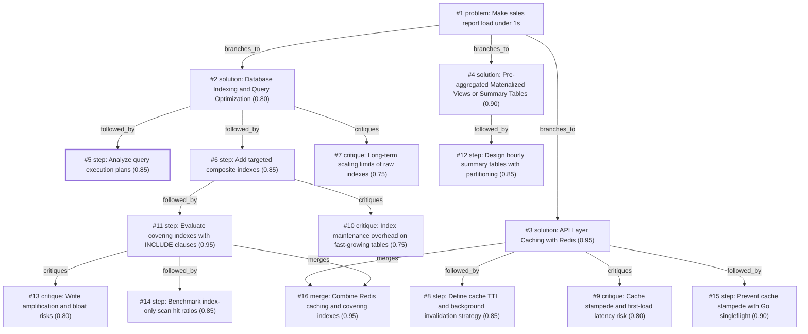

# report-page · gemini/gemini-3.5-flash-lite · index

**Task:** Our internal sales report page takes about 12 seconds to load. It runs on PostgreSQL behind a Go API, the data grows by 50,000 rows a day, and the team is two developers. How should we make it load in under 1 second?

| Thoughts | Calls | Tokens in / out | Time | Finish | First try valid | Next picked | Max depth | Weight spread | Duplicates |
|---|---|---|---|---|---|---|---|---|---|
| 16 | 9 | 11089 / 2748 | 18s | budget | 8/8 | 6/7 | 4 | 0.06 | 0 |

## Answer from the graph

To bring your internal sales report page load time down from 12 seconds to under 1 second with a lean two-developer team, you should combine **database optimization** with **API-layer caching**. A multi-layered approach ensures that even when cache expires, your database can handle the load efficiently without burning you out on complex maintenance.

Here is the step-by-step approach to take:

### 1. Optimize Database Queries and Indexes
Before caching, ensure your underlying database queries are as fast as possible, keeping in mind that your table grows by 50,000 rows a day.
* **Analyze Execution Plans:** Run `EXPLAIN ANALYZE` on your heavy report queries to identify sequential scans, expensive joins, or sorting bottlenecks.
* **Implement Covering Indexes:** Use PostgreSQL composite indexes with `INCLUDE` clauses. This allows the database to perform index-only scans for your dashboard metrics without touching the table heap, significantly speeding up reads.

### 2. Implement API-Layer Caching with Redis
With ~18 million new rows added per year, raw database queries will eventually degrade. Offload the read load by caching the final report JSON or heavy aggregate blocks in Redis.
* **Define TTL and Invalidation:** Set an appropriate Time-To-Live (TTL) based on how real-time your sales data needs to be (e.g., refreshing every 5 to 15 minutes, or hourly).
* **Prevent Cache Stampedes:** When the cache expires, multiple concurrent users hitting the page could trigger the heavy 12-second query simultaneously, exhausting your database connection pool. Use Go's `singleflight` package to collapse identical concurrent requests so that only one database query runs while others wait for the result.

---

### Risks to Watch
* **Write Amplification and Bloat:** Covering indexes are wide because they duplicate column data in leaf nodes. With 50,000 daily inserts, this leads to write amplification, index bloat, and heavier `VACUUM` overhead. Monitor index size and write performance closely.
* **Long-Term Scaling:** Raw indexes alone will hit limits as the dataset scales into hundreds of millions of rows. If index optimizations and Redis caching aren't enough long-term, prepare to pivot toward hourly summary tables or partitioned materialized views.

*Used: #1, #2, #3, #5, #6, #7, #8, #9, #11, #13, #15, #16*

## Index

```text
#1 [problem] Make sales report load under 1s · expanded
  #2 [solution] Database Indexing and Query Optimization · w 0.80 · expanded
    #5 [step] Analyze query execution plans · w 0.85 · done
    #6 [step] Add targeted composite indexes · w 0.85 · expanded
      #10 [critique] Index maintenance overhead on fast-growing tables · w 0.75 · open
      #11 [step] Evaluate covering indexes with INCLUDE clauses · w 0.95 · expanded
        #13 [critique] Write amplification and bloat risks · w 0.80 · open, max depth
        #14 [step] Benchmark index-only scan hit ratios · w 0.85 · open, max depth
    #7 [critique] Long-term scaling limits of raw indexes · w 0.75 · open
  #3 [solution] API Layer Caching with Redis · w 0.95 · expanded
    #8 [step] Define cache TTL and background invalidation strategy · w 0.85 · open
    #9 [critique] Cache stampede and first-load latency risk · w 0.80 · open
    #15 [step] Prevent cache stampede with Go singleflight · w 0.90 · open
    #16 [merge] Combine Redis caching and covering indexes · w 0.95 · open · also from #11
  #4 [solution] Pre-aggregated Materialized Views or Summary Tables · w 0.90 · expanded
    #12 [step] Design hourly summary tables with partitioning · w 0.85 · open
```

## Graph



## Thoughts

### #1 [problem] Make sales report load under 1s
w 1.00 · expanded · depth 0 · from –

Goal: Reduce sales report page load time from ~12 seconds to under 1 second. Facts/Limits: Stack is Go API + PostgreSQL; data grows by 50,000 rows/day; team size is only 2 developers. Unknowns: Current query structure, missing indexes, data volume details, database hardware specs, whether the report needs real-time data or can be pre-calculated/cached. Good result: A robust, maintainable architecture or query optimization that consistently delivers the report in <1s while handling daily data growth without burning out a 2-person team.

> Establishes the exact parameters, constraints, and success criteria for the graph.

### #2 [solution] Database Indexing and Query Optimization
w 0.80 · expanded · depth 1 · from #1

Analyze the current SQL queries using EXPLAIN ANALYZE, add missing indexes, and rewrite inefficient joins or aggregations to get quick wins with minimal code changes.

> Direct query optimization is the fastest way to reduce load time without changing architecture, fitting a 2-person team.

### #3 [solution] API Layer Caching with Redis
w 0.95 · expanded · depth 1 · from #1

Implement Redis caching in the Go API layer to cache the report results or heavy aggregate blocks, with a TTL or background refresh mechanism.

> Caching bypasses heavy database queries entirely, easily achieving sub-second loads for repetitive internal reports.

### #4 [solution] Pre-aggregated Materialized Views or Summary Tables
w 0.90 · expanded · depth 1 · from #1

Create materialized views or summary tables populated by a daily or hourly cron job, so the report queries pre-aggregated data instead of raw daily rows.

> Given 50k rows/day, pre-aggregation drastically reduces dataset size for reporting, ensuring long-term scalability.

### #5 [step] Analyze query execution plans
w 0.85 · done · depth 2 · from #2

Run EXPLAIN ANALYZE on the slowest report queries to identify sequential scans, expensive sorts, and nested loop bottlenecks.

> Directly pinpoints the database bottlenecks before attempting any index creation or rewriting.

### #6 [step] Add targeted composite indexes
w 0.85 · expanded · depth 2 · from #2

Create composite indexes tailored to the exact WHERE clauses, GROUP BY columns, and JOIN conditions used in the dashboard queries.

> Proper indexing provides massive speedups for large tables growing by 50k rows daily.

### #7 [critique] Long-term scaling limits of raw indexes
w 0.75 · open · depth 2 · from #2

Critique: With 50,000 new rows per day, even optimized queries will eventually slow down as historical data accumulates, requiring ongoing index maintenance and table partitioning.

> Highlights the long-term scalability risk of relying purely on query optimization for fast-growing data.

### #8 [step] Define cache TTL and background invalidation strategy
w 0.85 · open · depth 2 · from #3

Since data grows by 50k rows/day, determine if the report needs exact real-time accuracy. If a 1-hour or daily TTL is acceptable, store serialized JSON in Redis. For freshness, use a background goroutine in Go to precompute the cache before it expires.

> Clear concrete step to make caching reliable and fresh without hitting Postgres on every request.

### #9 [critique] Cache stampede and first-load latency risk
w 0.80 · open · depth 2 · from #3

When the Redis cache expires or restarts, the first user hitting the 12-second query will cause latency spikes and potential DB connection pool exhaustion. We must implement single-flight or locking in Go to ensure only one request triggers the DB recalculation.

> Important operational risk that must be mitigated for production stability.

### #10 [critique] Index maintenance overhead on fast-growing tables
w 0.75 · open · depth 3 · from #6

With 50,000 new rows added daily, heavy composite indexes will slow down INSERT performance and consume significant disk space, eventually requiring maintenance like REINDEX or bloated index cleanup.

> High write volume can degrade under-the-hood performance if too many indexes are added.

### #11 [step] Evaluate covering indexes with INCLUDE clauses
w 0.95 · expanded · depth 3 · from #6

Use PostgreSQL INCLUDE clauses in composite indexes to create covering indexes. This allows index-only scans for the dashboard queries without hitting the table heap, drastically speeding up aggregations.

> Index-only scans are crucial for sub-second analytical queries on large PostgreSQL tables.

### #12 [step] Design hourly summary tables with partitioning
w 0.85 · open · depth 2 · from #4

Create summary tables partitioned by month or year to keep aggregations fast and lightweight, populated incrementally via background jobs.

> Partitioning summary tables prevents table bloat and keeps writes fast for a 50k rows/day growth rate.

### #13 [critique] Write amplification and bloat risks
w 0.80 · open · depth 4 · from #11

Covering indexes add extra columns to the index leaf nodes, making them wider. With 50k new rows/day, write amplification increases, leading to faster index bloat and more frequent VACUUM needs, which can hurt write performance.

> Crucial risk assessment for high-write tables to ensure optimization doesn't degrade ingestion.

### #14 [step] Benchmark index-only scan hit ratios
w 0.85 · open · depth 4 · from #11

Measure the visibility map health and actual heap fetches (using pg_stat_user_indexes) after applying covering indexes to ensure Postgres can actually perform index-only scans without frequent visibility map updates.

> Validates whether the covering index strategy delivers the expected performance gains in practice.

### #15 [step] Prevent cache stampede with Go singleflight
w 0.90 · open · depth 2 · from #3

Use singleflight pattern in Go to collapse concurrent identical report requests into a single database query, preventing cache stampedes when the cache expires.

> Directly solves the cache stampede risk identified in #9 with minimal implementation effort for a 2-person team.

### #16 [merge] Combine Redis caching and covering indexes
w 0.95 · open · depth 2 · from #3, #11

Combine Redis API caching (#3) with targeted covering indexes (#11) to ensure the first-load and cache-miss latency remains extremely low.

> Caching alone leaves the first user or cache miss vulnerable to the 12-second load, so combining them provides bulletproof performance.

