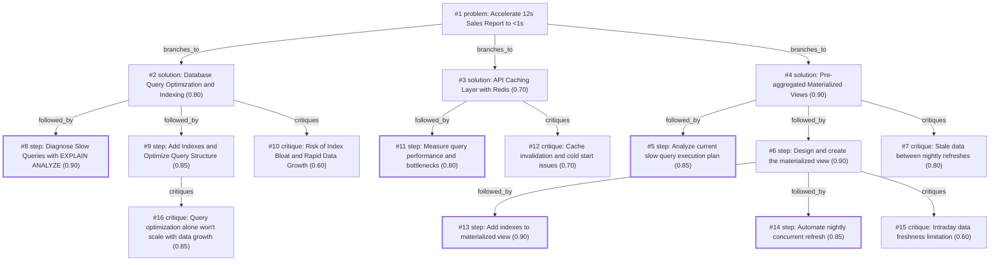

# report-page · gemini/gemini-3.5-flash-lite · path

**Task:** Our internal sales report page takes about 12 seconds to load. It runs on PostgreSQL behind a Go API, the data grows by 50,000 rows a day, and the team is two developers. How should we make it load in under 1 second?

| Thoughts | Calls | Tokens in / out | Time | Finish | First try valid | Next picked | Max depth | Weight spread | Duplicates |
|---|---|---|---|---|---|---|---|---|---|
| 16 | 8 | 7960 / 2611 | 27s | budget | 6/7 | 0/6 | 3 | 0.09 | 0 |

Failures: schema 1

## Answer from the graph

To reduce your internal sales report page load time from 12 seconds to under 1 second with a lean two-developer team, the most effective approach is to **shift heavy aggregation workloads away from request time using PostgreSQL Materialized Views**, backed by proper indexing and caching. 

Because your data is growing rapidly by 50,000 rows a day, running live aggregations on raw tables will only get slower. Pre-calculating the heavy lifting allows your Go API and database to serve the page almost instantaneously.

### Recommended Approach and Steps in Order

1. **Diagnose and Measure:**
   - Run `EXPLAIN ANALYZE` on your current slow queries to pinpoint the exact bottlenecks (e.g., sequential scans, expensive joins, or sorting large datasets).

2. **Design and Create the Materialized View:**
   - Create a PostgreSQL materialized view that pre-aggregates your sales data by common reporting dimensions (such as date, region, and product category) along with pre-calculated totals and counts.

3. **Add Indexes to the Materialized View:**
   - Build indexes on the materialized view's key filter and group-by columns (e.g., date, region) so that queries hitting the view execute in single-digit milliseconds.

4. **Automate Nightly Concurrent Refreshes:**
   - Set up an automated schedule (using `pg_cron` or a cron job paired with your Go backend) to run `REFRESH MATERIALIZED VIEW CONCURRENTLY`. The `CONCURRENTLY` keyword is crucial because it allows the view to be refreshed in the background without locking read queries.

5. **Implement an API Caching Layer (Optional/Complementary):**
   - If needed, cache the final JSON response in Redis for a short TTL (e.g., a few minutes) to completely bypass the database for repeated dashboard loads.

### Risks to Watch

* **Intraday Data Freshness (Stale Data):** 
  Nightly refreshes mean that current-day sales will not appear until the next refresh. If your business users strictly require real-time, intra-day accuracy, a pure materialized view won't be enough. 
  * *Mitigation:* If real-time today data is mandatory, modify your report query to union the pre-aggregated historical data from the materialized view with a live, fast-indexed query pulling only today's rows.

* **Index Bloat and Data Growth:**
  With 50,000 new rows daily, your underlying raw tables will bloat over time. While the materialized view shields your report from this, ensure you monitor table bloat and maintain indexes on the base tables.

*Used: #1, #2, #3, #4, #5, #6, #7, #8, #9, #10, #11, #12, #13, #14, #15, #16*

## Index

```text
#1 [problem] Accelerate 12s Sales Report to <1s · expanded
  #2 [solution] Database Query Optimization and Indexing · w 0.80 · expanded
    #8 [step] Diagnose Slow Queries with EXPLAIN ANALYZE · w 0.90 · done
    #9 [step] Add Indexes and Optimize Query Structure · w 0.85 · expanded
      #16 [critique] Query optimization alone won't scale with data growth · w 0.85 · open
    #10 [critique] Risk of Index Bloat and Rapid Data Growth · w 0.60 · open
  #3 [solution] API Caching Layer with Redis · w 0.70 · expanded
    #11 [step] Measure query performance and bottlenecks · w 0.80 · done
    #12 [critique] Cache invalidation and cold start issues · w 0.70 · open
  #4 [solution] Pre-aggregated Materialized Views · w 0.90 · expanded
    #5 [step] Analyze current slow query execution plan · w 0.85 · done
    #6 [step] Design and create the materialized view · w 0.90 · expanded
      #13 [step] Add indexes to materialized view · w 0.90 · done
      #14 [step] Automate nightly concurrent refresh · w 0.85 · done
      #15 [critique] Intraday data freshness limitation · w 0.60 · open
    #7 [critique] Stale data between nightly refreshes · w 0.80 · open
```

## Graph



## Thoughts

### #1 [problem] Accelerate 12s Sales Report to <1s
w 1.00 · expanded · depth 0 · from –

Goal: Reduce sales report page load time from 12s to under 1s.
Facts & Limits: PostgreSQL backend, Go API, data grows by 50,000 rows/day, small team of 2 developers.
Unknowns: Current database schema, indexing, query execution plan, caching layers, and whether the report requires real-time accuracy or can use pre-aggregated/cached data.
Good result: A fast-loading report page (<1s) maintainable by a small team without breaking business logic.

> Restates the full scope, constraints, and success criteria of the task as the root problem node.

### #2 [solution] Database Query Optimization and Indexing
w 0.80 · expanded · depth 1 · from #1

Diagnose the database queries using EXPLAIN ANALYZE, check indexes on date and foreign key columns, and identify missing indexes or sequential scans causing the 12s delay.

> Directly targets the root cause of slow performance with low effort for a two-person team.

### #3 [solution] API Caching Layer with Redis
w 0.70 · expanded · depth 1 · from #1

Implement Redis caching in the Go API to store pre-computed daily or monthly report aggregates, serving repeat requests instantly.

> Caching is a proven way to achieve sub-second response times for heavy reporting queries.

### #4 [solution] Pre-aggregated Materialized Views
w 0.90 · expanded · depth 1 · from #1

Create materialized views in PostgreSQL refreshed nightly via cron, shifting heavy aggregation workloads away from request time.

> Given 50k rows/day growth, pre-aggregating data avoids heavy scans during user requests.

### #5 [step] Analyze current slow query execution plan
w 0.85 · done · depth 2 · from #4

Run EXPLAIN ANALYZE on the slow sales report queries to identify exact table scan bottlenecks, missing indexes, and expensive joins before designing the materialized view.

> Understanding the precise bottlenecks ensures the materialized view addresses the root cause.

### #6 [step] Design and create the materialized view
w 0.90 · expanded · depth 2 · from #4

Create a PostgreSQL materialized view grouping sales data by day, region, and product category, aggregating totals and counts beforehand.

> This directly implements the core strategy of pre-aggregation.

### #7 [critique] Stale data between nightly refreshes
w 0.80 · open · depth 2 · from #4

Nightly refreshes mean current day sales won't appear until tomorrow. For a sales report, business users might need intra-day data. We should evaluate if combining the view with live today's data is necessary.

> Highlights a major business logic risk with materialized views and prompts a mitigation step.

### #8 [step] Diagnose Slow Queries with EXPLAIN ANALYZE
w 0.90 · done · depth 2 · from #2

Run EXPLAIN ANALYZE on the primary slow queries of the sales report to identify sequential scans, expensive joins, and missing indexes.

> This directly pinpoints the database bottlenecks causing the 12s load time before making schema changes.

### #9 [step] Add Indexes and Optimize Query Structure
w 0.85 · expanded · depth 2 · from #2

Add appropriate B-tree or partial indexes on heavily filtered columns such as date ranges and foreign keys, and rewrite inefficient JOINs or subqueries in the Go API or SQL.

> Indexing and query tuning are the lowest-hanging fruit to speed up PostgreSQL queries without architectural complexity.

### #10 [critique] Risk of Index Bloat and Rapid Data Growth
w 0.60 · open · depth 2 · from #2

With 50,000 new rows per day, indexes will bloat over time and queries may eventually slow down again, requiring ongoing maintenance.

> Highlights a long-term sustainability risk for a small team given rapid table growth.

### #11 [step] Measure query performance and bottlenecks
w 0.80 · done · depth 2 · from #3

Run EXPLAIN ANALYZE on the underlying PostgreSQL queries to identify missing indexes, sequential scans, or expensive joins.

> Without knowing why it is slow, caching might serve stale data or cache unoptimized queries.

### #12 [critique] Cache invalidation and cold start issues
w 0.70 · open · depth 2 · from #3

A cache miss will still cause a 12s load time for the first user, and frequent updates from 50k daily rows might constantly invalidate caches.

> Redis caching alone doesn't solve the core data growth problem of 50k rows/day if the cache invalidation is complex or the initial cache miss takes 12 seconds.

### #13 [step] Add indexes to materialized view
w 0.90 · done · depth 3 · from #6

Add indexes on the materialized view columns (date, region, product category) to ensure queries against the view execute in milliseconds.

> Without indexes, querying even a materialized view can still cause sequential scans as the dataset grows by 50k rows daily.

### #14 [step] Automate nightly concurrent refresh
w 0.85 · done · depth 3 · from #6

Set up a concurrent refresh schedule (REFRESH MATERIALIZED VIEW CONCURRENTLY) using pg_cron so the report updates nightly without locking reads.

> Concurrent refresh ensures that rebuilding the view daily doesn't cause downtime or block API requests.

### #15 [critique] Intraday data freshness limitation
w 0.60 · open · depth 3 · from #6

A materialized view might not handle real-time filters or custom date ranges if users need intraday data.

> If the business requires data from the current day, a purely nightly view will miss today's 50k rows.

### #16 [critique] Query optimization alone won't scale with data growth
w 0.85 · open · depth 3 · from #9

Critique: Pure query optimization alone may not suffice as the 50k daily row growth will eventually slow down queries again. We need to combine this with asynchronous pre-aggregation or materialized views to guarantee sub-second loads over time.

> Without addressing data volume growth, index optimization is only a temporary fix for a fast-growing dataset.

