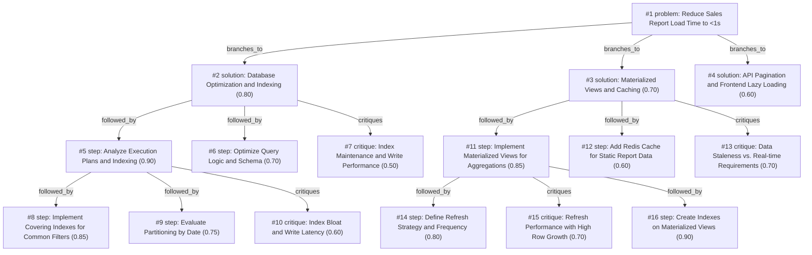

# report-page · ollama-cloud/gemma4:31b · index

**Task:** Our internal sales report page takes about 12 seconds to load. It runs on PostgreSQL behind a Go API, the data grows by 50,000 rows a day, and the team is two developers. How should we make it load in under 1 second?

| Thoughts | Calls | Tokens in / out | Time | Finish | First try valid | Next picked | Max depth | Weight spread | Duplicates |
|---|---|---|---|---|---|---|---|---|---|
| 16 | 7 | 12697 / 3717 | 23s | budget | 4/6 | 5/5 | 3 | 0.11 | 0 |

Failures: schema 2

## Answer from the graph

To reduce your sales report load time from 12 seconds to under 1 second with a small team, you should follow a tiered approach. Start with low-effort database optimizations, move to pre-aggregation if queries remain slow, and implement structural changes only if the data volume demands it.

### Step-by-Step Implementation Plan

**Phase 1: Database Diagnostic & Optimization (Immediate)**
1.  **Analyze Execution Plans:** Use `EXPLAIN (ANALYZE, BUFFERS)` on the report's main SQL queries. Identify whether the bottleneck is a sequential scan, expensive joins, or high-cost sorts.
2.  **Implement Covering Indexes:** Based on the analysis, create indexes on the most frequent filter columns. Use the `INCLUDE` clause to create covering indexes, allowing PostgreSQL to perform "Index Only Scans" and avoid fetching data from the main heap.
3.  **Optimize Query Logic:** Rewrite inefficient joins or subqueries identified in the execution plans to ensure the Go API is requesting only the necessary data.

**Phase 2: Pre-Aggregation (For Heavy Reports)**
If the report calculates totals or averages across millions of rows, real-time calculation will eventually fail regardless of indexing.
1.  **Materialized Views:** Create Materialized Views to store the results of complex aggregations.
2.  **Indexing Views:** Apply indexes directly to the Materialized Views to ensure the Go API can query the summary data instantly.
3.  **Refresh Strategy:** Define a refresh schedule (e.g., hourly or nightly) that balances data freshness with system load.

**Phase 3: Structural Scaling (Long-term)**
As your data grows by 50,000 rows daily, the table size will eventually degrade performance.
1.  **Date Partitioning:** Implement declarative range partitioning (e.g., by month). This allows PostgreSQL to use "partition pruning," scanning only the relevant time slices instead of the entire dataset.

### Risks to Monitor
*   **Write Latency:** Every new index slows down the 50k daily insertions. Balance the number of indexes to ensure that report read-speed doesn't break data ingestion.
*   **Index Bloat:** Frequent updates and high growth can lead to index bloat. Monitor your `VACUUM` behavior to maintain performance.
*   **Data Staleness:** If using Materialized Views, ensure the internal sales team is aware that the data is a "snapshot" and not real-time.

*Used: #1, #2, #5, #7, #8, #9, #10, #11, #14, #15, #16*

## Index

```text
#1 [problem] Reduce Sales Report Load Time to <1s · expanded
  #2 [solution] Database Optimization and Indexing · w 0.80 · expanded
    #5 [step] Analyze Execution Plans and Indexing · w 0.90 · expanded
      #8 [step] Implement Covering Indexes for Common Filters · w 0.85 · open
      #9 [step] Evaluate Partitioning by Date · w 0.75 · open
      #10 [critique] Index Bloat and Write Latency · w 0.60 · open
    #6 [step] Optimize Query Logic and Schema · w 0.70 · open
    #7 [critique] Index Maintenance and Write Performance · w 0.50 · open
  #3 [solution] Materialized Views and Caching · w 0.70 · expanded
    #11 [step] Implement Materialized Views for Aggregations · w 0.85 · expanded
      #14 [step] Define Refresh Strategy and Frequency · w 0.80 · open
      #15 [critique] Refresh Performance with High Row Growth · w 0.70 · open
      #16 [step] Create Indexes on Materialized Views · w 0.90 · open
    #12 [step] Add Redis Cache for Static Report Data · w 0.60 · open
    #13 [critique] Data Staleness vs. Real-time Requirements · w 0.70 · open
  #4 [solution] API Pagination and Frontend Lazy Loading · w 0.60 · open
```

## Graph



## Thoughts

### #1 [problem] Reduce Sales Report Load Time to <1s
w 1.00 · expanded · depth 0 · from –

Goal: Reduce the load time of an internal sales report page from 12 seconds to under 1 second. 

Facts:
- Tech Stack: PostgreSQL database, Go API.
- Data Growth: 50,000 new rows per day.
- Resources: Two developers.

Unknowns:
- Current query structure and execution plans.
- Database indexing status.
- Volume of data currently being fetched (total row count).
- Whether the bottleneck is in the DB, the API layer, or the frontend rendering.

Success Criteria:
- Page load time < 1 second.
- Solution is maintainable by a small team (2 devs).
- Solution scales with the daily growth of 50k rows.

> This defines the objective, constraints, and success metrics based on the prompt.

### #2 [solution] Database Optimization and Indexing
w 0.80 · expanded · depth 1 · from #1

Focus on the database layer by analyzing execution plans (EXPLAIN ANALYZE) to find slow scans. Implement missing indexes, rewrite inefficient joins, or optimize the schema to reduce the raw query time. This is the most direct approach for data-heavy reports.

> DB bottlenecks are the most common cause of slow reports in SQL-backed apps.

### #3 [solution] Materialized Views and Caching
w 0.70 · expanded · depth 1 · from #1

Instead of calculating reports in real-time, use PostgreSQL Materialized Views to pre-aggregate data. Use a cron job or trigger to refresh the view. Alternatively, implement a Redis cache layer in the Go API for frequently accessed report parameters.

> Pre-aggregation drastically reduces load time for large datasets regardless of query complexity.

### #4 [solution] API Pagination and Frontend Lazy Loading
w 0.60 · open · depth 1 · from #1

Shift from loading the entire report at once to a paginated approach. Implement keyset pagination (cursor-based) in the Go API and PostgreSQL to ensure performance stays constant as the dataset grows by 50k rows/day.

> Reducing the amount of data transferred per request is a scalable way to meet the <1s goal.

### #5 [step] Analyze Execution Plans and Indexing
w 0.90 · expanded · depth 2 · from #2

Run 'EXPLAIN (ANALYZE, BUFFERS)' on the report's main SQL queries to identify sequential scans, expensive joins, or high-cost sorts. Check for existing indexes on foreign keys and filter columns (e.g., date ranges) and implement B-tree or BRIN indexes where appropriate for the 50k daily growth.

> This is the essential first step to identify the exact cause of the 12-second delay before making changes.

### #6 [step] Optimize Query Logic and Schema
w 0.70 · open · depth 2 · from #2

Rewrite queries to avoid 'SELECT *', replace correlated subqueries with JOINs or Common Table Expressions (CTEs), and ensure that the Go API is not performing 'N+1' queries. Evaluate if some columns can be denormalized to avoid heavy joins on growing tables.

> Query restructuring often yields significant gains after indexing is optimized.

### #7 [critique] Index Maintenance and Write Performance
w 0.50 · open · depth 2 · from #2

Adding too many indexes may slow down the 50,000 daily row insertions. We must balance read performance for the report with the write throughput of the daily data ingestion to avoid locking issues or degraded insert speed.

> Highlights a critical trade-off given the high daily growth rate.

### #8 [step] Implement Covering Indexes for Common Filters
w 0.85 · open · depth 3 · from #5

Based on the EXPLAIN ANALYZE results, create covering indexes (using the INCLUDE clause) for the most frequent report filter combinations. This allows PostgreSQL to perform Index Only Scans, avoiding expensive heap fetches for the report's required columns.

> Reducing heap fetches is critical for large datasets to hit sub-second targets.

### #9 [step] Evaluate Partitioning by Date
w 0.75 · open · depth 3 · from #5

Given the 50k rows/day growth, investigate declarative partitioning by range (e.g., monthly partitions). This enables partition pruning, ensuring the database only scans relevant shards of data rather than the entire table.

> Essential for long-term scalability as the table grows by millions of rows per year.

### #10 [critique] Index Bloat and Write Latency
w 0.60 · open · depth 3 · from #5

Adding multiple covering or composite indexes will slow down the 50k daily inserts and increase disk usage. We must balance read performance with write throughput and monitor vacuuming behavior.

> Addresses the risk of trading one performance bottleneck for another.

### #11 [step] Implement Materialized Views for Aggregations
w 0.85 · expanded · depth 2 · from #3

Create Materialized Views for common report summaries (e.g., daily/monthly sales). Set up a REFRESH MATERIALIZED VIEW CONCURRENTLY schedule during off-peak hours to avoid locking the table, ensuring data is pre-calculated for the Go API to fetch instantly.

> Pre-calculating sums and counts removes the heaviest load from the request path.

### #12 [step] Add Redis Cache for Static Report Data
w 0.60 · open · depth 2 · from #3

Introduce a Redis layer in the Go API to cache the results of the materialized view queries. Use a TTL (Time To Live) that aligns with the report refresh rate, reducing the number of round-trips to PostgreSQL.

> Provides sub-millisecond response times but adds infrastructure complexity for 2 developers.

### #13 [critique] Data Staleness vs. Real-time Requirements
w 0.70 · open · depth 2 · from #3

Materialized views and caching introduce data lag. If the sales report requires 'up-to-the-minute' accuracy, these methods will fail business requirements. Need to verify if users accept data that is X hours old.

> Identifies a critical trade-off between speed and accuracy.

### #14 [step] Define Refresh Strategy and Frequency
w 0.80 · open · depth 3 · from #11

Determine if the report needs real-time data or if 1-hour/24-hour staleness is acceptable. Set up a pg_cron job or a Go-based scheduler to call 'REFRESH MATERIALIZED VIEW CONCURRENTLY' to balance resource usage with data freshness.

> The effectiveness of a materialized view depends entirely on how it is updated without blocking reads.

### #15 [critique] Refresh Performance with High Row Growth
w 0.70 · open · depth 3 · from #11

With 50k new rows daily, a full refresh of the materialized view will become increasingly expensive over time, potentially exceeding the maintenance window or spiking CPU.

> Materialized views in Postgres are fully rebuilt, which doesn't scale linearly as the base table grows to millions of rows.

### #16 [step] Create Indexes on Materialized Views
w 0.90 · open · depth 3 · from #11

Since materialized views are essentially tables, create specific indexes on the view itself (e.g., on date or region columns) to ensure the Go API can filter the pre-aggregated data in milliseconds.

> Pre-aggregation helps, but indexing the resulting view is necessary to hit the <1s target for filtered reports.

