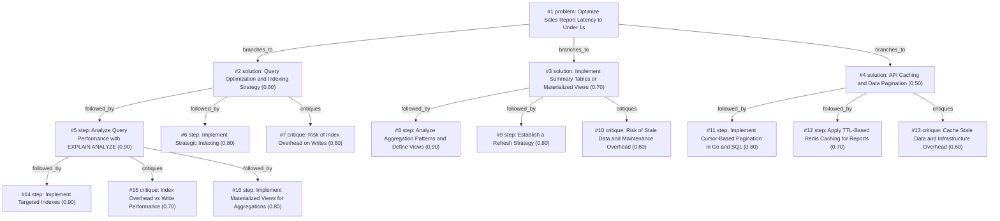

# report-page · ollama-cloud/gemma4:31b · path

**Task:** Our internal sales report page takes about 12 seconds to load. It runs on PostgreSQL behind a Go API, the data grows by 50,000 rows a day, and the team is two developers. How should we make it load in under 1 second?

| Thoughts | Calls | Tokens in / out | Time | Finish | First try valid | Next picked | Max depth | Weight spread | Duplicates |
|---|---|---|---|---|---|---|---|---|---|
| 16 | 7 | 6472 / 2734 | 15s | budget | 6/6 | 0/5 | 3 | 0.11 | 0 |

## Answer from the graph

To reduce your sales report load time from 12 seconds to under 1 second with a small team of two developers, you should follow a tiered approach—starting with the highest impact for the lowest effort.

### Recommended Approach

**Step 1: Diagnosis via `EXPLAIN ANALYZE`**
Before changing code, run `EXPLAIN ANALYZE` on the specific SQL queries powering the report. This will reveal exactly where the bottleneck lies—whether it is a sequential scan of a massive table, a heavy sort operation, or an inefficient join. This ensures you aren't guessing and prevents wasted development time.

**Step 2: Targeted Indexing**
Based on the analysis, implement targeted indexes. 
*   **B-Tree Indexes:** Apply these to columns used in `WHERE` clauses, `JOIN` conditions, and `ORDER BY` segments.
*   **BRIN Indexes:** Since your data grows linearly (50k rows/day), consider Block Range Indexes (BRIN) for timestamp columns to save space while maintaining high performance for time-range queries.

**Step 3: Materialized Views for Heavy Aggregations**
If the report involves aggregating millions of rows (e.g., calculating total monthly sales), indexing alone may not reach the <1s goal. Implement a **Materialized View** or a summary table. This pre-calculates the totals and stores them on disk, allowing the API to fetch a pre-computed result instantly rather than calculating it on every page load.

### Risks to Monitor

*   **Write Performance Degradation:** Every index you add slows down the ingestion of those 50,000 daily rows. Avoid "over-indexing"; only add indexes that directly solve a performance bottleneck identified in Step 1.
*   **Data Staleness:** Materialized views do not update in real-time. You must establish a refresh strategy (e.g., refreshing every hour or nightly) and ensure the business stakeholders are comfortable with the resulting data lag.
*   **Maintenance Overhead:** With only two developers, keep the solution simple. Avoid complex caching layers (like Redis) unless the database optimizations fail, as this adds another piece of infrastructure to maintain.

*Used: #1, #2, #5, #7, #14, #15, #16*

## Index

```text
#1 [problem] Optimize Sales Report Latency to Under 1s · expanded
  #2 [solution] Query Optimization and Indexing Strategy · w 0.80 · expanded
    #5 [step] Analyze Query Performance with EXPLAIN ANALYZE · w 0.90 · expanded
      #14 [step] Implement Targeted Indexes · w 0.90 · open
      #15 [critique] Index Overhead vs Write Performance · w 0.70 · open
      #16 [step] Implement Materialized Views for Aggregations · w 0.80 · open
    #6 [step] Implement Strategic Indexing · w 0.80 · open
    #7 [critique] Risk of Index Overhead on Writes · w 0.60 · open
  #3 [solution] Implement Summary Tables or Materialized Views · w 0.70 · expanded
    #8 [step] Analyze Aggregation Patterns and Define Views · w 0.90 · open
    #9 [step] Establish a Refresh Strategy · w 0.80 · open
    #10 [critique] Risk of Stale Data and Maintenance Overhead · w 0.60 · open
  #4 [solution] API Caching and Data Pagination · w 0.50 · expanded
    #11 [step] Implement Cursor-Based Pagination in Go and SQL · w 0.80 · open
    #12 [step] Apply TTL-Based Redis Caching for Reports · w 0.70 · open
    #13 [critique] Cache Stale Data and Infrastructure Overhead · w 0.60 · open
```

## Graph



## Thoughts

### #1 [problem] Optimize Sales Report Latency to Under 1s
w 1.00 · expanded · depth 0 · from –

Goal: Reduce the internal sales report page load time from 12 seconds to under 1 second. 
Facts: 
- Tech Stack: PostgreSQL database, Go API.
- Data Growth: ~50,000 new rows per day.
- Resources: Small team of two developers.
Unknowns: 
- The specific SQL queries being executed.
- Current indexing strategy.
- The amount of data being fetched/processed in the Go API.
- Whether the bottleneck is DB execution, network transfer, or API processing.
Success Criteria: A sustainable performance optimization that achieves <1s latency while remaining maintainable by a two-person team.

> This defines the technical constraints, the business goal, and the operational limits of the team.

### #2 [solution] Query Optimization and Indexing Strategy
w 0.80 · expanded · depth 1 · from #1

Focus on the database layer by analyzing slow queries using EXPLAIN ANALYZE, adding missing indexes (B-Tree, BRIN for time-series), and rewriting inefficient joins or aggregations to minimize disk I/O.

> Database bottlenecks are the most common cause of high latency in report pages and offer high ROI for low effort.

### #3 [solution] Implement Summary Tables or Materialized Views
w 0.70 · expanded · depth 1 · from #1

Since reports often aggregate large datasets, create pre-aggregated summary tables or PostgreSQL Materialized Views that refresh periodically. This shifts the cost from read-time to write-time/background-time.

> With 50k rows/day, raw table scans become unsustainable; pre-aggregation ensures O(1) or O(log n) read performance.

### #4 [solution] API Caching and Data Pagination
w 0.50 · expanded · depth 1 · from #1

Introduce a caching layer (e.g., Redis or in-memory Go cache) for common report parameters and implement strict pagination or date-range filtering to limit the data volume returned per request.

> Caching hides the problem but doesn't solve the underlying query growth; pagination is necessary but might change the user experience.

### #5 [step] Analyze Query Performance with EXPLAIN ANALYZE
w 0.90 · expanded · depth 2 · from #2

Use PostgreSQL's EXPLAIN ANALYZE on the specific queries powering the sales report to identify sequential scans, heavy sorts, or nested loop joins. This will pinpoint exactly where the 12-second latency originates (e.g., a missing index on a date column or a Cartesian product).

> Identification of the bottleneck is the mandatory first step before applying any fix.

### #6 [step] Implement Strategic Indexing
w 0.80 · open · depth 2 · from #2

Based on the analysis, apply B-Tree indexes for high-cardinality filter columns and consider BRIN (Block Range Index) for the timestamp columns, given the 50k rows/day growth. This optimizes range scans for date-based reporting while keeping index overhead low for the small team to manage.

> Indexing is the most common and effective way to reduce query time in PostgreSQL.

### #7 [critique] Risk of Index Overhead on Writes
w 0.60 · open · depth 2 · from #2

Adding too many indexes can slow down the ingestion of the 50,000 daily rows and increase storage costs. We must ensure that we only index columns used in the report's WHERE and JOIN clauses, rather than indexing everything.

> Balancing read performance with write throughput is critical for sustainable growth.

### #8 [step] Analyze Aggregation Patterns and Define Views
w 0.90 · open · depth 2 · from #3

Identify the most common dimensions (e.g., date, region, product) and metrics (e.g., total sum, count) required for the report. Create Materialized Views in PostgreSQL that pre-calculate these values, ensuring the Go API queries these views instead of the raw sales table.

> This is the immediate technical implementation needed to realize the summary table solution.

### #9 [step] Establish a Refresh Strategy
w 0.80 · open · depth 2 · from #3

Determine the acceptable data freshness. If real-time is not required, set up a cron job or a Go worker to run 'REFRESH MATERIALIZED VIEW CONCURRENTLY' during off-peak hours or at set intervals (e.g., every 1 hour) to avoid locking the table.

> Materialized views are only useful if they are updated without causing downtime or severe performance dips.

### #10 [critique] Risk of Stale Data and Maintenance Overhead
w 0.60 · open · depth 2 · from #3

Materialized views introduce data staleness, which might be unacceptable for some sales reports. Additionally, adding more views increases the database management burden for a two-person team. We should verify if 'Concurrent Refresh' is possible (requires a unique index) and if the business accepts the lag.

> Identifies the primary trade-off of the summary table approach regarding data accuracy and developer effort.

### #11 [step] Implement Cursor-Based Pagination in Go and SQL
w 0.80 · open · depth 2 · from #4

Modify the API to replace 'OFFSET/LIMIT' with cursor-based pagination (using a unique, ordered column like ID or timestamp) to prevent performance degradation as the dataset grows. Update the SQL queries to filter by the cursor, ensuring the database doesn't scan thousands of rows to find the starting point.

> Pagination directly addresses the growth of 50k rows/day by limiting the result set size per request.

### #12 [step] Apply TTL-Based Redis Caching for Reports
w 0.70 · open · depth 2 · from #4

Implement a Redis cache with a Time-To-Live (TTL) for the most frequently accessed reports. Since it's an internal sales report, a cache invalidation strategy based on a 5-15 minute window is likely acceptable to the business, drastically reducing the load on PostgreSQL.

> Caching removes the database bottleneck for repeat views, though it adds infrastructure complexity for two devs.

### #13 [critique] Cache Stale Data and Infrastructure Overhead
w 0.60 · open · depth 2 · from #4

Introducing Redis adds a new point of failure and operational overhead for a small team of two. Additionally, if the reports require real-time accuracy for sales figures, caching may introduce unacceptable data staleness.

> Highlights the trade-off between performance gains and the maintenance burden on a small team.

### #14 [step] Implement Targeted Indexes
w 0.90 · open · depth 3 · from #5

Identify and implement missing indexes based on the EXPLAIN ANALYZE output. Specifically, look for 'Seq Scan' on large tables where a 'Index Scan' would be more efficient, focusing on columns used in WHERE clauses, JOIN conditions, and ORDER BY segments.

> Directly translates the analysis results into a performance gain.

### #15 [critique] Index Overhead vs Write Performance
w 0.70 · open · depth 3 · from #5

Adding too many indexes can slow down the 50k daily row insertions and increase storage overhead. We must evaluate the trade-off between read speed for reports and write speed for ingestion.

> Addresses the data growth constraint mentioned in the problem.

### #16 [step] Implement Materialized Views for Aggregations
w 0.80 · open · depth 3 · from #5

If EXPLAIN ANALYZE shows that the query is fundamentally slow due to massive aggregations over millions of rows, indexing alone won't reach <1s. We should consider a Materialized View that refreshes periodically or a summary table updated via triggers.

> Provides a fallback for when simple indexing is insufficient for the data volume.

