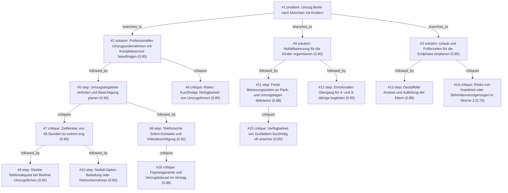

# umzug · gemini/gemini-3.5-flash-lite · index

**Task:** Wir ziehen in drei Wochen mit zwei Kindern (4 und 9 Jahre) von Berlin nach München. Beide Eltern arbeiten weiter. Wie organisieren wir den Umzug, damit nichts Wichtiges vergessen wird?

| Thoughts | Calls | Tokens in / out | Time | Finish | First try valid | Next picked | Max depth | Weight spread | Duplicates |
|---|---|---|---|---|---|---|---|---|---|
| 16 | 10 | 13615 / 3490 | 43s | budget | 9/9 | 6/8 | 4 | 0.04 | 0 |

## Answer from the graph

Ein Umzug von Berlin nach München mit zwei voll berufstätigen Eltern und zwei Kindern (4 und 9 Jahre) innerhalb von nur drei Wochen ist eine enorme organisatorische Herausforderung. Um diesen Kraftakt ohne Burnout und Chaos zu meistern, ist ein strikter Masterplan notwendig, der Logistik, Beruf und Familie synchronisiert. 

Hier ist Ihr konkreter Vorgehensplan und die wichtigsten Risiken, die Sie im Blick behalten müssen:

### Der strategische Ansatz: Maximales Outsourcing
Da beide Eltern arbeiten und das Zeitfenster extrem knapp ist, sollten Sie so viel wie möglich abgeben. Versuchen Sie nicht, in Eigenregie zu packen oder zu organisieren.

---

### Schritt-für-Schritt-Plan für die nächsten 3 Wochen

#### 1. Sofort-Aktion: Umzugsunternehmen (Gleich in den nächsten 48 Stunden)
* **Telefonische Sofort-Akquise:** Warten Sie nicht auf E-Mail-Antworten. Rufen Sie heute noch aktiv 5 bis 10 Berliner Umzugsunternehmen an, die auf Fernumzüge spezialisiert sind. 
* **Videobesichtigung nutzen:** Schildern Sie die extreme Dringlichkeit (Umzug in 3 Wochen) und vereinbaren Sie sofort per Video-Call (WhatsApp/Zoom) eine digitale Volumenermittlung.
* **Vertrag absichern:** Lassen Sie sich unbedingt eine schriftliche Fixpreisgarantie sowie verbindliche Liefertermine für die Strecke Berlin–München (inklusive Verzugspauschale im Vertrag) geben, um böse Überraschungen und Zusatzkosten zu vermeiden.

#### 2. Familie & Beruf: Urlaub und Puffer (Woche 2 und 3)
* **Pufferzeiten einplanen:** Nehmen Sie sich als Eltern in der Umzugswoche gezielt Urlaub. Teilen Sie sich bei der Anreise nach München auf (z. B. ein Elternteil fährt mit der Spedition/dem Auto voraus, der andere reist mit den Kindern entspannt per Zug nach).
* **Notfallbetreuung für die Kinder:** Da Pack- und Umzugstage für 4- und 9-Jährige stressig sind, definieren Sie feste Betreuungszeiten an diesen Tagen. (Achtung: Verlassen Sie sich nicht blind auf Großeltern, falls diese spontan einspringen müssen – haben Sie einen Plan B parat).
* **Emotionaler Übergang:** Bereiten Sie die Kinder aktiv vor. Die 9-Jährige versteht den Schulwechsel/Abschied bewusst, der 4-jährige braucht spielerische Begleitung und die Gewissheit, dass das Lieblingsspielzeug mitkommt.

---

### Kritische Risiken & Notfall-Pläne

* **Risiko: Kurzfristige Absagen oder Auslastung der Speditionen**
  * *Lage:* Drei Wochen Vorlauf sind für einen 600-km-Fernumzug mit Komplettservice extrem knapp. Firmen könnten ausgebucht sein oder horrende Express-Zuschläge verlangen.
  * *Plan B:* Sollte keine Firma den Rundum-Service (inklusive Packen) anbieten können, buchen Sie zumindest den reinen Transport (Lkw mit Fahrern) und engagieren Sie kurzfristig studentische Umzugshelfer fürs Packen oder lagern Sie einen Teil des Hausrats zwischen.
* **Risiko: Unvorhergesehene Verzögerungen (Krankheit, Behörden)**
  * *Lage:* Wenn in Woche 3 jemand krank wird, bricht das System ein. 
  * *Plan B:* Kommunizieren Sie mit Arbeitgebern transparent über die Ausnahmesituation und halten Sie digitale Arbeitsoptionen für die Übergangsphase in München bereit.

*Used: #1, #2, #3, #4, #5, #6, #7, #8, #9, #11, #12, #13, #14, #15, #16*

## Index

```text
#1 [problem] Umzug Berlin nach München mit Kindern · expanded
  #2 [solution] Professionelles Umzugsunternehmen mit Komplettservice beauftragen · w 0.95 · expanded
    #5 [step] Umzugsangebote einholen und Besichtigung planen · w 0.90 · expanded
      #7 [critique] Zeitfenster von 48 Stunden ist extrem eng · w 0.90 · expanded
        #9 [step] Direkte Telefonakquise bei Berliner Umzugsfirmen · w 0.92 · open, max depth
        #10 [step] Notfall-Option Beiladung oder Kleinunternehmer · w 0.80 · open, max depth
      #8 [step] Telefonische Sofort-Kontakte und Videobesichtigung · w 0.92 · expanded
        #16 [critique] Fixpreisgarantie und Verzugsklausel im Vertrag · w 0.88 · open, max depth
    #6 [critique] Risiko: Kurzfristige Verfügbarkeit von Umzugsfirmen · w 0.85 · open
  #3 [solution] Urlaub und Pufferzeiten für die Endphase einplanen · w 0.85 · expanded
    #13 [step] Gestaffelte Anreise und Aufteilung der Eltern · w 0.88 · open
    #14 [critique] Risiko von Krankheit oder Behördenverzögerungen in Woche 3 · w 0.75 · open
  #4 [solution] Notfallbetreuung für die Kinder organisieren · w 0.90 · expanded
    #11 [step] Feste Betreuungszeiten an Pack- und Umzugstagen definieren · w 0.88 · expanded
      #15 [critique] Verfügbarkeit von Großeltern kurzfristig oft unsicher · w 0.85 · open
    #12 [step] Emotionalen Übergang für 4- und 9-Jährige begleiten · w 0.85 · open
```

## Graph



## Thoughts

### #1 [problem] Umzug Berlin nach München mit Kindern
w 1.00 · expanded · depth 0 · from –

Ziel: Stressfreier Umzug von Berlin nach München in drei Wochen mit zwei Kindern (4 und 9 Jahre) und zwei voll berufstätigen Eltern. 
Fakten & Grenzen: Extrem knappe Zeit (3 Wochen), laufende Arbeit beider Eltern, Betreuungsbedarf der Kinder muss gewährleistet sein, räumliche Distanz (ca. 600 km). 
Unbekannt: Konkreter Status von Wohnung, Behörden, Umzugsunternehmen, Kita/Schule.
Gutes Ergebnis: Ein strukturierter Masterplan, der Logistik, Beruf, Familie und Behördenkram ohne Burnout synchronisiert, sodass am Einzugstag in München alles Wichtige organisiert ist und die Kinder emotional gut begleitet werden.

> Das ist die präzise Definition des Gesamtproblems, die alle Randbedingungen und das Ziel klar umreißt.

### #2 [solution] Professionelles Umzugsunternehmen mit Komplettservice beauftragen
w 0.95 · expanded · depth 1 · from #1

Wir beauftragen ein professionelles Umzugsunternehmen für den Fernumzug von Berlin nach München (inklusive Ein- und Auspackservice), um die Eltern extrem zu entlasten.

> Bei 600 km Distanz und zwei voll berufstätigen Eltern ist Eigenregie in 3 Wochen ein zu hohes Burnout-Risiko.

### #3 [solution] Urlaub und Pufferzeiten für die Endphase einplanen
w 0.85 · expanded · depth 1 · from #1

Die letzten 3-5 Tage vor dem Umzug nehmen beide Eltern Sonderurlaub oder Urlaub, um Behördengänge, Übergaben und die Reise zu managen.

> Ohne Pufferzeit vor Ort ist die Koordination mit Vollzeitjobs unmöglich.

### #4 [solution] Notfallbetreuung für die Kinder organisieren
w 0.90 · expanded · depth 1 · from #1

Die Kinder (4 und 9 Jahre) werden für die stressigen Tage des Packens und des eigentlichen Umzugs durch die Großeltern oder Freunde betreut.

> Das schützt die Kinder vor Umzugsstress und gibt den Eltern die Hände frei zum Arbeiten und Packen.

### #5 [step] Umzugsangebote einholen und Besichtigung planen
w 0.90 · expanded · depth 2 · from #2

Sofort (innerhalb der nächsten 48 Stunden) mindestens drei Umzugsunternehmen für Fernumzüge kontaktieren, digitale Besichtigung (Video-Call) vereinbaren und Angebote für den Komplettservice inklusive Packen und Montage einholen.

> Bei nur 3 Wochen Vorlaufzeit ist schnelles Handeln für die Kapazitäten der Firmen überlebenswichtig.

### #6 [critique] Risiko: Kurzfristige Verfügbarkeit von Umzugsfirmen
w 0.85 · open · depth 2 · from #2

In drei Wochen einen Fernumzug (600 km) mit Komplettservice zu buchen ist extrem knapp; Firmen könnten ausgebucht sein oder horrende Express-Zuschläge verlangen. Plan B: Nur den Transport (Lkw mit Fahrern) buchen und Freunde/Familie zum Packen einspannen, oder einen Teil des Hausrats einlagern.

> Beleuchtet das größte Projektrisiko dieses Lösungsansatzes und bietet sofort eine Ausweichstrategie.

### #7 [critique] Zeitfenster von 48 Stunden ist extrem eng
w 0.90 · expanded · depth 3 · from #5

Bei nur drei Wochen Vorlaufzeit könnten Umzugsfirmen bereits ausgebucht sein oder nicht mehr auf digitale Anfragen reagieren. Wir müssen parallel sofort zum Telefon greifen, statt auf E-Mails zu warten.

> Ein wichtiger Risikofaktor bei so kurzer Vorlaufzeit.

### #8 [step] Telefonische Sofort-Kontakte und Videobesichtigung
w 0.92 · expanded · depth 3 · from #5

Nicht auf schriftliche Angebote warten, sondern direkt anrufen, die Dringlichkeit (3 Wochen) betonen und noch für heute oder morgen eine Videobesichtigung (per WhatsApp/Zoom) zur Volumenermittlung einfordern.

> Sichert die maximale Beschleunigung des Prozesses.

### #9 [step] Direkte Telefonakquise bei Berliner Umzugsfirmen
w 0.92 · open · depth 4 · from #7

Heute noch aktiv bei 5-10 Berliner Umzugsunternehmen anrufen, die auf Fernumzüge spezialisiert sind, um sofort freie Kapazitäten für die nächsten zwei Wochen zu prüfen.

> Das direkte Telefonat umgeht langsame E-Mail-Schleifen und erhöht die Chance auf einen kurzfristigen Termin drastisch.

### #10 [step] Notfall-Option Beiladung oder Kleinunternehmer
w 0.80 · open · depth 4 · from #7

Falls keine große Umzugsfirma mehr Zeit hat, sofort nach kleineren Transportdiensten oder Beiladungs-Portalen suchen, während die Eltern wichtige Kisten selbst packen.

> Sichert den Transport ab, falls die großen Full-Service-Firmen für die Strecke Berlin-München komplett ausgebucht sind.

### #11 [step] Feste Betreuungszeiten an Pack- und Umzugstagen definieren
w 0.88 · expanded · depth 2 · from #4

Großeltern oder Freunde einbinden, damit die Kinder 4 Tage lang (Packen, Fahrt, erster Tag in München) komplett betreut sind, oder eine temporäre Ferienbetreuung/Not-Kita in Berlin bzw. München organisieren.

> Das entlastet die voll berufstätigen Eltern in der kritischsten Phase enorm.

### #12 [step] Emotionalen Übergang für 4- und 9-Jährige begleiten
w 0.85 · open · depth 2 · from #4

Abschiedsrituale in Berlin planen (Abschied von Freunden, Kita, Schule) und die neue Wohnung in München vorab per Foto/Video positiv besetzen, damit die Kinder den Wechsel gut verarbeiten.

> Verhindert Verhaltensprobleme durch Stress und gibt den Kindern Sicherheit.

### #13 [step] Gestaffelte Anreise und Aufteilung der Eltern
w 0.88 · open · depth 2 · from #3

Jeweils gestaffelten Urlaub nehmen: Ein Elternteil reist mit den Kindern 1-2 Tage früher nach München (z.B. zu Verweilmöglichkeiten oder erster Einrichtung), während der andere den Auszug in Berlin final betreut.

> Verteilt die Last des Umzugs und schützt die Kinder vor dem ärgsten Packchaos am Schlusstag.

### #14 [critique] Risiko von Krankheit oder Behördenverzögerungen in Woche 3
w 0.75 · open · depth 2 · from #3

Kurzfristige Krankschreibung (Kind krank) als Puffer einplanen oder unbezahlten Urlaub bzw. Pflegezeit prüfen, falls der Umzugstag durch unvorhergesehene Verzögerungen kollidiert.

> Gefahr, dass Urlaubstage allein nicht reichen, wenn Kinder in der hektischen Phase erkranken.

### #15 [critique] Verfügbarkeit von Großeltern kurzfristig oft unsicher
w 0.85 · open · depth 3 · from #11

In drei Wochen ist es schwer, spontan Urlaub von Großeltern zu bekommen oder sie für 4 Tage fest einzuplanen, besonders bei einer Distanz von 600 km.

> Risikoanalyse der Kinderbetreuung bei so kurzer Vorlaufzeit.

### #16 [critique] Fixpreisgarantie und Verzugsklausel im Vertrag
w 0.88 · open · depth 4 · from #8

Bei so kurzfristigen Verträgen besteht das Risiko von versteckten Zusatzkosten oder Lieferverzögerungen auf der Strecke Berlin-München. Unbedingt im Telefonat eine schriftliche Fixpreisgarantie und verbindliche Liefertermine (inklusive Verzugspauschale) einfordern.

> Sichert die zeitliche und finanzielle Kontrolle bei extremem Zeitdruck.

