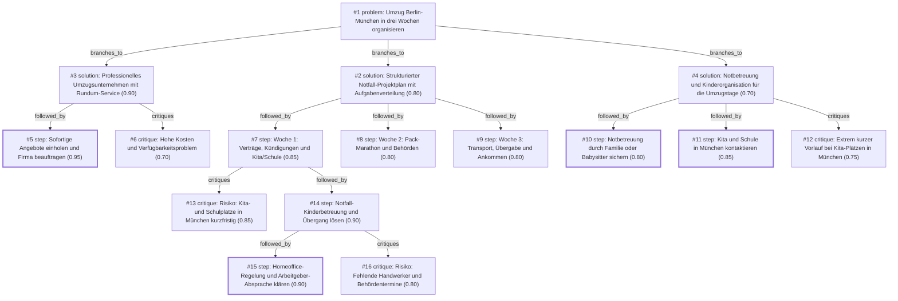

# umzug · gemini/gemini-3.5-flash-lite · path

**Task:** Wir ziehen in drei Wochen mit zwei Kindern (4 und 9 Jahre) von Berlin nach München. Beide Eltern arbeiten weiter. Wie organisieren wir den Umzug, damit nichts Wichtiges vergessen wird?

| Thoughts | Calls | Tokens in / out | Time | Finish | First try valid | Next picked | Max depth | Weight spread | Duplicates |
|---|---|---|---|---|---|---|---|---|---|
| 16 | 8 | 7798 / 3070 | 51s | budget | 7/7 | 0/6 | 4 | 0.06 | 0 |

## Answer from the graph

Ein Umzug von Berlin nach München mit zwei Kindern (4 und 9 Jahre) und beiden Elternteilen im Beruf innerhalb von nur drei Wochen ist eine enorme Herausforderung. Um diesen Kraftakt erfolgreich und möglichst stressfrei zu meistern, ist ein straff durchgetakteter Notfall-Projektplan mit klarer Aufgabenverteilung und externer professioneller Unterstützung zwingend erforderlich.

### Das Vorgehen und die Schritte nach Wochen

**1. Sofortige Maßnahmen (noch heute / vor Beginn von Woche 1):**
* **Umzugsunternehmen buchen:** Da nur drei Wochen bleiben, müssen Sie sofort mindestens drei Speditionen für Fernumzüge kontaktieren. Buchen Sie am besten einen Rundum-Service (inklusive Einpackservice, Möbelabbau und behördlicher Halteverbotszonen in Berlin und München), um die Eltern zu entlasten.
* **Arbeitgeber informieren:** Sprechen Sie sofort mit Ihren Arbeitgebern. Vereinbaren Sie Sonderurlaub, Gleitzeit oder erweiterte Homeoffice-Tage für die Umzugstage und die erste Eingewöhnungsphase der Kinder in München.

**2. Woche 1: Verträge, Kündigungen und Kinderbetreuung**
* **Wohnung & Verträge:** Alte Wohnung übergeben/Kündigungen abschließen, Verträge (Strom, Internet, Versicherungen) auf das neue Datum anpassen.
* **Schule und Kita (München):** Da reguläre Plätze extrem schwer kurzfristig zu bekommen sind, kontaktieren Sie sofort das Münchner Stadtschulamt und Jugendamt (Hinweis auf Umzug als Härtefall). 
* **Notfall-Kinderbetreuung planen:** Da die formellen Kita- und Schulplätze in München nicht in drei Wochen garantiert werden können, organisieren Sie eine Übergangsbetreuung (z. B. Unterstützung durch Großeltern, temporäre Babysitter oder einen gestaffelten Start der Eltern im Job).

**3. Woche 2: Pack-Marathon und Behörden**
* **Verpacken:** Nutzen Sie den Buchungsservice der Umzugsfirma oder packen Sie jede freie Minute. Sortieren Sie radikal aus.
* **Behörden-Termine:** Buchen Sie *jetzt* online die Termine für die Ummeldung in München im Voraus, da die Vorlaufzeiten dort oft lang sind.

**4. Woche 3: Transport, Übergabe und Ankommen**
* **Umzugstage:** Während das Umzugsunternehmen den Transport regelt, sollten die Kinder (4 und 9 Jahre) durch Verwandte oder einen Babysitter betreut werden, um sie aus dem Umzugsstress herauszuhalten.
* **Ankunft in München:** Übergabe der alten Wohnung, Einzug in die neue Heimat und schrittweises Ankommen mit den Kindern in der neuen Umgebung.

### Risiken, die Sie im Blick behalten müssen

* **Kita- und Schulplätze:** Die größte Hürde ist die extreme Kurzfristigkeit. Rechnen Sie damit, dass der 4-Jährige und der 9-Jährige möglicherweise in den ersten Wochen noch keinen regulären Platz haben und Sie eine private Übergangsbetreuung brauchen.
* **Handwerker-Mangel:** Handwerker (z. B. für den Kücheneinbau in München) sind kurzfristig kaum zu bekommen. Hier sind pragmatische Übergangslösungen (oder vorbereitete Küchenmodule) gefragt.
* **Kosten und Verfügbarkeit der Speditionen:** Ein Full-Service-Umzug auf dieser Strecke ist sehr teuer, und viele Unternehmen werden aufgrund der kurzen Frist bereits ausgebucht sein – rufen Sie daher sofort an.

*Used: #1, #2, #3, #5, #6, #7, #13, #14, #15, #16*

## Index

```text
#1 [problem] Umzug Berlin-München in drei Wochen organisieren · expanded
  #2 [solution] Strukturierter Notfall-Projektplan mit Aufgabenverteilung · w 0.80 · expanded
    #7 [step] Woche 1: Verträge, Kündigungen und Kita/Schule · w 0.85 · expanded
      #13 [critique] Risiko: Kita- und Schulplätze in München kurzfristig · w 0.85 · open
      #14 [step] Notfall-Kinderbetreuung und Übergang lösen · w 0.90 · expanded
        #15 [step] Homeoffice-Regelung und Arbeitgeber-Absprache klären · w 0.90 · done
        #16 [critique] Risiko: Fehlende Handwerker und Behördentermine · w 0.80 · open, max depth
    #8 [step] Woche 2: Pack-Marathon und Behörden · w 0.80 · open
    #9 [step] Woche 3: Transport, Übergabe und Ankommen · w 0.80 · open
  #3 [solution] Professionelles Umzugsunternehmen mit Rundum-Service · w 0.90 · expanded
    #5 [step] Sofortige Angebote einholen und Firma beauftragen · w 0.95 · done
    #6 [critique] Hohe Kosten und Verfügbarkeitsproblem · w 0.70 · open
  #4 [solution] Notbetreuung und Kinderorganisation für die Umzugstage · w 0.70 · expanded
    #10 [step] Notbetreuung durch Familie oder Babysitter sichern · w 0.80 · done
    #11 [step] Kita und Schule in München kontaktieren · w 0.85 · done
    #12 [critique] Extrem kurzer Vorlauf bei Kita-Plätzen in München · w 0.75 · open
```

## Graph



## Thoughts

### #1 [problem] Umzug Berlin-München in drei Wochen organisieren
w 1.00 · expanded · depth 0 · from –

Ziel: Stressfreier Umzug von Berlin nach München in drei Wochen.
Gegebene Fakten und Einschränkungen: Zwei Kinder (4 und 9 Jahre), beide Eltern arbeiten Vollzeit/weiter, extrem knappe Zeit (3 Wochen).
Unbekannt/Zu klären: Aktueller Stand der Vorbereitungen (Packen, Verträge, Handwerker, Kinderbetreuung, Schule/Kita in München).
Ein gutes Ergebnis muss erreichen: Reibungsloser Transport des Hausrats, geregelter Übergang für die Kinder (Kita/Schule), nahtlose Arbeitsfähigkeit der Eltern und fristgerechte Erledigung aller Behördengänge sowie Kündigungen/Anmeldungen.

> Das ist der Startpunkt, der alle Rahmenbedingungen, Ziele und Einschränkungen präzise definiert.

### #2 [solution] Strukturierter Notfall-Projektplan mit Aufgabenverteilung
w 0.80 · expanded · depth 1 · from #1

Aufteilung der verbleibenden 21 Tage in drei 7-Tages-Blöcke (Woche 1: Organisation & Verträge, Woche 2: Verpacken & Behörden, Woche 3: Transport & Übergabe). Klare Aufteilung der Aufgaben zwischen den arbeitenden Eltern.

> Ein strikter Zeitplan ist bei nur drei Wochen Vorbereitungszeit absolut überlebenswichtig, um nichts Wichtiges zu vergessen.

### #3 [solution] Professionelles Umzugsunternehmen mit Rundum-Service
w 0.90 · expanded · depth 1 · from #1

Buchung einer Umzugsfirma, die nicht nur den Transport übernimmt, sondern auch das Einpacken, den Möbelabbau und die Halteverbotszonen in Berlin und München organisiert.

> Da beide Eltern voll arbeiten, spart der Einpackservice enorm viel Zeit und reduziert den Stress drastisch.

### #4 [solution] Notbetreuung und Kinderorganisation für die Umzugstage
w 0.70 · expanded · depth 1 · from #1

Sofortige Organisation von Urlaub oder flexiblen Arbeitszeiten für die Umzugstage sowie Einbindung von Großeltern oder Babysittern, um die 4- und 9-jährigen Kinder während der heißen Phase zu betreuen.

> Mit Kindern im Alter von 4 und 9 Jahren ist ein Umzug neben der Vollzeitarbeit ohne externe Betreuung an den kritischen Tagen nicht machbar.

### #5 [step] Sofortige Angebote einholen und Firma beauftragen
w 0.95 · done · depth 2 · from #3

Da es nur noch drei Wochen bis zum Umzug sind, müssen sofort mindestens drei Umzugsunternehmen kontaktiert, Video-Besichtigungen durchgeführt und der Auftrag vergeben werden, um den Termin zu sichern.

> Ohne eine sofortige Buchung springt bei der extrem knappen Vorlaufzeit von drei Wochen kein professionelles Unternehmen mehr ein.

### #6 [critique] Hohe Kosten und Verfügbarkeitsproblem
w 0.70 · open · depth 2 · from #3

Ein Full-Service-Umzug auf dieser Strecke ist sehr teuer und kurzfristig (in 3 Wochen) sind viele Berliner und Münchener Speditionen bereits ausgebucht.

> Dies ist ein realistisches Risiko bei so kurzem Vorlauf, das die gesamte Strategie gefährden kann.

### #7 [step] Woche 1: Verträge, Kündigungen und Kita/Schule
w 0.85 · expanded · depth 2 · from #2

Sofortige Kündigung der alten Wohnung (falls noch nicht geschehen), Fixierung des Umzugsunternehmens (Fernumzug Berlin-München anfragen), Klärung der Betreuungs- und Schulplätze in München für den 4- und 9-Jährigen.

> Der erste Zeitblock muss die zeitkritischen Verträge und die Kinderinfrastruktur sichern.

### #8 [step] Woche 2: Pack-Marathon und Behörden
w 0.80 · open · depth 2 · from #2

Täglich 1-2 Kartons packen, um den Berg zu bewältigen. Ummeldung vorbereiten, Nachsendeauftrag bei der Post einrichten, Internetanschluss für die neue Wohnung in München rechtzeitig beantragen.

> In der zweiten Woche liegt der Fokus auf physischem Packen und digitaler/behördlicher Vorbereitung.

### #9 [step] Woche 3: Transport, Übergabe und Ankommen
w 0.80 · open · depth 2 · from #2

Umzugstag durchführen, alte Wohnung übergeben. Parallel die Kinder in den ersten Tagen in München betreuen und die Eltern im Homeoffice/neuen Job abschirmen.

> Die letzte Woche regelt den physischen Umzug und den Neustart vor Ort.

### #10 [step] Notbetreuung durch Familie oder Babysitter sichern
w 0.80 · done · depth 2 · from #4

Großeltern für die konkreten Umzugstage (Packen in Berlin, Fahrt, erster Tag in München) anfragen oder kurzfristig einen professionellen Babysitter buchen, damit die Kinder an den stressigsten Tagen komplett versorgt sind.

> Ohne Kinderbetreuung ist an den eigentlichen Umzugstagen kein effizientes Arbeiten oder Packen möglich.

### #11 [step] Kita und Schule in München kontaktieren
w 0.85 · done · depth 2 · from #4

Sofort mit der bisherigen Kita/Schule den Übergang besprechen und in München die Notfall-Anmeldung für den 4-Jährigen (Kita-Gutschein/Platz) sowie die Einschulung des 9-Jährigen vorbereiten.

> Bildung und Betreuung der Kinder nach dem Umzug muss rechtzeitig stehen, um den Eltern das Weiterarbeiten zu ermöglichen.

### #12 [critique] Extrem kurzer Vorlauf bei Kita-Plätzen in München
w 0.75 · open · depth 2 · from #4

In München ist es notorisch schwer, kurzfristig einen Kita-Platz zu bekommen. Wenn Großeltern nicht dauerhaft einspringen können, müssen die Eltern Homeoffice-Zeiten radikal aufteilen oder eine Übergangs-Tagespflege suchen.

> Die Realität des Münchner Kita-Marktes könnte den Plan der nahtlosen Kinderbetreuung durchkreuzen.

### #13 [critique] Risiko: Kita- und Schulplätze in München kurzfristig
w 0.85 · open · depth 3 · from #7

Drei Wochen sind extrem knapp, um in München einen Kita- oder Grundschulplatz zu bekommen. Die Bürokratie dauert oft Monate.

> Das Risiko für die Familie ist hoch, wenn die Kinder nach dem Umzug keine Betreuung haben, während beide Eltern arbeiten.

### #14 [step] Notfall-Kinderbetreuung und Übergang lösen
w 0.90 · expanded · depth 3 · from #7

Sofort das Jugendamt/Stadtschulamt München kontaktieren (Härtefallregelung beim Umzug), temporäre Betreuung (Großeltern, Babysitter) für die ersten Wochen in München einplanen.

> Da offizielle Plätze oft nicht in drei Wochen zu bekommen sind, braucht es sofort eine realistische Brückenlösung.

### #15 [step] Homeoffice-Regelung und Arbeitgeber-Absprache klären
w 0.90 · done · depth 4 · from #14

Da beide Eltern voll arbeiten, müssen in den letzten drei Wochen und der ersten Woche in München Sonderurlaub, Gleitzeit oder Homeoffice-Tage mit den Arbeitgebern vereinbart werden, um den Umzug und die Eingewöhnung der Kinder abzufedern.

> Essenziell für arbeitende Eltern, um den zeitlichen Engpass des Umzugs zu bewältigen.

### #16 [critique] Risiko: Fehlende Handwerker und Behördentermine
w 0.80 · open · depth 4 · from #14

Die Zeit von drei Wochen ist extrem kurz, um in München kurzfristig Handwerker (Küche einbauen etc.) und Behördentermine (Ummeldung) zu bekommen. Es müssen sofort Online-Termine gebucht und Notfall-Lösungen gesucht werden.

> Weist auf typische Engpässe hin, die den reibungslosen Ablauf gefährden können.

