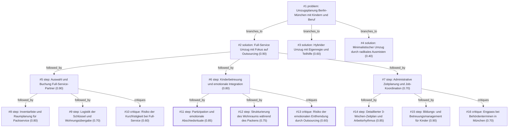

# umzug · ollama-cloud/gemma4:31b · index

**Task:** Wir ziehen in drei Wochen mit zwei Kindern (4 und 9 Jahre) von Berlin nach München. Beide Eltern arbeiten weiter. Wie organisieren wir den Umzug, damit nichts Wichtiges vergessen wird?

| Thoughts | Calls | Tokens in / out | Time | Finish | First try valid | Next picked | Max depth | Weight spread | Duplicates |
|---|---|---|---|---|---|---|---|---|---|
| 16 | 7 | 17826 / 5338 | 29s | budget | 2/6 | 5/5 | 3 | 0.11 | 0 |

Failures: schema 4

## Answer from the graph

Ein Umzug über 600 Kilometer mit zwei Kindern und zwei berufstätigen Eltern innerhalb von nur drei Wochen ist ein ambitioniertes Projekt. Um den Stress zu minimieren und sicherzustellen, dass nichts Wichtiges vergessen wird, ist die effektivste Strategie ein **Full-Service-Umzug mit Fokus auf Outsourcing**. Da Ihre Zeit durch die Arbeit stark begrenzt ist, sollten Sie die physische Arbeit delegieren, um sich auf die Kinder und die Administration zu konzentrieren.

Hier ist Ihr strukturierter Plan:

### 1. Sofortmaßnahmen: Logistik & Outsourcing
Da drei Wochen Vorlauf für Full-Service-Anbieter sehr knapp sind, hat dies oberste Priorität:
*   **Angebote einholen:** Fordern Sie sofort drei Vergleichsangebote für einen Full-Service-Umzug an (inkl. Verpackungsservice und Montage). Achten Sie auf Versicherungsschutz und Langstrecken-Erfahrung.
*   **Inventarliste erstellen:** Erstellen Sie eine grobe Liste der Möbel und des geschätzten Kartonvolumens pro Raum.
*   **„No-Go-Zonen“ definieren:** Legen Sie fest, welche Bereiche (z. B. wichtige Arbeitsunterlagen, Dokumente, Lieblingsspielzeug der Kinder) *nicht* vom Packservice angefasst werden dürfen, damit Sie diese Dinge sofort griffbereit haben.

### 2. Kinderbetreuung und emotionale Begleitung
Ein Umzug ist für Kinder (besonders in den Altern 4 und 9) ein großer Einschnitt.
*   **Externe Betreuung:** Organisieren Sie für die intensiven Packtage und den eigentlichen Umzugstag externe Hilfe (Großeltern, Freunde oder Betreuung), damit die Kinder nicht im Chaos der Kartons stehen.
*   **Partizipation:** Beziehen Sie die 9-Jährige aktiv ein. Lassen Sie sie über die Gestaltung ihres neuen Zimmers in München mitentscheiden.
*   **Abschiedsrituale:** Begleiten Sie die 4-Jährige durch kleine Rituale, wie einen letzten Besuch auf dem Lieblingsspielplatz oder gemeinsame Fotos in Berlin, um den Übergang zu verarbeiten.
*   **Die „Überlebenskiste“:** Packen Sie für die lange Fahrt eine Kiste mit Snacks, Tablets, Lieblingsspielzeugen und ausreichend Unterhaltung.

### 3. Administrative Planung & Zeitmanagement
Parallel zum Packen müssen die Rahmenbedingungen in München und Berlin geklärt werden:
*   **Job-Koordination:** Klären Sie Home-Office-Optionen oder Urlaubstage für die Umzugswoche, um Pufferzeiten zu haben.
*   **Bildungs-Management:** Stellen Sie sicher, dass die Anmeldung für Kita/Schule in München priorisiert wird.
*   **Verträge:** Erstellen Sie eine Liste aller lokalen Verträge in Berlin, die gekündigt oder umgemeldet werden müssen.

### Risiken, auf die Sie achten sollten:
*   **Kurzfristigkeit:** Full-Service-Firmen könnten bereits ausgebucht sein oder hohe Notfall-Tarife verlangen. **Plan B:** Halten Sie eine Liste mit Teil-Service-Firmen oder Mietwagen-Optionen bereit.
*   **Emotionale Distanz:** Achten Sie darauf, dass die Kinder durch die externe Betreuung während des Packens nicht das Gefühl bekommen, „weggeschickt“ zu werden. Planen Sie bewusste gemeinsame Momente ein.
*   **Behörden-Engpass:** Termine beim Bürgeramt in München können knapp sein. Versuchen Sie, die Anmeldung so früh wie möglich online oder telefonisch zu koordinieren.

*Used: #1, #2, #5, #6, #8, #10, #11, #13, #14, #15, #16*

## Index

```text
#1 [problem] Umzugsplanung Berlin-München mit Kindern und Beruf · expanded
  #2 [solution] Full-Service Umzug mit Fokus auf Outsourcing · w 0.90 · expanded
    #5 [step] Auswahl und Buchung Full-Service-Partner · w 0.90 · expanded
      #8 [step] Inventarliste und Raumplanung für Packservice · w 0.80 · open
      #9 [step] Logistik der Schlüssel und Wohnungsübergabe · w 0.70 · open
      #10 [critique] Risiko der Kurzfristigkeit bei Full-Service · w 0.60 · open
    #6 [step] Kinderbetreuung und emotionale Integration · w 0.80 · expanded
      #11 [step] Partizipation und emotionale Abschiedsrituale · w 0.85 · done
      #12 [step] Strukturierung des Wohnraums während des Packens · w 0.75 · done
      #13 [critique] Risiko der emotionalen Entfremdung durch Outsourcing · w 0.60 · done
    #7 [step] Administrative Zeitplanung und Job-Koordination · w 0.70 · expanded
      #14 [step] Detaillierter 3-Wochen-Zeitplan und Arbeitsrhythmus · w 0.85 · open
      #15 [step] Bildungs- und Betreuungsmanagement für Kinder · w 0.90 · open
      #16 [critique] Engpass bei Behördenterminen in München · w 0.70 · open
  #3 [solution] Hybrider Umzug mit Eigenregie und Teilhilfe · w 0.60 · open
  #4 [solution] Minimalistischer Umzug durch radikales Ausmisten · w 0.40 · open
```

## Graph



## Thoughts

### #1 [problem] Umzugsplanung Berlin-München mit Kindern und Beruf
w 1.00 · expanded · depth 0 · from –

Ziel: Ein stressfreier, vollständig organisierter Umzug von Berlin nach München innerhalb von drei Wochen. 

Fakten & Rahmenbedingungen:
- Zeitrahmen: 21 Tage bis zum Umzug.
- Personen: 2 Erwachsene, 2 Kinder (4 und 9 Jahre).
- Situation: Beide Eltern sind berufstätig (begrenzte Zeit für Packen und Behörden).
- Distanz: Langstreckenumzug (~600 km).

Unbekannte Variablen:
- Verfügbarkeit von Umzugsunternehmen/Mietwagen.
- Status der neuen Wohnung (bezugsfertig?).
- Kinderbetreuung während der Pack- und Umzugstage.
- Kündigungsfristen für lokale Verträge in Berlin.

Ein gutes Ergebnis umfasst:
- Eine detaillierte Checkliste (Zeitplan).
- Ein Konzept zur Kinderbetreuung und emotionalen Begleitung.
- Eine Strategie zur Vereinbarkeit von Arbeit und Umzugsvorbereitung.
- Sicherstellung, dass alle administrativen Aufgaben (Anmeldung, Verträge) erledigt sind.

> Definiert das Ziel, die Einschränkungen und die Erfolgskriterien präzise.

### #2 [solution] Full-Service Umzug mit Fokus auf Outsourcing
w 0.90 · expanded · depth 1 · from #1

Ein Full-Service-Umzug unter Nutzung eines professionellen Umzugsunternehmens, um die Zeitbelastung für die berufstätigen Eltern zu minimieren. Fokus liegt auf Outsourcing von Packen und Transport, während die Familie sich auf die Kinder und die Administration konzentriert.

> Maximiert die Zeitersparnis bei engem Zeitplan und Berufstätigkeit.

### #3 [solution] Hybrider Umzug mit Eigenregie und Teilhilfe
w 0.60 · open · depth 1 · from #1

Ein hybrider Umzug: Die Eltern organisieren den Transport selbst (Mietwagen), nutzen aber gezielte Hilfen für das Packen und die Kinderbetreuung. Dies spart Kosten, erhöht aber den Zeitaufwand für die Eltern.

> Kosteneffizienter, aber riskant bei nur drei Wochen Vorlauf und zwei Jobs.

### #4 [solution] Minimalistischer Umzug durch radikales Ausmisten
w 0.40 · open · depth 1 · from #1

Ein minimalistischer Umzug: Radikale Ausmisten-Strategie in den ersten zwei Wochen, um das Volumen zu reduzieren und den Transport so simpel wie möglich zu halten (z.B. nur ein kleiner LKW).

> Reduziert die Logistikkomplexität, ist aber stressig für die Kinder (Verlust von Spielzeug).

### #5 [step] Auswahl und Buchung Full-Service-Partner
w 0.90 · expanded · depth 2 · from #2

Sofortige Einholung von drei Vergleichsangeboten für Full-Service-Umzüge (inkl. Verpackungsservice und Montage). Kriterien: Erfahrung mit Langstrecken, Versicherungsschutz und Verfügbarkeit innerhalb der 3-Wochen-Frist. Fixierung des Termins für die Packtage und den Transporttag.

> Dies ist die kritische erste Hürde, da die Verfügbarkeit von Firmen kurzfristig begrenzt sein kann.

### #6 [step] Kinderbetreuung und emotionale Integration
w 0.80 · expanded · depth 2 · from #2

Organisation externer Betreuung (Großeltern, Freunde oder Ferienbetreuung) für die Packtage und den Umzugstag. Erstellung eines 'Umzugs-Kalenders' für die Kinder (besonders die 9-Jährige), um Vorfreude zu wecken und Sicherheit zu geben. Packen einer 'Überlebenskiste' für die Kinder (Lieblingsspielzeug, Snacks, Tablet) für die Fahrt.

> Die Kinder sind der größte emotionale Stressfaktor und benötigen eine eigene Strategie.

### #7 [step] Administrative Zeitplanung und Job-Koordination
w 0.70 · expanded · depth 2 · from #2

Absprache mit den Arbeitgebern über Home-Office-Tage oder Urlaub für die Umzugswoche. Erstellung einer Liste für Adressänderungen (Banken, Versicherungen, Schulen/Kita) und Terminierung der Abmeldungen/Anmeldungen in Berlin und München.

> Die berufliche Belastung muss aktiv reduziert werden, um die Steuerung des Outsourcings zu ermöglichen.

### #8 [step] Inventarliste und Raumplanung für Packservice
w 0.80 · open · depth 3 · from #5

Erstellung einer groben Liste der zu transportierenden Möbel und Schätzungen des Kartonvolumens pro Raum. Definition von 'No-Go-Zonen' (z.B. wichtige Arbeitsunterlagen, Dokumente, Lieblingsspielzeug der Kinder), die nicht vom Packservice angefasst werden sollen, um Zeit bei der späteren Suche zu sparen.

> Ein Packservice benötigt präzise Angaben, um effizient zu arbeiten und Fehlbuchungen beim Material zu vermeiden.

### #9 [step] Logistik der Schlüssel und Wohnungsübergabe
w 0.70 · open · depth 3 · from #5

Koordination der Übergabetermine für die alte Wohnung in Berlin und die neue in München. Klärung, ob das Umzugsunternehmen den Zugang zur neuen Wohnung eigenständig regeln kann oder ob eine Person vor Ort sein muss, um den Zugang zum Haus/Aufzug zu ermöglichen.

> Die physische Übergabe ist oft der größte Engpass bei Langstreckenumzügen.

### #10 [critique] Risiko der Kurzfristigkeit bei Full-Service
w 0.60 · open · depth 3 · from #5

Drei Wochen Vorlauf sind für Full-Service-Anbieter sehr knapp. Es besteht das Risiko, dass nur teure Notfall-Tarife verfügbar sind oder die Qualität der Anbieter sinkt. Lösung: Parallel eine 'Plan B' Liste mit Teil-Service-Firmen oder Mietwagen-Optionen führen.

> Identifiziert eine kritische Schwachstelle im Zeitplan des Full-Service-Ansatzes.

### #11 [step] Partizipation und emotionale Abschiedsrituale
w 0.85 · done · depth 3 · from #6

Die 9-Jährige aktiv einbinden, indem sie über ihr eigenes Zimmer in München mitentscheiden darf (z.B. Farbwahl oder Möbelanordnung). Die 4-Jährige durch ein 'Abschiedsritual' für Berlin begleiten (z.B. Lieblingsspielplatz ein letztes Mal besuchen, Fotos machen), um den Übergang emotional zu verarbeiten.

> Emotionale Unterstützung ist entscheidend, um den Stress für die Kinder zu minimieren und Widerstände zu reduzieren.

### #12 [step] Strukturierung des Wohnraums während des Packens
w 0.75 · done · depth 3 · from #6

Die 4-jährige Tochter benötigt während des Packprozesses eine feste Struktur, da das Chaos in der Wohnung verunsichern kann. Einrichtung einer 'sicheren Zone' (ein Bereich, der bis zum Schluss nicht gepackt wird), in der die Kinder spielen können, ohne dass ihre Sachen verschwinden.

> Vermeidet Stress durch räumliche Instabilität während der Packphase.

### #13 [critique] Risiko der emotionalen Entfremdung durch Outsourcing
w 0.60 · done · depth 3 · from #6

Es besteht das Risiko, dass die Kinder durch die externe Betreuung während der wichtigsten Phasen (Einpacken/Auszug) entfremdet werden oder das Gefühl haben, 'weggeschickt' zu werden, während die Eltern die Kontrolle behalten.

> Übermäßige Auslagerung der Kinderbetreuung kann zu emotionalem Stress führen.

### #14 [step] Detaillierter 3-Wochen-Zeitplan und Arbeitsrhythmus
w 0.85 · open · depth 3 · from #7

Erstellung eines detaillierten Zeitplans für die letzten 3 Wochen: Woche 1 (Administrative Vorbereitung & Verträge), Woche 2 (Packphase & Kindernachbetreuung), Woche 3 (Umzug & Anmeldung in München). Festlegung von 'Power-Hours' nach Feierabend für die Eltern.

> Provides the necessary temporal structure to manage work and move simultaneously.

### #15 [step] Bildungs- und Betreuungsmanagement für Kinder
w 0.90 · open · depth 3 · from #7

Spezifische Liste der Institutionen für die Kinder: Anmeldung in der neuen Grundschule (9 J.) und Kita/Kindergarten (4 J.) in München, Beantragung von Übertrittsberechtigungen und Anforderung von Schulakten in Berlin.

> Critical path for the children's stability and legal requirements.

### #16 [critique] Engpass bei Behördenterminen in München
w 0.70 · open · depth 3 · from #7

Risiko: Die Zeitplanung könnte unterschätzen, wie lange die bürokratische Anmeldung in München (Bürgerbüro) dauert, was die Rückkehr in den vollen Arbeitsmodus verzögern könnte.

> Identifies a common bottleneck in German city administrations.

