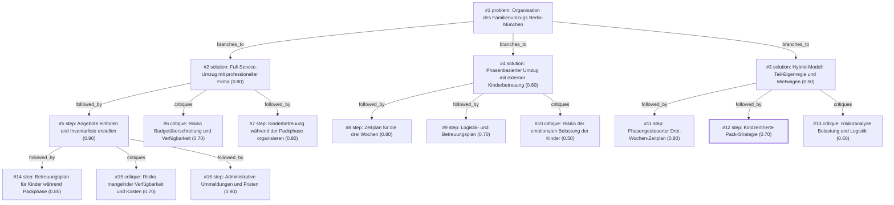

# umzug · ollama-cloud/gemma4:31b · path

**Task:** Wir ziehen in drei Wochen mit zwei Kindern (4 und 9 Jahre) von Berlin nach München. Beide Eltern arbeiten weiter. Wie organisieren wir den Umzug, damit nichts Wichtiges vergessen wird?

| Thoughts | Calls | Tokens in / out | Time | Finish | First try valid | Next picked | Max depth | Weight spread | Duplicates |
|---|---|---|---|---|---|---|---|---|---|
| 16 | 7 | 6716 / 3297 | 19s | budget | 6/6 | 0/5 | 3 | 0.10 | 0 |

## Answer from the graph

Ein Umzug über 600 km innerhalb von drei Wochen ist bei zwei berufstätigen Eltern und zwei Kindern eine große Herausforderung. Um den Stress zu minimieren und sicherzustellen, dass nichts vergessen wird, ist die effizienteste Strategie die Delegation der Logistik an Profis, kombiniert mit einem strikten administrativen Zeitplan.

### Der empfohlene Ansatz: Full-Service-Management
Da Sie beide berufstätig sind, ist ein **Full-Service-Umzug** die sinnvollste Option. Hierbei übernimmt ein Unternehmen das Verpacken, den Transport und das Auspacken. Dies schont Ihre zeitlichen Ressourcen und reduziert die emotionale Belastung für die Kinder (4 und 9 Jahre), da das Zuhause nicht über Wochen in einem chaotischen Zustand verharrt.

### Schritt-für-Schritt-Plan

**1. Sofortmaßnahmen (Woche 1): Logistik & Inventar**
*   **Angebote einholen:** Kontaktieren Sie umgehend zertifizierte Umzugsunternehmen, die auf Fernumzüge spezialisiert sind. Da die Frist extrem kurz ist, müssen Sie sofort die Verfügbarkeit prüfen.
*   **Inventarliste erstellen:** Erstellen Sie eine detaillierte Liste Ihrer Möbel und Kartonagen, damit die Firma präzise kalkulieren kann.
*   **Besichtigungstermin:** Vereinbaren Sie schnellstmöglich einen Termin zur Besichtigung (ggf. virtuell), um ein verbindliches Angebot zu erhalten.

**2. Parallelphase (Woche 1-3): Administration & Betreuung**
*   **Ummeldungen:** Erstellen Sie eine Liste aller notwendigen Adressänderungen und Kündigungen (Schule, Kita, Strom, Internet, GEZ, Versicherungen), damit in München alles reibungslos funktioniert.
*   **Betreuungsplan für die Kinder:** Klären Sie die Betreuung für die heiße Phase. Da Sie arbeiten, sollten Sie prüfen, ob Großeltern, Babysitter oder eine verlängerte Betreuung in Kita/Schule möglich sind, um den Kindern Stabilität zu geben, während im Hintergrund gepackt wird.

**3. Finale Phase (Woche 3): Durchführung**
*   **Überwachung des Packens:** Auch bei Full-Service sollten Sie wertvolle persönliche Gegenstände und wichtige Dokumente selbst sichern und transportieren.
*   **Übergabe & Transport:** Koordination des Verladens in Berlin und der Entladung in München.

### Risiken, die Sie im Auge behalten sollten

*   **Verfügbarkeit und Kosten:** In einer Drei-Wochen-Frist ist das größte Risiko, dass seriöse Firmen ausgebucht sind oder "Last-Minute"-Aufschläge verlangen, die Ihr Budget sprengen.
*   **Emotionale Belastung:** Ein Umzug ist für Kinder (besonders im Alter von 4 und 9 Jahren) ein großer Einschnitt. Vermeiden Sie es, sie in den logistischen Stress einzubeziehen.
*   **Vertrauensrisiko:** Bei Full-Service-Anbietern besteht die Gefahr, dass Gegenstände beschädigt werden oder wichtige Dinge in falschen Kartons landen. Eine klare Kommunikation und eine eigene Liste der wichtigsten Kisten sind essenziell.

*Used: #1, #2, #5, #6, #14, #15, #16*

## Index

```text
#1 [problem] Organisation des Familienumzugs Berlin-München · expanded
  #2 [solution] Full-Service-Umzug mit professioneller Firma · w 0.80 · expanded
    #5 [step] Angebote einholen und Inventarliste erstellen · w 0.90 · expanded
      #14 [step] Betreuungsplan für Kinder während Packphase · w 0.85 · open
      #15 [critique] Risiko mangelnder Verfügbarkeit und Kosten · w 0.70 · open
      #16 [step] Administrative Ummeldungen und Fristen · w 0.90 · open
    #6 [critique] Risiko Budgetüberschreitung und Verfügbarkeit · w 0.70 · open
    #7 [step] Kinderbetreuung während der Packphase organisieren · w 0.80 · open
  #3 [solution] Hybrid-Modell: Teil-Eigenregie und Mietwagen · w 0.50 · expanded
    #11 [step] Phasengesteuerter Drei-Wochen-Zeitplan · w 0.80 · open
    #12 [step] Kindzentrierte Pack-Strategie · w 0.70 · done
    #13 [critique] Risikoanalyse Belastung und Logistik · w 0.60 · open
  #4 [solution] Phasenbasierter Umzug mit externer Kinderbetreuung · w 0.60 · expanded
    #8 [step] Zeitplan für die drei Wochen · w 0.80 · open
    #9 [step] Logistik- und Betreuungsplan · w 0.70 · open
    #10 [critique] Risiko der emotionalen Belastung der Kinder · w 0.50 · open
```

## Graph



## Thoughts

### #1 [problem] Organisation des Familienumzugs Berlin-München
w 1.00 · expanded · depth 0 · from –

Ziel ist die vollständige und stressfreie Organisation eines Umzugs von Berlin nach München innerhalb von drei Wochen. 

Gegebenheiten:
- Zeitrahmen: 3 Wochen.
- Personen: 2 Erwachsene, 2 Kinder (4 und 9 Jahre).
- Kontext: Beide Eltern bleiben berufstätig (Zeitlimitierung).
- Distanz: Ca. 600 km (Fernumzug).

Unbekannte Faktoren:
- Budget für das Umzugsunternehmen/Transport.
- Verfügbarkeit von Helfern.
- Status der neuen Wohnung (bereit zum Einzug?).

Ein optimales Ergebnis umfasst einen detaillierten Zeitplan, Strategien zur Kinderbetreuung während der Packphase, eine Checkliste für administrative Aufgaben und einen Logistikplan, der den Erhalt des Arbeitsalltags ermöglicht.

> Definiert die Ausgangslage, die Constraints und die Erfolgskriterien präzise.

### #2 [solution] Full-Service-Umzug mit professioneller Firma
w 0.80 · expanded · depth 1 · from #1

Beauftragung eines Full-Service-Umzugsunternehmens, das Verpacken, Transport und Auspacken übernimmt. Dies minimiert den Zeitaufwand für die berufstätigen Eltern und reduziert den Stress für die Kinder, da die Logistik delegiert wird.

> Maximiert die Zeitersparnis bei engem Zeitplan und hoher Distanz, ist jedoch kostenintensiv.

### #3 [solution] Hybrid-Modell: Teil-Eigenregie und Mietwagen
w 0.50 · expanded · depth 1 · from #1

Die Eltern übernehmen das Packen und die Sortierung selbst; der Transport erfolgt über einen gemieteten LKW oder ein Teil-Service-Unternehmen. Die Kinder werden in kleine Aufgaben einbezogen, um die Vorfreude zu wecken.

> Kostengünstiger als Full-Service, aber riskant bezüglich der Zeitkapazitäten der berufstätigen Eltern.

### #4 [solution] Phasenbasierter Umzug mit externer Kinderbetreuung
w 0.60 · expanded · depth 1 · from #1

Strikte Trennung von Arbeits-, Pack- und Familienzeit. Nutzung von externer Betreuung (Großeltern, Betreuungsgruppen) für die Kinder während der intensiven Packwochen, um fokussiertes Arbeiten am Umzug zu ermöglichen.

> Strukturierter Ansatz zur Bewältigung der Zeitnot, löst aber nicht das logistische Transportproblem.

### #5 [step] Angebote einholen und Inventarliste erstellen
w 0.90 · expanded · depth 2 · from #2

Erstellung einer detaillierten Inventarliste und Terminabsprache mit der Firma für die Besichtigung und den Umzugstag. Da die Zeit knapp ist (3 Wochen), muss sofort eine Anfrage an zertifizierte Unternehmen gesendet werden, die auch kurzfristig Kapazitäten für Fernumzüge haben.

> Die erste operative Hürde bei einem Full-Service-Umzug ist die Verfügbarkeit und die präzise Kalkulation durch das Unternehmen.

### #6 [critique] Risiko Budgetüberschreitung und Verfügbarkeit
w 0.70 · open · depth 2 · from #2

Ein Full-Service-Umzug ist die teuerste Option. Es besteht das Risiko, dass das Budget überschritten wird oder in der kurzen Zeit kein seriöses Unternehmen verfügbar ist, was die gesamte Planung hinfällig machen würde.

> Kosten und kurzfristige Verfügbarkeit sind die größten Schwachstellen dieses Ansatzes.

### #7 [step] Kinderbetreuung während der Packphase organisieren
w 0.80 · open · depth 2 · from #2

Organisation einer externen Betreuung für die Kinder (z.B. Großeltern, Ferienbetreuung) während der intensiven Packphase und am Umzugstag, um den Eltern die Koordination mit der Firma und die berufliche Arbeit zu ermöglichen.

> Die physische Präsenz von Packteams in der Wohnung ist für kleine Kinder oft stressig und stört den Arbeitsfluss der Eltern.

### #8 [step] Zeitplan für die drei Wochen
w 0.80 · open · depth 2 · from #4

Erstellung eines detaillierten Kalenders: Woche 1: Ausmisten und Packen von nicht-essentiellen Dingen; Woche 2: Administrative Erledigungen (Ummeldungen) und finale Packphase; Woche 3: Transport, Schlüsselübergabe und Einzug. Festlegung von festen 'Pack-Blöcken' (z.B. 19:00 - 21:00 Uhr), wenn die Kinder schlafen.

> Ein strukturierter Zeitplan ist essenziell, um die Deadline bei gleichzeitiger Berufstätigkeit einzuhalten.

### #9 [step] Logistik- und Betreuungsplan
w 0.70 · open · depth 2 · from #4

Buchung eines Full-Service-Umzugsunternehmens, um die physische Belastung zu minimieren. Organisation von Betreuung für die Kinder (z.B. verlängerte Kita-Zeiten, Babysitter oder Großeltern), insbesondere für den Transporttag und den Tag der Wohnungsübergabe in Berlin.

> Externalisierung der Logistik und Betreuung schafft die notwendigen Zeitfenster für die Eltern.

### #10 [critique] Risiko der emotionalen Belastung der Kinder
w 0.50 · open · depth 2 · from #4

Die strikte Trennung von Packzeit und Familienzeit könnte bei den Kindern (besonders dem 4-jährigen) zu Verunsicherung führen, da der Umzug ein großer Einschnitt ist. Es muss Zeit für gemeinsame Gespräche und Vorfreude auf München eingeplant werden, statt die Kinder nur 'extern' zu betreuen.

> Die psychologische Komponente wird in der reinen Effizienzstrategie vernachlässigt.

### #11 [step] Phasengesteuerter Drei-Wochen-Zeitplan
w 0.80 · open · depth 2 · from #3

Erstellung eines detaillierten Drei-Wochen-Zeitplans, der Packphasen in die Abendstunden und Wochenenden legt, um die Berufstätigkeit nicht zu gefährden. Priorisierung: Woche 1 (Ausmisten/Verpacken), Woche 2 (Administration/Logistik), Woche 3 (Finaler Pack/Transport).

> Ein Zeitplan ist die notwendige Basis, um die knappe Zeit bei voller Berufstätigkeit zu managen.

### #12 [step] Kindzentrierte Pack-Strategie
w 0.70 · done · depth 2 · from #3

Einbindung der Kinder durch 'eigene Kisten': Das 9-jährige Kind darf seine Zimmer-Organisation mitplanen, das 4-jährige Kind darf Spielzeug in spezielle, farbige Kisten sortieren. Dies reduziert den Stress und fördert die Akzeptanz.

> Die emotionale Beteiligung der Kinder minimiert Widerstände und hilft bei der praktischen Organisation.

### #13 [critique] Risikoanalyse Belastung und Logistik
w 0.60 · open · depth 2 · from #3

Das Risiko bei Eigenregie auf einer 600km Strecke ist die physische und psychische Erschöpfung der Eltern, was zu Fehlern im Arbeitsalltag führen kann. Zudem ist die kurzfristige Verfügbarkeit eines passenden LKWs in 3 Wochen unsicher.

> Die Distanz und die Zeitnot machen die Eigenregie riskant im Vergleich zu einem Full-Service-Unternehmen.

### #14 [step] Betreuungsplan für Kinder während Packphase
w 0.85 · open · depth 3 · from #5

Erstellung einer Prioritätenliste für die Kinderbetreuung während der Packphase. Da die Eltern arbeiten, muss geklärt werden, ob die Kinder in den letzten zwei Wochen früher aus der Kita/Schule abgeholt werden können oder ob externe Hilfe (Großeltern, Babysitter) benötigt wird, um den Stress für die Kinder zu minimieren.

> Die Logistik der Erwachsenen ist durch die Firma abgedeckt, aber die emotionale und zeitliche Betreuung der Kinder ist ein kritischer Erfolgsfaktor.

### #15 [critique] Risiko mangelnder Verfügbarkeit und Kosten
w 0.70 · open · depth 3 · from #5

Das Risiko bei Full-Service-Anbietern in einer Drei-Wochen-Frist ist die mangelnde Verfügbarkeit oder überhöhte 'Last-Minute'-Preise. Zudem könnten wertvolle persönliche Gegenstände bei blindem Vertrauen in die Firma verloren gehen oder beschädigt werden.

> Identifiziert die finanziellen und zeitlichen Risiken der kurzfristigen Beauftragung.

### #16 [step] Administrative Ummeldungen und Fristen
w 0.90 · open · depth 3 · from #5

Erstellung einer Liste aller notwendigen administrativen Ummeldungen (Schule, Kita, GEZ, Strom, Internet), die parallel zur Logistikplanung ablaufen müssen, damit der Start in München reibungslos funktioniert.

> Ein Umzug ist nicht nur physischer Transport, sondern auch bürokratische Organisation, besonders bei Kindern in verschiedenen Bildungseinrichtungen.

